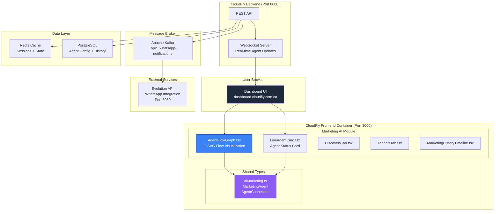
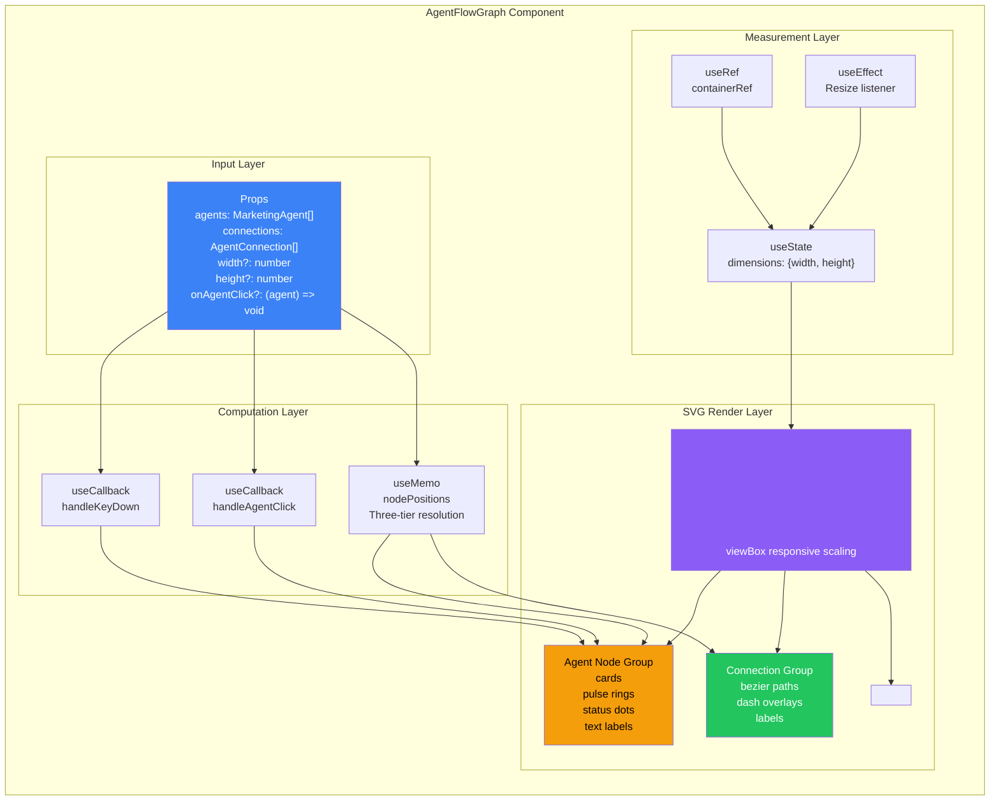
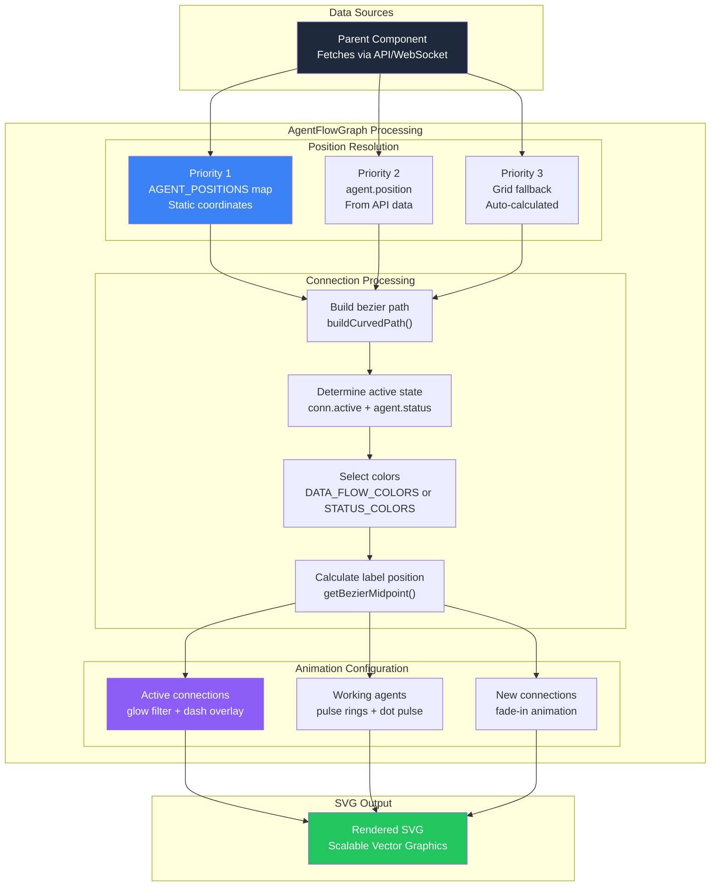
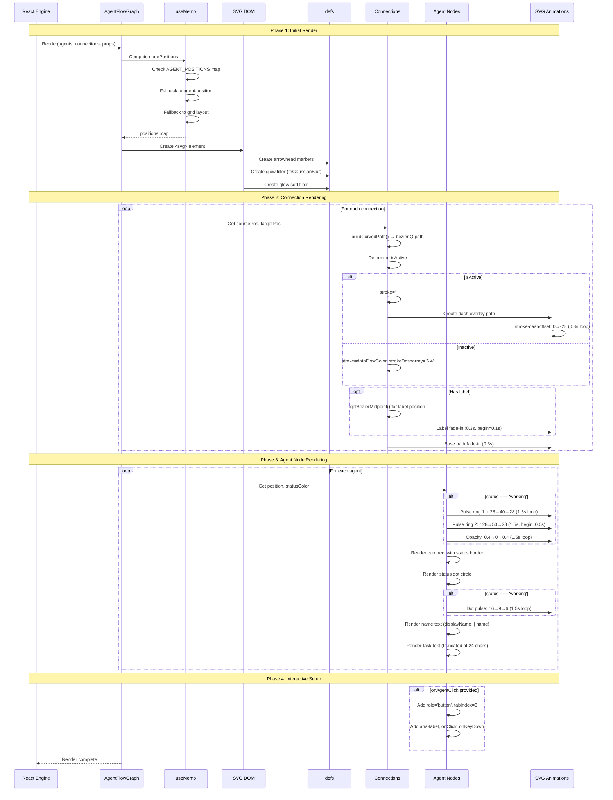
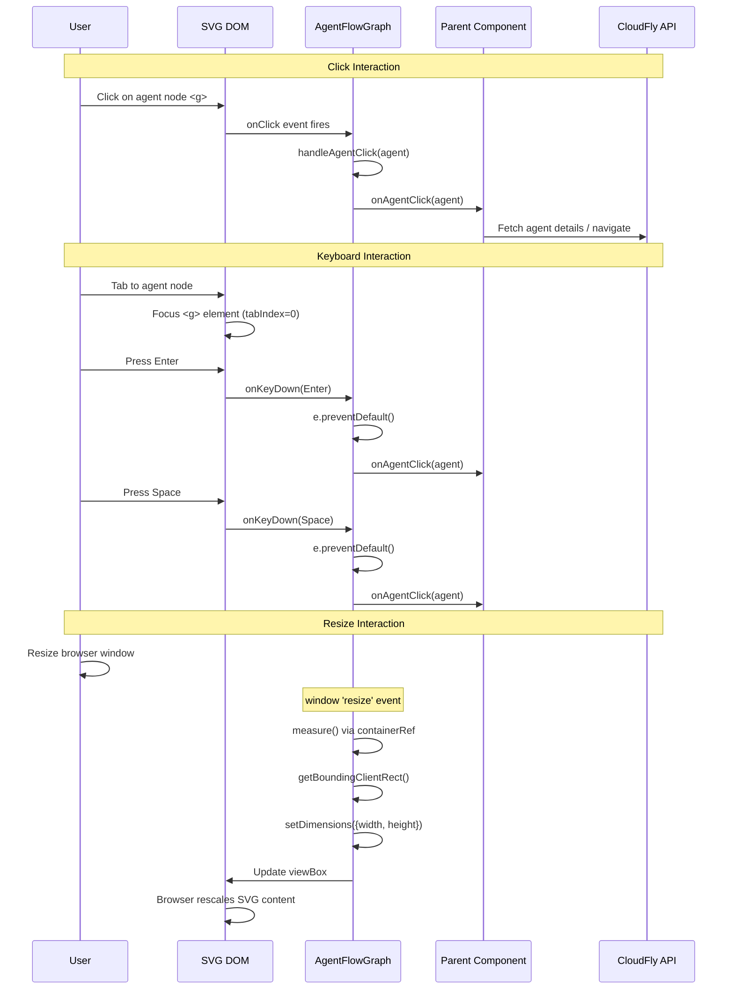
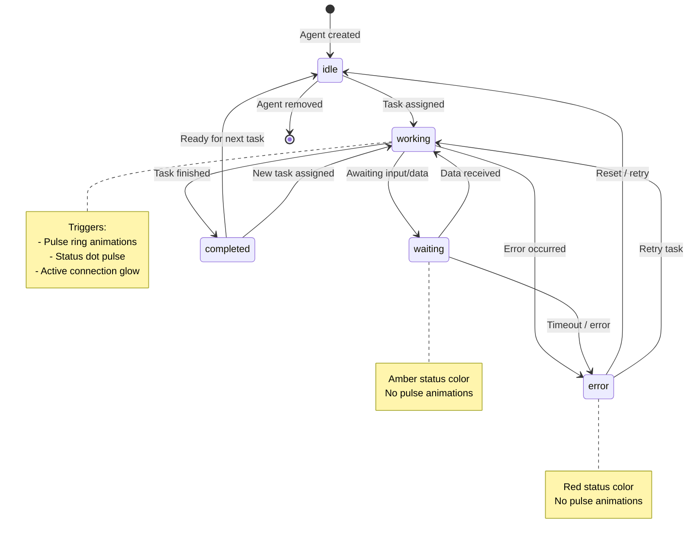
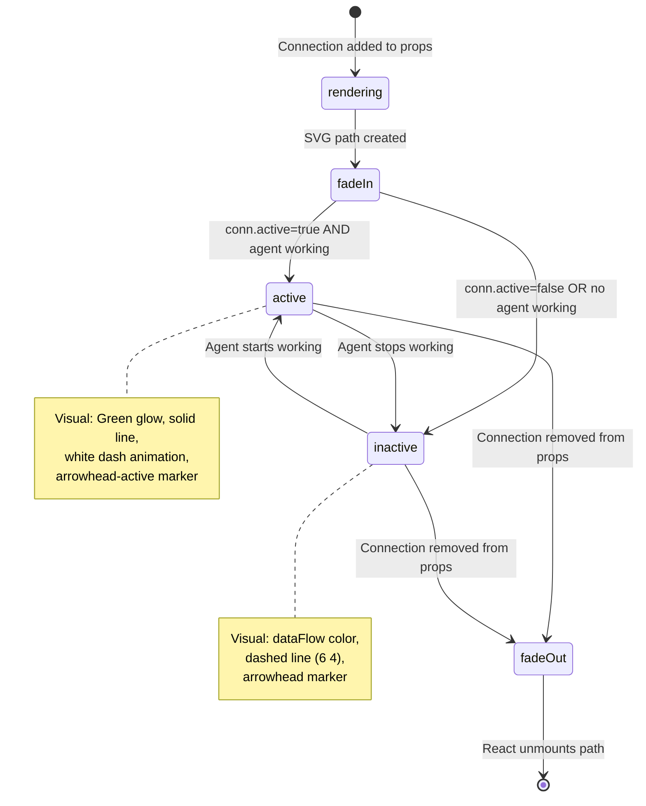
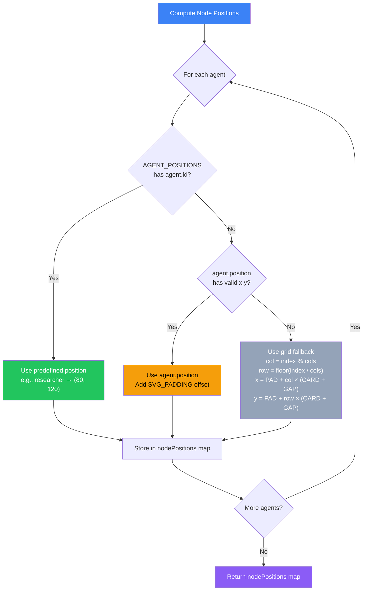
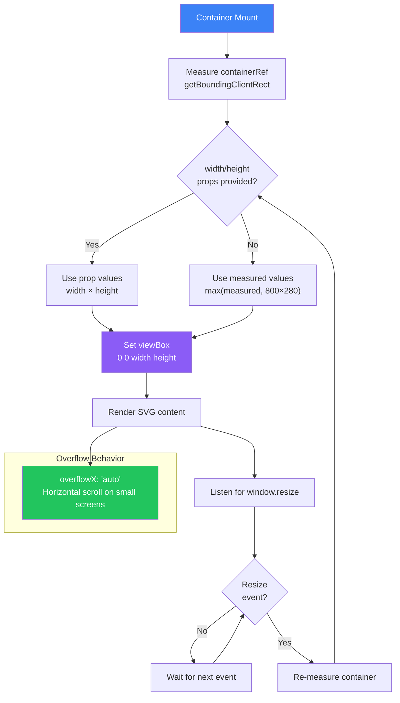
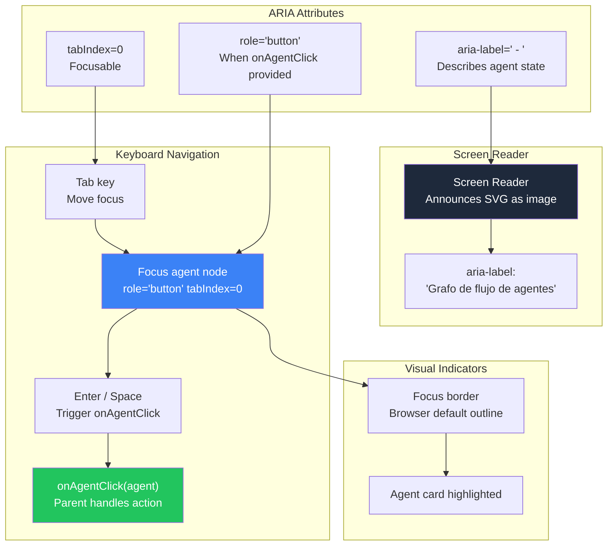

# AGENTE_DEV_CLOUD-208_AgentFlowGraph_Architecture_Diagrams

> **Ticket:** CLOUD-208 / CLOUD-257  
> **Epic:** CLOUD-205 — Marketing Team Live Dashboard  
> **Component:** `AgentFlowGraph.tsx`  
> **Status:** ✅ Complete  
> **Last Updated:** 2026-06-01  
> **Author:** OWL — Technical Writer & Diagram Specialist

---

## 📋 Table of Contents

1. [System Context Diagram](#1-system-context-diagram)
2. [Component Architecture](#2-component-architecture)
3. [Data Flow Diagram](#3-data-flow-diagram)
4. [Sequence Diagram — Render & Animation](#4-sequence-diagram--render--animation)
5. [Sequence Diagram — User Interaction](#5-sequence-diagram--user-interaction)
6. [State Machine — Agent Status](#6-state-machine--agent-status)
7. [State Machine — Connection Lifecycle](#7-state-machine--connection-lifecycle)
8. [ERD — Agent & Connection Types](#8-erd--agent--connection-types)
9. [Layout Algorithm](#9-layout-algorithm)
10. [Animation Timing Diagram](#10-animation-timing-diagram)
11. [Responsive Behavior Diagram](#11-responsive-behavior-diagram)
12. [Accessibility Flow](#12-accessibility-flow)

---

## 1. System Context Diagram



---

## 2. Component Architecture



---

## 3. Data Flow Diagram



---

## 4. Sequence Diagram — Render & Animation



---

## 5. Sequence Diagram — User Interaction



---

## 6. State Machine — Agent Status



---

## 7. State Machine — Connection Lifecycle



---

## 8. ERD — Agent & Connection Types

```mermaid
erDiagram
    MARKETING_AGENT {
        string id PK "Unique agent ID (e.g., 'researcher')"
        string name "Internal name"
        string displayName "Human-readable name"
        string role "Agent role description"
        enum status "working|waiting|error|completed|idle"
        string currentTask "Current task description"
        datetime taskStartedAt "Task start timestamp"
        datetime lastActivity "Last activity timestamp"
        string color "Hex color code"
        json position "Optional {x, y} position"
    }

    AGENT_CONNECTION {
        string id PK "Unique connection ID"
        string sourceAgentId FK "→ MarketingAgent.id"
        string targetAgentId FK "→ MarketingAgent.id"
        string label "Display label (e.g., 'Leads')"
        enum dataFlow "leads|analysis|messages|context"
        boolean active "Currently active"
    }

    AGENT_POSITION {
        string agentId PK "→ MarketingAgent.id"
        int x "X coordinate"
        int y "Y coordinate"
    }

    MARKETING_AGENT ||--o{ AGENT_CONNECTION : "source"
    MARKETING_AGENT ||--o{ AGENT_CONNECTION : "target"
    MARKETING_AGENT ||--|| AGENT_POSITION : "predefined"

    note right of AGENT_POSITION
        Static map in code:
        researcher: (80, 120)
        icp_agent: (280, 60)
        qualification_agent: (480, 120)
        copywriter_agent: (680, 60)
    end note
```

---

## 9. Layout Algorithm



---

## 10. Animation Timing Diagram

```mermaid
gantt
    title AgentFlowGraph Animation Timing
    dateFormat X
    axisFormat %S.%L

    section Pulse Ring 1 (Working Agent)
    r: 28→40→28    :p1, 0, 1.5s
    opacity: 0.4→0→0.4 :p1o, 0, 1.5s
    repeat           :p1r, after p1, 1.5s

    section Pulse Ring 2 (Working Agent)
    r: 28→50→28    :p2, 0.5s, 1.5s
    opacity: 0.3→0→0.3 :p2o, 0.5s, 1.5s
    repeat           :p2r, after p2, 1.5s

    section Status Dot Pulse
    r: 6→9→6        :d1, 0, 1.5s
    repeat           :d1r, after d1, 1.5s

    section Dash Flow (Active Connection)
    stroke-dashoffset: 0→-28 :df, 0, 0.8s
    repeat                    :dfr, after df, 0.8s

    section Connection Fade-in
    opacity: 0→1    :cf, 0, 0.3s

    section Label Fade-in
    opacity: 0→1    :lf, 0.1s, 0.3s
```

---

## 11. Responsive Behavior Diagram



---

## 12. Accessibility Flow



---

## Appendix: Diagram Legend

### Color Coding

| Color | Meaning |
|---|---|
| 🔵 Blue `#3b82f6` | Primary component / Input |
| 🟣 Purple `#8b5cf6` | SVG rendering / Filters |
| 🟢 Green `#22c55e` | Active state / Success |
| 🟡 Amber `#f59e0b` | Warning / Working state |
| ⚪ Gray `#94a3b8` | Inactive / Fallback |
| 🔴 Red `#ef4444` | Error state |
| ⬛ Dark `#1e293b` | External systems |

### Line Styles

| Style | Meaning |
|---|---|
| Solid `──>` | Data flow / Direct call |
| Dashed `..>` | Optional / Conditional |
| Bold `━━>` | Primary path |

---

*Generated by OWL — Technical Writer & Diagram Specialist*  
*CloudFly AI Platform — Marketing Team Live Dashboard*  
*CLOUD-208 / CLOUD-257 — AgentFlowGraph Component*
