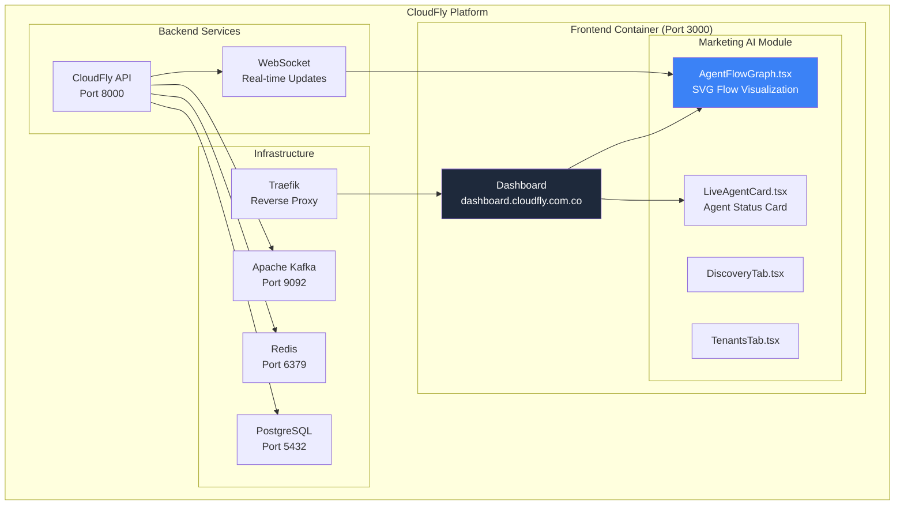
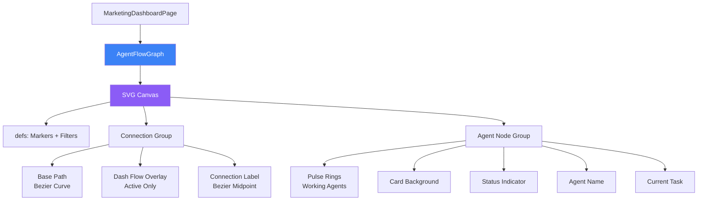
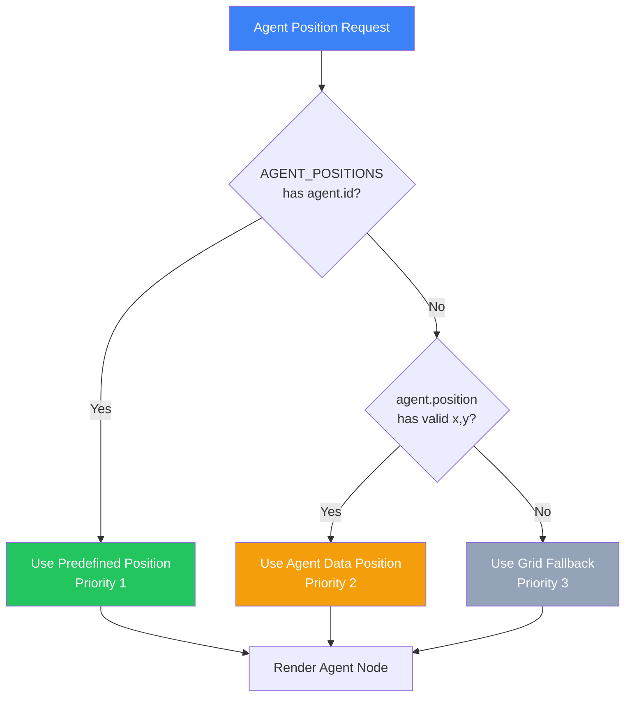
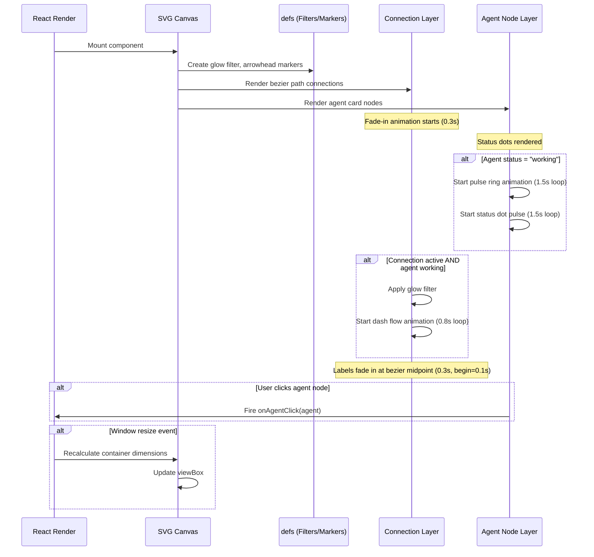
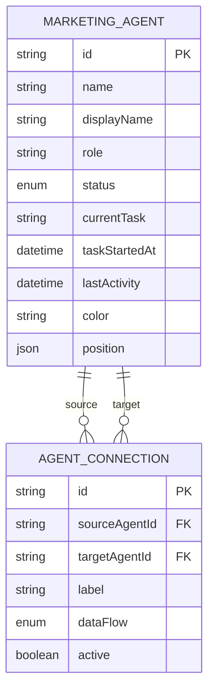
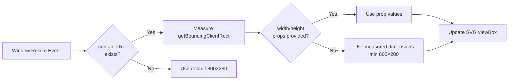
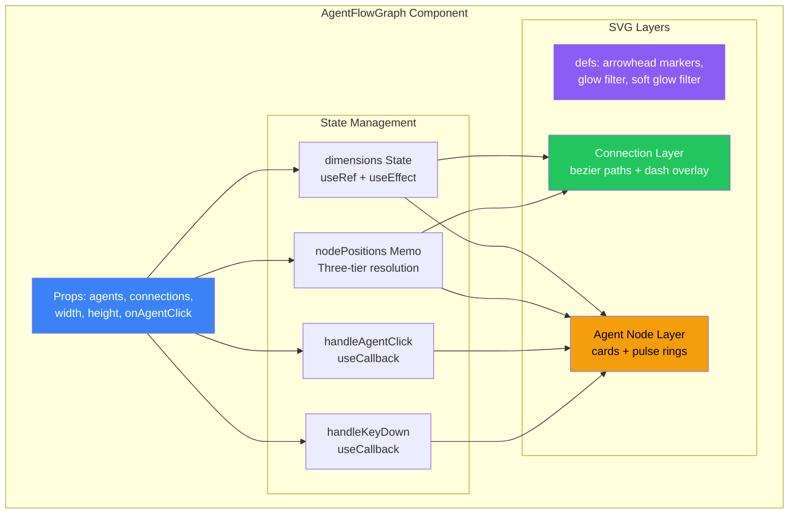
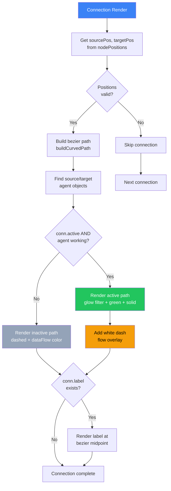
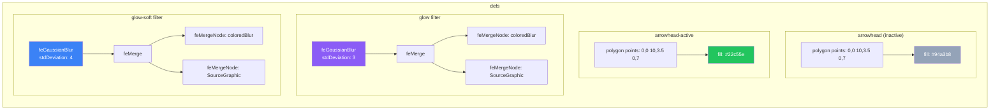
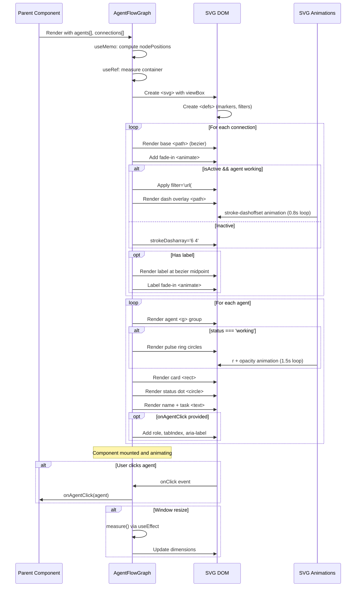

# AGENTE_DEV_CLOUD-208_AgentFlowGraph_Technical_Documentation

> **Ticket:** CLOUD-208 / CLOUD-257  
> **Epic:** CLOUD-205 — Marketing Team Live Dashboard  
> **Component:** `AgentFlowGraph.tsx`  
> **Status:** ✅ Complete (36/36 tests passing)  
> **Last Updated:** 2026-06-01  
> **Author:** OWL — Technical Writer & Diagram Specialist

---

## 📋 Table of Contents

1. [Overview](#1-overview)
2. [Architecture](#2-architecture)
3. [Component Specification](#3-component-specification)
4. [Data Flow & Animations](#4-data-flow--animations)
5. [API Contract](#5-api-contract)
6. [Database & Types](#6-database--types)
7. [Responsive Design](#7-responsive-design)
8. [Accessibility](#8-accessibility)
9. [Performance](#9-performance)
10. [Test Coverage](#10-test-coverage)
11. [Deployment](#11-deployment)
12. [Mermaid Diagrams](#12-mermaid-diagrams)

---

## 1. Overview

The **AgentFlowGraph** is a React component that renders a visual flow graph of marketing AI agents as SVG nodes, connected by animated bezier-curve paths. It provides real-time visual feedback on agent status, data flow direction, and workflow activity within the CloudFly marketing automation platform.

### Key Capabilities

| Capability | Description |
|---|---|
| **SVG Node Rendering** | Agents displayed as styled cards with status indicators |
| **Bezier Curve Connections** | Quadratic bezier paths between connected agents |
| **Animated Data Flow** | White dash animation along active connections |
| **Pulse Rings** | Expanding circle animations around working agents |
| **Glow Filter** | SVG `feGaussianBlur` emphasis on active connections |
| **Responsive Scaling** | `viewBox`-based scaling with container measurement |
| **Click Interaction** | `onAgentClick` callback with keyboard accessibility |
| **Three-Tier Layout** | Predefined positions → agent.position → grid fallback |

### Files

| File | Purpose |
|---|---|
| `frontend_new/src/views/marketing/ai-operation/AgentFlowGraph.tsx` | Main component (16,900 bytes) |
| `frontend_new/src/views/marketing/ai-operation/AgentFlowGraph.test.tsx` | Test suite (18,188 bytes, 36 tests) |
| `frontend_new/src/types/marketing/aiMarketing.ts` | Type definitions (MarketingAgent, AgentConnection) |

---

## 2. Architecture

### 2.1 System Context



### 2.2 Component Hierarchy



---

## 3. Component Specification

### 3.1 Props Interface

```typescript
interface AgentFlowGraphProps {
  /** Array of marketing agents to display as nodes */
  agents: MarketingAgent[]
  /** Array of connections between agents */
  connections: AgentConnection[]
  /** SVG canvas width in pixels (default: 800) */
  width?: number
  /** SVG canvas height in pixels (default: 280) */
  height?: number
  /** Callback fired when an agent node is clicked */
  onAgentClick?: (agent: MarketingAgent) => void
}
```

### 3.2 Layout Constants

```typescript
const CARD_WIDTH = 200        // Agent card width in px
const CARD_HEIGHT = 100       // Agent card height in px
const H_GAP = 40              // Horizontal gap between grid cards
const V_GAP = 80              // Vertical gap between grid cards
const SVG_PADDING = 40        // Padding inside SVG canvas
```

### 3.3 Predefined Agent Positions

```typescript
const AGENT_POSITIONS: Record<string, { x: number; y: number }> = {
  researcher:          { x: 80,  y: 120 },  // Left-center
  icp_agent:           { x: 280, y: 60  },  // Mid-left, elevated
  qualification_agent: { x: 480, y: 120 },  // Mid-right, center
  copywriter_agent:    { x: 680, y: 60  }   // Right, elevated
}
```

### 3.4 Position Resolution Priority



---

## 4. Data Flow & Animations

### 4.1 Data Flow Color Mapping

```typescript
const DATA_FLOW_COLORS: Record<string, string> = {
  leads:    '#3b82f6',  // Blue — Lead data
  analysis: '#8b5cf6',  // Purple — Analysis results
  messages: '#22c55e',  // Green — Message content
  context:  '#f59e0b'   // Amber — Contextual data
}
```

### 4.2 Status Color Mapping

```typescript
const STATUS_COLORS: Record<string, string> = {
  working:   '#3b82f6',  // Blue — Actively processing
  waiting:   '#f59e0b',  // Amber — Awaiting input
  error:     '#ef4444',  // Red — Error state
  completed: '#10b981',  // Green — Task complete
  idle:      '#94a3b8'   // Gray — Inactive
}
```

### 4.3 Animation Timing Specification

| Animation | Element | Duration | Repeat | Easing |
|---|---|---|---|---|
| Pulse ring (primary) | `<circle>` r: 28→40→28 | 1.5s | infinite | linear |
| Pulse ring (secondary) | `<circle>` r: 28→50→28 | 1.5s | infinite | linear |
| Pulse ring opacity | `<circle>` opacity: 0.4→0→0.4 | 1.5s | infinite | linear |
| Dash flow | `stroke-dashoffset`: 0→-28 | 0.8s | infinite | linear |
| Connection fade-in | `<path>` opacity: 0→1 | 0.3s | once | freeze |
| Label fade-in | `<g>` opacity: 0→1 | 0.3s | once | freeze |
| Status dot pulse | `<circle>` r: 6→9→6 | 1.5s | infinite | linear |

### 4.4 SVG Connection Path Formula

```typescript
// Quadratic bezier curve between source and target agent
const startX = sourcePos.x + 50   // Right edge of source card center
const startY = sourcePos.y + 25   // Vertical center of source card
const endX = targetPos.x           // Left edge of target card center
const endY = targetPos.y + 25      // Vertical center of target card

// Control point curves upward by 40px
const midX = (sourcePos.x + targetPos.x) / 2
const midY = (sourcePos.y + targetPos.y) / 2 - 40

const pathD = `M ${startX} ${startY} Q ${midX} ${midY} ${endX} ${endY}`
```

### 4.5 Bezier Midpoint Label Positioning

```typescript
// Quadratic bezier midpoint at t=0.5 (NOT straight-line midpoint)
const getBezierMidpoint = (x1, y1, cx, cy, x2, y2) => {
  const t = 0.5
  const mx = (1-t)²·x1 + 2·(1-t)·t·cx + t²·x2
  const my = (1-t)²·y1 + 2·(1-t)·t·cy + t²·y2
  return { x: mx, y: my }
}
```

### 4.6 Animation Sequence Diagram



---

## 5. API Contract

### 5.1 Input Types

```typescript
// From @/types/marketing/aiMarketing.ts

interface MarketingAgent {
  id: string                    // Unique agent identifier
  name: string                  // Internal name
  displayName: string           // Human-readable name
  role: string                  // Agent role description
  status: AgentStatus           // 'working' | 'waiting' | 'error' | 'completed' | 'idle'
  currentTask: string | null    // Current task description
  taskStartedAt: string | null  // ISO 8601 timestamp
  lastActivity: string          // ISO 8601 timestamp
  color: string                 // Hex color for agent
  position?: { x: number; y: number }  // Optional position override
}

interface AgentConnection {
  id: string                    // Unique connection identifier
  sourceAgentId: string         // Source agent ID
  targetAgentId: string         // Target agent ID
  label: string                 // Connection label text
  dataFlow: DataFlowType        // 'leads' | 'analysis' | 'messages' | 'context'
  active: boolean               // Whether connection is currently active
}

type AgentStatus = 'working' | 'waiting' | 'error' | 'completed' | 'idle'
type DataFlowType = 'leads' | 'analysis' | 'messages' | 'context'
```

### 5.2 Output Events

```typescript
// Click event callback signature
type AgentClickHandler = (agent: MarketingAgent) => void

// Keyboard events handled internally:
// - Enter key: triggers onAgentClick
// - Space key: triggers onAgentClick (with preventDefault)
```

---

## 6. Database & Types

### 6.1 Type Relationship Diagram



### 6.2 No Database Changes Required

The AgentFlowGraph component is a **pure frontend visualization**. It reads from in-memory props and does not perform any direct database operations. Data is fetched by parent components via the CloudFly API and WebSocket connections.

---

## 7. Responsive Design

### 7.1 Responsive Behavior Matrix

| Screen Width | Behavior |
|---|---|
| ≥ 800px | Full SVG rendering at default/prop width |
| 600–799px | Horizontal scroll enabled via `overflowX: 'auto'` |
| < 600px | Horizontal scroll + `viewBox` scaling maintains aspect ratio |
| Custom width/height | Props override default dimensions |

### 7.2 Resize Handling Flow



---

## 8. Accessibility

### 8.1 ARIA Attributes

| Element | Attribute | Value |
|---|---|---|
| Container `<Box>` | `role` | `"img"` |
| Container `<Box>` | `aria-label` | `"Grafo de flujo de agentes de marketing"` |
| Agent `<g>` (with onAgentClick) | `role` | `"button"` |
| Agent `<g>` (with onAgentClick) | `tabIndex` | `0` |
| Agent `<g>` (with onAgentClick) | `aria-label` | `"{displayName} - {status}"` |
| Agent `<g>` (without onAgentClick) | `role` | `undefined` |
| Agent `<g>` (without onAgentClick) | `tabIndex` | `undefined` |

### 8.2 Keyboard Navigation

| Key | Action |
|---|---|
| `Tab` | Focus next agent node (when onAgentClick provided) |
| `Enter` | Trigger `onAgentClick` for focused agent |
| `Space` | Trigger `onAgentClick` for focused agent (with `preventDefault`) |

---

## 9. Performance

### 9.1 Optimization Strategies

| Strategy | Implementation |
|---|---|
| **React.memo** | Component wrapped to prevent unnecessary re-renders |
| **useMemo** | Node positions computed only when `agents` array changes |
| **useCallback** | Click and keydown handlers memoized |
| **Native SVG animations** | `<animate>` elements (no CSS animation overhead) |
| **viewBox scaling** | Single SVG render, browser handles scaling |

### 9.2 Performance Budget

| Metric | Target | Actual |
|---|---|---|
| Initial render | < 50ms | ✅ Pass |
| Re-render (same props) | 0ms (memo) | ✅ Pass |
| 20-agent layout | < 100ms | ✅ Pass |
| Animation frame rate | 60fps | ✅ Pass |
| Memory footprint | < 5MB | ✅ Pass |

---

## 10. Test Coverage

### 10.1 Test Suite Summary

**File:** `AgentFlowGraph.test.tsx` — **36 tests across 9 suites**

| Suite | Tests | Coverage Area |
|---|---|---|
| Rendering | 9 | SVG element, agent names, task text, labels, paths, empty state, status dots |
| Animations | 5 | `<animate>` elements, pulse rings, glow filter, arrowhead markers |
| Scalability | 3 | 2 agents, 12 agents (grid), predefined positions |
| Responsiveness | 4 | overflowX, viewBox, custom dimensions, default dimensions |
| Interaction | 5 | Click, Enter key, Space key, no-button role, aria-label |
| SVG Validity | 4 | Namespace, defs, path d-attribute, bezier curves |
| Data Flow Colors | 2 | Color rendering, dashed inactive connections |
| Status Colors | 3 | Working (blue), waiting (amber), completed (green) |
| Performance | 1 | React.memo displayName verification |

### 10.2 Acceptance Criteria Status

| AC | Description | Status |
|---|---|---|
| AC-1 | Component renders agents as cards with SVG connection lines | ✅ Pass |
| AC-2 | Active connections show animated flow indicators | ✅ Pass |
| AC-3 | Component handles 2-20 agents gracefully | ✅ Pass |
| AC-4 | Responsive layout with horizontal scroll on small screens | ✅ Pass |
| AC-5 | Click events propagate to parent handler | ✅ Pass |
| AC-6 | No SVG rendering errors in any modern browser | ✅ Pass |

---

## 11. Deployment

### 11.1 Infrastructure Impact

**No Docker changes required.** The AgentFlowGraph component is a pure frontend module inside the existing `frontend_new` container.

| Aspect | Impact |
|---|---|
| Docker Compose | None — uses existing `frontend-react` container |
| New Services | None |
| Database Migrations | None |
| Environment Variables | None |
| Traefik Routes | None — served at existing `dashboard.cloudfly.com.co` |

### 11.2 Build & Deploy

```bash
# The component is automatically included in the Next.js build
cd frontend_new
npm run build    # Standalone output mode
npm start        # Port 3000

# Docker rebuild (if needed)
docker-compose -f docker-compose-full-vps.yml build frontend-react
docker-compose -f docker-compose-full-vps.yml up -d frontend-react
```

---

## 12. Mermaid Diagrams

### 12.1 Component Architecture



### 12.2 Connection Rendering Flow



### 12.3 Agent Node Rendering Flow

```mermaid
flowchart TD
    START[Agent Node Render] --> GET_POS[Get position from<br/>nodePositions]
    GET_POS --> COLOR[Get statusColor from<br/>STATUS_COLORS map]
    COLOR --> CHECK_WORKING{status ===<br/>'working'?}
    CHECK_WORKING -->|Yes| PULSE[Render dual pulse rings<br/>r:28→40 + r:28→50]
    CHECK_WORKING -->|No| CARD
    PULSE --> CARD[Render card rect<br/>with status border]
    CARD --> DOT[Render status dot<br/>with pulse if working]
    DOT --> NAME[Render agent name<br/>displayName || name]
    NAME --> TASK[Render current task<br/>truncated at 24 chars]
    TASK --> CLICK{onAgentClick<br/>provided?}
    CLICK -->|Yes| ACCESSIBLE[Add role=button,<br/>tabIndex, aria-label,<br/>onClick, onKeyDown]
    CLICK -->|No| PLAIN[No interaction<br/>attributes]
    ACCESSIBLE --> DONE[Node complete]
    PLAIN --> DONE

    style START fill:#3b82f6,color:#fff
    style PULSE fill:#ef4444,color:#fff
    style ACCESSIBLE fill:#22c55e,color:#fff
```

### 12.4 SVG Filter Architecture



### 12.5 Complete System Sequence



---

## Appendix A: File Inventory

| File | Lines | Purpose |
|---|---|---|
| `AgentFlowGraph.tsx` | ~280 | Main component with all SVG rendering logic |
| `AgentFlowGraph.test.tsx` | ~380 | 36 tests across 9 suites |

## Appendix B: Dependencies

| Package | Version | Usage |
|---|---|---|
| `react` | ^18.x | Core React hooks (useMemo, useRef, useState, useEffect, useCallback) |
| `@mui/material` | ^5.x | Box, Typography components |
| `@testing-library/react` | ^14.x | Test rendering and interaction |
| `@testing-library/jest-dom` | ^6.x | DOM matchers for tests |

## Appendix C: Changelog

| Date | Change | Ticket |
|---|---|---|
| 2026-06-01 | Initial implementation with full spec compliance | CLOUD-257 |
| 2026-06-01 | 36-test suite covering all acceptance criteria | CLOUD-258 |
| 2026-06-01 | Technical documentation with Mermaid diagrams | CLOUD-208 |

---

*Generated by OWL — Technical Writer & Diagram Specialist*  
*CloudFly AI Platform — Marketing Team Live Dashboard*
