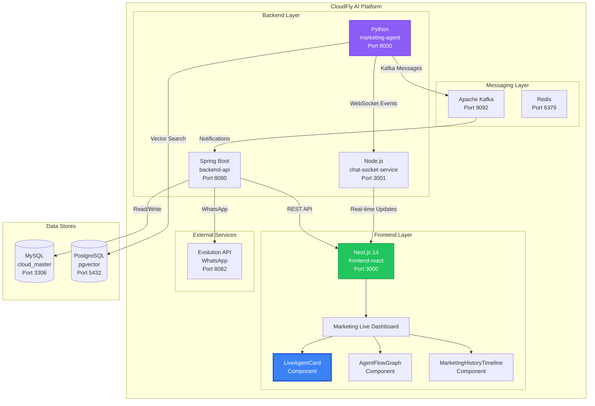
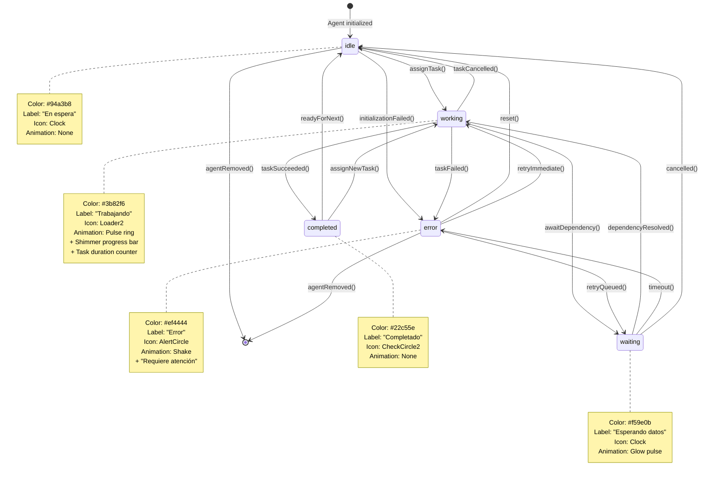
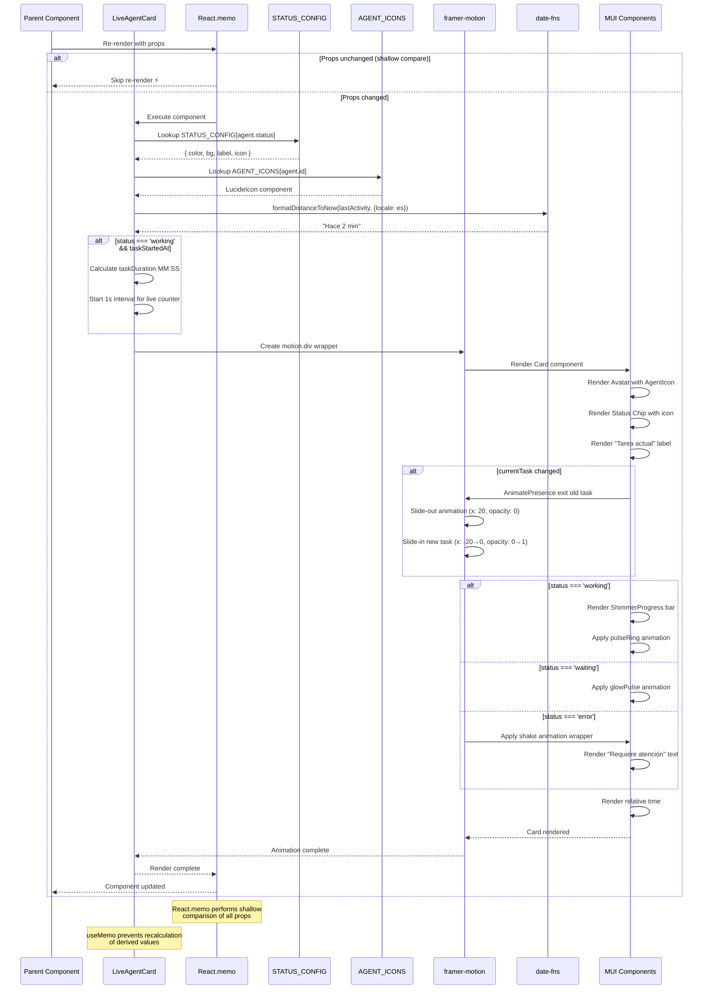
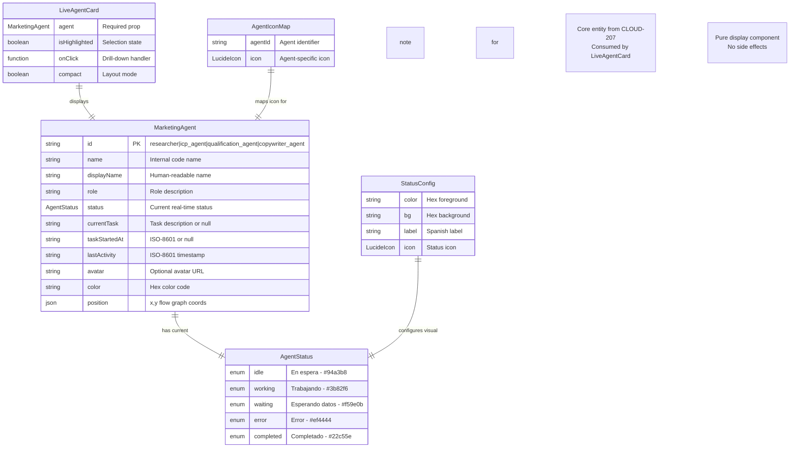
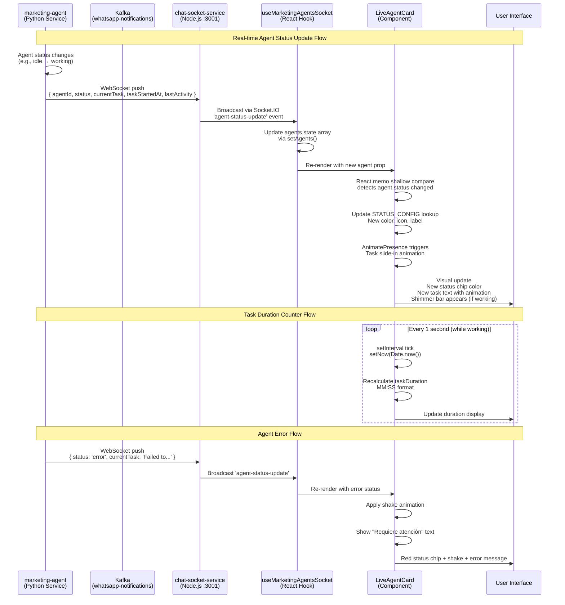

# CLOUD-209: LiveAgentCard — Architecture Diagrams

> **Status**: ✅ Complete  
> **Date**: 2025-07-19  
> **Author**: OWL — Technical Writer & Diagram Specialist

---

## Table of Contents

1. [System Context Diagram](#1-system-context-diagram)
2. [Component Architecture Diagram](#2-component-architecture-diagram)
3. [Status State Machine](#3-status-state-machine)
4. [Rendering Sequence Diagram](#4-rendering-sequence-diagram)
5. [Animation Flow Diagram](#5-animation-flow-diagram)
6. [Data Type ERD](#6-data-type-erd)
7. [Props Flow Diagram](#7-props-flow-diagram)
8. [Compact vs Full Mode Layout](#8-compact-vs-full-mode-layout)
9. [Docker Infrastructure Context](#9-docker-infrastructure-context)
10. [WebSocket Data Flow](#10-websocket-data-flow)

---

## 1. System Context Diagram



---

## 2. Component Architecture Diagram

```mermaid
graph TB
    subgraph "LiveAgentCard Component"
        direction TB
        
        subgraph "Props Interface"
            P1[agent: MarketingAgent]
            P2[isHighlighted?: boolean]
            P3[onClick?: function]
            P4[compact?: boolean]
        end

        subgraph "Internal State"
            S1[now: number<br/>useState for timer]
        end

        subgraph "Derived Values"
            D1[config: STATUS_CONFIG<br/>useMemo]
            D2[AgentIcon: LucideIcon<br/>useMemo]
            D3[relativeTime: string<br/>useMemo]
            D4[taskDuration: string<br/>useMemo]
        end

        subgraph "Animation System"
            A1[cardVariants<br/>framer-motion]
            A2[taskVariants<br/>framer-motion]
            A3[errorShake<br/>framer-motion]
            A4[pulseRing<br/>MUI keyframes]
            A5[shimmer<br/>MUI keyframes]
            A6[glowPulse<br/>MUI keyframes]
        end

        subgraph "Rendering Paths"
            R1[Compact Mode<br/>Inline layout]
            R2[Full Mode<br/>Card layout]
        end
    end

    subgraph "External Dependencies"
        E1[framer-motion v12.38.0]
        E2[date-fns v2.30.0]
        E3[Lucide React]
        E4[MUI v5]
    end

    P1 --> D1
    P1 --> D2
    P1 --> D3
    P1 --> D4
    P4 --> R1
    P4 --> R2
    
    D1 --> R2
    D2 --> R1
    D2 --> R2
    D3 --> R2
    D4 --> R2
    
    A1 --> R1
    A1 --> R2
    A2 --> R2
    A3 --> R2
    A4 --> R2
    A5 --> R2
    A6 --> R2

    E1 --> A1
    E1 --> A2
    E1 --> A3
    E2 --> D3
    E3 --> D2
    E4 --> R1
    E4 --> R2

    style P1 fill:#3b82f6,stroke:#1d4ed8,color:#fff
    style R1 fill:#22c55e,stroke:#15803d,color:#fff
    style R2 fill:#22c55e,stroke:#15803d,color:#fff
```



---

## 3. Status State Machine



---

## 4. Rendering Sequence Diagram



---

## 5. Animation Flow Diagram

```mermaid
flowchart TD
    START([Component Mounts]) --> CHECK_COMPACT{compact === true?}
    
    CHECK_COMPACT -->|Yes| COMPACT_MODE[Compact Mode Path]
    CHECK_COMPACT -->|No| FULL_MODE[Full Card Mode Path]
    
    %% Compact Mode Flow
    COMPACT_MODE --> C1[Resolve AgentIcon]
    C1 --> C2[framer-motion entrance<br/>opacity: 0→1, y: 10→0]
    C2 --> C3[Render 32px Avatar]
    C3 --> C4[Render agent name]
    C4 --> C5[Render status dot<br/>10px circle]
    C5 --> C6{status === 'working'?}
    C6 -->|Yes| C7[Add pulseRing animation<br/>to status dot]
    C6 -->|No| C8[Static status dot]
    C7 --> END_COMPACT([Compact Card Ready])
    C8 --> END_COMPACT
    
    %% Full Mode Flow
    FULL_MODE --> F1[Resolve STATUS_CONFIG<br/>by agent.status]
    F1 --> F2[Resolve AgentIcon<br/>by agent.id]
    F2 --> F3[Calculate relativeTime<br/>via date-fns]
    F3 --> F4{status === 'working'?}
    
    F4 -->|Yes| F5[Start taskDuration interval<br/>1 second tick]
    F5 --> F6[Calculate MM:SS<br/>from taskStartedAt]
    F6 --> F7[Render ShimmerProgress bar<br/>gradient animation]
    F7 --> F8[Apply pulseRing<br/>box-shadow animation]
    
    F4 -->|waiting| F9[Apply glowPulse<br/>box-shadow animation]
    F4 -->|error| F10[Apply shake animation<br/>translateX oscillation]
    F4 -->|idle| F11[No special animation]
    F4 -->|completed| F11
    
    F8 --> F12[framer-motion entrance]
    F9 --> F12
    F10 --> F12
    F11 --> F12
    
    F12 --> F13[Render 44px Avatar<br/>with AgentIcon]
    F13 --> F14[Render Status Chip<br/>with semantic icon]
    F14 --> F15[Render "Tarea actual" label]
    F15 --> F16[AnimatePresence<br/>for currentTask]
    F16 --> F17[Task slide-in animation<br/>x: -20→0, opacity: 0→1]
    
    F17 --> F18{status === 'error'?}
    F18 -->|Yes| F19[Render "Requiere atención"<br/>with shake wrapper]
    F18 -->|No| F20[Render relative time]
    F19 --> F20
    
    F20 --> END_FULL([Full Card Ready])

    style START fill:#22c55e,stroke:#15803d,color:#fff
    style END_COMPACT fill:#22c55e,stroke:#15803d,color:#fff
    style END_FULL fill:#22c55e,stroke:#15803d,color:#fff
    style F8 fill:#3b82f6,stroke:#1d4ed8,color:#fff
    style F9 fill:#f59e0b,stroke:#d97706,color:#fff
    style F10 fill:#ef4444,stroke:#b91c1c,color:#fff
```

---

## 6. Data Type ERD



---

## 7. Props Flow Diagram

```mermaid
flowchart LR
    subgraph "Parent Component"
        P1[agent: MarketingAgent]
        P2[isHighlighted?: boolean]
        P3[onClick?: (agent) => void]
        P4[compact?: boolean]
    end

    subgraph "React.memo Shallow Compare"
        M1{agent changed?}
        M2{isHighlighted changed?}
        M3{onClick changed?}
        M4{compact changed?}
    end

    subgraph "Re-render Decision"
        R1[Skip re-render ⚡]
        R2[Execute component]
    end

    subgraph "Internal Processing"
        D1[useMemo: config]
        D2[useMemo: AgentIcon]
        D3[useMemo: relativeTime]
        D4[useMemo: taskDuration]
        D5[useCallback: handleClick]
        D6[useState: now]
        D7[useEffect: interval]
    end

    subgraph "Render Output"
        O1[Compact Card]
        O2[Full Card]
    end

    P1 --> M1
    P2 --> M2
    P3 --> M3
    P4 --> M4

    M1 -->|No| R1
    M2 -->|No| R1
    M3 -->|No| R1
    M4 -->|No| R1

    M1 -->|Yes| R2
    M2 -->|Yes| R2
    M3 -->|Yes| R2
    M4 -->|Yes| R2

    R2 --> D1
    R2 --> D2
    R2 --> D3
    R2 --> D4
    R2 --> D5
    R2 --> D6
    R2 --> D7

    D1 --> O2
    D2 --> O1
    D2 --> O2
    D3 --> O2
    D4 --> O2
    D5 --> O1
    D5 --> O2
    D6 --> D4
    D7 --> D6

    P4 -->|true| O1
    P4 -->|false| O2

    style R1 fill:#22c55e,stroke:#15803d,color:#fff
    style R2 fill:#f59e0b,stroke:#d97706,color:#fff
    style O1 fill:#3b82f6,stroke:#1d4ed8,color:#fff
    style O2 fill:#3b82f6,stroke:#1d4ed8,color:#fff
```

---

## 8. Compact vs Full Mode Layout

```mermaid
graph TB
    subgraph "Full Mode (compact=false)"
        direction TB
        F1["┌─────────────────────────────┐"]
        F2["│  ● Status Dot (top-right)   │"]
        F3["│  ┌──┐  Display Name         │"]
        F4["│  │🧠│  Role                 │"]
        F5["│  └──┘  [Status Chip]        │"]
        F6["│                             │"]
        F7["│  TAREA ACTUAL               │"]
        F8["│  Current task description   │"]
        F9["│                             │"]
        F10["│  ⏱ 1:23 (duration counter) │"]
        F11["│  ████████ (shimmer bar)    │"]
        F12["│                             │"]
        F13["│  Hace 2 min                 │"]
        F14["└─────────────────────────────┘"]
        F15["minWidth: 260 | maxWidth: 320"]
    end

    subgraph "Compact Mode (compact=true)"
        direction TB
        C1["┌──────────────────────────┐"]
        C2["│ ┌──┐ Name          ●    │"]
        C3["│ │🧠│                   │"]
        C4["│ └──┘                   │"]
        C5["└──────────────────────────┘"]
        C6["minWidth: 180 | inline-flex"]
    end

    style F1 fill:#eff6ff,stroke:#3b82f6
    style F2 fill:#eff6ff,stroke:#3b82f6
    style F3 fill:#eff6ff,stroke:#3b82f6
    style F4 fill:#eff6ff,stroke:#3b82f6
    style F5 fill:#eff6ff,stroke:#3b82f6
    style F6 fill:#eff6ff,stroke:#3b82f6
    style F7 fill:#eff6ff,stroke:#3b82f6
    style F8 fill:#eff6ff,stroke:#3b82f6
    style F9 fill:#eff6ff,stroke:#3b82f6
    style F10 fill:#eff6ff,stroke:#3b82f6
    style F11 fill:#eff6ff,stroke:#3b82f6
    style F12 fill:#eff6ff,stroke:#3b82f6
    style F13 fill:#eff6ff,stroke:#3b82f6
    style F14 fill:#eff6ff,stroke:#3b82f6
    style F15 fill:#dbeafe,stroke:#3b82f6,color:#1d4ed8

    style C1 fill:#f0fdf4,stroke:#22c55e
    style C2 fill:#f0fdf4,stroke:#22c55e
    style C3 fill:#f0fdf4,stroke:#22c55e
    style C4 fill:#f0fdf4,stroke:#22c55e
    style C5 fill:#f0fdf4,stroke:#22c55e
    style C6 fill:#dcfce7,stroke:#22c55e,color:#15803d
```



---

## 9. Docker Infrastructure Context

```mermaid
graph TB
    subgraph "Docker Network: app-net"
        direction TB
        
        subgraph "Frontend"
            FR[frontend-react<br/>Next.js 14<br/>Port 3000<br/>LiveAgentCard served here]
        end

        subgraph "Backend"
            BE[backend-api<br/>Spring Boot<br/>Port 8080]
            MA[marketing-agent<br/>Python<br/>Port 8000]
            CS[chat-socket-service<br/>Node.js<br/>Port 3001]
            NS[notification-service<br/>Java<br/>Port 8081]
        end

        subgraph "Messaging"
            KF[Kafka<br/>Port 9092]
            ZK[Zookeeper<br/>Port 2181]
            RD[Redis<br/>Port 6379]
        end

        subgraph "External"
            EV[Evolution API<br/>WhatsApp<br/>Port 8082]
        end
    end

    subgraph "Docker Network: kafka-net"
        KF
        ZK
        MA
        BE
        NS
    end

    subgraph "Data Stores"
        MY[(MySQL<br/>Port 3306)]
        PG[(PostgreSQL<br/>pgvector<br/>Port 5432)]
    end

    FR -->|WebSocket| CS
    FR -->|REST API| BE
    CS <--|Agent Updates| MA
    MA -->|Produces| KF
    KF -->|Consumes| NS
    KF -->|Consumes| BE
    BE -->|Read/Write| MY
    MA -->|Vector Search| PG
    BE -->|WhatsApp| EV
    RD -->|Cache| BE
    RD -->|Cache| MA

    style FR fill:#3b82f6,stroke:#1d4ed8,color:#fff,stroke-width:3px
    style MA fill:#8b5cf6,stroke:#6d28d9,color:#fff
    style CS fill:#22c55e,stroke:#15803d,color:#fff
```

---

## 10. WebSocket Data Flow



---

## Appendix: Diagram Legend

### Color Coding

| Color | Meaning |
|-------|---------|
| 🔵 Blue (#3b82f6) | Primary component / Active working state |
| 🟢 Green (#22c55e) | Completed / Success / Ready state |
| 🟡 Yellow (#f59e0b) | Waiting / Caution / In-progress |
| 🔴 Red (#ef4444) | Error / Failure / Attention needed |
| ⚪ Gray (#94a3b8) | Idle / Inactive / Default |
| 🟣 Purple (#8b5cf6) | External service / Backend |

### Line Styles

| Style | Meaning |
|-------|---------|
| Solid arrow (→) | Data flow / Function call |
| Dashed arrow (⤳) | Optional / Conditional flow |
| Bold border | Primary component of interest |
| Double line | WebSocket / Real-time connection |
