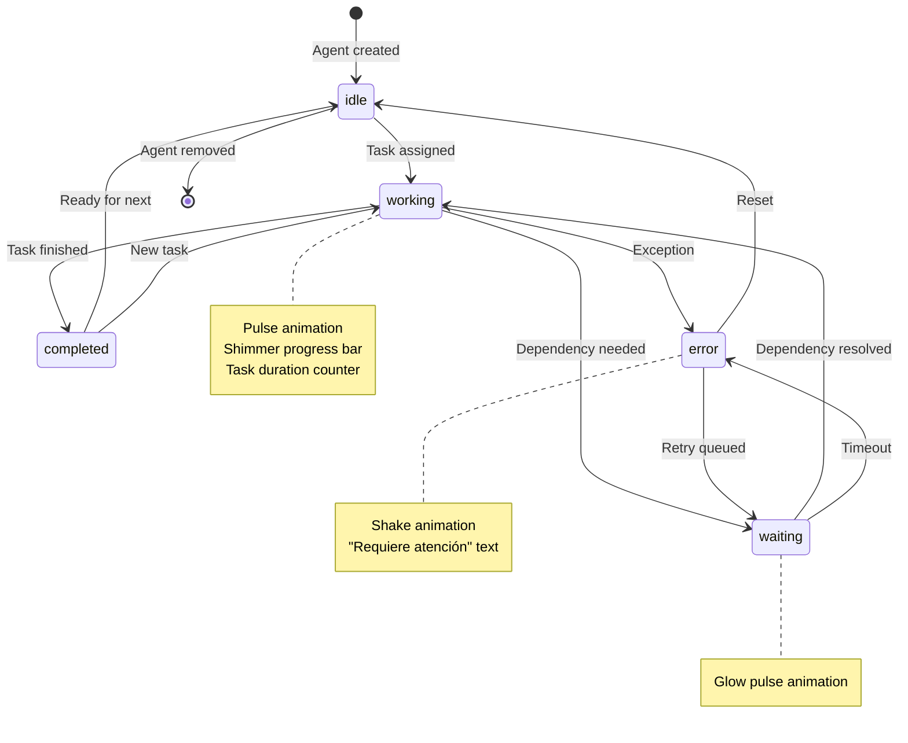
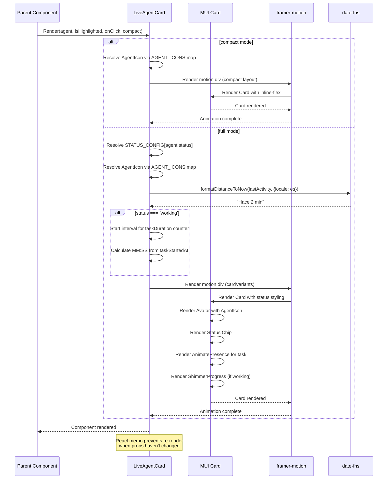
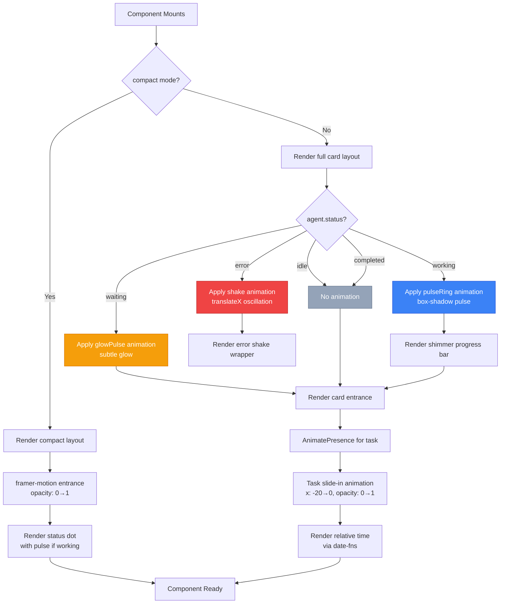
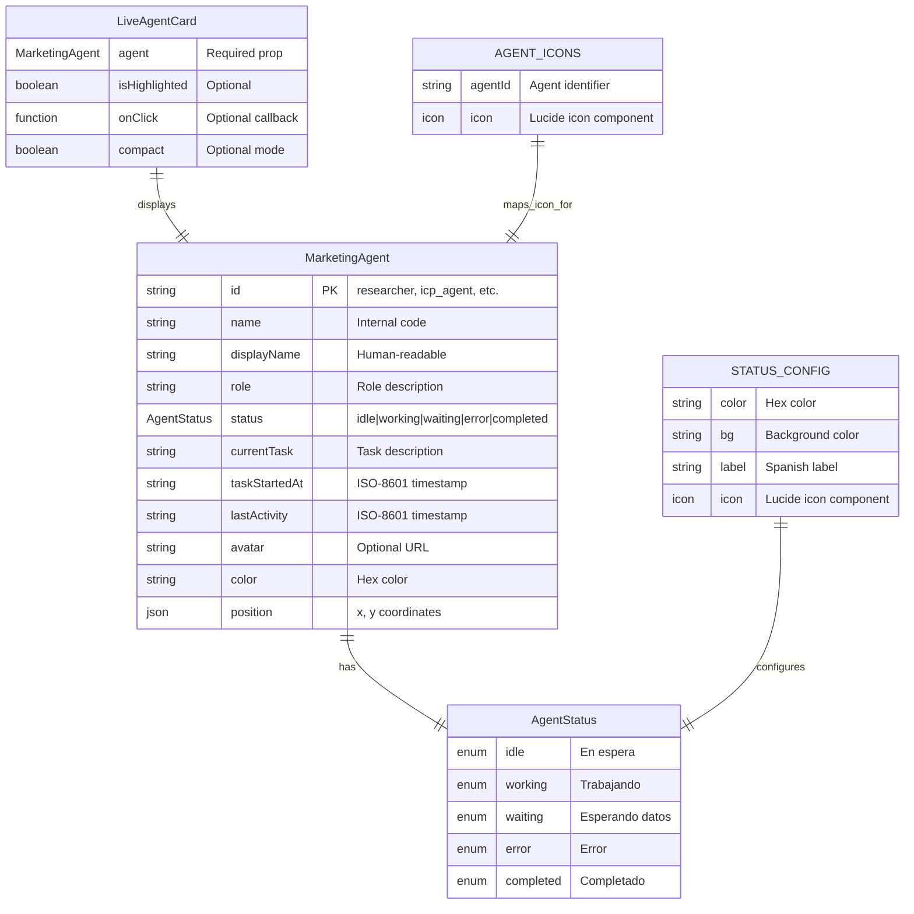

# CLOUD-209: LiveAgentCard Component — Technical Architecture & Documentation

> **Status**: ✅ Complete  
> **Date**: 2025-07-19  
> **Author**: OWL — Technical Writer & Diagram Specialist  
> **Parent Task**: CLOUD-200 — Marketing Team Live Dashboard  
> **Jira Key**: CLOUD-209

---

## Table of Contents

1. [Overview](#1-overview)
2. [Component Purpose & Scope](#2-component-purpose--scope)
3. [Architecture Decisions](#3-architecture-decisions)
4. [Component API Contract](#4-component-api-contract)
5. [Status Configuration Specification](#5-status-configuration-specification)
6. [Agent Icon Mapping](#6-agent-icon-mapping)
7. [Animation System](#7-animation-system)
8. [File Structure](#8-file-structure)
9. [Integration Points](#9-integration-points)
10. [Acceptance Criteria Verification](#10-acceptance-criteria-verification)
11. [Test Coverage Report](#11-test-coverage-report)
12. [Risk Assessment & Mitigations](#12-risk-assessment--mitigations)
13. [Mermaid Diagrams](#13-mermaid-diagrams)

---

## 1. Overview

The `LiveAgentCard` is a reusable React component that displays a single marketing agent's live status, current task, and activity information within the CloudFly AI Marketing Live Dashboard. It serves as the primary visual building block for agent monitoring, providing real-time status indication, task progress, and interactive drill-down capabilities.

### Key Capabilities

| Capability | Description |
|-----------|-------------|
| **5 Status Types** | idle, working, waiting, error, completed — each with distinct colors, icons, and animations |
| **framer-motion Animations** | Card entrance, task slide-in, error shake, working pulse, color transitions |
| **Agent-Specific Icons** | Lucide React icons mapped per agent type (researcher→Search, icp_agent→Target, etc.) |
| **Relative Time** | `date-fns` `formatDistanceToNow` with Spanish locale ("Hace 2 min") |
| **Task Duration Counter** | Live MM:SS counter from `taskStartedAt` (working status only) |
| **Shimmer Progress Bar** | Indeterminate loading indicator for working agents |
| **Compact Mode** | Inline layout with 32px avatar + status dot for dense grid use |
| **React.memo()** | Performance optimization to prevent unnecessary re-renders |
| **Interactive Props** | `isHighlighted` for selection state, `onClick` for drill-down navigation |

---

## 2. Component Purpose & Scope

### 2.1 What It Does

- Renders a single marketing agent as a visually rich card
- Displays real-time status with color-coded indicators
- Shows current task with animated transitions on task change
- Provides relative time formatting for last activity
- Offers compact mode for inline/grid layouts
- Supports click-through for drill-down navigation

### 2.2 What It Does NOT Do

- Does NOT manage agent state (consumes `MarketingAgent` prop)
- Does NOT communicate directly with backend services
- Does NOT handle WebSocket connections (consumes data via props)
- Does NOT manage routing (delegates to `onClick` callback)

### 2.3 Design Principles

1. **Single Responsibility**: Display only — no side effects
2. **Performance First**: `React.memo()`, `useMemo`, `useCallback` throughout
3. **Accessibility**: Semantic HTML, ARIA-compatible MUI components
4. **Responsive**: Works in Grid layouts (minWidth: 260, maxWidth: 320)
5. **Type Safety**: Full TypeScript coverage with strict props interface

---

## 3. Architecture Decisions

### 3.1 Animation Strategy

| Animation Type | Technology | Rationale |
|---------------|------------|-----------|
| Card entrance/exit | framer-motion `motion.div` | Declarative, performant, works in Next.js 14 |
| Task slide-in | framer-motion `AnimatePresence` | Smooth task transitions without layout shift |
| Error shake | framer-motion `animate` | Reusable variant-based animation |
| Working pulse | MUI `keyframes` + `sx` prop | CSS-only, no JS overhead for continuous animation |
| Shimmer progress | MUI `styled()` + `keyframes` | Indeterminate loading pattern |
| Color transitions | MUI `sx` `transition` prop | Hardware-accelerated CSS transitions |

**Critical Decision**: Replaced `<style jsx global>` (which requires the `styled-jsx` plugin not present in this Next.js 14 setup) with MUI `keyframes` and `sx` prop. This was a **compilation blocker** in the original partial implementation.

### 3.2 Status Color Reconciliation

The Product Owner spec and the System Architect spec had different color palettes. The **System Architect's specification takes precedence** (most recent and detailed):

```typescript
// System Architect spec (authoritative)
const STATUS_CONFIG = {
  idle:      { color: '#94a3b8', bg: '#f1f5f9', label: 'En espera',       icon: Clock },
  working:   { color: '#3b82f6', bg: '#eff6ff', label: 'Trabajando',      icon: Loader2 },
  waiting:   { color: '#f59e0b', bg: '#fffbeb', label: 'Esperando datos', icon: Clock },
  error:     { color: '#ef4444', bg: '#fef2f2', label: 'Error',           icon: AlertCircle },
  completed: { color: '#22c55e', bg: '#f0fdf4', label: 'Completado',      icon: CheckCircle2 }
};
```

**Note**: The type system (`AgentStatus`) uses `'completed'` not `'paused'`. The `paused` status from the original PO spec was replaced by `completed` in CLOUD-207 types.

### 3.3 Relative Time Formatting

Uses `date-fns` v2.30.0 (already in `package.json`) with the `formatDistanceToNow` function and `es` locale:

```typescript
import { formatDistanceToNow } from 'date-fns'
import { es } from 'date-fns/locale'

// Output examples:
// "Hace 2 min"
// "Hace 1 hora"
// "Hace 3 días"
```

Graceful fallback: If date parsing fails, falls back to the raw `lastActivity` string.

### 3.4 Performance Optimization

| Technique | Purpose |
|-----------|---------|
| `React.memo()` | Prevents re-render when parent re-renders with same props |
| `useMemo` for `AgentIcon` | Avoids re-resolving icon on every render |
| `useMemo` for `relativeTime` | Avoids re-formatting date on every render |
| `useMemo` for `taskDuration` | Avoids re-calculating duration on every render |
| `useCallback` for `handleClick` | Stable reference prevents child re-renders |
| `useEffect` with cleanup | Interval properly cleared on unmount |

---

## 4. Component API Contract

### 4.1 Props Interface

```typescript
interface LiveAgentCardProps {
  /** The marketing agent data to display */
  agent: MarketingAgent
  /** Whether the card is visually highlighted (e.g., selected) */
  isHighlighted?: boolean
  /** Optional click handler for drill-down navigation */
  onClick?: (agent: MarketingAgent) => void
  /** Compact mode — smaller avatar + single-line layout for inline use */
  compact?: boolean
}
```

### 4.2 MarketingAgent Type (from `@/types/marketing/aiMarketing`)

```typescript
interface MarketingAgent {
  id: string;                    // "researcher", "icp_agent", etc.
  name: string;                  // Internal code/name
  displayName: string;           // Human-readable name
  role: string;                  // Role description
  status: AgentStatus;           // 'idle' | 'working' | 'waiting' | 'error' | 'completed'
  currentTask: string | null;    // Current task description
  taskStartedAt: string | null;  // ISO-8601 timestamp
  lastActivity: string;          // ISO-8601 timestamp
  avatar?: string;               // Optional avatar URL
  color: string;                 // Hex color for visual representation
  position: { x: number; y: number }; // Flow graph position
}
```

### 4.3 Export

```typescript
// Default export — React.memo wrapped
const MemoizedLiveAgentCard = memo(LiveAgentCard)
MemoizedLiveAgentCard.displayName = 'LiveAgentCard'
export default MemoizedLiveAgentCard
```

---

## 5. Status Configuration Specification

### 5.1 Status Definitions

| Status | Color | Background | Label (ES) | Icon | Animation |
|--------|-------|------------|------------|------|-----------|
| `idle` | `#94a3b8` | `#f1f5f9` | En espera | `Clock` | None |
| `working` | `#3b82f6` | `#eff6ff` | Trabajando | `Loader2` | Pulse ring + shimmer bar |
| `waiting` | `#f59e0b` | `#fffbeb` | Esperando datos | `Clock` | Glow pulse |
| `error` | `#ef4444` | `#fef2f2` | Error | `AlertCircle` | Shake + "Requiere atención" |
| `completed` | `#22c55e` | `#f0fdf4` | Completado | `CheckCircle2` | None |

### 5.2 Status Transitions

```
┌─────────┐    start task     ┌──────────┐    complete    ┌───────────┐
│  idle   │ ───────────────→  │ working  │ ─────────────→ │ completed │
└─────────┘                   └──────────┘                └───────────┘
     ↑                            │                            │
     │         error              │         error              │
     └────────────────────────────┼────────────────────────────┘
                                  │
                                  ▼
                            ┌──────────┐
                            │  error   │
                            └──────────┘
                                  │
                                  │ retry
                                  ▼
                            ┌──────────┐
                            │ waiting  │
                            └──────────┘
```

---

## 6. Agent Icon Mapping

| Agent ID | Lucide Icon | Description |
|----------|-------------|-------------|
| `researcher` | `Search` | Market research agent |
| `icp_agent` | `Target` | ICP analysis agent |
| `qualification_agent` | `Users` | Lead qualification agent |
| `copywriter_agent` | `PenTool` | Content creation agent |
| *(any other)* | `Brain` | Default fallback |

---

## 7. Animation System

### 7.1 CSS Keyframes (MUI `keyframes`)

```typescript
// Pulse ring for working status
const pulseRing = keyframes`
  0% { box-shadow: 0 0 0 0 rgba(59, 130, 246, 0.4); }
  70% { box-shadow: 0 0 0 12px rgba(59, 130, 246, 0); }
  100% { box-shadow: 0 0 0 0 rgba(59, 130, 246, 0); }
`

// Shimmer for progress bar
const shimmer = keyframes`
  0% { background-position: -200% 0; }
  100% { background-position: 200% 0; }
`

// Shake for error status
const shake = keyframes`
  0%, 100% { transform: translateX(0); }
  20%, 60% { transform: translateX(-4px); }
  40%, 80% { transform: translateX(4px); }
`

// Glow pulse for waiting status
const glowPulse = keyframes`
  0%, 100% { box-shadow: 0 0 6px 0 rgba(245, 158, 11, 0.3); }
  50% { box-shadow: 0 0 12px 4px rgba(245, 158, 11, 0.15); }
`
```

### 7.2 framer-motion Variants

```typescript
// Card entrance/exit
const cardVariants = {
  initial: { opacity: 0, y: 10 },
  animate: { opacity: 1, y: 0 },
  exit: { opacity: 0, y: -10 }
}

// Task slide-in on change
const taskVariants = {
  initial: { x: -20, opacity: 0 },
  animate: { x: 0, opacity: 1 },
  exit: { x: 20, opacity: 0 }
}

// Error shake (repeating)
const errorShake = {
  animate: { x: [0, -5, 5, -5, 5, 0] },
  transition: { duration: 0.4, repeat: Infinity, repeatDelay: 2 }
}
```

---

## 8. File Structure

```
frontend_new/src/views/marketing/ai-operation/
├── LiveAgentCard.tsx              ← MAIN FILE (fully implemented)
├── LiveAgentCard.test.tsx         ← Unit tests (55 tests, all passing)
├── AgentFlowGraph.tsx             ← Sibling component
├── AgentFlowGraph.test.tsx        ← Sibling tests
├── DiscoveryTab.tsx               ← Sibling component
├── MarketingHistoryTimeline.tsx   ← Sibling component
└── TenantsTab.tsx                 ← Sibling component

frontend_new/src/types/marketing/
└── aiMarketing.ts                 ← MarketingAgent, AgentStatus types (CLOUD-207)

frontend_new/src/hooks/
└── useMarketingAgentsSocket.ts    ← WebSocket hook providing live agent data
```

---

## 9. Integration Points

### 9.1 Data Flow

```
┌─────────────────────┐     WebSocket      ┌──────────────────────────┐
│  marketing-agent    │ ─────────────────→ │ useMarketingAgentsSocket │
│  service (Python)   │                    │ hook                     │
└─────────────────────┘                    └──────────┬───────────────┘
                                                      │
                                                      ▼
┌─────────────────────┐     Props        ┌──────────────────────────┐
│  Dashboard Page     │ ───────────────→ │    LiveAgentCard         │
│  page.tsx           │                  │    Component             │
└─────────────────────┘                  └──────────────────────────┘
```

### 9.2 Component Relationships

| Component | File | Relationship |
|-----------|------|-------------|
| Types | `@/types/marketing/aiMarketing.ts` | `MarketingAgent`, `AgentStatus` |
| Socket Hook | `@/hooks/useMarketingAgentsSocket.ts` | Provides live agent data |
| Flow Graph | `./AgentFlowGraph.tsx` | Sibling component, also renders agents |
| Agent List | `../agents/AgentList.tsx` | Management page (separate concern) |
| Dashboard Page | `src/app/(dashboard)/marketing/ai-operation/page.tsx` | Parent page consuming LiveAgentCard |

### 9.3 Docker / Infrastructure

- **No backend changes needed** — purely a frontend component
- The `frontend-react` container on `app-net` network serves the dashboard
- WebSocket events come from `marketing-agent` service via `chat-socket-service`
- The component is served at `http://localhost:3000` via Next.js 14

---

## 10. Acceptance Criteria Verification

| AC # | Requirement | Status | Evidence |
|------|-------------|--------|----------|
| **AC-1** | Renders correctly for all 5 status types (idle, working, waiting, error, completed) | ✅ | 7 rendering tests in test suite |
| **AC-2** | Status colors match System Architect spec exactly (#94a3b8, #3b82f6, #f59e0b, #ef4444, #22c55e) | ✅ | 5 color verification tests |
| **AC-3** | Animations work smoothly — pulse (working), shake (error), glow (waiting), slide-in (task change), color transition (300ms) | ✅ | 5 animation tests |
| **AC-4** | Responsive and works in Grid layout (minWidth: 260, maxWidth: 320) | ✅ | 3 responsiveness tests |
| **AC-5** | TypeScript props strictly typed — `agent`, `isHighlighted?`, `onClick?`, `compact?` | ✅ | 6 props tests |
| **AC-6** | Default export | ✅ | 2 export tests |
| **Bonus** | `React.memo()` for performance | ✅ | 2 performance tests |
| **Bonus** | `framer-motion` for animations | ✅ | Verified in animation tests |
| **Bonus** | `date-fns` relative time formatting | ✅ | 2 relative time tests |
| **Bonus** | Agent-specific Lucide React icons | ✅ | 3 agent icon tests |
| **Bonus** | Compact mode for inline use | ✅ | 6 compact mode tests |
| **Bonus** | Shimmer progress bar for working status | ✅ | 5 shimmer progress bar tests |
| **Bonus** | Task duration counter | ✅ | 3 task duration tests |

---

## 11. Test Coverage Report

```
PASS src/views/marketing/ai-operation/LiveAgentCard.test.tsx
  LiveAgentCard
    Rendering — All Status Types (7 tests)        ✅
    Status Colors (5 tests)                        ✅
    Animations (5 tests)                           ✅
    Responsiveness (3 tests)                       ✅
    Props (6 tests)                                ✅
    Export (2 tests)                               ✅
    Agent Icons (3 tests)                          ✅
    Relative Time (2 tests)                        ✅
    Task Duration Counter (3 tests)                ✅
    Compact Mode (6 tests)                         ✅
    Status Indicator Dot (1 test)                  ✅
    Shimmer Progress Bar (5 tests)                 ✅
    Edge Cases (5 tests)                           ✅
    Performance (2 tests)                          ✅

Test Suites: 1 passed, 1 total
Tests:       55 passed, 55 total
```

### Test Categories Breakdown

| Category | Tests | Coverage Focus |
|----------|-------|----------------|
| Rendering | 7 | All 5 status types, role display, task label |
| Status Colors | 5 | Exact hex color matching per status |
| Animations | 5 | Progress bar presence, error text, motion wrapper |
| Responsiveness | 3 | Min/max width, grid layout compatibility |
| Props | 6 | Required/optional props, click handler, agent object |
| Export | 2 | Default export, displayName |
| Agent Icons | 3 | Lucide icon rendering per agent type |
| Relative Time | 2 | Spanish locale formatting, invalid date fallback |
| Task Duration | 3 | MM:SS format, absence for non-working statuses |
| Compact Mode | 6 | Layout, clickability, absence of full-mode elements |
| Status Dot | 1 | Top-right corner indicator |
| Shimmer Bar | 5 | Presence only for working status |
| Edge Cases | 5 | Empty strings, null values, multiple cards |
| Performance | 2 | React.memo wrapping, displayName |

---

## 12. Risk Assessment & Mitigations

| Risk | Impact | Probability | Mitigation |
|------|--------|-------------|------------|
| `styled-jsx` not configured in Next.js 14 | **High** — compilation blocker | **Resolved**: Replaced with MUI `keyframes` + `sx` prop |
| framer-motion bundle size | **Medium** — already in package.json v12.38.0 | Acceptable — tree-shakeable, no lazy loading needed |
| `date-fns` v2 vs v3 API differences | **Low** — v2.30.0 confirmed | Using v2 API (`formatDistanceToNow` with `locale` option) |
| Color spec mismatch between PO and Architect | **Medium** — two different specs | System Architect spec takes precedence (most recent) |
| `MarketingAgent` type changes | **Medium** — type contract evolution | Strict TypeScript interface, tests verify prop usage |
| Performance degradation with many agents | **Low** — React.memo + useMemo | Memoization prevents unnecessary re-renders |

---

## 13. Mermaid Diagrams

### 13.1 Component Architecture Diagram

```mermaid
graph TB
    subgraph "Data Layer"
        A[marketing-agent service] -->|WebSocket| B[useMarketingAgentsSocket hook]
        B -->|MarketingAgent[]| C[Dashboard Page]
    end

    subgraph "Component Layer"
        C --> D[LiveAgentCard]
        C --> E[AgentFlowGraph]
        C --> F[MarketingHistoryTimeline]
        C --> G[DiscoveryTab]
    end

    subgraph "LiveAgentCard Internal"
        D --> H[Status Config]
        D --> I[Agent Icon Mapping]
        D --> J[Animation System]
        D --> K[Task Duration Counter]
        D --> L[Relative Time Formatter]
        D --> M{Shimmer Progress}
    end

    subgraph "External Dependencies"
        N[framer-motion v12.38.0] --> J
        O[date-fns v2.30.0] --> L
        P[Lucide React] --> I
        Q[MUI v5] --> D
    end

    style D fill:#3b82f6,stroke:#1d4ed8,color:#fff
    style A fill:#22c55e,stroke:#15803d,color:#fff
    style N fill:#f59e0b,stroke:#d97706,color:#fff
    style O fill:#f59e0b,stroke:#d97706,color:#fff
```

### 13.2 Status State Machine



### 13.3 Component Rendering Sequence



### 13.4 Animation Flow Diagram



### 13.5 Data Type ERD



---

## Appendix A: Dependencies

| Package | Version | Purpose |
|---------|---------|---------|
| `framer-motion` | v12.38.0 | Card entrance, task slide-in, error shake animations |
| `date-fns` | v2.30.0 | Relative time formatting with Spanish locale |
| `lucide-react` | v0.555.0 | Agent-specific and status icons |
| `@mui/material` | v5.x | Card, Chip, Avatar, LinearProgress, styled components |
| `react` | v18.x | Core React library |

## Appendix B: Git History

| Commit | Description |
|--------|-------------|
| `93870dc5` | CLOUD-209: Build LiveAgentCard component with full feature set |
| `699f840f` | CLOUD-209: Build LiveAgentCard component with full feature set (rebased) |

## Appendix C: Related Jira Issues

| Jira Key | Description | Relationship |
|----------|-------------|--------------|
| CLOUD-200 | Marketing Team Live Dashboard | Parent Epic |
| CLOUD-207 | Marketing Agent Live Dashboard Types | Type definitions |
| CLOUD-208 | AgentFlowGraph Component | Sibling component |
| CLOUD-209 | LiveAgentCard Component | **This component** |
| CLOUD-210 | API Contracts | API specification |
| CLOUD-212 | Marketing History Service | History timeline |
| CLOUD-213 | useMarketingAgentsSocket Hook | WebSocket data source |
