# CLOUD-210: Marketing Live Dashboard — Architecture Diagrams

> **Ticket:** CLOUD-210 (Resume & Complete — Replace page.tsx with the new Marketing Live Dashboard)  
> **Status:** ✅ Finalizada  
> **Last Updated:** 2025-07-19  
> **Author:** AI Scrum Team — Technical Writer Agent  

---

## 1. System Context Diagram

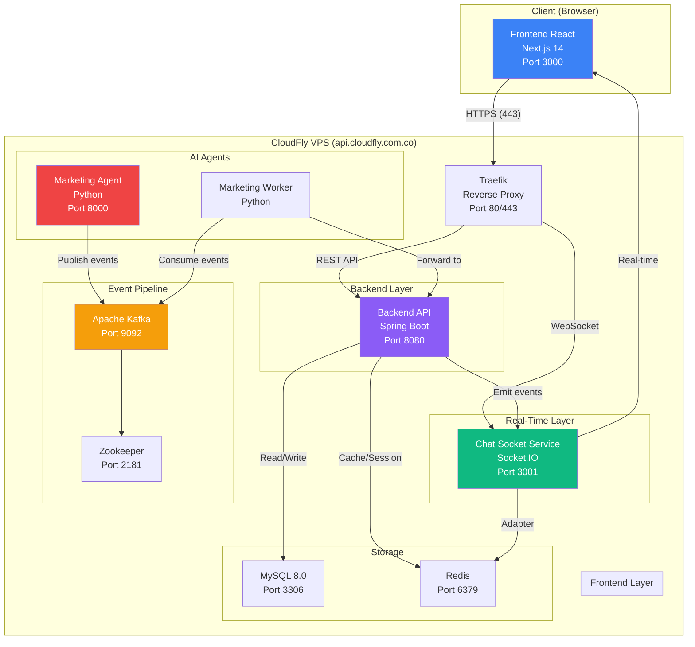

---

## 2. Component Architecture Diagram

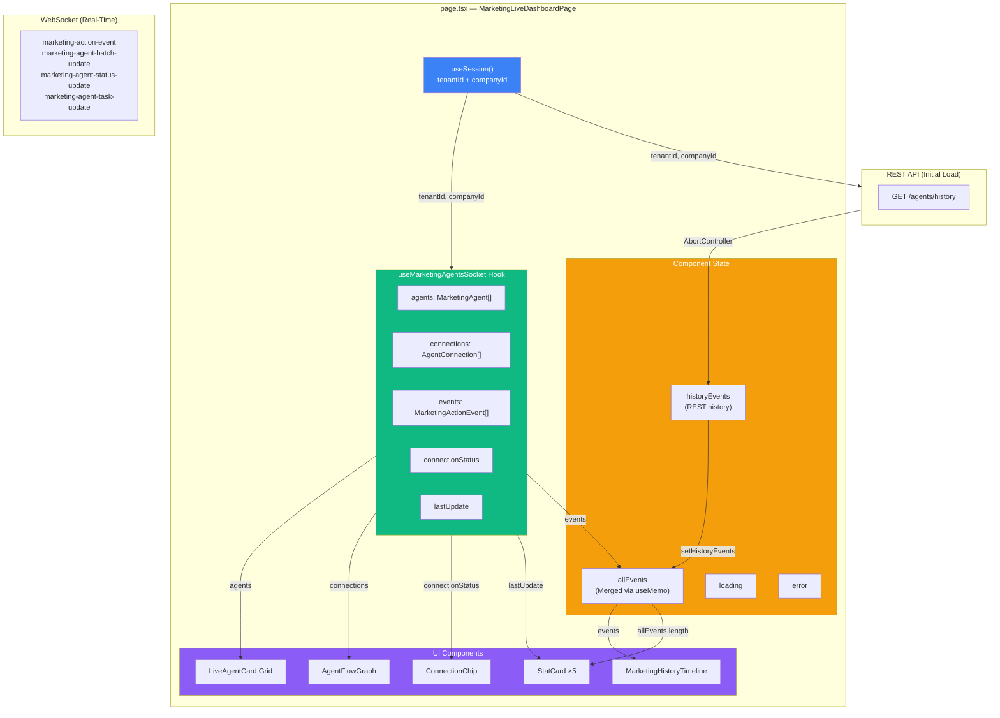

---

## 3. Data Flow Sequence Diagram

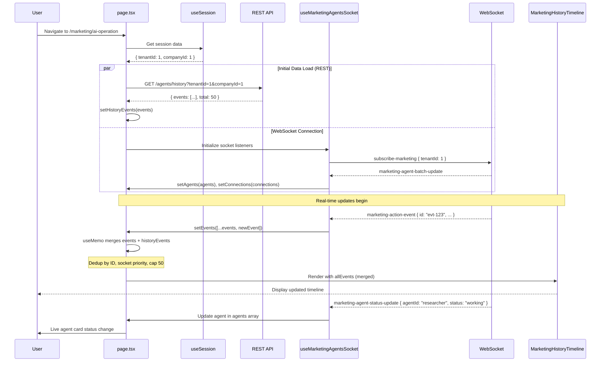

---

## 4. Event Merging Flow (CLOUD-252)

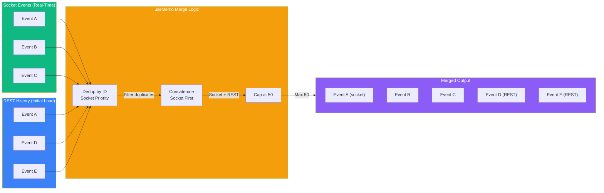

---

## 5. WebSocket Event Protocol

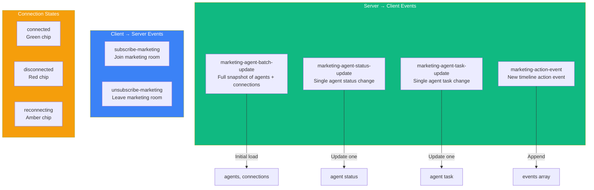

---

## 6. Responsive Layout Grid (CLOUD-254)

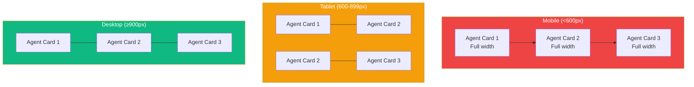

---

## 7. Stats Bar Layout (CLOUD-253)

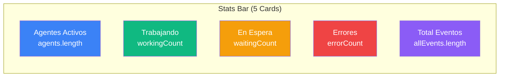

---

## 8. AbortController Lifecycle (CLOUD-218)

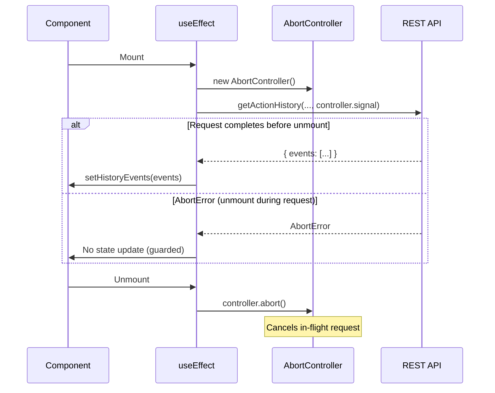

---

## 9. Session Integration Flow (CLOUD-251)

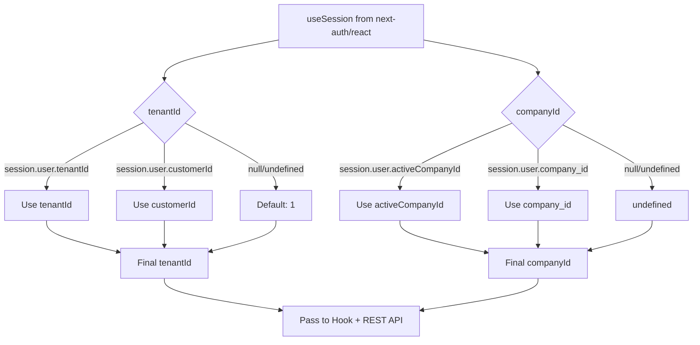

---

## 10. Test Coverage Map

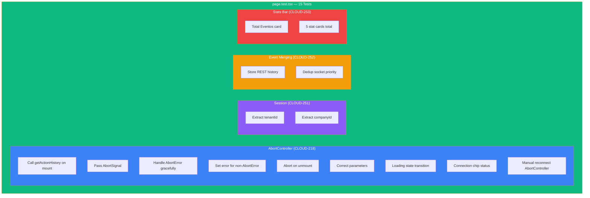

---

## 11. Deployment Architecture

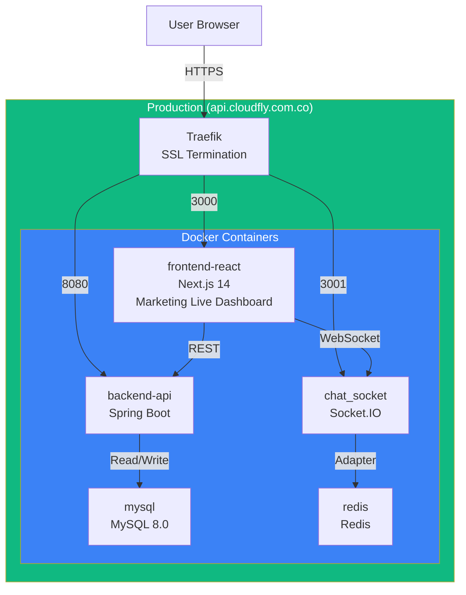

---

## 12. Related Diagrams

- [CLOUD-212: REST API Architecture](./AGENTE_DEV_CLOUD-212_architecture_diagrams.md)
- [CLOUD-191: System Architecture](./AGENTE_DEV_CLOUD-191_architecture_diagrams.md)
- [WebSocket Event Protocol](./chat_socket_flow.md)
- [WhatsApp Message Flow](./whatsapp_message_flow.md)
