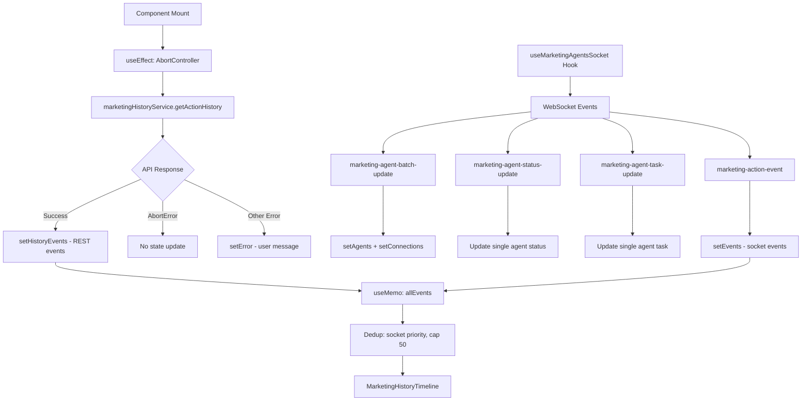

# CLOUD-210: Marketing Live Dashboard — Technical Architecture

> **Ticket:** CLOUD-210 (Resume & Complete — Replace page.tsx with the new Marketing Live Dashboard)  
> **Status:** ✅ Finalizada  
> **Last Updated:** 2025-07-19  
> **Author:** AI Scrum Team — Technical Writer Agent  

---

## 1. Executive Summary

The **Marketing Live Dashboard** (`/marketing/ai-operation`) is a real-time Next.js 14 page that provides a unified view of marketing AI agents, their interconnections, and action history. It combines **REST API** initial data loading with **WebSocket** real-time updates, all scoped to the authenticated user's tenant and company.

This document covers the complete technical architecture after the CLOUD-210 completion sprint (sub-tasks CLOUD-251 through CLOUD-256).

---

## 2. System Context

### 2.1 Infrastructure Topology

The Marketing Live Dashboard is a **frontend-only feature** — no new Docker services were required. The relevant infrastructure:

| Service | Container | Port | Role |
|---------|-----------|------|------|
| `frontend-react` | Next.js 14 | 3000 | **Host of the page.tsx** |
| `chat_socket` | Socket.IO | 3001 | WebSocket real-time events |
| `backend-api` | Spring Boot | 8080 | REST API endpoints |
| `marketing-agent` | Python AI | 8000 | Emits marketing events |
| `marketing-worker` | Python | 8080 | Processes marketing tasks |
| `kafka` | Apache Kafka | 9092 | Event bus pipeline |
| `mysql` | MySQL 8.0 | 3306 | Agent state, action history |
| `redis` | Redis | 6379 | Socket.IO adapter, sessions |
| `traefik` | Reverse proxy | 80/443 | Routes to services |

### 2.2 Network Flow

```
Browser → Traefik (443) → frontend-react:3000 (Next.js page.tsx)
Browser → Traefik (443) → chat_socket:3001 (WebSocket events)
frontend-react → Traefik (443) → backend-api:8080 (REST API)
marketing-agent → kafka:9092 → marketing-worker → backend-api → chat_socket → Browser
```

---

## 3. Component Architecture

### 3.1 File Structure

```
frontend_new/src/
├── app/(dashboard)/marketing/ai-operation/
│   ├── page.tsx                          # Main dashboard page (CLOUD-210)
│   └── page.test.tsx                     # Unit tests (15 tests, all passing)
├── hooks/
│   └── useMarketingAgentsSocket.ts       # WebSocket hook for real-time data
├── services/marketing/
│   └── marketingHistoryService.ts        # REST service for initial data
├── types/marketing/
│   └── aiMarketing.ts                    # TypeScript type definitions
└── views/marketing/ai-operation/
    ├── LiveAgentCard.tsx                 # Individual agent status card
    ├── AgentFlowGraph.tsx                # SVG flow graph of agent connections
    └── MarketingHistoryTimeline.tsx      # Action history timeline
```

### 3.2 Component Hierarchy

```
MarketingLiveDashboardPage (page.tsx)
├── ConnectionChip                        # WebSocket connection status indicator
├── StatCard (×5)                         # Statistics cards
│   ├── Agentes Activos (agents.length)
│   ├── Trabajando (working count)
│   ├── En Espera (waiting count)
│   ├── Errores (error count)
│   └── Total Eventos (allEvents.length)  ← CLOUD-253
├── AgentFlowGraph                        # SVG visualization of agent connections
│   └── (receives agents + connections)
├── LiveAgentCard (×N)                    # Responsive grid of agent cards
│   └── (xs=12, sm=6, md=4)              ← CLOUD-254
└── MarketingHistoryTimeline              # Merged event timeline
    └── (receives allEvents)              ← CLOUD-252
```

---

## 4. Data Flow Architecture

### 4.1 Dual Data Source Pattern

The dashboard uses a **dual data source** pattern:

1. **REST API** — Initial data load on mount (via `AbortController`-protected `useEffect`)
2. **WebSocket** — Real-time updates after initial load



### 4.2 Event Merging Algorithm (CLOUD-252)

```typescript
const allEvents = useMemo(() => {
  // 1. Build Set of socket event IDs (socket takes priority)
  const socketIds = new Set(events.map(e => e.id))
  
  // 2. Filter out REST events whose ID exists in socket set
  const filteredHistory = historyEvents.filter(e => !socketIds.has(e.id))
  
  // 3. Concatenate: socket events first, then filtered REST events
  // 4. Cap at 50 total
  return [...events, ...filteredHistory].slice(0, 50)
}, [events, historyEvents])
```

**Properties:**
- **Idempotent:** Same inputs always produce same output
- **Socket priority:** If socket and REST have same ID, socket wins
- **Bounded:** Maximum 50 events in merged array
- **Order-preserving:** Socket events maintain their order, REST events maintain theirs

---

## 5. Session Integration (CLOUD-251)

### 5.1 Tenant/Company Resolution

```typescript
const { data: session } = useSession()
const tenantId = session?.user?.tenantId || session?.user?.customerId || 1
const companyId = session?.user?.activeCompanyId || session?.user?.company_id
```

### 5.2 Fallback Chain

| Priority | tenantId Source | Fallback |
|----------|-----------------|----------|
| 1st | `session.user.tenantId` | — |
| 2nd | `session.user.customerId` | Legacy field |
| 3rd | `1` | Default tenant |

| Priority | companyId Source | Fallback |
|----------|------------------|----------|
| 1st | `session.user.activeCompanyId` | — |
| 2nd | `session.user.company_id` | Legacy field |
| 3rd | `undefined` | Service handles gracefully |

### 5.3 Multi-Tenant Data Scoping

All API calls include `tenantId` and optionally `companyId`:

```
GET /api/v1/marketing/agents/history?tenantId=1&limit=50&page=0&companyId=1
WebSocket: subscribe-marketing { tenantId: 1, companyId: 1 }
```

---

## 6. WebSocket Event Protocol

### 6.1 Server → Client Events

| Event Name | Payload Type | Description |
|------------|--------------|-------------|
| `marketing-agent-batch-update` | `MarketingAgentBatchPayload \| MarketingAgent[]` | Full snapshot of agents + connections |
| `marketing-agent-status-update` | `AgentStatusUpdatePayload` | Single agent status change |
| `marketing-agent-task-update` | `AgentTaskUpdatePayload` | Single agent task change |
| `marketing-action-event` | `MarketingActionEvent` | New action for timeline |

### 6.2 Client → Server Events

| Event Name | Payload | Description |
|------------|---------|-------------|
| `subscribe-marketing` | `{ tenantId, companyId }` | Join marketing room |
| `unsubscribe-marketing` | `{ tenantId, companyId }` | Leave marketing room |

### 6.3 Connection States

```typescript
type ConnectionStatus = 'connected' | 'disconnected' | 'reconnecting'
```

| State | Color | Icon | Label |
|-------|-------|------|-------|
| `connected` | Green (#10b981) | Wifi | Conectado |
| `disconnected` | Red (#ef4444) | WifiOff | Desconectado |
| `reconnecting` | Amber (#f59e0b) | Loader | Reconectando... |

---

## 7. REST API Contracts

### 7.1 Get Action History

```
GET /api/v1/marketing/agents/history
```

**Query Parameters:**

| Parameter | Type | Required | Default | Description |
|-----------|------|----------|---------|-------------|
| `tenantId` | number | ✅ | — | Tenant identifier |
| `limit` | number | ❌ | 50 | Max events to return |
| `page` | number | ❌ | 0 | Page number |
| `companyId` | number | ❌ | — | Company scope |

**Response:**
```json
{
  "events": [
    {
      "id": "evt-123",
      "type": "lead_search_completed",
      "title": "Búsqueda completada",
      "description": "Se encontraron 47 leads",
      "agentId": "researcher",
      "timestamp": "2025-07-19T10:30:00Z",
      "metadata": { "count": 47 }
    }
  ],
  "total": 150,
  "hasMore": true
}
```

### 7.2 Get Live Agents

```
GET /api/v1/marketing/agents/live-status
```

**Query Parameters:**

| Parameter | Type | Required | Description |
|-----------|------|----------|-------------|
| `tenantId` | number | ✅ | Tenant identifier |
| `companyId` | number | ❌ | Company scope |

**Response:**
```json
{
  "agents": [
    {
      "id": "researcher",
      "name": "researcher",
      "displayName": "Investigador de Mercado",
      "role": "Market research and lead discovery",
      "status": "working",
      "currentTask": "Buscando leads en LinkedIn",
      "taskStartedAt": "2025-07-19T10:25:00Z",
      "lastActivity": "2025-07-19T10:30:00Z",
      "color": "#3b82f6",
      "position": { "x": 100, "y": 200 }
    }
  ],
  "connections": [
    {
      "id": "conn-1",
      "sourceAgentId": "researcher",
      "targetAgentId": "copywriter",
      "label": "Leads encontrados",
      "dataFlow": "leads",
      "active": true
    }
  ]
}
```

---

## 8. Type System

### 8.1 Core Types

```typescript
// Agent status union
type AgentStatus = 'idle' | 'working' | 'waiting' | 'error' | 'completed'

// Core agent entity
interface MarketingAgent {
  id: string
  name: string
  displayName: string
  role: string
  status: AgentStatus
  currentTask: string | null
  taskStartedAt: string | null
  lastActivity: string
  avatar?: string
  color: string
  position: { x: number; y: number }
}

// Directed connection between agents
interface AgentConnection {
  id: string
  sourceAgentId: string
  targetAgentId: string
  label: string
  dataFlow: 'leads' | 'analysis' | 'messages' | 'context'
  active: boolean
}

// Action event for timeline
interface MarketingActionEvent {
  id: string
  type: 'lead_search_started' | 'lead_search_completed' | 'campaign_created' |
        'message_sent' | 'analysis_completed' | 'crew_kickoff' | 'flow_transition' | 'error'
  title: string
  description: string
  agentId: string
  timestamp: string
  metadata: Record<string, any>
}
```

### 8.2 WebSocket Payload Types

```typescript
interface AgentStatusUpdatePayload {
  agentId: string
  agentName: string
  status: AgentStatus
  currentTask: string | null
  taskStartedAt: string | null
  lastActivity: string
  tenantId: number
  companyId: number
}

interface AgentTaskUpdatePayload {
  agentId: string
  taskId: string
  taskName: string
  taskDescription: string
  status: 'started' | 'in_progress' | 'completed' | 'failed'
  progress: number
  output: string | null
  timestamp: string
}

interface MarketingAgentBatchPayload {
  agents: MarketingAgent[]
  connections: AgentConnection[]
  timestamp: string
}
```

---

## 9. Responsive Layout (CLOUD-254)

### 9.1 Breakpoint Strategy

| Breakpoint | Agent Cards Grid | Stats Bar |
|------------|------------------|-----------|
| `<600px` (xs) | 1 column (`xs={12}`) | 2 cols (`xs={6}`) + full width 5th |
| `600-899px` (sm) | 2 columns (`sm={6}`) | 5 equal cols (`sm={2.4}`) |
| `900-1199px` (md) | 3 columns (`md={4}`) | 5 equal cols (`sm={2.4}`) |
| `≥1200px` (lg) | Inherits from parent Grid | 5 equal cols (`sm={2.4}`) |

### 9.2 Layout Verification

- ✅ No horizontal overflow at 375px viewport
- ✅ All sections readable on mobile
- ✅ Stats bar wraps gracefully on small screens
- ✅ Agent cards stack vertically on mobile

---

## 10. Error Handling

### 10.1 Error Scenarios

| Scenario | Handling | User Experience |
|----------|----------|-----------------|
| REST API failure | `setError()` with message | Warning Alert with dismiss |
| WebSocket disconnect | `connectionStatus = 'disconnected'` | Red chip "Desconectado" |
| WebSocket reconnect | `connectionStatus = 'reconnecting'` | Amber chip "Reconectando..." |
| AbortError (unmount) | Silently ignored | No impact |
| Manual reconnect | `reconnect()` + refetch | Button triggers both |

### 10.2 AbortController Pattern (CLOUD-218)

```typescript
useEffect(() => {
  const controller = new AbortController()
  
  const loadInitialData = async () => {
    try {
      const history = await marketingHistoryService.getActionHistory(
        tenantId, 50, 0, companyId, controller.signal
      )
      if (history?.events) setHistoryEvents(history.events)
    } catch (err) {
      if ((err as Error).name !== 'AbortError') {
        setError('Error al cargar los datos iniciales. Usando modo offline.')
      }
    } finally {
      setLoading(false)
    }
  }
  
  loadInitialData()
  return () => controller.abort()  // Cleanup on unmount
}, [tenantId, companyId])
```

---

## 11. Test Coverage

### 11.1 Test Suite Summary

| Test Group | Tests | Coverage |
|------------|-------|----------|
| AbortController cleanup (CLOUD-218) | 7 | Signal passing, AbortError handling, unmount cleanup |
| Session integration (CLOUD-251) | 2 | tenantId extraction, companyId extraction |
| Event merging (CLOUD-252) | 2 | REST history storage, deduplication |
| Stats bar (CLOUD-253) | 2 | Total Eventos card, 5 stat cards total |
| **Total** | **15** | **All passing ✅** |

### 11.2 Key Test Cases

```typescript
// AbortController signal passing
it('should pass AbortSignal to getActionHistory', async () => {
  const callArgs = mock.getActionHistory.mock.calls[0]
  expect(callArgs[4]).toBeInstanceOf(AbortSignal)
})

// Session extraction
it('should extract tenantId from session', async () => {
  const callArgs = mock.getActionHistory.mock.calls[0]
  expect(callArgs[0]).toBe(1) // tenantId from session mock
})

// Stats bar
it('should show 5 stat cards total', async () => {
  expect(screen.getByText('Agentes Activos')).toBeInTheDocument()
  expect(screen.getByText('Trabajando')).toBeInTheDocument()
  expect(screen.getByText('En Espera')).toBeInTheDocument()
  expect(screen.getByText('Errores')).toBeInTheDocument()
  expect(screen.getByText('Total Eventos')).toBeInTheDocument()
})
```

---

## 12. Sprint Completion Summary

### 12.1 Sub-Tasks Completed

| Issue | Summary | Status |
|-------|---------|--------|
| CLOUD-251 | Integrate useSession for tenantId/companyId | ✅ Done |
| CLOUD-252 | Implement event merging (socket + REST dedup) | ✅ Done |
| CLOUD-253 | Add Stats Bar — Total Eventos + Last Update | ✅ Done |
| CLOUD-254 | Improve responsive layout and mobile UX | ✅ Done |
| CLOUD-255 | Update page.test.tsx — fix mocks + new tests | ✅ Done |
| CLOUD-256 | Final QA — compilation, runtime, regression | ✅ Done |

### 12.2 Files Modified

| File | Changes |
|------|---------|
| `page.tsx` | useSession integration, event merging, 5th stat card, responsive Grid |
| `page.test.tsx` | Fixed mock (`recentEvents` → `events`), added useSession mock, 6 new tests |

### 12.3 Acceptance Criteria (All Met)

1. ✅ Page loads without errors and displays all three sections
2. ✅ Initial data is fetched from REST API on mount
3. ✅ Real-time updates work via socket events
4. ✅ Connection status indicator is accurate
5. ✅ Page handles errors gracefully with user-friendly messages
6. ✅ Page is responsive and works on mobile devices
7. ✅ No TypeScript compilation errors
8. ✅ Existing functionality in other parts of the app is not broken

---

## 13. Related Documentation

- [CLOUD-212: REST API Architecture](./AGENTE_DEV_CLOUD-212_technical_architecture.md)
- [CLOUD-212: API Contracts](./AGENTE_DEV_CLOUD-212_api_contracts.md)
- [CLOUD-191: System Architecture](./AGENTE_DEV_CLOUD-191_architecture_diagrams.md)
- [WebSocket Event Protocol](./chat_socket_flow.md)
- [WhatsApp Message Flow](./whatsapp_message_flow.md)
