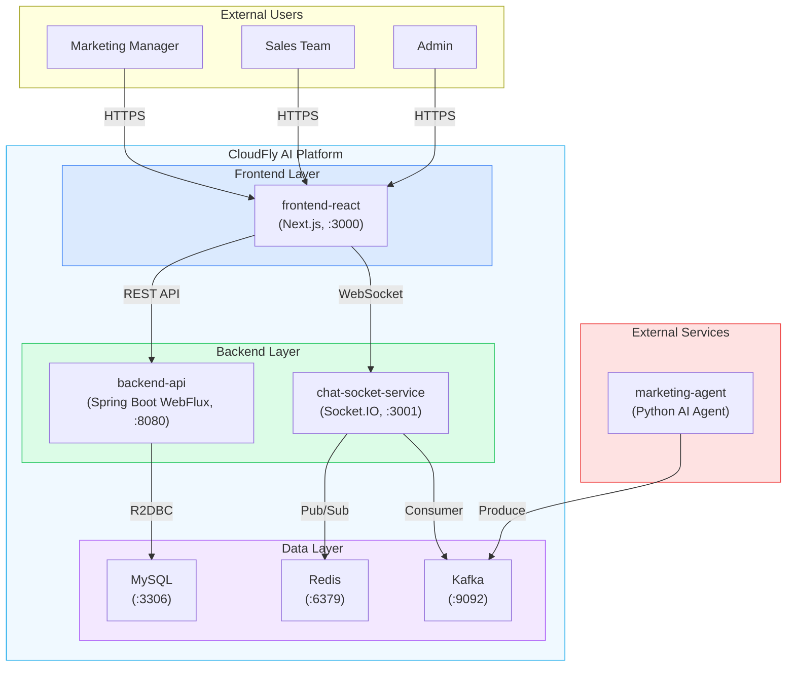
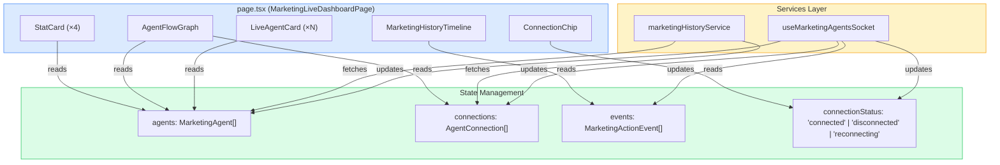
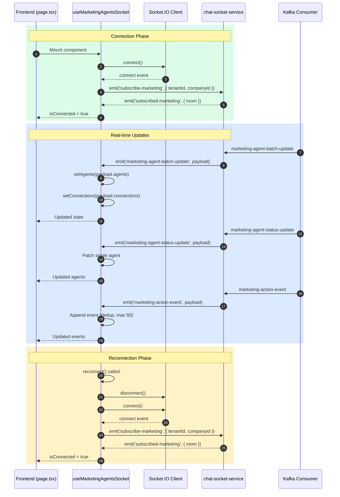
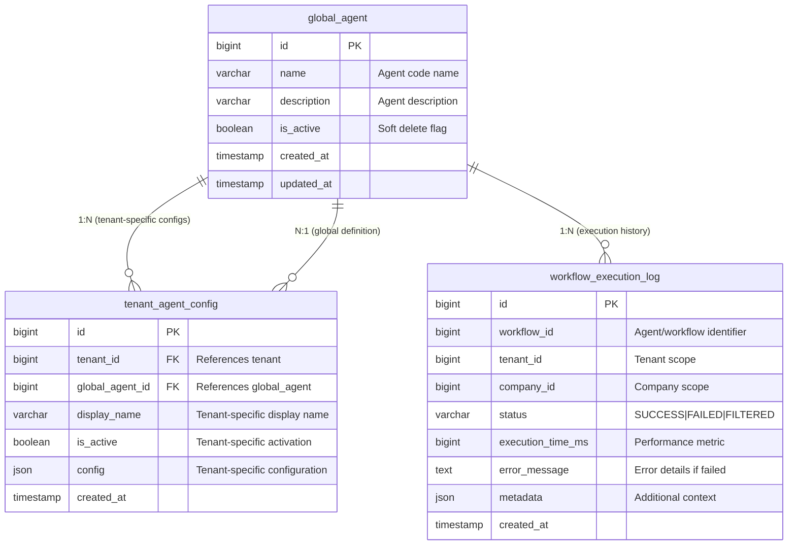
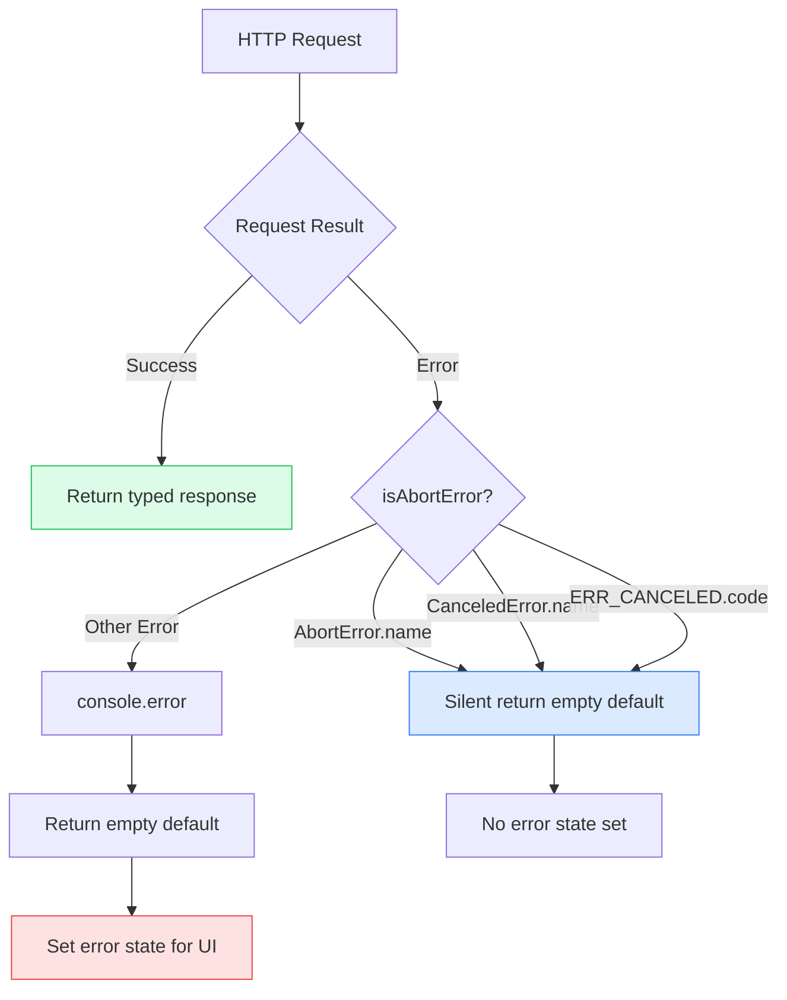
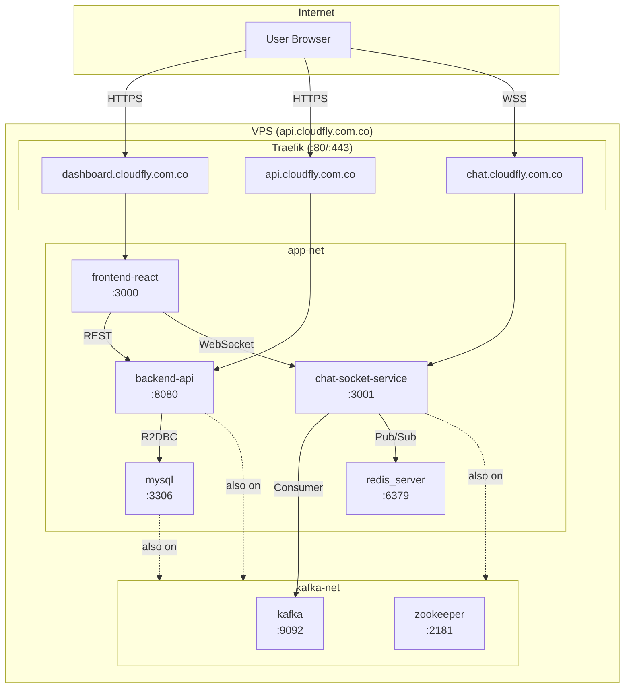
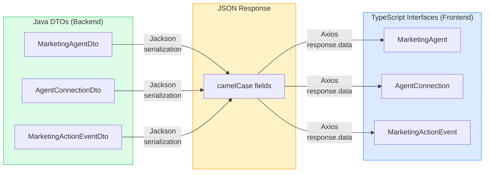
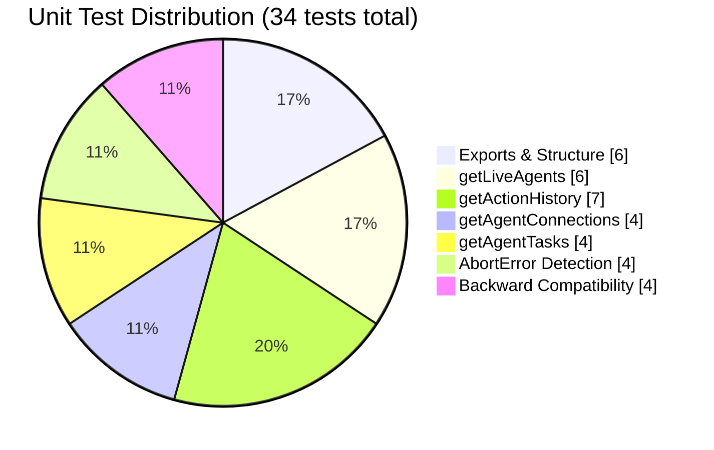
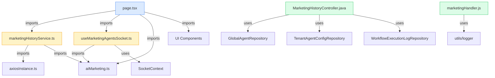

# CLOUD-212: marketingHistoryService — Architecture Diagrams

> **Document generated by:** 🤖 Technical Writer & Diagram Specialist  
> **Date:** 2025-07-19  
> **Ticket:** CLOUD-212 — Create marketingHistoryService for fetching history/tasks via REST  
> **Status:** ✅ **COMPLETE**

---

## 1. System Context Diagram



---

## 2. Component Architecture Diagram



---

## 3. Service Method Flow Diagram

```mermaid
flowchart TD
    subgraph getLiveAgents["getLiveAgents(tenantId, companyId?, signal?)"]
        LA1["Build URLSearchParams"] --> LA2["Append tenantId"]
        LA2 --> LA3{"companyId?"}
        LA3 -->|Yes| LA4["Append companyId"]
        LA3 -->|No| LA5["axiosInstance.get"]
        LA4 --> LA5
        LA5 --> LA6{"Response?"}
        LA6 -->|Success| LA7["Return { agents, connections }"]
        LA6 -->|AbortError| LA8["Return { agents: [], connections: [] }"]
        LA6 -->|Other Error| LA9["console.error"] --> LA8
    end

    subgraph getActionHistory["getActionHistory(tenantId, limit=50, page=0, companyId?, signal?)"]
        AH1["Build URLSearchParams"] --> AH2["Append tenantId, limit, page"]
        AH2 --> AH3{"companyId?"}
        AH3 -->|Yes| AH4["Append companyId"]
        AH3 -->|No| AH5["axiosInstance.get"]
        AH4 --> AH5
        AH5 --> AH6{"Response?"}
        AH6 -->|Success| AH7["Return MarketingHistoryResponse"]
        AH6 -->|AbortError| AH8["Return { events: [], total: 0, hasMore: false }"]
        AH6 -->|Other Error| AH9["console.error"] --> AH8
    end

    subgraph getAgentConnections["getAgentConnections(tenantId, signal?)"]
        AC1["axiosInstance.get"] --> AC2{"Response?"}
        AC2 -->|Success| AC3["Return AgentConnection[]"]
        AC2 -->|AbortError| AC4["Return []"]
        AC2 -->|Other Error| AC5["console.error"] --> AC4
    end

    subgraph getAgentTasks["getAgentTasks(agentId, signal?)"]
        AT1["axiosInstance.get"] --> AT2{"Response?"}
        AT2 -->|Success| AT3["Return MarketingActionEvent[]"]
        AT2 -->|AbortError| AT4["Return []"]
        AT2 -->|Other Error| AT5["console.error"] --> AT4
    end
```



---

## 4. WebSocket Event Flow Diagram



---

## 5. Database Schema Diagram



---

## 6. State Machine Diagram

```mermaid
stateDiagram-v2
    [*] --> Initializing

    Initializing --> LoadingREST: Component mounts
    LoadingREST --> RESTLoaded: REST call succeeds
    LoadingREST --> RESTError: REST call fails (non-abort)
    RESTError --> RESTLoaded: Use empty defaults

    RESTLoaded --> WebSocketConnecting: Socket connects
    WebSocketConnecting --> Connected: Socket connected + subscribed
    WebSocketConnecting --> ConnectionFailed: Socket connection failed

    Connected --> Reconnecting: User clicks reconnect OR socket disconnects
    Reconnecting --> Connected: Socket reconnects
    Reconnecting --> Disconnected: Reconnect failed

    Connected --> Disconnected: Socket disconnects unexpectedly
    Disconnected --> Reconnecting: Auto-reconnect attempt

    Connected --> Unmounting: User navigates away
    Disconnected --> Unmounting: User navigates away
    Reconnecting --> Unmounting: User navigates away
    Unmounting --> [*]: AbortController.abort() + socket.off()

    note right of Connected: Real-time updates flowing\nagents[], connections[], events[]
    note right of RESTLoaded: Initial data loaded\nWebSocket not yet connected
    note right of Unmounting: Cleanup:\n- AbortController.abort()\n- socket.off(all listeners)\n- unsubscribe-marketing
```

---

## 7. Error Handling Flow Diagram



---

## 8. AbortController Lifecycle Diagram

```mermaid
sequenceDiagram
    autonumber
    participant Comp as page.tsx
    participant Ctrl as AbortController
    participant Svc as marketingHistoryService
    participant Axios as axiosInstance

    rect rgb(220, 252, 231)
        Note over Comp,Axios: Mount Phase
        Comp->>Ctrl: new AbortController()
        Comp->>Svc: getActionHistory(tenantId, 50, 0, companyId, ctrl.signal)
        Svc->>Axios: axios.get(url, { signal: ctrl.signal })
        Axios-->>Svc: Response data
        Svc-->>Comp: MarketingHistoryResponse
    end

    rect rgb(254, 243, 199)
        Note over Comp,Axios: Unmount Phase (Request In-Flight)
        Comp->>Ctrl: ctrl.abort()
        Ctrl->>Axios: AbortSignal triggered
        Axios--x>Svc: DOMException: AbortError
        Svc->>Svc: isAbortError(error) === true
        Svc-->>Comp: { events: [], total: 0, hasMore: false }
        Note over Comp: NO state update (component unmounted)
    end

    rect rgb(219, 234, 254)
        Note over Comp,Axios: Unmount Phase (Request Completed)
        Comp->>Ctrl: ctrl.abort()
        Note over Comp: No effect (request already completed)
    end
```

---

## 9. Deployment Topology Diagram



---

## 10. Type Mapping Diagram



---

## 11. Test Coverage Diagram



---

## 12. File Dependency Diagram



---

*🤖 Technical Writer & Diagram Specialist — CLOUD-212 Architecture Diagrams Complete*
