# CLOUD-243: Marketing Agent Socket Event Handlers — Architecture Diagrams

> **Ticket**: [CLOUD-243] Add marketing agent socket event handlers to chat-socket-service  
> **Parent**: [CLOUD-200] Marketing Team Live Dashboard  
> **Status**: ✅ COMPLETADO  
> **Last Updated**: 2026-06-01

---

## 1. System Context Diagram

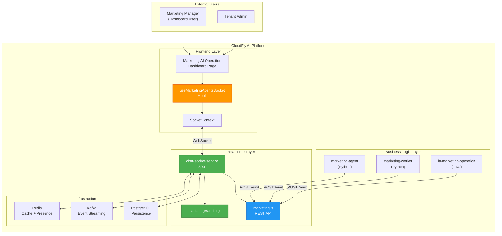

---

## 2. Deployment Architecture (Docker)

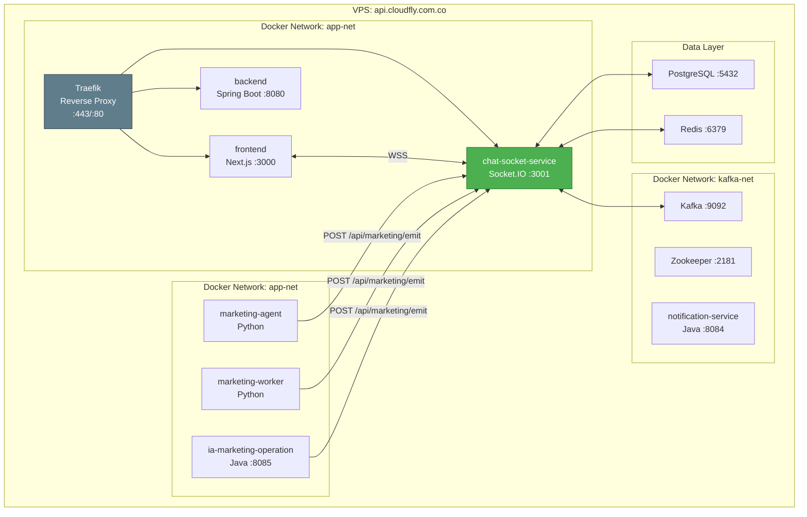

---

## 3. Socket.IO Event Flow Diagram

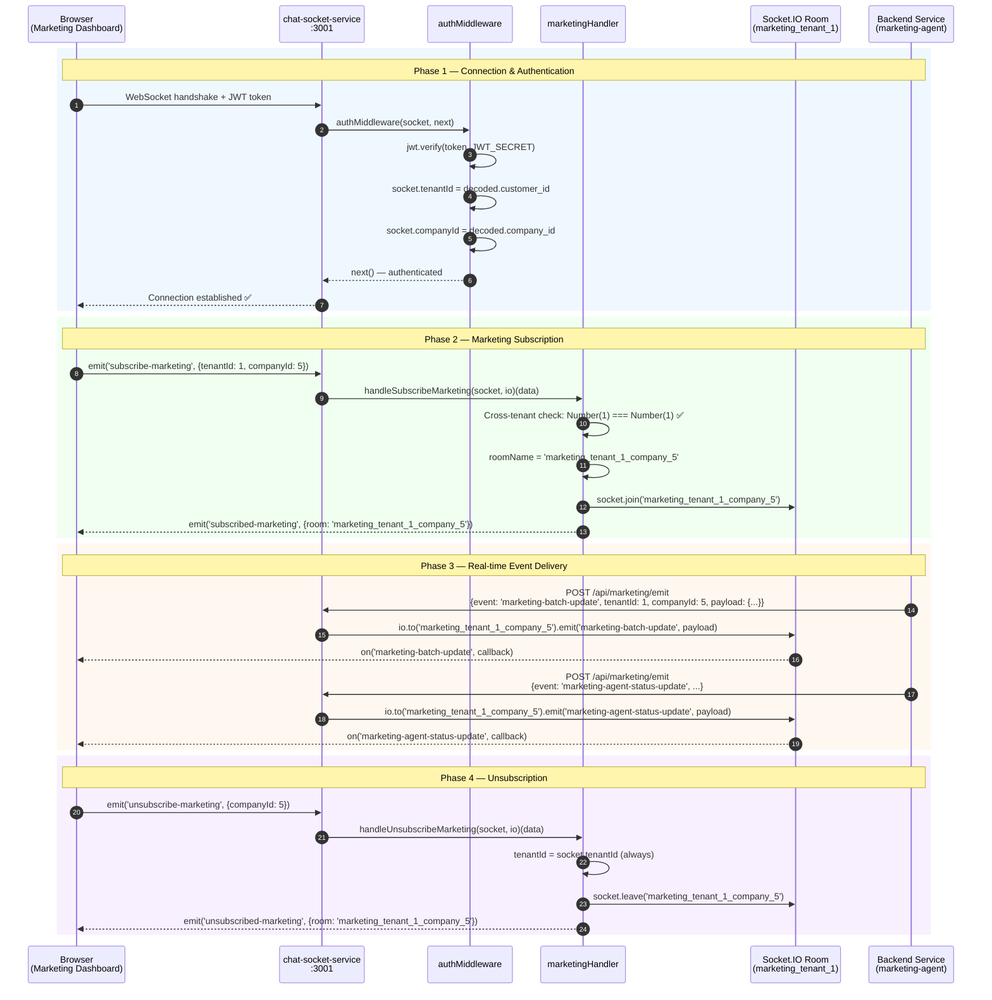

---

## 4. Cross-Tenant Security Flow

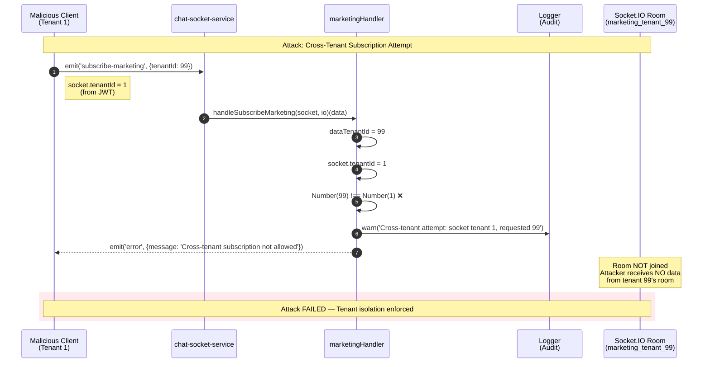

---

## 5. Multi-Tenant Room Isolation Diagram

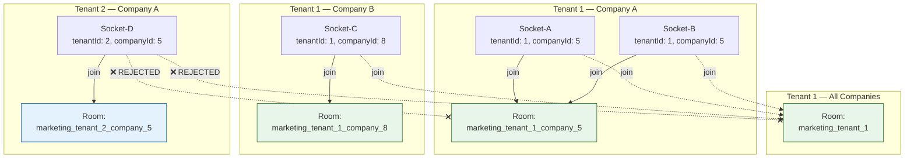

---

## 6. Handler Registration Order in index.js

```mermaid
graph TD
    subgraph "io.on('connection', socket => { ... })"
        A["1. Auto-join tenant room<br/>socket.join('tenant_{id}')"]
        B["2. Auto-join company room<br/>socket.join('tenant_{id}_company_{id}')"]
        C["3. Auto-join user room<br/>socket.join('tenant_{id}_company_{id}_user_{id}')"]
        D["4. presenceHandler.handleUserOnline"]
        
        subgraph "CONVERSATION EVENTS"
            E["5. join-conversation"]
            F["6. leave-conversation"]
            G["7. subscribe-platform"]
        end

        subgraph "MARKETING AGENT EVENTS (CLOUD-243)"
            H["8. subscribe-marketing ⭐"]
            I["9. unsubscribe-marketing ⭐"]
        end

        subgraph "MESSAGE EVENTS"
            J["10. send-message"]
            K["11. mark-as-read"]
        end

        subgraph "PRESENCE EVENTS"
            L["12. typing"]
            M["13. stop-typing"]
        end

        N["14. disconnect"]
        O["15. error"]
    end

    A --> B --> C --> D --> E --> F --> G --> H --> I --> J --> K --> L --> M --> N --> O

    style H fill:#4CAF50,stroke:#2E7D32,color:#fff
    style I fill:#4CAF50,stroke:#2E7D32,color:#fff
```

---

## 7. Data Flow: Backend Service → Frontend

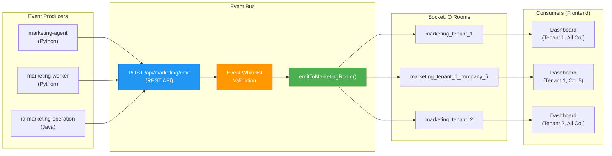

---

## 8. Error Handling Flow

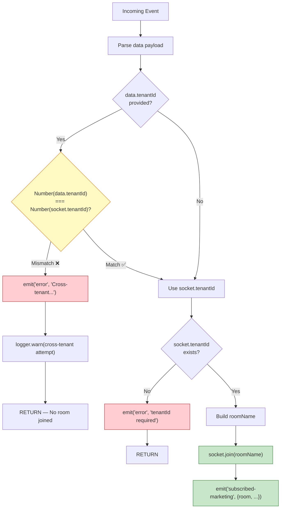

---

## 9. Test Coverage Diagram

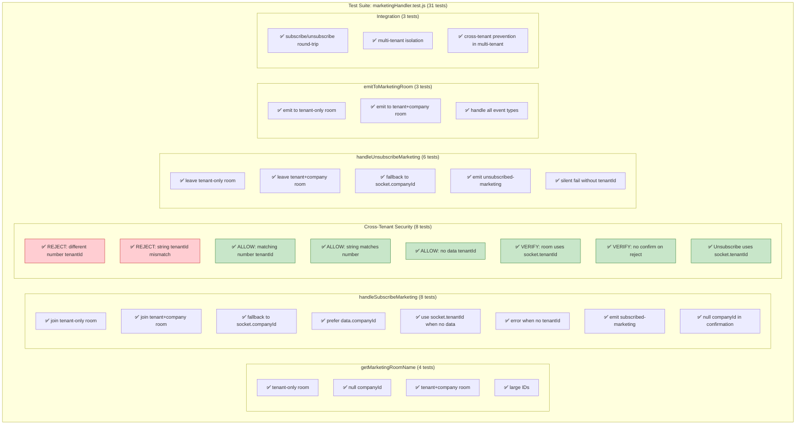

---

## 10. Acceptance Criteria Traceability

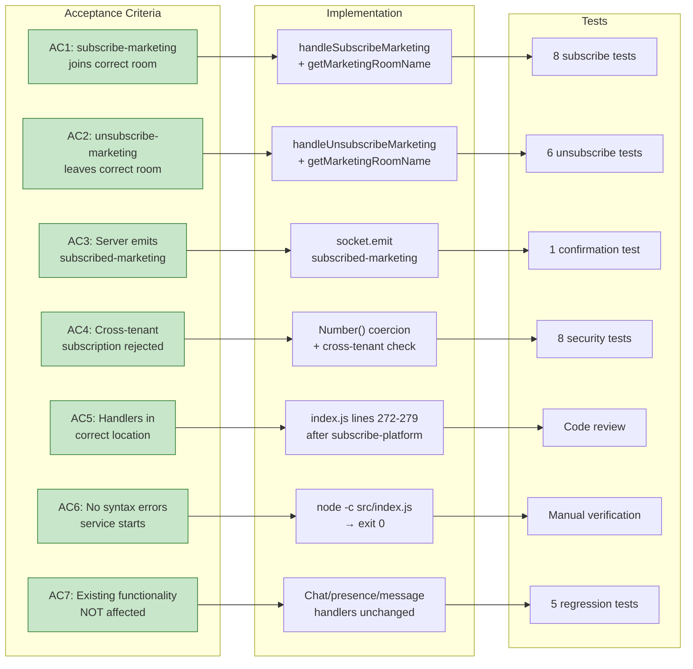

---

## 11. Ticket Dependency Graph

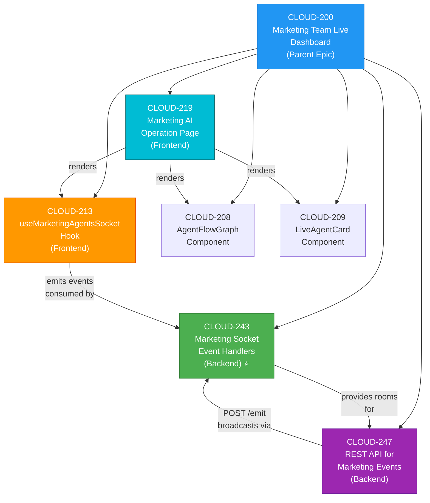

---

*Document generated by 🤖 Technical Writer Agent — CLOUD-243 Architecture Diagrams*
