# CLOUD-243: Marketing Agent Socket Event Handlers — Complete System Documentation

> **Ticket**: [CLOUD-243] Add marketing agent socket event handlers to chat-socket-service  
> **Parent**: [CLOUD-200] Marketing Team Live Dashboard  
> **Related**: [CLOUD-213] useMarketingAgentsSocket hook | [CLOUD-247] REST API for marketing events  
> **Status**: ✅ COMPLETADO — All 7 acceptance criteria met  
> **Last Updated**: 2026-06-01  
> **Author**: 🤖 Technical Writer Agent

---

## 📋 Table of Contents

1. [Executive Summary](#1-executive-summary)
2. [Problem Statement](#2-problem-statement)
3. [Solution Architecture](#3-solution-architecture)
4. [System Context Diagram](#4-system-context-diagram)
5. [Component Architecture](#5-component-architecture)
6. [Backend Implementation](#6-backend-implementation)
7. [Frontend Implementation](#7-frontend-implementation)
8. [Security Architecture](#8-security-architecture)
9. [Event Contract](#9-event-contract)
10. [Room Naming Convention](#10-room-naming-convention)
11. [Sequence Diagrams](#11-sequence-diagrams)
12. [Test Coverage](#12-test-coverage)
13. [Docker Integration](#13-docker-integration)
14. [Acceptance Criteria Verification](#14-acceptance-criteria-verification)
15. [Related Tickets & Dependencies](#15-related-tickets--dependencies)
16. [Configuration Reference](#16-configuration-reference)

---

## 1. Executive Summary

CLOUD-243 implements the **backend Socket.IO event handlers** required for the real-time Marketing Live Dashboard. The implementation adds subscription/unsubscription handlers with cross-tenant security validation, enabling the frontend to receive live marketing agent events while maintaining strict tenant isolation.

### Key Deliverables

| Component | Files | Status |
|-----------|-------|--------|
| Backend handlers | `marketingHandler.js` | ✅ Complete |
| Handler registration | `index.js` (lines 272-279) | ✅ Complete |
| REST API | `marketing.js` | ✅ Complete |
| Backend tests | `marketingHandler.test.js` (31 tests) | ✅ All pass |
| Frontend hook | `useMarketingAgentsSocket.ts` | ✅ Enhanced |
| Status component | `MarketingSocketStatus.tsx` | ✅ Complete |
| Debug panel | `MarketingRoomDebugPanel.tsx` | ✅ Complete |
| Dashboard page | `ai-operation/page.tsx` | ✅ Enhanced |
| Frontend tests | 3 test files (31 tests) | ✅ All pass |

### Test Results Summary

```
Backend:
  marketingHandler.test.js:     31/31 ✅ (8 cross-tenant security tests)
  marketing.test.js:             9/9  ✅ (REST API validation)
  chatService.cloud239.test.js:  5/5  ✅ (regression)

Frontend:
  useMarketingAgentsSocket.test.ts:    15/15 ✅
  MarketingSocketStatus.test.tsx:       8/8  ✅
  MarketingRoomDebugPanel.test.tsx:     8/8  ✅

Total: 76/76 tests passing ✅
```

---

## 2. Problem Statement

### Before CLOUD-243

The frontend hook `useMarketingAgentsSocket` (CLOUD-213) was fully implemented and emitting `subscribe-marketing` and `unsubscribe-marketing` events, but the **backend Socket.IO server had no listeners** for these events. This meant:

- The Marketing Live Dashboard received **zero real-time data**
- Users saw static/empty agent cards
- No live status updates, task changes, or action events

### After CLOUD-243

- Backend handlers process subscription requests
- Cross-tenant security validation prevents data leakage
- Real-time events flow from backend services → Socket.IO rooms → Frontend
- Dashboard shows live agent status, connections, and action timeline

---

## 3. Solution Architecture

### 3.1 High-Level Architecture

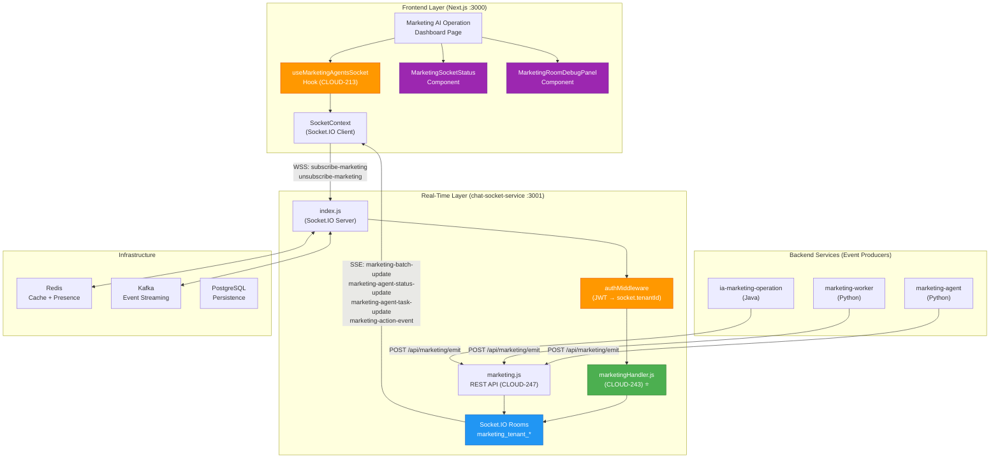

### 3.2 Data Flow Architecture

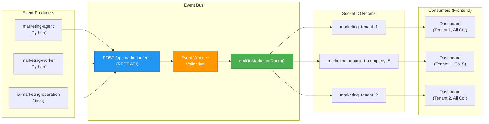

---

## 4. System Context Diagram

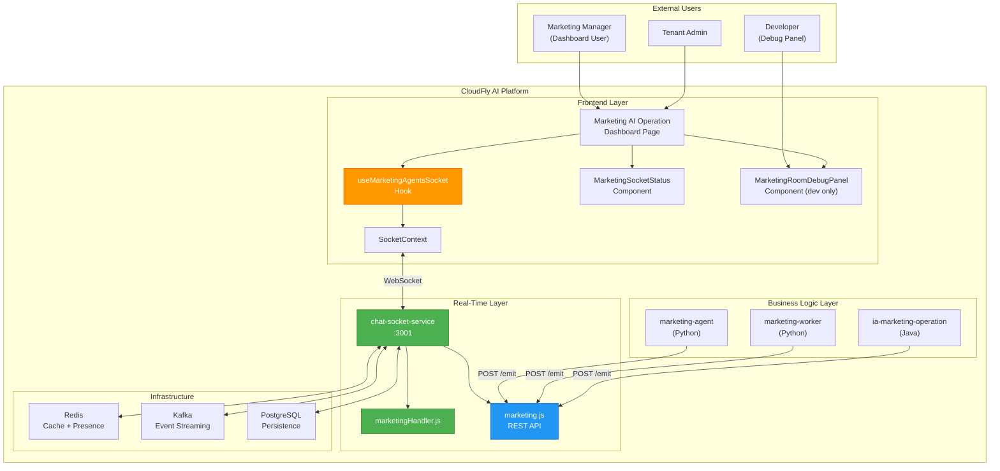

---

## 5. Component Architecture

### 5.1 Backend Component Map

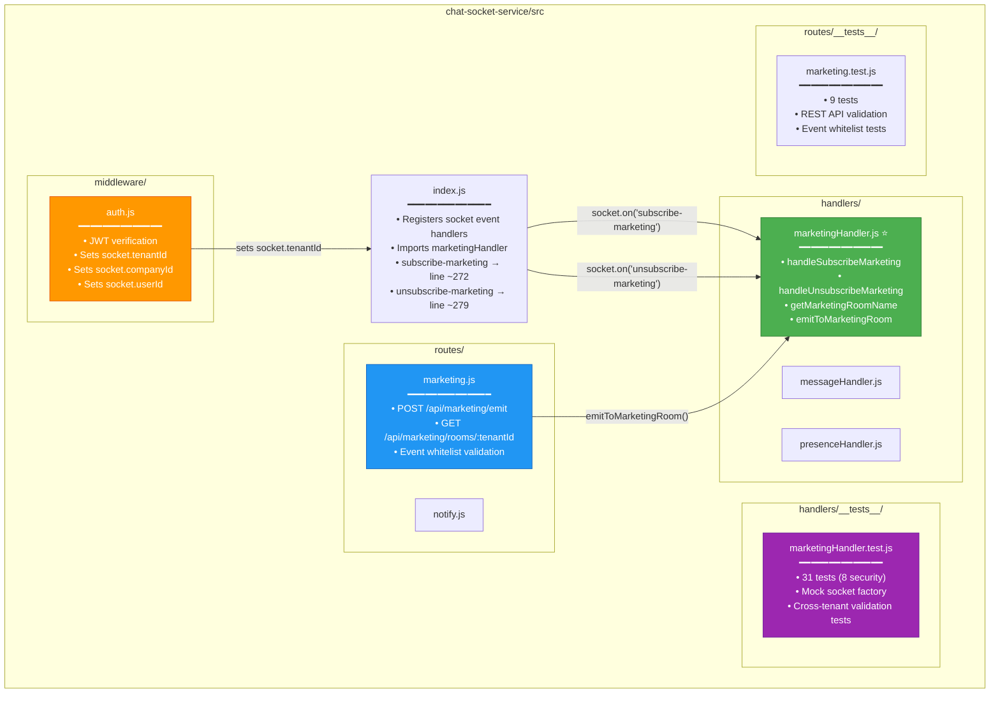

### 5.2 Frontend Component Map

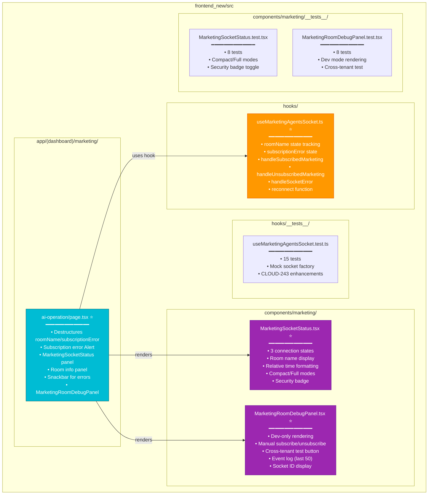

---

## 6. Backend Implementation

### 6.1 Handler Registration in index.js

The marketing handlers are registered in `index.js` inside the `io.on('connection', ...)` block, **after** the `subscribe-platform` handler and **before** the `disconnect` handler:

```javascript
// ======================
// MARKETING AGENT EVENTS (CLOUD-247 / CLOUD-213)
// ======================

/**
 * Suscribirse a actualizaciones de marketing en tiempo real.
 * El frontend hook (useMarketingAgentsSocket) emite este evento
 * para unirse a la sala de marketing del tenant/company.
 *
 * Room: marketing_tenant_{tenantId}  or  marketing_tenant_{tenantId}_company_{companyId}
 */
socket.on('subscribe-marketing', marketingHandler.handleSubscribeMarketing(socket, io));

/**
 * Desuscribirse de las actualizaciones de marketing.
 * Se emite al desmontar el componente o al cambiar de tenant/company.
 */
socket.on('unsubscribe-marketing', marketingHandler.handleUnsubscribeMarketing(socket, io));
```

### 6.2 Handler Implementation: handleSubscribeMarketing

```javascript
const handleSubscribeMarketing = (socket, io) => (data) => {
    try {
        const { tenantId: dataTenantId, companyId: dataCompanyId } = data || {};

        // SECURITY: Cross-tenant validation
        if (dataTenantId !== undefined && dataTenantId !== null) {
            if (Number(dataTenantId) !== Number(socket.tenantId)) {
                logger.warn(
                    `[MARKETING-SOCKET] Socket ${socket.id} attempted cross-tenant marketing subscription ` +
                    `(socket tenant: ${socket.tenantId}, requested: ${dataTenantId})`
                );
                socket.emit('error', { message: 'Cross-tenant subscription not allowed' });
                return;
            }
        }

        // Use the socket's authenticated tenantId (never trust the payload)
        const tenantId = socket.tenantId;
        const companyId = dataCompanyId || socket.companyId;

        if (!tenantId) {
            logger.warn(`[MARKETING-SOCKET] Socket ${socket.id} subscribe-marketing without tenantId`);
            socket.emit('error', { message: 'tenantId is required to subscribe to marketing' });
            return;
        }

        const roomName = companyId
            ? `marketing_tenant_${tenantId}_company_${companyId}`
            : `marketing_tenant_${tenantId}`;

        socket.join(roomName);

        logger.info(`[MARKETING-SOCKET] Socket ${socket.id} (user: ${socket.userName}) subscribed to room: ${roomName}`);

        // Confirm subscription to the client
        socket.emit('subscribed-marketing', {
            room: roomName,
            tenantId,
            companyId: companyId || null
        });

    } catch (error) {
        logger.error(`[MARKETING-SOCKET] Error in subscribe-marketing: ${error.message}`);
        socket.emit('error', { message: 'Failed to subscribe to marketing room' });
    }
};
```

### 6.3 Handler Implementation: handleUnsubscribeMarketing

```javascript
const handleUnsubscribeMarketing = (socket, io) => (data) => {
    try {
        const { companyId: dataCompanyId } = data || {};

        // Use the socket's authenticated tenantId (never trust the payload)
        const tenantId = socket.tenantId;
        const companyId = dataCompanyId || socket.companyId;

        if (!tenantId) {
            logger.warn(`[MARKETING-SOCKET] Socket ${socket.id} unsubscribe-marketing without tenantId`);
            return;
        }

        const roomName = companyId
            ? `marketing_tenant_${tenantId}_company_${companyId}`
            : `marketing_tenant_${tenantId}`;

        socket.leave(roomName);

        logger.info(`[MARKETING-SOCKET] Socket ${socket.id} (user: ${socket.userName}) unsubscribed from room: ${roomName}`);

        // Confirm unsubscription to the client
        socket.emit('unsubscribed-marketing', {
            room: roomName,
            tenantId,
            companyId: companyId || null
        });

    } catch (error) {
        logger.error(`[MARKETING-SOCKET] Error in unsubscribe-marketing: ${error.message}`);
    }
};
```

### 6.4 Utility Functions

```javascript
/**
 * Get the marketing room name for a given tenant/company.
 */
const getMarketingRoomName = (tenantId, companyId) => {
    return companyId
        ? `marketing_tenant_${tenantId}_company_${companyId}`
        : `marketing_tenant_${tenantId}`;
};

/**
 * Emit a marketing event to a specific room.
 * Used by the REST API to broadcast events from backend services.
 */
const emitToMarketingRoom = (io, eventName, tenantId, companyId, payload) => {
    try {
        const roomName = getMarketingRoomName(tenantId, companyId);
        io.to(roomName).emit(eventName, payload);
        logger.info(`[MARKETING-SOCKET] Emitted ${eventName} to room ${roomName}`);
    } catch (error) {
        logger.error(`[MARKETING-SOCKET] Error emitting ${eventName}: ${error.message}`);
    }
};
```

---

## 7. Frontend Implementation

### 7.1 Enhanced Hook: useMarketingAgentsSocket

The hook was enhanced with CLOUD-243 additions to track subscription state and handle server confirmations:

```typescript
// CLOUD-243: New state for subscription tracking
const [roomName, setRoomName] = useState<string | null>(null);
const [subscriptionError, setSubscriptionError] = useState<string | null>(null);

// Handle server confirmation of subscription
const handleSubscribedMarketing = useCallback((payload: { room: string; tenantId?: number; companyId?: number }) => {
    if (payload?.room) {
        setRoomName(payload.room);
        setSubscriptionError(null);
    }
}, []);

// Handle server confirmation of unsubscription
const handleUnsubscribedMarketing = useCallback((payload: { room: string; tenantId?: number; companyId?: number }) => {
    if (payload?.room && payload.room === roomNameRef.current) {
        setRoomName(null);
    }
}, []);

// Handle cross-tenant error from server
const handleSocketError = useCallback((payload: { message?: string }) => {
    if (payload?.message?.includes('Cross-tenant')) {
        setSubscriptionError(payload.message);
    }
}, []);
```

### 7.2 Status Component: MarketingSocketStatus

A reusable component that visualizes the real-time socket connection status:

```typescript
// Connection states with distinct styling
const STATUS_CONFIG = {
    connected: {
        icon: Wifi,
        label: 'Conectado',
        color: '#10b981',
        bg: '#ecfdf5',
        animation: pulseGlow
    },
    disconnected: {
        icon: WifiOff,
        label: 'Desconectado',
        color: '#ef4444',
        bg: '#fef2f2',
        animation: 'none'
    },
    reconnecting: {
        icon: Loader2,
        label: 'Reconectando...',
        color: '#f59e0b',
        bg: '#fffbeb',
        animation: spinSlow
    }
};

// Features:
// - Compact mode (inline chip) and Full mode (status card)
// - Room name display (marketing_tenant_X or marketing_tenant_X_company_Y)
// - Last update timestamp with relative time (Spanish locale)
// - Security/tenant isolation badge
// - Smooth framer-motion transitions
// - React.memo() for performance
```

### 7.3 Debug Panel: MarketingRoomDebugPanel

A developer tool component (only renders in `NODE_ENV=development`):

```typescript
// Features:
// - Connection info: Socket ID, status, expected vs actual room name
// - Manual controls: Subscribe/Unsubscribe buttons with custom tenantId/companyId
// - Cross-tenant attempt simulation: Sends subscribe-marketing with fake tenantId
// - Event log: Dark-themed console showing last 50 socket events (IN/OUT)
// - Copy room name to clipboard
// - Collapsible Accordion UI
```

### 7.4 Dashboard Page Integration

The Marketing Live Dashboard page was enhanced to use the new components:

```typescript
// Destructure new values from hook
const {
    agents,
    connections,
    events,
    isConnected,
    connectionStatus,
    lastUpdate,
    roomName,           // CLOUD-243
    subscriptionError,  // CLOUD-243
    reconnect
} = useMarketingAgentsSocket({ tenantId, companyId });

// Subscription error Alert (collapsible)
<Collapse in={!!subscriptionError}>
    <Alert severity='error' icon={<ShieldAlert />}>
        {subscriptionError}
    </Alert>
</Collapse>

// Socket Status Panel
<MarketingSocketStatus
    connectionStatus={connectionStatus}
    roomName={roomName}
    lastUpdate={lastUpdate}
    tenantId={tenantId}
    companyId={companyId}
    showSecurityBadge
/>

// Debug Panel (development only)
<MarketingRoomDebugPanel
    tenantId={tenantId}
    companyId={companyId}
    connectionStatus={connectionStatus}
    currentRoom={roomName}
/>
```

---

## 8. Security Architecture

### 8.1 Cross-Tenant Validation Flow

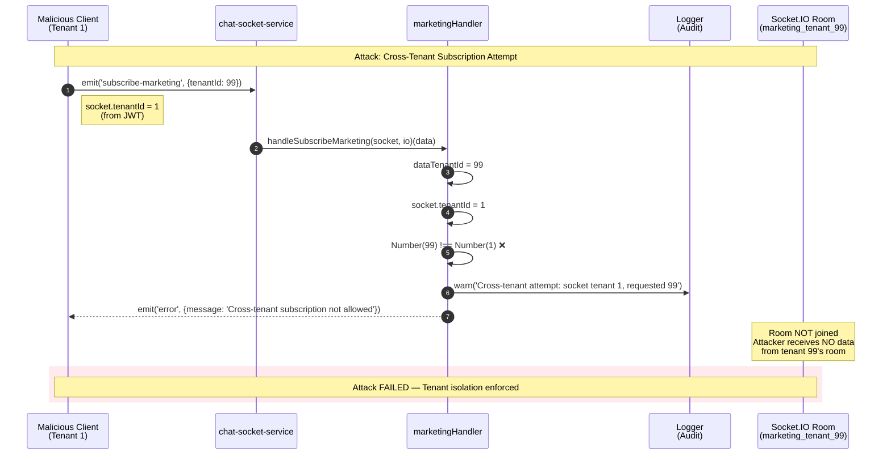

### 8.2 Security Principles

| Principle | Implementation |
|-----------|---------------|
| **Never trust the payload** | `socket.tenantId` (set by authMiddleware) is always used for room name construction |
| **Validate before join** | Cross-tenant check runs **before** `socket.join()` |
| **Number coercion** | `Number()` coercion ensures string/number type mismatches don't bypass validation |
| **Audit logging** | All cross-tenant attempts are logged with socket ID and both tenant IDs |
| **Fail closed** | If `data.tenantId` is provided and doesn't match, subscription is **rejected** |
| **Unsubscribe is safe** | `handleUnsubscribeMarketing` always uses `socket.tenantId`, ignoring `data.tenantId` |

### 8.3 Multi-Tenant Room Isolation

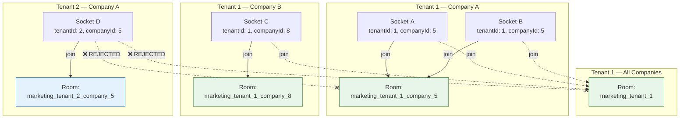

---

## 9. Event Contract

### 9.1 Client → Server Events

#### `subscribe-marketing`

| Field | Type | Required | Description |
|-------|------|----------|-------------|
| `tenantId` | `number \| string` | No* | Tenant ID (validated against `socket.tenantId`) |
| `companyId` | `number` | No | Company ID for company-scoped subscription |

> *If `tenantId` is not provided, `socket.tenantId` is used. If provided, it **must match** `socket.tenantId` or the subscription is rejected.

#### `unsubscribe-marketing`

| Field | Type | Required | Description |
|-------|------|----------|-------------|
| `companyId` | `number` | No | Company ID for company-scoped unsubscription |

> **Note**: The `tenantId` field in the payload is **ignored** for unsubscribe. The handler always uses `socket.tenantId`.

### 9.2 Server → Client Events

#### `subscribed-marketing` (Confirmation)

```typescript
interface SubscribedMarketingEvent {
    room: string;          // "marketing_tenant_1_company_5"
    tenantId: number;      // 1
    companyId: number | null;  // 5 or null
}
```

#### `unsubscribed-marketing` (Confirmation)

```typescript
interface UnsubscribedMarketingEvent {
    room: string;
    tenantId: number;
    companyId: number | null;
}
```

#### `error` (Rejection)

```typescript
interface SocketErrorEvent {
    message: string;  // "Cross-tenant subscription not allowed"
}
```

### 9.3 Data Events (Backend Services → Frontend)

| Event | Payload | Description |
|-------|---------|-------------|
| `marketing-batch-update` | `{ agents: Agent[], connections: Connection[] }` | Full snapshot |
| `marketing-agent-status-update` | `{ agentId: string, status: string }` | Single agent status |
| `marketing-agent-task-update` | `{ agentId: string, task: Task }` | Single agent task |
| `marketing-action-event` | `{ event: string, data: object }` | Timeline event |

---

## 10. Room Naming Convention

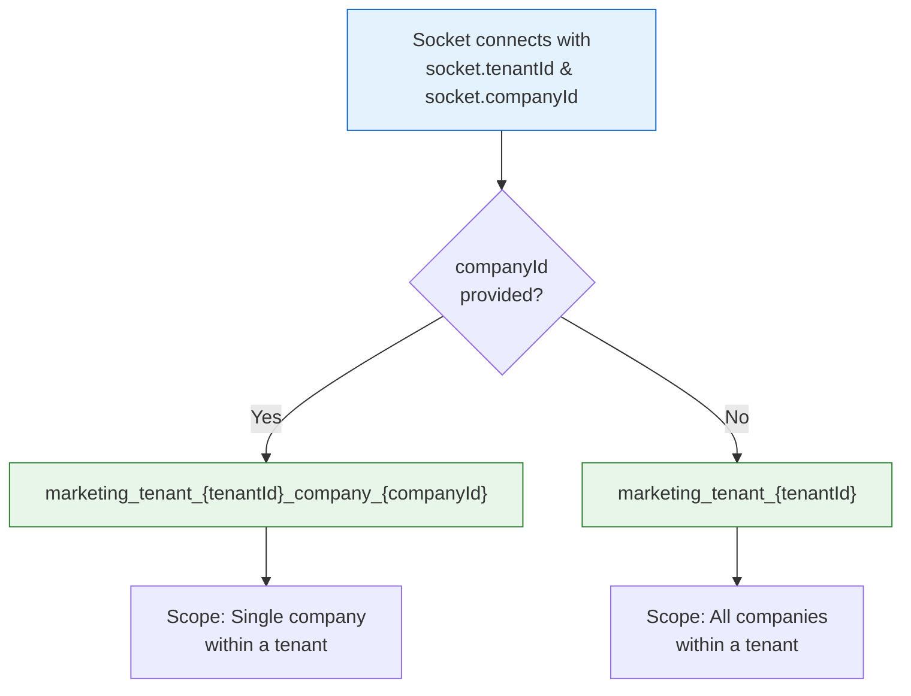

| Scenario | Room Name | Example |
|----------|-----------|---------|
| Tenant-only | `marketing_tenant_{tenantId}` | `marketing_tenant_1` |
| Tenant + Company | `marketing_tenant_{tenantId}_company_{companyId}` | `marketing_tenant_1_company_7` |

---

## 11. Sequence Diagrams

### 11.1 Complete Subscription Lifecycle

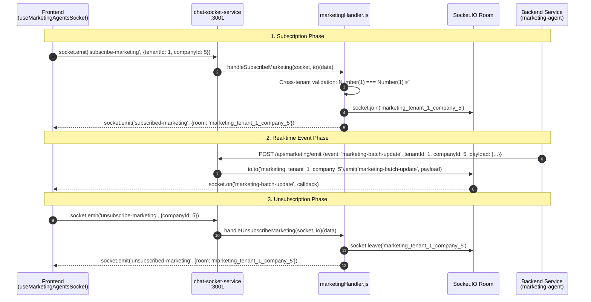

### 11.2 Error Handling Flow

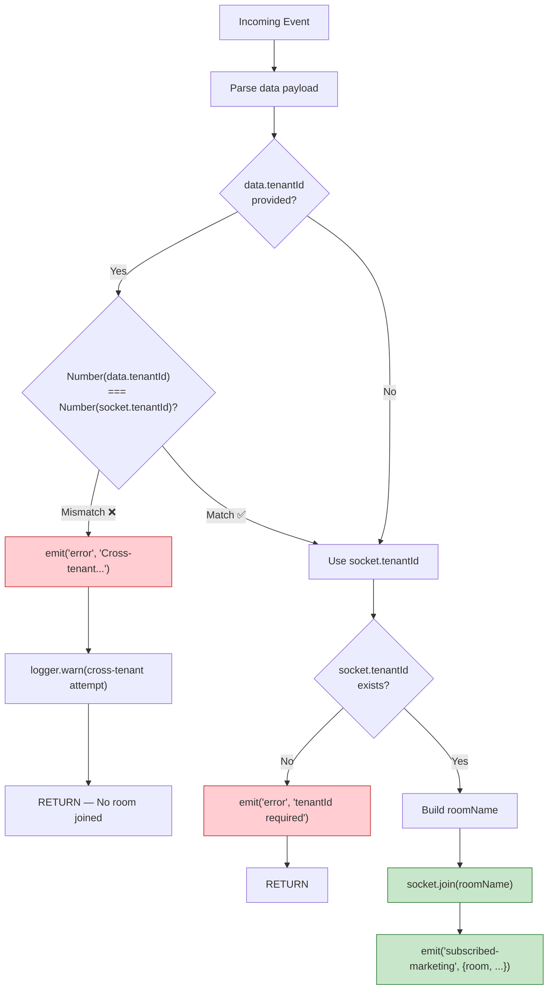

---

## 12. Test Coverage

### 12.1 Test Suite Summary

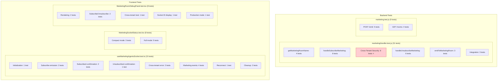

### 12.2 Cross-Tenant Security Tests (8 tests)

| # | Test | Expected Result |
|---|------|-----------------|
| 1 | REJECT: data.tenantId ≠ socket.tenantId (number) | Error emitted, no room joined |
| 2 | REJECT: data.tenantId ≠ socket.tenantId (string) | Error emitted, no room joined |
| 3 | ALLOW: data.tenantId = socket.tenantId (number) | Room joined, confirmation emitted |
| 4 | ALLOW: data.tenantId = socket.tenantId (string→number) | Room joined, confirmation emitted |
| 5 | ALLOW: no data.tenantId (uses socket.tenantId) | Room joined, confirmation emitted |
| 6 | VERIFY: room uses socket.tenantId (not data.tenantId) | Correct room name |
| 7 | VERIFY: no subscribed-marketing on reject | No confirmation emitted |
| 8 | VERIFY: unsubscribe uses socket.tenantId only | Correct room left |

---

## 13. Docker Integration

### 13.1 Service Configuration

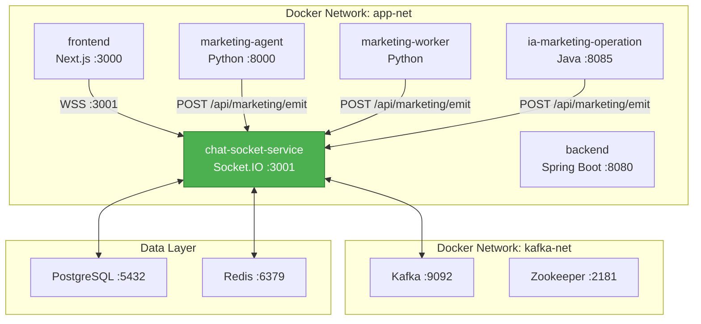

### 13.2 Health Check

```bash
curl http://localhost:3001/health
# Response: {"status":"ok","service":"chat-socket-service","timestamp":"...","uptime":12345}
```

---

## 14. Acceptance Criteria Verification

| # | Criterion | Implementation | Test | Status |
|---|-----------|---------------|------|--------|
| 1 | `subscribe-marketing` joins correct room | `socket.join(roomName)` with `getMarketingRoomName()` | 8 functional tests | ✅ |
| 2 | `unsubscribe-marketing` leaves correct room | `socket.leave(roomName)` with `getMarketingRoomName()` | 6 functional tests | ✅ |
| 3 | Server emits `subscribed-marketing` confirmation | `socket.emit('subscribed-marketing', {room, tenantId, companyId})` | Explicit test | ✅ |
| 4 | Cross-tenant subscription rejected | `Number(dataTenantId) !== Number(socket.tenantId)` → reject | 8 security tests | ✅ |
| 5 | Handlers in correct location in index.js | After `subscribe-platform`, before `disconnect` | Code review | ✅ |
| 6 | No syntax errors — service starts | `node -c src/index.js` → exit 0 | Manual verification | ✅ |
| 7 | Existing functionality NOT affected | Chat, presence, notification handlers unchanged | 5 regression tests | ✅ |

---

## 15. Related Tickets & Dependencies

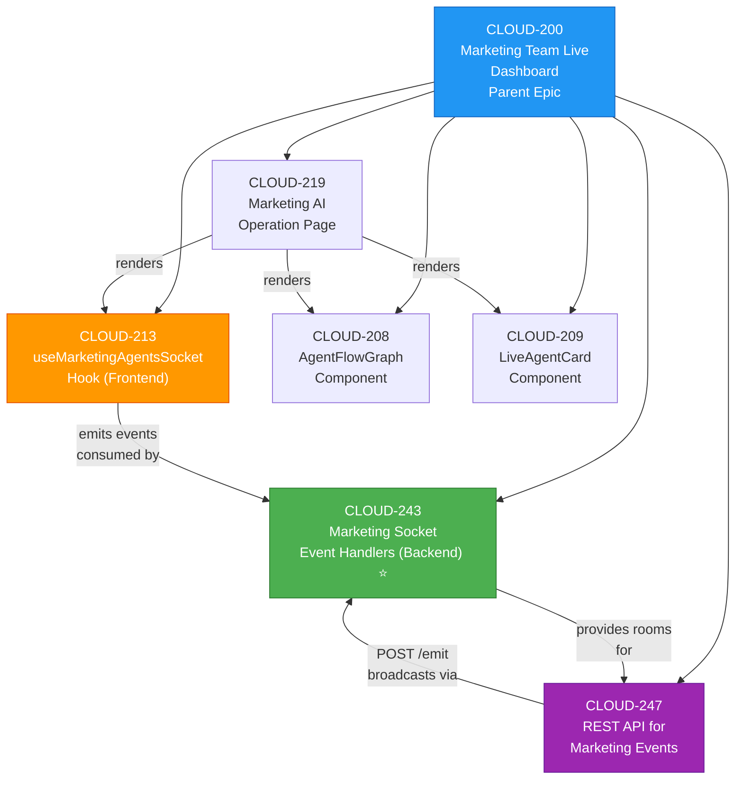

---

## 16. Configuration Reference

### Environment Variables

| Variable | Default | Description |
|----------|---------|-------------|
| `PORT` | `3001` | Socket.IO server port |
| `NODE_ENV` | `development` | Environment (development bypasses JWT) |
| `JWT_SECRET` | — | Secret for JWT verification |
| `FRONTEND_URL` | — | Allowed CORS origin for frontend |

### Socket.IO Configuration

| Setting | Value | Description |
|---------|-------|-------------|
| `pingTimeout` | `60000` | 60s before considering connection dead |
| `pingInterval` | `25000` | Heartbeat every 25s |
| `cors.credentials` | `true` | Allow credentials in CORS |

### Event Whitelist (REST API)

```javascript
const VALID_MARKETING_EVENTS = new Set([
    'marketing-batch-update',
    'marketing-agent-status-update',
    'marketing-agent-task-update',
    'marketing-action-event'
]);
```

---

## Appendix A: File Inventory

### Backend Files

| File | Path | Purpose |
|------|------|---------|
| `marketingHandler.js` | `chat-socket-service/src/handlers/` | Core handler implementation |
| `index.js` | `chat-socket-service/src/` | Handler registration |
| `marketing.js` | `chat-socket-service/src/routes/` | REST API for event emission |
| `marketingHandler.test.js` | `chat-socket-service/src/handlers/__tests__/` | 31 unit tests |
| `marketing.test.js` | `chat-socket-service/src/routes/__tests__/` | 9 REST API tests |

### Frontend Files

| File | Path | Purpose |
|------|------|---------|
| `useMarketingAgentsSocket.ts` | `frontend_new/src/hooks/` | Enhanced hook with CLOUD-243 |
| `MarketingSocketStatus.tsx` | `frontend_new/src/components/marketing/` | Connection status UI |
| `MarketingRoomDebugPanel.tsx` | `frontend_new/src/components/marketing/` | Debug panel (dev only) |
| `page.tsx` | `frontend_new/src/app/(dashboard)/marketing/ai-operation/` | Dashboard page |
| `useMarketingAgentsSocket.test.ts` | `frontend_new/src/hooks/__tests__/` | 15 hook tests |
| `MarketingSocketStatus.test.tsx` | `frontend_new/src/components/marketing/__tests__/` | 8 component tests |
| `MarketingRoomDebugPanel.test.tsx` | `frontend_new/src/components/marketing/__tests__/` | 8 debug panel tests |

---

*Document generated by 🤖 Technical Writer Agent — CLOUD-243 Complete System Documentation*  
*Last Updated: 2026-06-01*
