# CLOUD-243: Marketing Agent Socket Event Handlers — Technical Architecture

> **Ticket**: [CLOUD-243] Add marketing agent socket event handlers to chat-socket-service  
> **Parent**: [CLOUD-200] Marketing Team Live Dashboard  
> **Related**: [CLOUD-213] useMarketingAgentsSocket hook | [CLOUD-247] REST API for marketing events  
> **Status**: ✅ COMPLETADO — All 7 acceptance criteria met  
> **Last Updated**: 2026-06-01

---

## 1. Overview

CLOUD-243 adds **Socket.IO event handlers** to the `chat-socket-service` backend that enable the frontend Marketing Live Dashboard to subscribe/unsubscribe from real-time marketing agent events. The handlers enforce **cross-tenant security validation** to prevent data leakage between tenants in the multi-tenant SaaS platform.

### Problem Solved

The frontend hook `useMarketingAgentsSocket` (CLOUD-213) emits `subscribe-marketing` and `unsubscribe-marketing` events, but the backend had **no listeners** for these events. Without these handlers, the real-time marketing dashboard would receive **zero data** from the server.

### Scope

| In Scope | Out of Scope |
|----------|-------------|
| `subscribe-marketing` handler with cross-tenant validation | Backend services that emit marketing events (separate task) |
| `unsubscribe-marketing` handler using `socket.tenantId` | Frontend hook implementation (CLOUD-213) |
| Room naming convention (`marketing_tenant_{id}`) | REST API for marketing events (CLOUD-247) |
| Unit tests (31 tests including 8 security tests) | Docker infrastructure changes |

---

## 2. System Architecture

### 2.1 High-Level Architecture Diagram

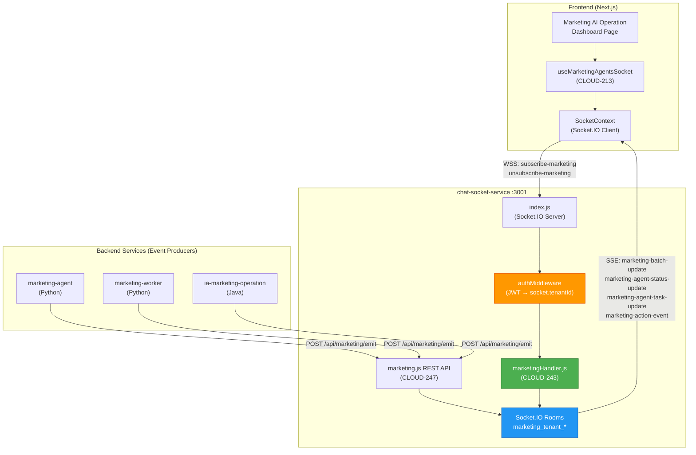

### 2.2 Component Interaction Diagram

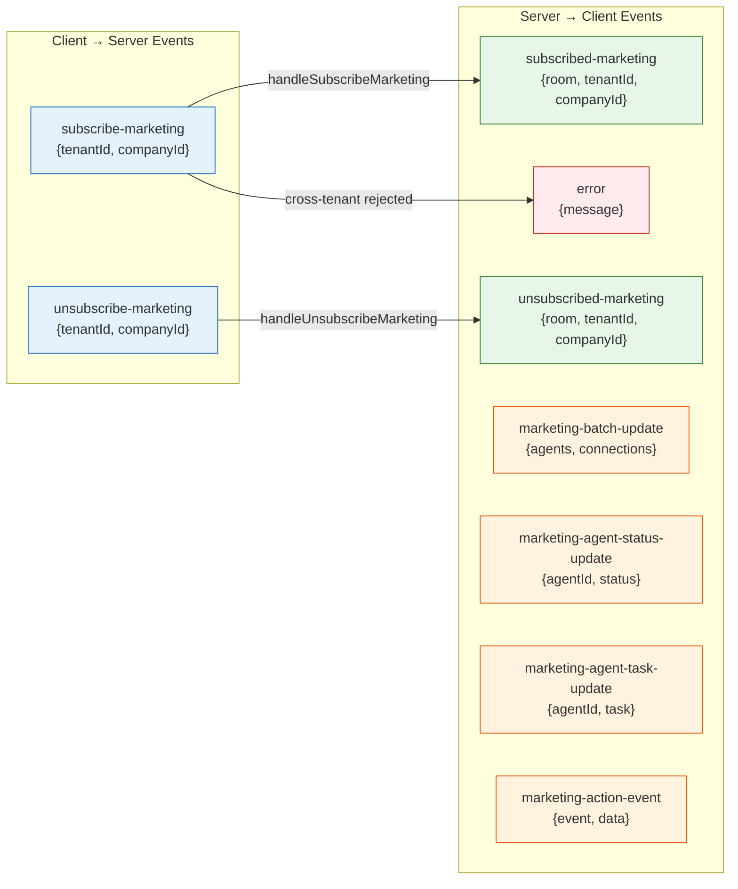

---

## 3. Event Contract

### 3.1 Client → Server Events

#### `subscribe-marketing`

Joins the socket to the marketing room for the authenticated tenant.

| Field | Type | Required | Description |
|-------|------|----------|-------------|
| `tenantId` | `number \| string` | No* | Tenant ID (validated against `socket.tenantId`) |
| `companyId` | `number` | No | Company ID for company-scoped subscription |

> *If `tenantId` is not provided, `socket.tenantId` is used. If provided, it **must match** `socket.tenantId` or the subscription is rejected.

**Security Validation:**
```
if (dataTenantId !== undefined && dataTenantId !== null) {
    if (Number(dataTenantId) !== Number(socket.tenantId)) {
        → REJECT: emit 'error' with 'Cross-tenant subscription not allowed'
    }
}
```

#### `unsubscribe-marketing`

Leaves the marketing room. Always uses `socket.tenantId` as the source of truth.

| Field | Type | Required | Description |
|-------|------|----------|-------------|
| `companyId` | `number` | No | Company ID for company-scoped unsubscription |

### 3.2 Server → Client Events

#### `subscribed-marketing` (confirmation)

| Field | Type | Description |
|-------|------|-------------|
| `room` | `string` | The room name joined |
| `tenantId` | `number` | The tenant ID (from `socket.tenantId`) |
| `companyId` | `number \| null` | The company ID or null |

#### `unsubscribed-marketing` (confirmation)

| Field | Type | Description |
|-------|------|-------------|
| `room` | `string` | The room name left |
| `tenantId` | `number` | The tenant ID (from `socket.tenantId`) |
| `companyId` | `number \| null` | The company ID or null |

#### `error` (rejection)

| Field | Type | Description |
|-------|------|-------------|
| `message` | `string` | Error description |

### 3.3 Server → Client Events (emitted by backend services via REST API)

These events are emitted to the marketing rooms by backend services (marketing-agent, marketing-worker, ia-marketing-operation) via `POST /api/marketing/emit`.

| Event | Payload | Description |
|-------|---------|-------------|
| `marketing-batch-update` | `{ agents: Agent[], connections: Connection[] }` | Full snapshot of all agents and their connections |
| `marketing-agent-status-update` | `{ agentId: string, status: string }` | Single agent status change |
| `marketing-agent-task-update` | `{ agentId: string, task: Task }` | Single agent task change |
| `marketing-action-event` | `{ event: string, data: object }` | New timeline/history event |

---

## 4. Room Naming Convention

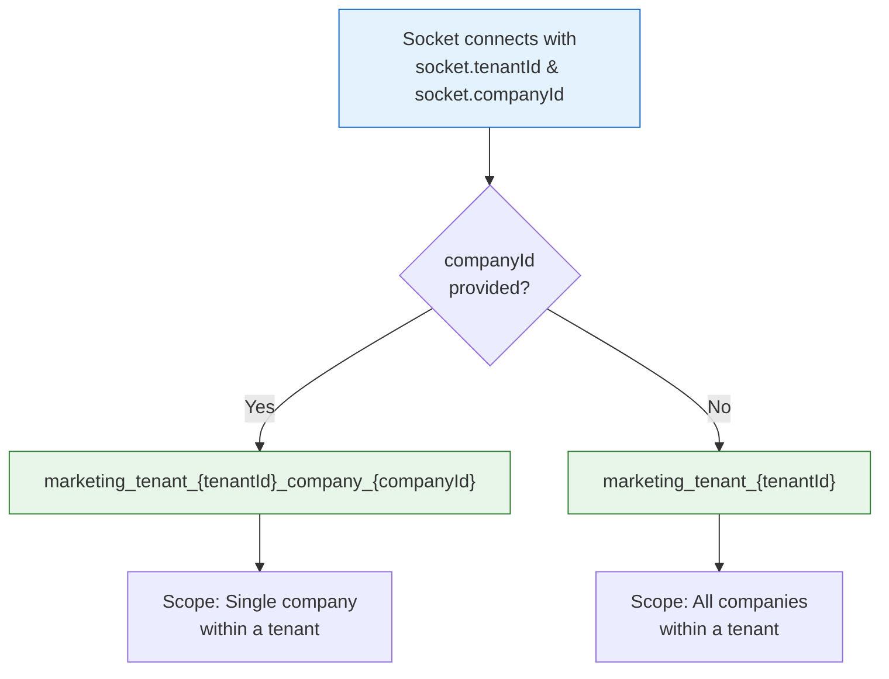

| Scenario | Room Name | Example |
|----------|-----------|---------|
| Tenant-only (no company) | `marketing_tenant_{tenantId}` | `marketing_tenant_1` |
| Tenant + Company | `marketing_tenant_{tenantId}_company_{companyId}` | `marketing_tenant_1_company_7` |

This follows the existing room naming pattern used for chat rooms (`tenant_{id}_company_{id}_contact_{phone}`) and platform rooms (`tenant_{id}_company_{id}_platform_{name}`).

---

## 5. Security Architecture

### 5.1 Cross-Tenant Validation Flow

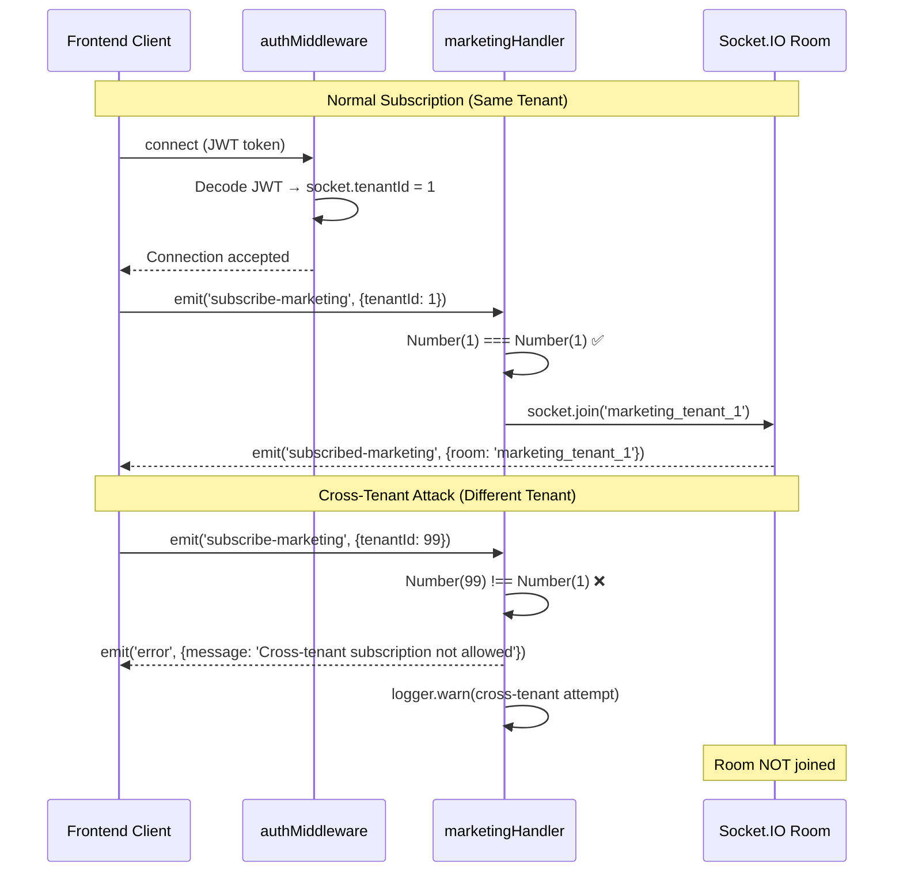

### 5.2 Security Principles

| Principle | Implementation |
|-----------|---------------|
| **Never trust the payload** | `socket.tenantId` (set by authMiddleware) is always used for room name construction |
| **Validate before join** | Cross-tenant check runs **before** `socket.join()` |
| **Number coercion** | `Number()` coercion ensures string/number type mismatches don't bypass validation |
| **Audit logging** | All cross-tenant attempts are logged with socket ID and both tenant IDs |
| **Fail closed** | If `data.tenantId` is provided and doesn't match, subscription is **rejected** (not silently ignored) |
| **Unsubscribe is safe** | `handleUnsubscribeMarketing` always uses `socket.tenantId`, ignoring `data.tenantId` entirely |

### 5.3 Authentication Flow

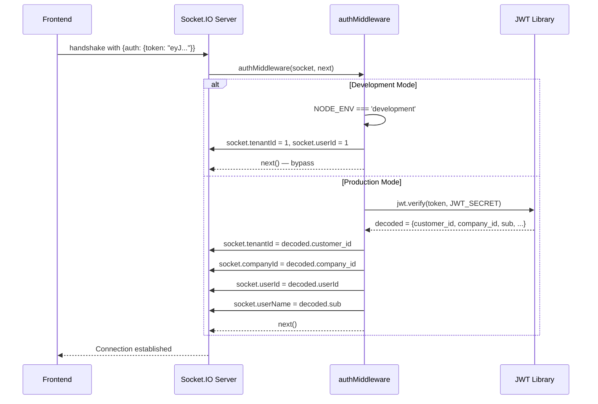

---

## 6. Sequence Diagrams

### 6.1 Complete Subscription Lifecycle

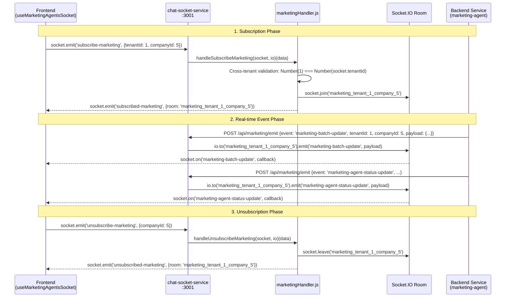

### 6.2 Error Scenarios

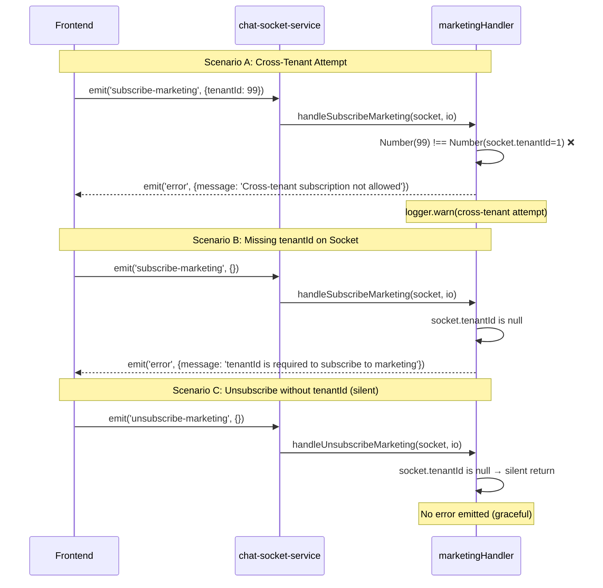

---

## 7. File Structure & Module Map

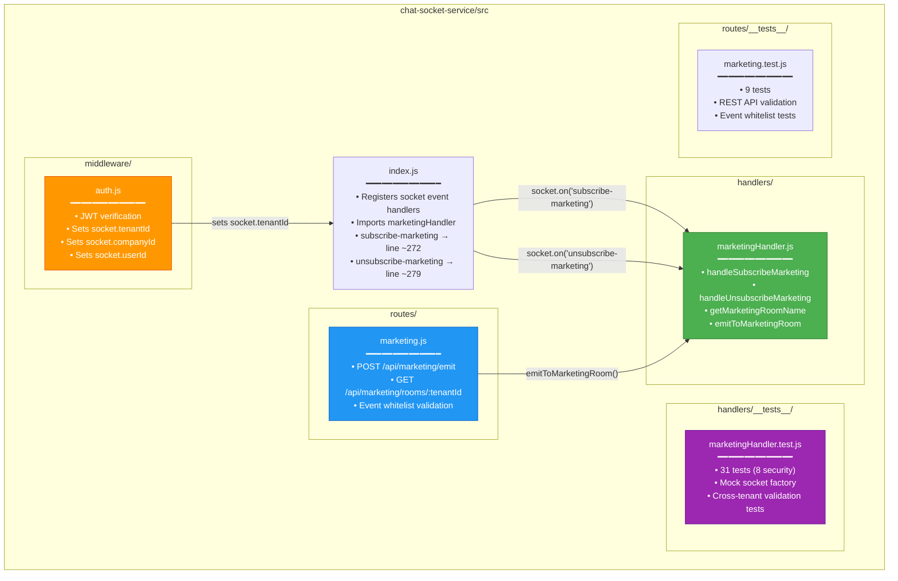

---

## 8. Handler Implementation Details

### 8.1 `handleSubscribeMarketing(socket, io) → (data) => void`

```
┌─────────────────────────────────────────────────────────┐
│  handleSubscribeMarketing(socket, io)                    │
│                                                          │
│  1. Extract dataTenantId, dataCompanyId from data        │
│  2. IF dataTenantId is provided:                         │
│     ├─ IF Number(dataTenantId) !== Number(socket.tenantId)│
│     │  ├─ logger.warn(cross-tenant attempt)              │
│     │  ├─ socket.emit('error', 'Cross-tenant...')        │
│     │  └─ RETURN (reject)                                │
│     └─ (continue — tenantId matches)                     │
│  3. tenantId = socket.tenantId (source of truth)         │
│  4. companyId = dataCompanyId || socket.companyId        │
│  5. IF !tenantId:                                        │
│     ├─ socket.emit('error', 'tenantId is required')      │
│     └─ RETURN                                            │
│  6. roomName = companyId ?                               │
│     ├─ marketing_tenant_{tenantId}_company_{companyId}   │
│     └─ marketing_tenant_{tenantId}                       │
│  7. socket.join(roomName)                                │
│  8. socket.emit('subscribed-marketing', {room, ...})     │
└─────────────────────────────────────────────────────────┘
```

### 8.2 `handleUnsubscribeMarketing(socket, io) → (data) => void`

```
┌─────────────────────────────────────────────────────────┐
│  handleUnsubscribeMarketing(socket, io)                  │
│                                                          │
│  1. Extract dataCompanyId from data                      │
│  2. tenantId = socket.tenantId (ALWAYS — never payload)  │
│  3. companyId = dataCompanyId || socket.companyId        │
│  4. IF !tenantId: silent return (graceful)               │
│  5. roomName = companyId ?                               │
│     ├─ marketing_tenant_{tenantId}_company_{companyId}   │
│     └─ marketing_tenant_{tenantId}                       │
│  6. socket.leave(roomName)                               │
│  7. socket.emit('unsubscribed-marketing', {room, ...})   │
└─────────────────────────────────────────────────────────┘
```

---

## 9. REST API (CLOUD-247 — Complementary)

### `POST /api/marketing/emit`

Allows backend services to emit marketing events to Socket.IO rooms via HTTP.

**Request:**
```json
{
  "event": "marketing-batch-update",
  "tenantId": 1,
  "companyId": 5,
  "payload": {
    "agents": [...],
    "connections": [...]
  }
}
```

**Response (200):**
```json
{
  "success": true,
  "event": "marketing-batch-update",
  "room": "marketing_tenant_1_company_5",
  "timestamp": "2026-06-01T12:00:00.000Z"
}
```

**Event Whitelist:**
- `marketing-batch-update`
- `marketing-agent-status-update`
- `marketing-agent-task-update`
- `marketing-action-event`

### `GET /api/marketing/rooms/:tenantId?companyId=X`

Returns room occupancy information for debugging/monitoring.

**Response (200):**
```json
{
  "room": "marketing_tenant_1_company_5",
  "tenantId": 1,
  "companyId": 5,
  "socketCount": 3,
  "sockets": ["socket-abc", "socket-def", "socket-ghi"]
}
```

---

## 10. Test Coverage

### 10.1 Test Suite Summary

| Test Suite | Tests | Status | Focus |
|------------|-------|--------|-------|
| `marketingHandler.test.js` | 31 | ✅ PASS | Handler logic + security |
| `marketing.test.js` | 9 | ✅ PASS | REST API validation |
| `chatService.cloud239.test.js` | 5 | ✅ PASS | Existing functionality intact |
| **Total** | **45** | **✅ ALL PASS** | |

### 10.2 Security Test Matrix

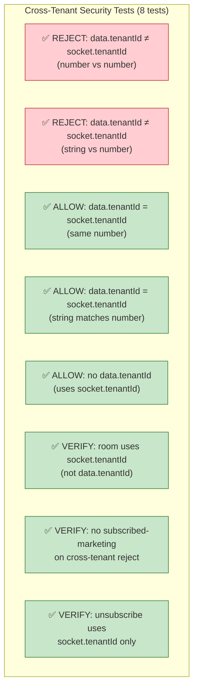

### 10.3 Functional Test Categories

| Category | Tests | Description |
|----------|-------|-------------|
| `getMarketingRoomName` | 4 | Room name generation (tenant-only, tenant+company, null, large IDs) |
| `handleSubscribeMarketing` | 8 | Subscribe logic (room join, companyId fallback, confirmation) |
| Cross-tenant security | 8 | Validation of tenant ID matching and rejection |
| `handleUnsubscribeMarketing` | 6 | Unsubscribe logic (room leave, confirmation, silent fail) |
| Unsubscribe security | 1 | Uses socket.tenantId for room name |
| `emitToMarketingRoom` | 3 | Server-side emit utility |
| Round-trip integration | 3 | Subscribe→unsubscribe, multi-tenant, cross-tenant prevention |

---

## 11. Docker Integration

### 11.1 Service Configuration

The `chat-socket-service` is integrated into the Docker Compose infrastructure:

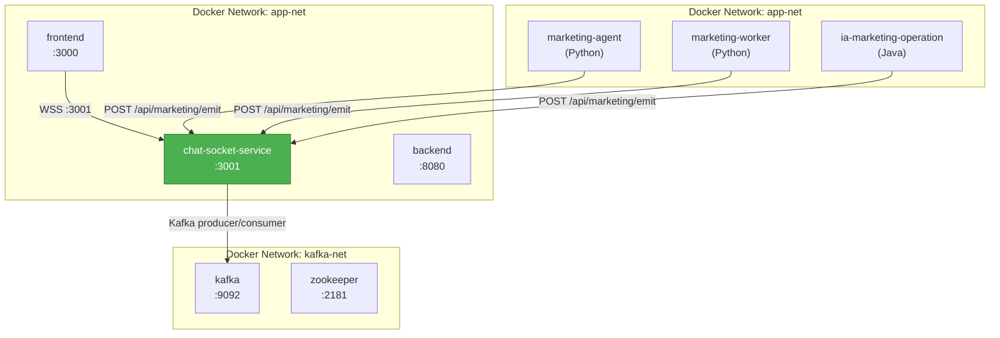

### 11.2 Health Check

```bash
curl http://localhost:3001/health
# Response: {"status":"ok","service":"chat-socket-service","timestamp":"...","uptime":12345}
```

---

## 12. Acceptance Criteria Verification

| # | Criterion | Implementation | Test | Status |
|---|-----------|---------------|------|--------|
| 1 | `subscribe-marketing` joins correct room | `socket.join(roomName)` with `getMarketingRoomName()` | 8 functional tests | ✅ |
| 2 | `unsubscribe-marketing` leaves correct room | `socket.leave(roomName)` with `getMarketingRoomName()` | 6 functional tests | ✅ |
| 3 | Server emits `subscribed-marketing` confirmation | `socket.emit('subscribed-marketing', {room, tenantId, companyId})` | Explicit test | ✅ |
| 4 | Cross-tenant subscription rejected | `Number(dataTenantId) !== Number(socket.tenantId)` → reject | 8 security tests | ✅ |
| 5 | Handlers in correct location in index.js | After `subscribe-platform`, before `disconnect` | Code review | ✅ |
| 6 | No syntax errors — service starts | `node -c src/index.js` → exit 0 | Manual verification | ✅ |
| 7 | Existing functionality NOT affected | Chat, presence, notification handlers unchanged | 5 regression tests | ✅ |

---

## 13. Related Tickets & Dependencies

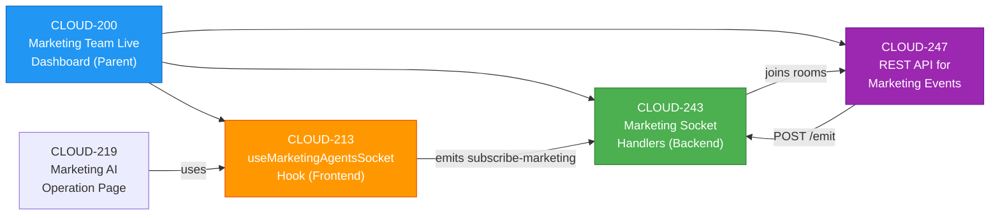

---

## 14. Configuration Reference

### Environment Variables

| Variable | Default | Description |
|----------|---------|-------------|
| `PORT` | `3001` | Socket.IO server port |
| `NODE_ENV` | `development` | Environment (development bypasses JWT) |
| `JWT_SECRET` | — | Secret for JWT verification |
| `FRONTEND_URL` | — | Allowed CORS origin for frontend |

### Socket.IO Configuration

| Setting | Value | Description |
|---------|-------|-------------|
| `pingTimeout` | `60000` | 60s before considering connection dead |
| `pingInterval` | `25000` | Heartbeat every 25s |
| `cors.credentials` | `true` | Allow credentials in CORS |

---

*Document generated by 🤖 Technical Writer Agent — CLOUD-243 Implementation Documentation*
