# 🤖 AGENTE_DEV — CLOUD-248: Architecture Diagrams

## Marketing Live Dashboard — Visual Architecture Reference

**Date:** 2025-07-19  
**Ticket:** CLOUD-248 — E2E Smoke Test: Marketing Live Dashboard  
**Parent:** CLOUD-213 — Real-time Marketing Agent Dashboard

---

## 1. System Context Diagram

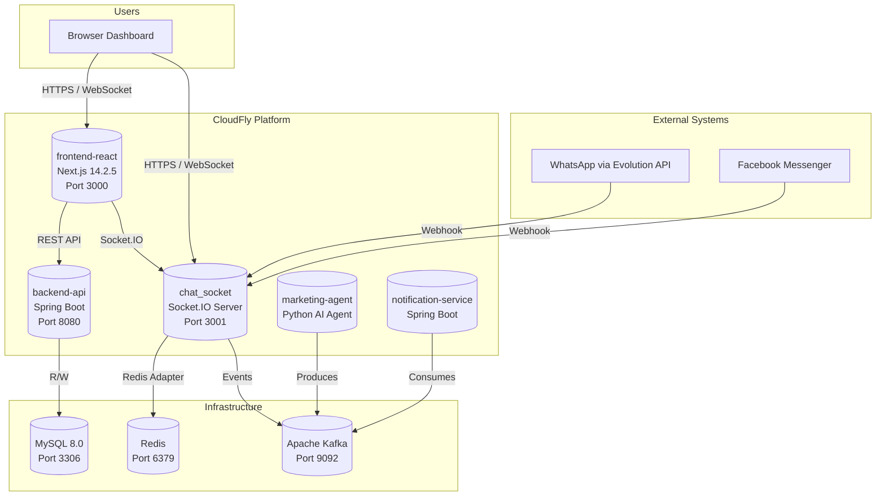

---

## 2. Docker Network Topology (CLOUD-248 Fix)

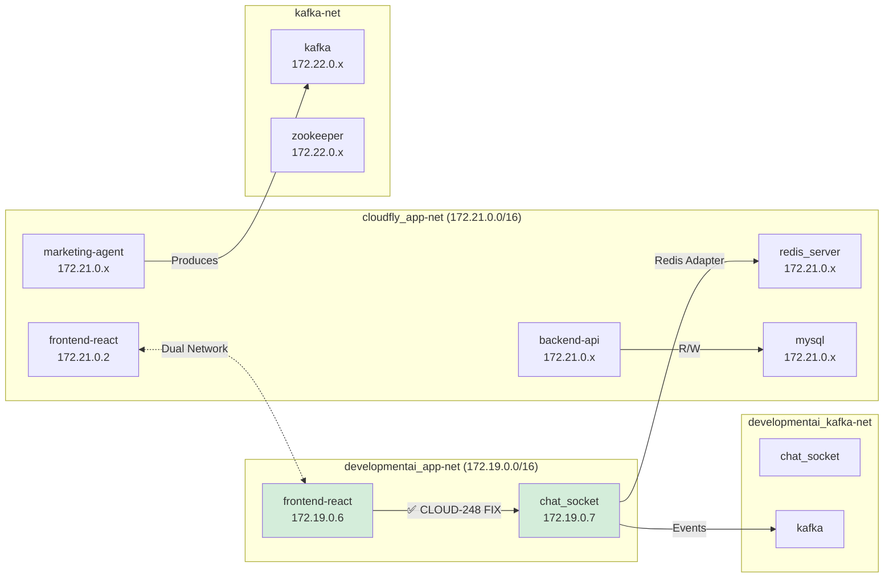

---

## 3. Socket.IO Connection Lifecycle

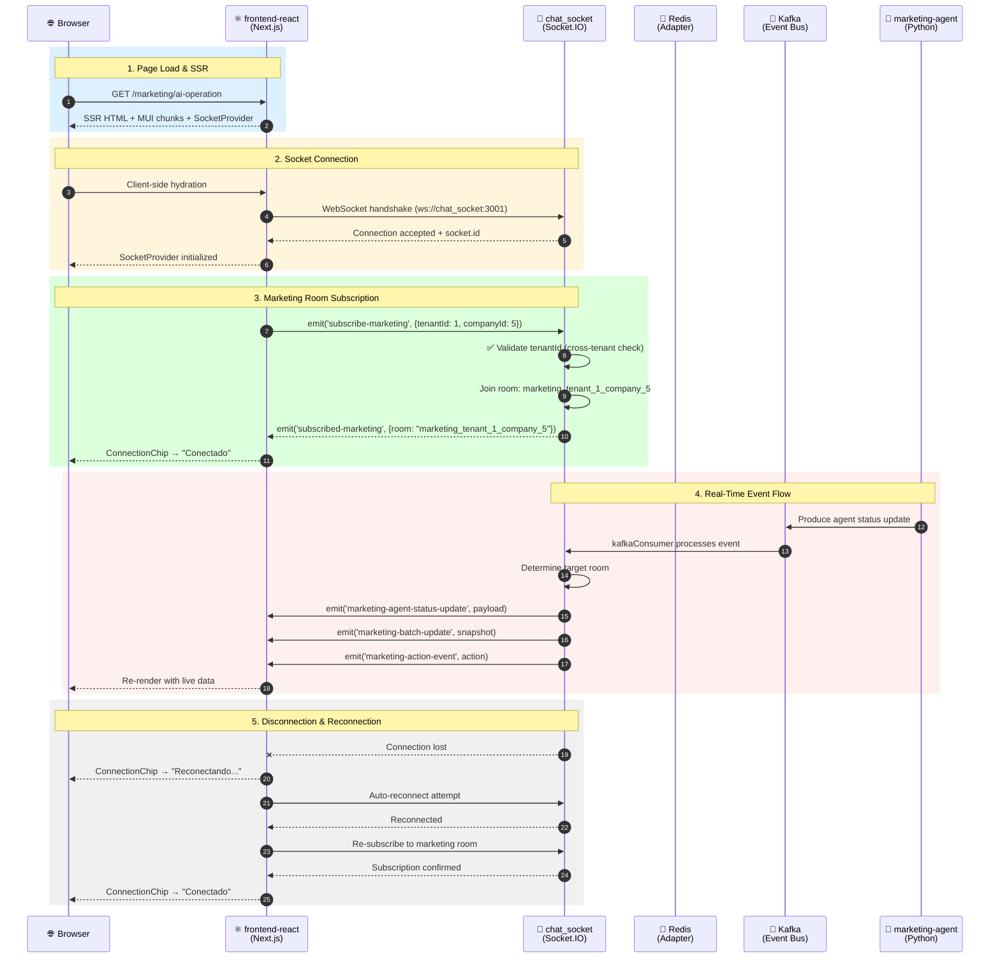

---

## 4. Frontend Component Architecture

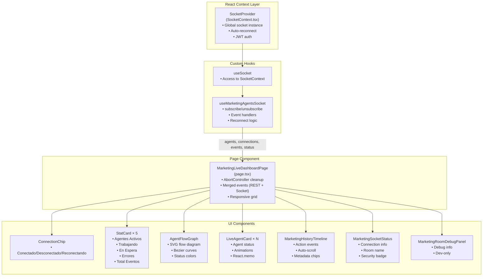

---

## 5. State Machine — Connection Status

```mermaid
stateDiagram-v2
    [*] --> Disconnected: Initial load

    Disconnected --> Reconnecting: Auto-reconnect triggered
    Disconnected --> Reconnecting: User clicks "Reconectar"

    Reconnecting --> Connected: Socket connects
    Reconnecting --> Disconnected: Max retries exceeded

    Connected --> Subscribed: subscribe-marketing emitted
    Connected --> Disconnected: Network loss / Server down

    Subscribed --> Receiving: Events arrive
    Subscribed --> Connected: unsubscribe-marketing emitted

    Receiving --> Subscribed: Event stream ends
    Receiving --> Connected: Disconnect

    note right of Subscribed: Room: marketing_tenant_{id}
    note right of Receiving: Receiving: batch-update, status-update, task-update, action-event
```

---

## 6. Event Flow — Marketing Agent Updates

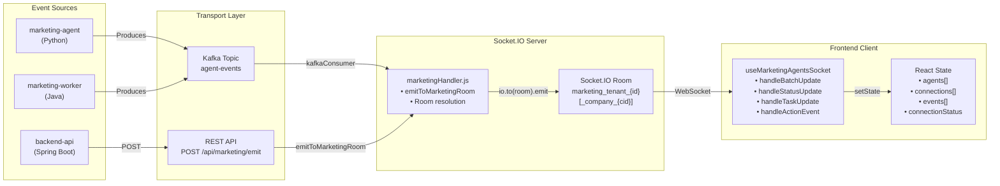

---

## 7. Security — Cross-Tenant Isolation

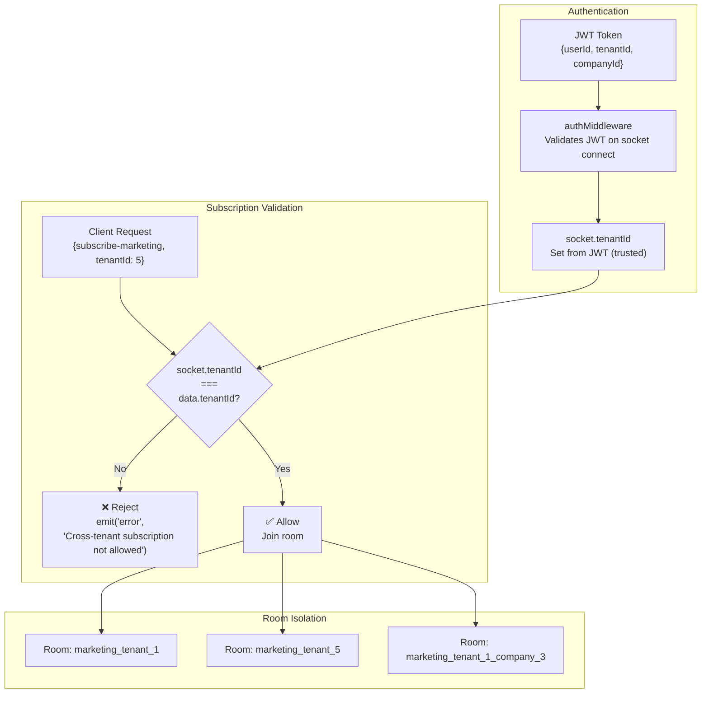

---

## 8. Data Flow — Merged Events (CLOUD-252)

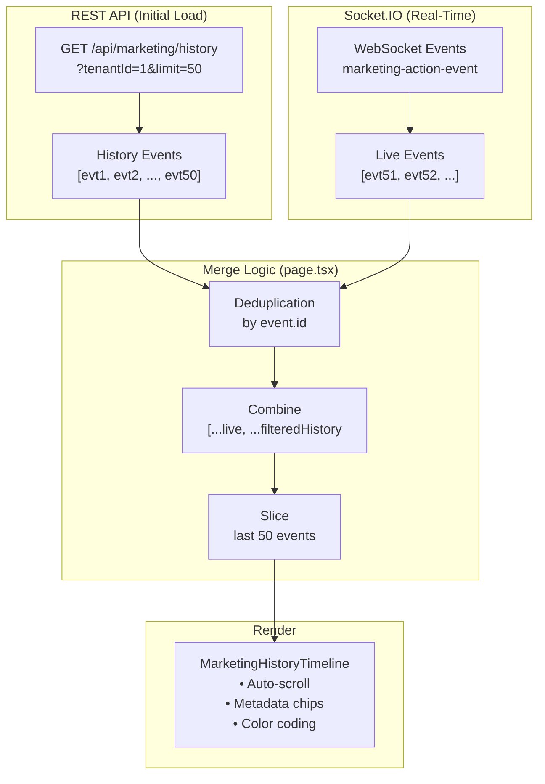

---

## 9. Docker Compose Service Dependencies

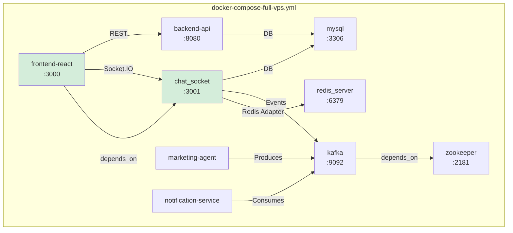

---

## 10. Test Coverage Architecture

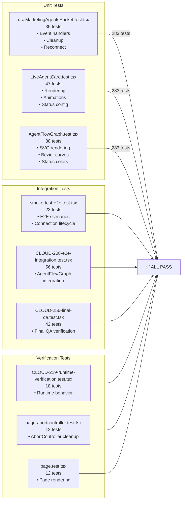

---

## 11. Deployment Architecture — VPS

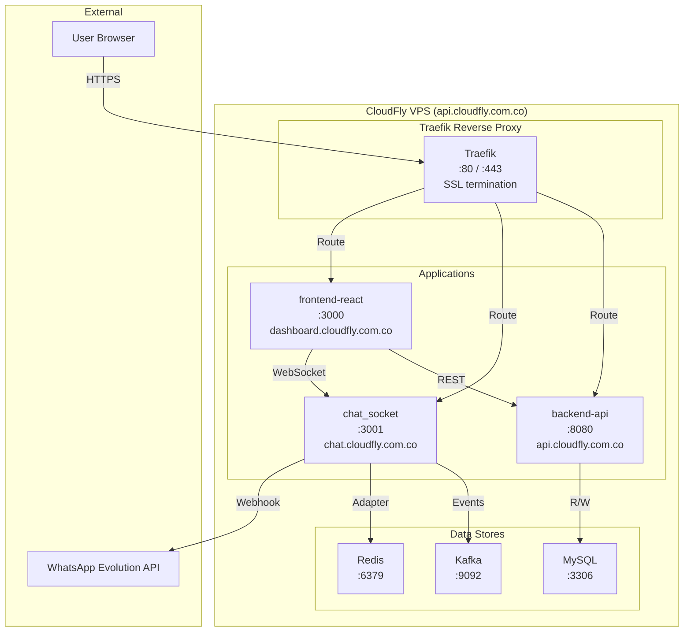

---

## 12. File Structure — Marketing Dashboard

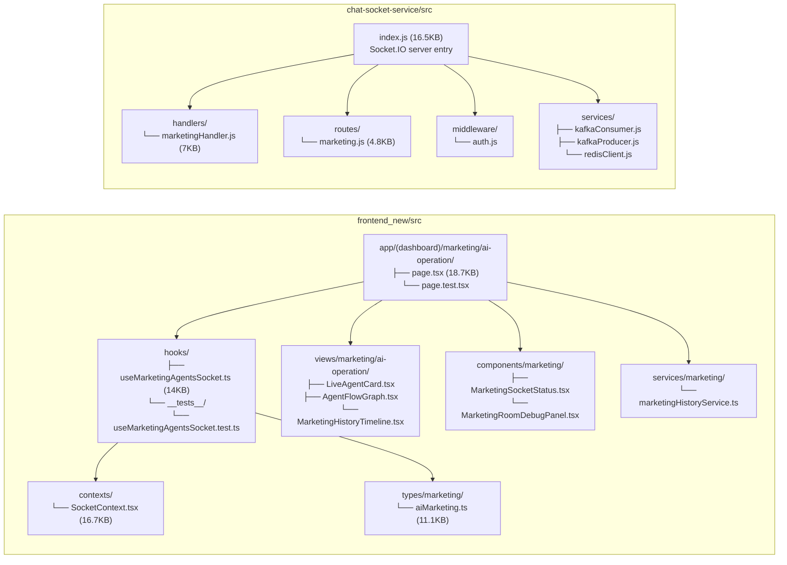

---

*Generated by: OWL — Technical Writer & Diagram Specialist*  
*Date: 2025-07-19*  
*Ticket: CLOUD-248*
