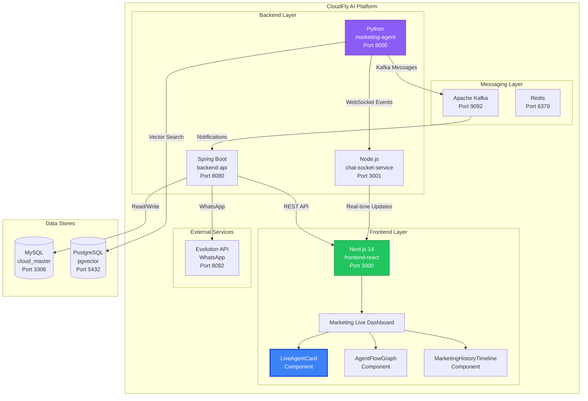
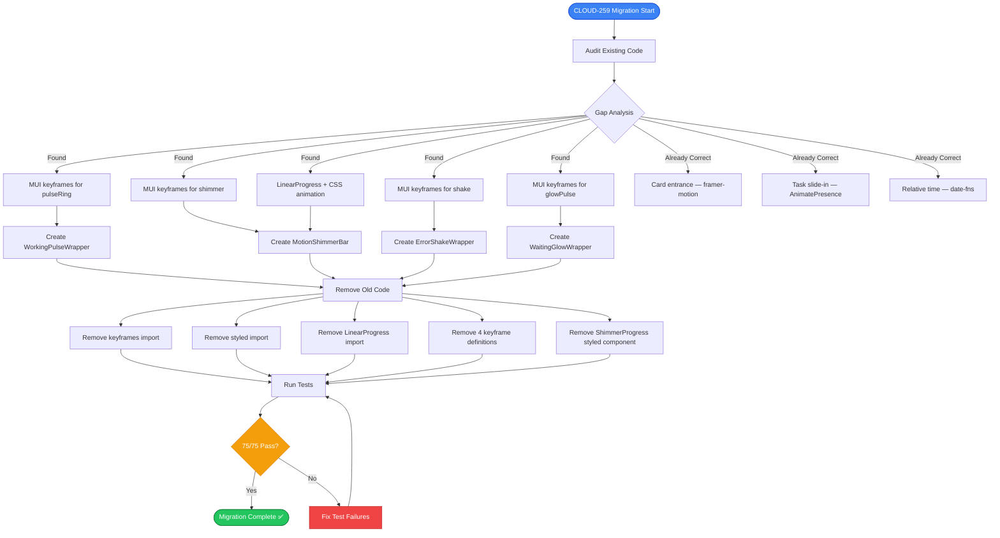
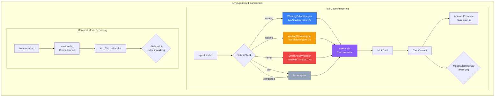
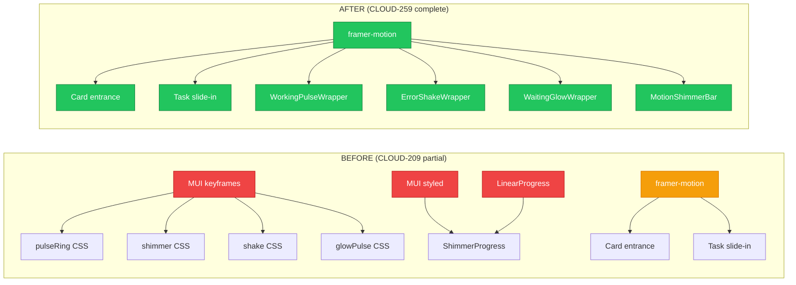
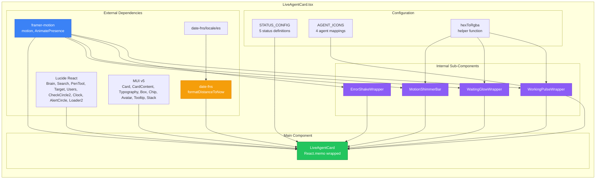
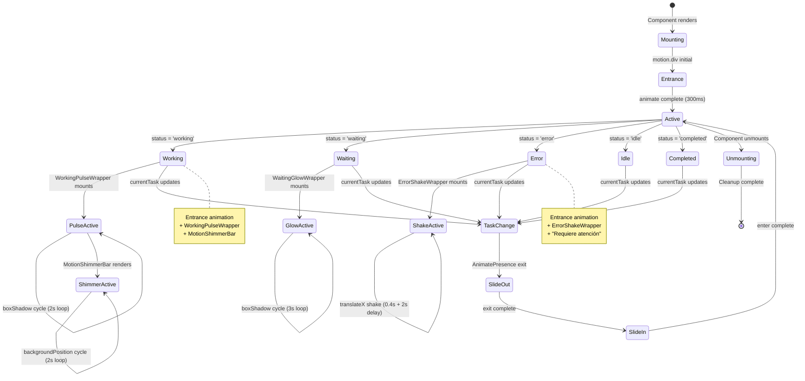
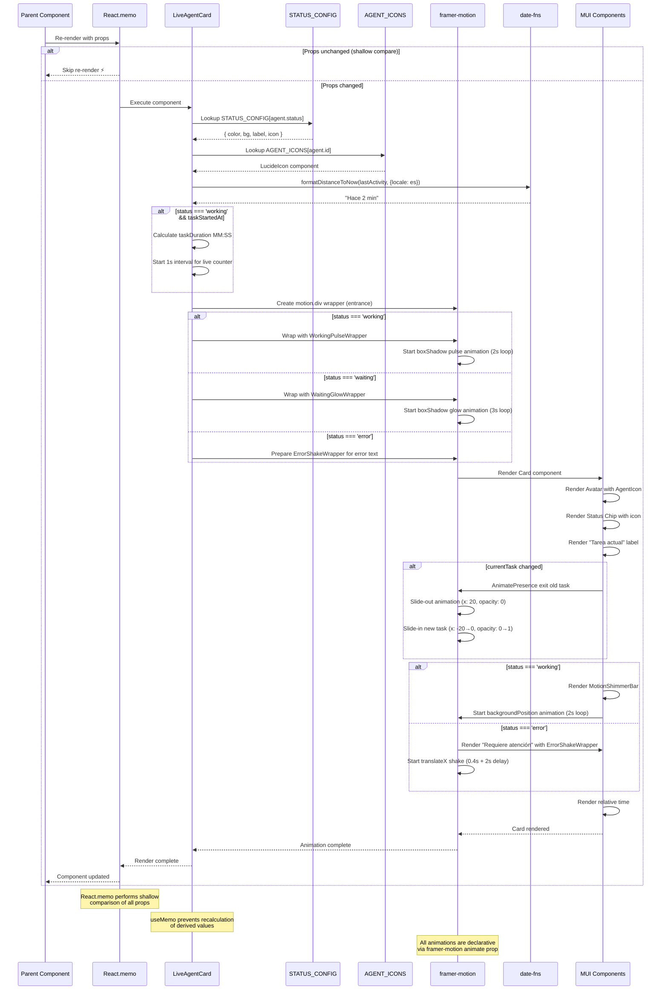
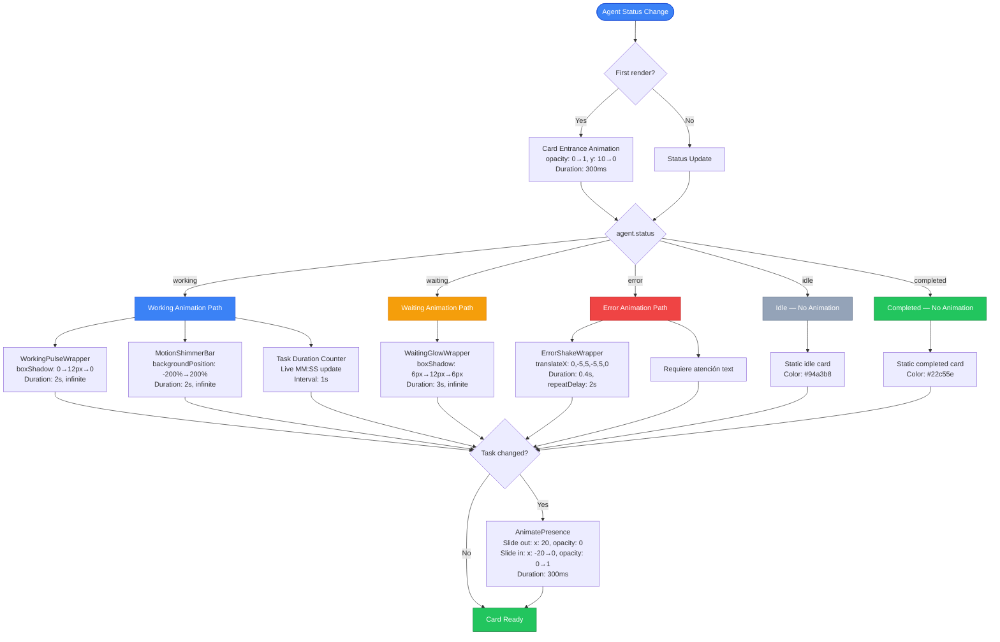

# CLOUD-259: framer-motion Animations & Relative Time — Architecture Diagrams

> **Status**: ✅ Complete  
> **Date**: 2025-07-19  
> **Author**: OWL — Technical Writer & Diagram Specialist  
> **Jira Key**: CLOUD-259

---

## Table of Contents

1. [System Context Diagram](#1-system-context-diagram)
2. [Animation Migration Architecture](#2-animation-migration-architecture)
3. [Animation Wrapper Hierarchy](#3-animation-wrapper-hierarchy)
4. [Animation Timing Diagram](#4-animation-timing-diagram)
5. [Before vs After Comparison](#5-before-vs-after-comparison)
6. [Component Dependency Graph](#6-component-dependency-graph)
7. [Animation State Lifecycle](#7-animation-state-lifecycle)
8. [Rendering Sequence Diagram](#8-rendering-sequence-diagram)
9. [Data Flow Diagram](#9-data-flow-diagram)
10. [Animation Decision Tree](#10-animation-decision-tree)

---

## 1. System Context Diagram



---

## 2. Animation Migration Architecture



---

## 3. Animation Wrapper Hierarchy



---

## 4. Animation Timing Diagram

```mermaid
gantt
    title Animation Timing — Working Status Card
    dateFormat X
    axisFormat %L ms
    
    section Card Entrance
    Fade in + slide up (300ms)           :done, entrance, 0, 300
    
    section Working Pulse
    Box-shadow pulse cycle 1 (2000ms)    :active, pulse1, 300, 2300
    Box-shadow pulse cycle 2 (2000ms)    :active, pulse2, 2300, 4300
    Box-shadow pulse cycle 3 (2000ms)    :active, pulse3, 4300, 6300
    
    section Shimmer Bar
    Shimmer cycle 1 (2000ms)            :active, shimmer1, 300, 2300
    Shimmer cycle 2 (2000ms)            :active, shimmer2, 2300, 4300
    Shimmer cycle 3 (2000ms)            :active, shimmer3, 4300, 6300
    
    section Task Slide-in
    Task text slide-in (300ms)           :done, task, 300, 600
```



---

## 5. Before vs After Comparison



---

## 6. Component Dependency Graph



---

## 7. Animation State Lifecycle



---

## 8. Rendering Sequence Diagram



---

## 9. Data Flow Diagram

```mermaid
flowchart TD
    subgraph "Data Sources"
        WS[WebSocket<br/>agent-status-update] --> HOOK[useMarketingAgentsSocket<br/>React Hook]
        HOOK --> STATE[agents: MarketingAgent[]]
    end

    subgraph "Parent Component"
        STATE --> DASH[Dashboard Page]
        DASH --> MAP[.map(agent =>)]
    end

    subgraph "LiveAgentCard"
        MAP --> PROPS[Props: agent, isHighlighted, onClick, compact]
        
        PROPS --> MEMO{React.memo<br/>shallow compare}
        MEMO -->|unchanged| SKIP[Skip re-render ⚡]
        MEMO -->|changed| EXEC[Execute component]
        
        EXEC --> DERIVE[Derive Values]
        DERIVE --> D1[config = STATUS_CONFIG[status]]
        DERIVE --> D2[AgentIcon = AGENT_ICONS[id]]
        DERIVE --> D3[relativeTime = formatDistanceToNow]
        DERIVE --> D4[taskDuration = MM:SS calc]
        
        D1 --> RENDER[Render Path]
        D2 --> RENDER
        D3 --> RENDER
        D4 --> RENDER
        
        RENDER --> COMPACT{compact?}
        COMPACT -->|Yes| CMP[Compact Layout]
        COMPACT -->|No| FULL[Full Card Layout]
        
        CMP --> OUT1[Compact Card Output]
        FULL --> STATUS{status?}
        
        STATUS -->|working| WRP[WorkingPulseWrapper]
        STATUS -->|waiting| WGW[WaitingGlowWrapper]
        STATUS -->|error| ESW[ErrorShakeWrapper]
        STATUS -->|idle| NOWRAP[No wrapper]
        STATUS -->|completed| NOWRAP
        
        WRP --> OUT2[Full Card Output]
        WGW --> OUT2
        ESW --> OUT2
        NOWRAP --> OUT2
    end

    subgraph "User Interaction"
        OUT1 --> CLICK1[onClick?]
        OUT2 --> CLICK2[onClick?]
        CLICK1 -->|Yes| HANDLER[handleClick agent]
        CLICK2 -->|Yes| HANDLER
        HANDLER --> CALLBACK[onClick agent]
    end

    style WS fill:#8b5cf6,stroke:#6d28d9,color:#fff
    style MEMO fill:#f59e0b,stroke:#d97706,color:#fff
    style SKIP fill:#22c55e,stroke:#15803d,color:#fff
    style WRP fill:#3b82f6,stroke:#1d4ed8,color:#fff
    style WGW fill:#f59e0b,stroke:#d97706,color:#fff
    style ESW fill:#ef4444,stroke:#b91c1c,color:#fff
```

---

## 10. Animation Decision Tree



---

## Appendix: Diagram Legend

### Color Coding

| Color | Meaning |
|-------|---------|
| 🔵 Blue (#3b82f6) | Primary component / Active working state |
| 🟢 Green (#22c55e) | Completed / Success / Ready state |
| 🟡 Yellow (#f59e0b) | Waiting / Caution / In-progress |
| 🔴 Red (#ef4444) | Error / Failure / Attention needed |
| ⚪ Gray (#94a3b8) | Idle / Inactive / Default |
| 🟣 Purple (#8b5cf6) | External service / Backend / Sub-components |

### Line Styles

| Style | Meaning |
|-------|---------|
| Solid arrow (→) | Data flow / Function call |
| Dashed arrow (⤳) | Optional / Conditional flow |
| Bold border | Primary component of interest |
| Double line | WebSocket / Real-time connection |
