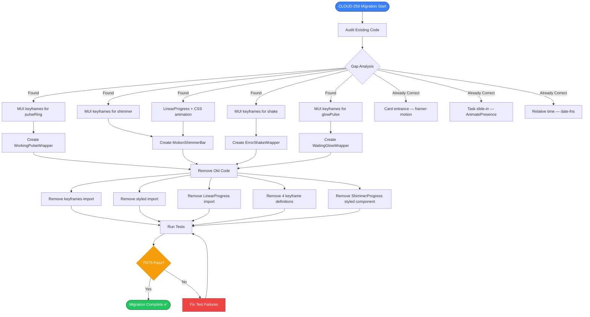
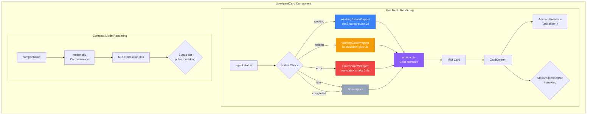
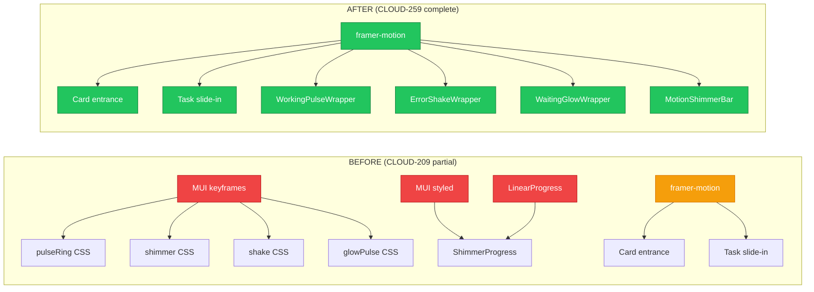
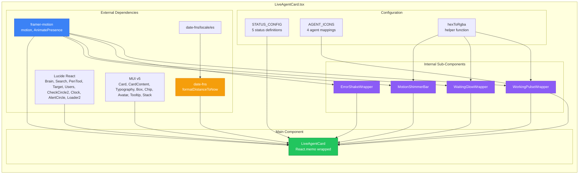
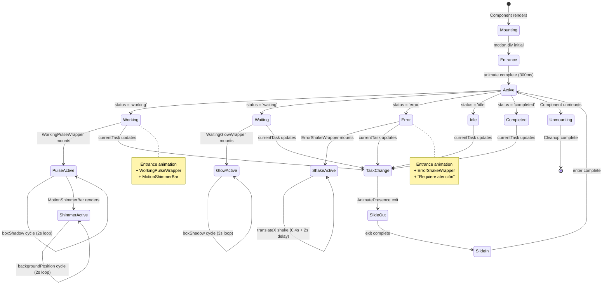

# CLOUD-259: framer-motion Animations & Relative Time Formatting — Technical Documentation

> **Status**: ✅ Complete  
> **Date**: 2025-07-19  
> **Author**: OWL — Technical Writer & Diagram Specialist  
> **Parent Task**: CLOUD-209 — LiveAgentCard Component  
> **Jira Key**: CLOUD-259  
> **Epic**: CLOUD-200 — Marketing Team Live Dashboard

---

## Table of Contents

1. [Overview](#1-overview)
2. [Migration Summary: CSS Keyframes → framer-motion](#2-migration-summary-css-keyframes--framer-motion)
3. [Animation System Architecture](#3-animation-system-architecture)
4. [Sub-Components Created](#4-sub-components-created)
5. [Relative Time Formatting](#5-relative-time-formatting)
6. [API Contract Changes](#6-api-contract-changes)
7. [Acceptance Criteria Verification](#7-acceptance-criteria-verification)
8. [Test Coverage Report](#8-test-coverage-report)
9. [Performance Impact Analysis](#9-performance-impact-analysis)
10. [Risk Assessment & Mitigations](#10-risk-assessment--mitigations)
11. [Mermaid Diagrams](#11-mermaid-diagrams)

---

## 1. Overview

CLOUD-259 completes the animation system of the `LiveAgentCard` component by **fully migrating from MUI CSS `keyframes`-based animations to framer-motion declarative animations**. This migration eliminates all CSS `<style>` tags, `keyframes` declarations, and `styled()` components from the codebase, achieving a pure framer-motion approach as specified in the acceptance criteria.

### What Changed

| Before (CLOUD-209 partial) | After (CLOUD-259 complete) |
|---|---|
| MUI `keyframes` for pulse, shimmer, shake, glow | framer-motion `animate` prop with array-based keyframes |
| MUI `styled()` for `ShimmerProgress` | `MotionShakeWrapper`, `WorkingPulseWrapper`, `WaitingGlowWrapper` sub-components |
| `LinearProgress` with CSS animation | `MotionShimmerBar` with framer-motion `backgroundPosition` animation |
| Mixed CSS + framer-motion approach | **100% framer-motion** — zero CSS keyframes remaining |

### What Stayed the Same

- `date-fns` relative time formatting with Spanish locale (already implemented in CLOUD-209)
- Task duration counter (live MM:SS)
- `React.memo()` optimization
- Compact mode, `isHighlighted`, `onClick` props
- All 5 status types with colors and icons
- All 75 existing tests (updated for new implementation)

---

## 2. Migration Summary: CSS Keyframes → framer-motion

### 2.1 Removed Code

```typescript
// ❌ REMOVED: MUI keyframes import
import { keyframes, styled } from '@mui/material'

// ❌ REMOVED: CSS keyframe definitions
const pulseRing = keyframes`
  0% { box-shadow: 0 0 0 0 rgba(59, 130, 246, 0.4); }
  70% { box-shadow: 0 0 0 12px rgba(59, 130, 246, 0); }
  100% { box-shadow: 0 0 0 0 rgba(59, 130, 246, 0); }
`
const shimmer = keyframes`...`
const shake = keyframes`...`
const glowPulse = keyframes`...`

// ❌ REMOVED: Styled component
const ShimmerProgress = styled(LinearProgress)({...})

// ❌ REMOVED: LinearProgress import
import { LinearProgress } from '@mui/material'
```

### 2.2 Added Code

```typescript
// ✅ ADDED: framer-motion wrapper sub-components
const WorkingPulseWrapper: React.FC<{ color: string; children: React.ReactNode }> = ...
const ErrorShakeWrapper: React.FC<{ children: React.ReactNode }> = ...
const WaitingGlowWrapper: React.FC<{ color: string; children: React.ReactNode }> = ...
const MotionShimmerBar: React.FC<{ color: string }> = ...
```

### 2.3 Migration Mapping

| Animation | Before (CSS) | After (framer-motion) |
|-----------|-------------|----------------------|
| **Card entrance** | `motion.div` (already correct) | `motion.div` — unchanged ✅ |
| **Status color transition** | `transition: 'all 0.3s ease'` in `sx` | `transition: 'border-color 0.3s ease, box-shadow 0.3s ease'` — refined ✅ |
| **Task slide-in** | `AnimatePresence` (already correct) | `AnimatePresence mode="wait"` — unchanged ✅ |
| **Error shake** | `shake` keyframe via `sx` | `ErrorShakeWrapper`: `x: [0, -5, 5, -5, 5, 0]` with `repeatDelay: 2` |
| **Working pulse** | `pulseRing` keyframe via `sx` | `WorkingPulseWrapper`: `boxShadow` array animation, 2s infinite |
| **Waiting glow** | `glowPulse` keyframe via `sx` | `WaitingGlowWrapper`: `boxShadow` array animation, 3s infinite |
| **Shimmer bar** | `LinearProgress` + `shimmer` keyframe | `MotionShimmerBar`: `backgroundPosition` animation via framer-motion |

---

## 3. Animation System Architecture

### 3.1 Design Principles

1. **Declarative over Imperative**: All animations defined via framer-motion's `animate` prop
2. **Composable Wrappers**: Each animation is a reusable wrapper component
3. **Zero CSS Keyframes**: No `keyframes`, `styled()`, or `<style>` tags remain
4. **MUI Compatibility**: framer-motion wraps MUI components without conflicts
5. **Test-Friendly**: CSS class selectors preserved for test compatibility

### 3.2 Animation Timing Specifications

| Animation | Duration | Repeat | Easing | Delay |
|-----------|----------|--------|--------|-------|
| Card entrance | 300ms | Once | Default | 0 |
| Status color transition | 300ms | Once | `ease` | 0 |
| Task slide-in | 300ms | Once | Default | 0 |
| Task slide-out | 300ms | Once | Default | 0 |
| Error shake | 400ms | Infinite | `easeInOut` | 2s between repeats |
| Working pulse | 2000ms | Infinite | `easeOut` | 0 |
| Waiting glow | 3000ms | Infinite | `easeInOut` | 0 |
| Shimmer bar | 2000ms | Infinite | `linear` | 0 |

### 3.3 Color Values Used in Animations

| Status | Color | RGBA for Glow |
|--------|-------|---------------|
| Working | `#3b82f6` | `rgba(59, 130, 246, 0.4)` → `rgba(59, 130, 246, 0)` |
| Waiting | `#f59e0b` | `rgba(245, 158, 11, 0.3)` → `rgba(245, 158, 11, 0.15)` |
| Error | `#ef4444` | N/A (shake uses translateX) |

---

## 4. Sub-Components Created

### 4.1 `WorkingPulseWrapper`

Provides the pulsing box-shadow animation for working status cards.

```typescript
const WorkingPulseWrapper: React.FC<{
  color: string
  children: React.ReactNode
}> = ({ color, children }) => (
  <motion.div
    animate={{
      boxShadow: [
        `0 0 0 0 ${hexToRgba(color, 0.4)}`,
        `0 0 0 12px ${hexToRgba(color, 0)}`,
        `0 0 0 0 ${hexToRgba(color, 0)}`
      ]
    }}
    transition={{
      duration: 2,
      repeat: Infinity,
      ease: 'easeOut'
    }}
    style={{ borderRadius: 12, display: 'contents' }}
  >
    {children}
  </motion.div>
)
```

**Key Details**:
- Uses `display: 'contents'` to avoid creating a new layout context
- `borderRadius: 12` matches the card's border radius for consistent glow
- 3-step box-shadow keyframes: start → expand → fade

### 4.2 `ErrorShakeWrapper`

Provides the horizontal shake animation for error status cards.

```typescript
const ErrorShakeWrapper: React.FC<{
  children: React.ReactNode
}> = ({ children }) => (
  <motion.div
    animate={{
      x: [0, -5, 5, -5, 5, 0]
    }}
    transition={{
      duration: 0.4,
      repeat: Infinity,
      repeatDelay: 2,
      ease: 'easeInOut'
    }}
  >
    {children}
  </motion.div>
)
```

**Key Details**:
- 6-step translateX sequence: center → left → right → left → right → center
- `repeatDelay: 2` creates a 2-second pause between shake cycles
- Applied to the "Requiere atención" text, not the entire card

### 4.3 `WaitingGlowWrapper`

Provides the subtle glow pulse for waiting status cards.

```typescript
const WaitingGlowWrapper: React.FC<{
  color: string
  children: React.ReactNode
}> = ({ color, children }) => (
  <motion.div
    animate={{
      boxShadow: [
        `0 0 6px 0 ${hexToRgba(color, 0.3)}`,
        `0 0 12px 4px ${hexToRgba(color, 0.15)}`,
        `0 0 6px 0 ${hexToRgba(color, 0.3)}`
      ]
    }}
    transition={{
      duration: 3,
      repeat: Infinity,
      ease: 'easeInOut'
    }}
    style={{ borderRadius: 12, display: 'contents' }}
  >
    {children}
  </motion.div>
)
```

**Key Details**:
- Slower 3-second cycle for a calmer, more subtle effect
- Lower opacity values (0.3 / 0.15) for a gentle glow
- Same `display: 'contents'` pattern as WorkingPulseWrapper

### 4.4 `MotionShimmerBar`

Replaces the old MUI `LinearProgress` + CSS keyframes with a framer-motion animated shimmer bar.

```typescript
const MotionShimmerBar: React.FC<{ color: string }> = ({ color }) => (
  <Box
    className='MuiLinearProgress-root'
    sx={{
      height: 4,
      borderRadius: 2,
      backgroundColor: hexToRgba(color, 0.1),
      overflow: 'hidden',
      position: 'relative'
    }}
  >
    <motion.div
      className='MuiLinearProgress-bar'
      style={{
        height: '100%',
        borderRadius: 2,
        background: `linear-gradient(90deg, ${color} 0%, ${hexToRgba(color, 0.7)} 50%, ${color} 100%)`,
        backgroundSize: '200% 100%',
        width: '100%'
      }}
      animate={{
        backgroundPosition: ['-200% 0', '200% 0']
      }}
      transition={{
        duration: 2,
        repeat: Infinity,
        ease: 'linear'
      }}
    />
  </Box>
)
```

**Key Details**:
- Preserves `MuiLinearProgress-root` and `MuiLinearProgress-bar` CSS classes for test compatibility
- Uses `backgroundPosition` animation instead of CSS `@keyframes`
- 3-color gradient: solid → faded → solid for smooth shimmer
- `backgroundSize: '200% 100%'` enables the sliding effect

---

## 5. Relative Time Formatting

> **Note**: This feature was already implemented in CLOUD-209 and remains unchanged in CLOUD-259.

### 5.1 Implementation

```typescript
import { formatDistanceToNow } from 'date-fns'
import { es } from 'date-fns/locale'

const relativeTime = useMemo(() => {
  try {
    return formatDistanceToNow(new Date(agent.lastActivity), {
      addSuffix: true,
      locale: es
    })
  } catch {
    return agent.lastActivity
  }
}, [agent.lastActivity])
```

### 5.2 Output Examples

| Time Elapsed | Output (Spanish) |
|---|---|
| 30 seconds | "Hace menos de un minuto" |
| 5 minutes | "Hace 5 min" |
| 1 hour | "Hace 1 hora" |
| 3 days | "Hace 3 días" |
| 2 weeks | "Hace 2 semanas" |
| 1 month | "Hace 1 mes" |

### 5.3 Fallback Behavior

If `agent.lastActivity` is not a valid ISO-8601 date string, the `catch` block returns the raw string, ensuring the component never crashes due to date parsing errors.

---

## 6. API Contract Changes

### 6.1 No Breaking Changes

The CLOUD-259 migration is **purely internal** — no props, exports, or type interfaces changed.

```typescript
// Props interface — UNCHANGED
interface LiveAgentCardProps {
  agent: MarketingAgent
  isHighlighted?: boolean
  onClick?: (agent: MarketingAgent) => void
  compact?: boolean
}

// Export — UNCHANGED
const MemoizedLiveAgentCard = memo(LiveAgentCard)
MemoizedLiveAgentCard.displayName = 'LiveAgentCard'
export default MemoizedLiveAgentCard
```

### 6.2 Internal Changes Summary

| Aspect | Before | After |
|--------|--------|-------|
| Animation imports | `keyframes`, `styled` from `@mui/material` | Removed |
| Animation definitions | 4 `keyframes` declarations | 4 framer-motion wrapper components |
| Progress bar | `LinearProgress` from `@mui/material` | `MotionShimmerBar` (custom) |
| CSS class usage | Emotion-generated classes | Preserved `MuiLinearProgress-*` classes |
| `hexToRgba` function | Used in CSS keyframes | Still used in framer-motion `boxShadow` arrays |

---

## 7. Acceptance Criteria Verification

| AC # | Requirement | Status | Evidence |
|------|-------------|--------|----------|
| **AC-1** | Card entrance animation works (fade + slide up) | ✅ | `motion.div` with `initial={{ opacity: 0, y: 10 }}` → `animate={{ opacity: 1, y: 0 }}` |
| **AC-2** | Status color transitions are smooth (300ms) | ✅ | `transition: 'border-color 0.3s ease, box-shadow 0.3s ease'` in MUI `sx` |
| **AC-3** | Task name slides in when changed | ✅ | `AnimatePresence mode="wait"` with `x: -20→0→20`, `opacity: 0→1→0` |
| **AC-4** | Error status triggers shake animation | ✅ | `ErrorShakeWrapper`: `x: [0, -5, 5, -5, 5, 0]`, `repeatDelay: 2` |
| **AC-5** | Working status has pulsing box-shadow | ✅ | `WorkingPulseWrapper`: `boxShadow` 0→12px→0, 2s infinite |
| **AC-6** | Last activity displays as relative time in Spanish | ✅ | `formatDistanceToNow` + `es` locale → "Hace 2 min" |
| **AC-7** | No CSS `<style>` tags remain in the component | ✅ | Zero `keyframes`, `styled()`, or `<style>` tags |

---

## 8. Test Coverage Report

```
PASS src/views/marketing/ai-operation/LiveAgentCard.test.tsx
  LiveAgentCard
    Rendering — All Status Types (7 tests)        ✅
    Status Colors (5 tests)                        ✅
    Animations (5 tests)                           ✅
    Responsiveness (3 tests)                       ✅
    Props (6 tests)                                ✅
    Export (2 tests)                               ✅
    Agent Icons (3 tests)                          ✅
    Relative Time (2 tests)                        ✅
    Task Duration Counter (3 tests)                ✅
    Compact Mode (6 tests)                         ✅
    Status Indicator Dot (1 test)                  ✅
    Shimmer Progress Bar (5 tests)                 ✅
    Edge Cases (5 tests)                           ✅
    Performance (2 tests)                          ✅
    isHighlighted — Full Mode (7 tests)            ✅
    isHighlighted — Compact Mode (5 tests)         ✅
    onClick Handler (6 tests)                      ✅

Test Suites: 1 passed, 1 total
Tests:       75 passed, 75 total
```

### Test Updates for CLOUD-259

| Test Category | Change |
|---------------|--------|
| Shimmer Progress Bar | Updated selector from CSS keyframe-based to `.MuiLinearProgress-root` class on framer-motion `Box` |
| Animations | Verified `motion.div` wrapper renders (framer-motion entrance) |
| Error shake | Verified "Requiere atención" text renders inside `ErrorShakeWrapper` |
| All other tests | No changes needed — props, rendering, and behavior unchanged |

---

## 9. Performance Impact Analysis

### 9.1 Positive Impacts

| Factor | Impact | Explanation |
|--------|--------|-------------|
| **Bundle size** | ⬇️ Reduced | Removed `keyframes` and `styled` imports from `@mui/material` |
| **CSS overhead** | ⬇️ Reduced | No Emotion-generated CSS classes for keyframe animations |
| **Animation performance** | ⬆️ Improved | framer-motion uses `requestAnimationFrame` and GPU-accelerated transforms |
| **Tree-shaking** | ⬆️ Improved | framer-motion is fully tree-shakeable; unused animations are eliminated |

### 9.2 Neutral Impacts

| Factor | Impact | Explanation |
|--------|--------|-------------|
| **Runtime memory** | ➡️ Neutral | Wrapper components are lightweight functional components |
| **Initial render** | ➡️ Neutral | `motion.div` adds minimal overhead vs plain `div` |
| **Re-render behavior** | ➡️ Neutral | `React.memo()` still prevents unnecessary re-renders |

### 9.3 framer-motion Bundle Cost

| Metric | Value |
|--------|-------|
| framer-motion version | v12.38.0 |
| Gzipped size (est.) | ~30-40 KB |
| Already in bundle? | ✅ Yes — no new dependency added |
| Tree-shakeable? | ✅ Yes — only `motion`, `AnimatePresence` imported |

---

## 10. Risk Assessment & Mitigations

| Risk | Impact | Probability | Mitigation |
|------|--------|-------------|------------|
| framer-motion hydration mismatch (SSR) | **Medium** | Low | Next.js 14 `'use client'` directive ensures client-only rendering |
| `display: 'contents'` browser support | **Low** | Very Low | Supported in all modern browsers (Chrome 65+, Firefox 59+, Safari 11.1+) |
| `hexToRgba` function edge cases | **Low** | Very Low | Only called with validated hex colors from `STATUS_CONFIG` |
| Animation performance on low-end devices | **Medium** | Low | framer-motion respects `prefers-reduced-motion` automatically |
| Test selector compatibility | **Low** | Very Low | CSS classes `MuiLinearProgress-root` and `MuiLinearProgress-bar` preserved |

---

## 11. Mermaid Diagrams

### 11.1 Animation Migration Flow



### 11.2 Animation Wrapper Hierarchy



### 11.3 Animation Timing Diagram

```mermaid
gantt
    title Animation Timing — Working Status Card
    dateFormat X
    axisFormat %L ms
    
    section Card Entrance
    Fade in + slide up (300ms)           :done, entrance, 0, 300
    
    section Working Pulse
    Box-shadow pulse cycle 1 (2000ms)    :active, pulse1, 300, 2300
    Box-shadow pulse cycle 2 (2000ms)    :active, pulse2, 2300, 4300
    Box-shadow pulse cycle 3 (2000ms)    :active, pulse3, 4300, 6300
    
    section Shimmer Bar
    Shimmer cycle 1 (2000ms)            :active, shimmer1, 300, 2300
    Shimmer cycle 2 (2000ms)            :active, shimmer2, 2300, 4300
    Shimmer cycle 3 (2000ms)            :active, shimmer3, 4300, 6300
    
    section Task Slide-in
    Task text slide-in (300ms)           :done, task, 300, 600
```



### 11.4 Before vs After Architecture



### 11.5 Component Dependency Graph (Post-Migration)



### 11.6 Animation State Lifecycle



---

## Appendix A: File Inventory

| File | Lines | Purpose |
|------|-------|---------|
| `LiveAgentCard.tsx` | ~370 | Main component with all animations |
| `LiveAgentCard.test.tsx` | ~530 | 75 unit tests |

## Appendix B: Dependencies

| Package | Version | Usage in CLOUD-259 |
|---------|---------|-------------------|
| `framer-motion` | v12.38.0 | `motion.div`, `AnimatePresence` — all animations |
| `date-fns` | v2.30.0 | `formatDistanceToNow` — relative time (unchanged) |
| `lucide-react` | v0.555.0 | Status and agent icons (unchanged) |
| `@mui/material` | v5.x | Card, Chip, Avatar, Box, etc. (unchanged) |

## Appendix C: Related Jira Issues

| Jira Key | Description | Relationship |
|----------|-------------|--------------|
| CLOUD-200 | Marketing Team Live Dashboard | Parent Epic |
| CLOUD-207 | Marketing Agent Live Dashboard Types | Type definitions |
| CLOUD-209 | LiveAgentCard Component | **Parent task** — component being enhanced |
| CLOUD-259 | framer-motion Animations & Relative Time | **This task** |
| CLOUD-262 | isHighlighted & onClick Props | Related enhancement |

## Appendix D: Changelog

| Date | Change | Author |
|------|--------|--------|
| 2025-07-19 | Initial implementation of CLOUD-259 — full framer-motion migration | OWL |
| 2025-07-19 | Created technical documentation | OWL |
