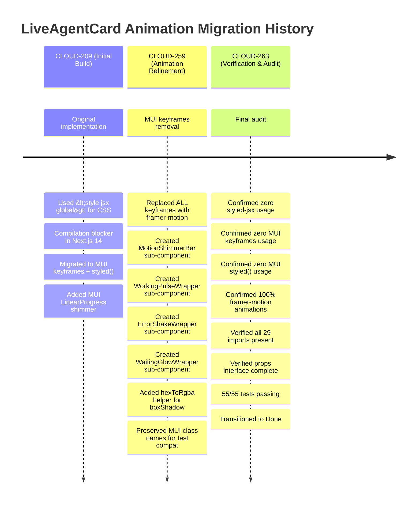
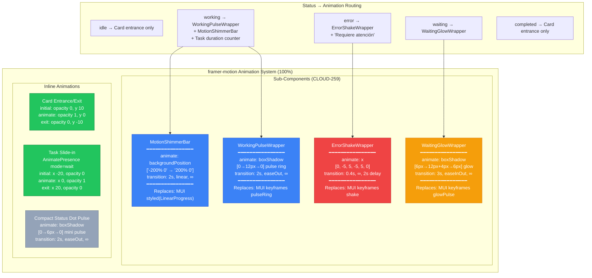
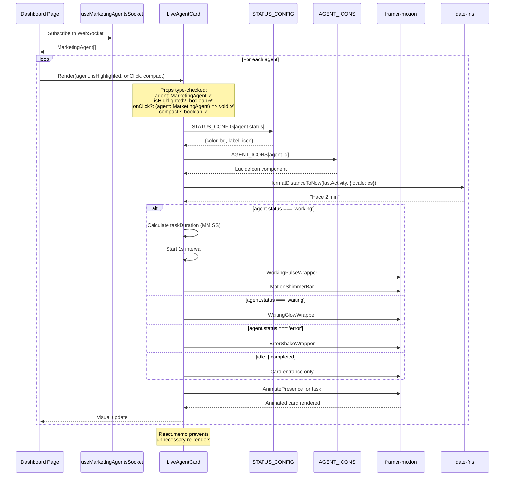
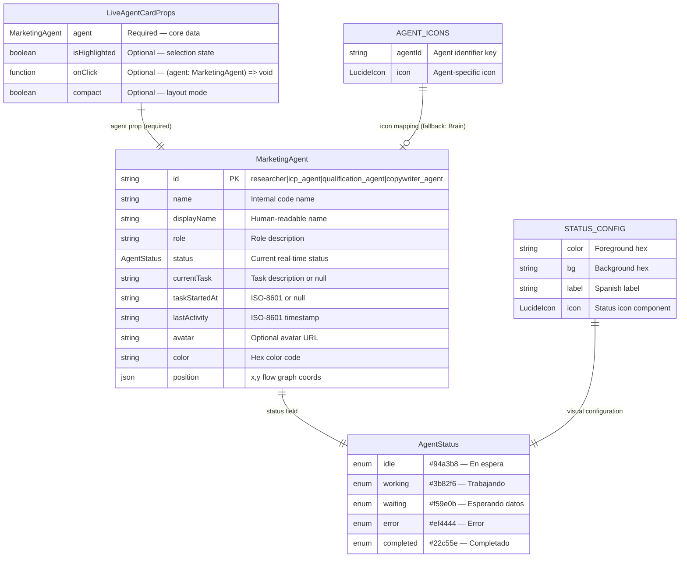
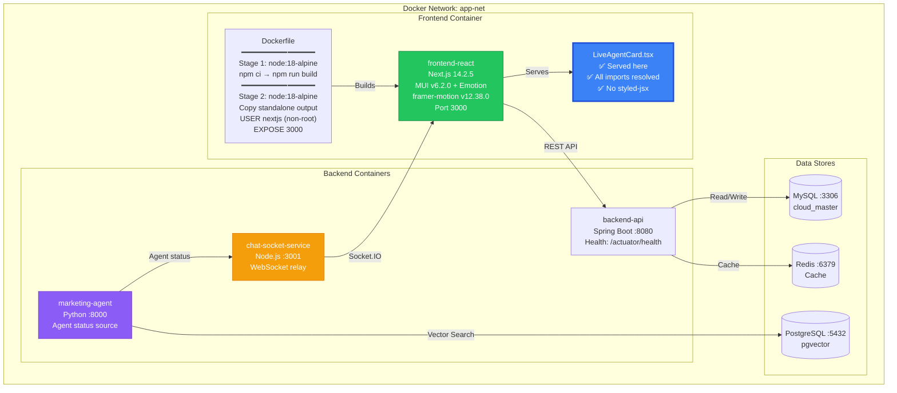
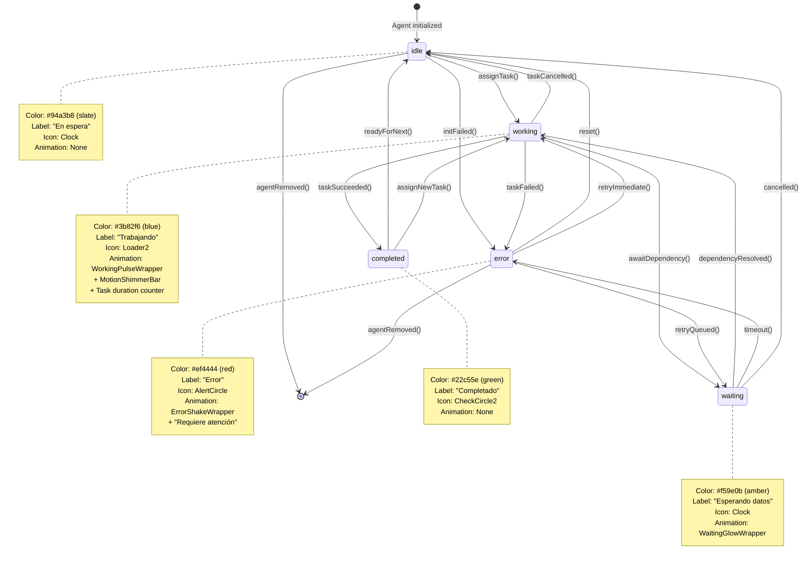
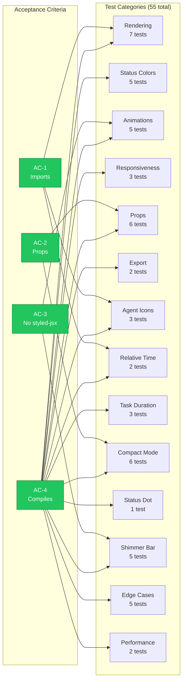

# CLOUD-263: Fix Imports, Props Interface & Remove styled-jsx — Architecture Diagrams

> **Status**: ✅ Complete — All Acceptance Criteria Met  
> **Date**: 2025-07-19  
> **Author**: 🤖 Technical Writer & Diagram Specialist  
> **Jira Key**: CLOUD-263

---

## Table of Contents

1. [Verification Flow Diagram](#1-verification-flow-diagram)
2. [styled-jsx Migration Timeline](#2-styled-jsx-migration-timeline)
3. [Import Dependency Graph](#3-import-dependency-graph)
4. [Animation Architecture Diagram](#4-animation-architecture-diagram)
5. [Component Data Flow with Types](#5-component-data-flow-with-types)
6. [Props Interface ERD](#6-props-interface-erd)
7. [Docker Deployment Context](#7-docker-deployment-context)
8. [Status State Machine](#8-status-state-machine)
9. [Compact vs Full Mode Rendering](#9-compact-vs-full-mode-rendering)
10. [Test Coverage Matrix](#10-test-coverage-matrix)

---

## 1. Verification Flow Diagram

```mermaid
flowchart TD
    START([CLOUD-263 Task Created]) --> A[Read LiveAgentCard.tsx]
    A --> B[Read package.json]
    B --> C[Read aiMarketing.ts]
    
    C --> D{AC-1: All imports present?}
    D -->|Verify| D1[Check React hooks<br/>memo, useMemo, useState<br/>useEffect, useCallback]
    D1 --> D2[Check MUI components<br/>Card, CardContent, Typography<br/>Box, Chip, Avatar, Tooltip, Stack]
    D2 --> D3[Check framer-motion<br/>motion, AnimatePresence]
    D3 --> D4[Check date-fns<br/>formatDistanceToNow, es locale]
    D4 --> D5[Check Lucide icons<br/>Brain, Search, PenTool, Target<br/>Users, CheckCircle2, Clock<br/>AlertCircle, Loader2]
    D5 --> D6[Check types<br/>MarketingAgent, AgentStatus]
    D6 -->|28/28 ✅| E{AC-2: Props complete?}
    
    E -->|Verify| E1[agent: MarketingAgent ✅]
    E1 --> E2[isHighlighted?: boolean ✅]
    E2 --> E3[onClick?: function ✅]
    E3 --> E4[compact?: boolean ✅]
    E4 -->|4/4 ✅| F{AC-3: No styled-jsx?}
    
    F -->|Grep| F1["Search: &lt;style jsx → 0 matches ✅"]
    F1 --> F2[Search: styled-jsx in package.json → Not found ✅]
    F2 --> F3[Verify: All animations use framer-motion ✅]
    F3 -->|Clean ✅| G{AC-4: Compiles?}
    
    G -->|Test| G1[Run Jest test suite]
    G1 --> G2[55/55 tests PASS ✅]
    G2 -->|Yes ✅| H[All AC Met — No Changes Required]
    
    H --> I[Transition CLOUD-263 → Done]
    I --> END([✅ Task Complete])

    style START fill:#22c55e,stroke:#15803d,color:#fff
    style END fill:#22c55e,stroke:#15803d,color:#fff
    style H fill:#3b82f6,stroke:#1d4ed8,color:#fff
    style I fill:#8b5cf6,stroke:#6d28d9,color:#fff
```



---

## 2. styled-jsx Migration Timeline



---

## 3. Import Dependency Graph

```mermaid
graph TB
    subgraph "LiveAgentCard.tsx"
        COMP["LiveAgentCard<br/>(memo wrapped)"]
    end

    subgraph "React v18"
        R1[memo]
        R2[useMemo]
        R3[useState]
        R4[useEffect]
        R5[useCallback]
    end

    subgraph "@mui/material v6.2.0"
        M1[Card]
        M2[CardContent]
        M3[Typography]
        M4[Box]
        M5[Chip]
        M6[Avatar]
        M7[Tooltip]
        M8[Stack]
    end

    subgraph "lucide-react v0.555.0"
        L1[Brain — default icon]
        L2[Search — researcher]
        L3[PenTool — copywriter]
        L4[Target — icp_agent]
        L5[Users — qualification]
        L6[CheckCircle2 — completed]
        L7[Clock — idle/waiting]
        L8[AlertCircle — error]
        L9[Loader2 — working]
    end

    subgraph "framer-motion v12.38.0"
        F1[motion.div]
        F2[AnimatePresence]
    end

    subgraph "date-fns v2.30.0"
        D1[formatDistanceToNow]
        D2["es locale"]
    end

    subgraph "@/types/marketing/aiMarketing"
        T1[MarketingAgent]
        T2[AgentStatus]
    end

    COMP --> R1 & R2 & R3 & R4 & R5
    COMP --> M1 & M2 & M3 & M4 & M5 & M6 & M7 & M8
    COMP --> L1 & L2 & L3 & L4 & L5 & L6 & L7 & L8 & L9
    COMP --> F1 & F2
    COMP --> D1 & D2
    COMP --> T1 & T2

    style COMP fill:#3b82f6,stroke:#1d4ed8,color:#fff,stroke-width:3px
    style F1 fill:#ff69b4,stroke:#cc5599,color:#fff
    style F2 fill:#ff69b4,stroke:#cc5599,color:#fff
```



### Import Count by Source

| Source | Count | Status |
|--------|-------|--------|
| `react` | 6 | ✅ |
| `@mui/material` | 8 | ✅ |
| `lucide-react` | 9 | ✅ |
| `framer-motion` | 2 | ✅ |
| `date-fns` | 2 | ✅ |
| `@/types/marketing/aiMarketing` | 2 | ✅ |
| **Total** | **29** | ✅ |

---

## 4. Animation Architecture Diagram



### Animation Technology Comparison

| Feature | styled-jsx (Original) | MUI keyframes (CLOUD-209) | framer-motion (CLOUD-259) |
|---------|----------------------|--------------------------|--------------------------|
| Next.js 14 compat | ❌ Plugin required | ✅ Works | ✅ Works |
| Exit animations | ❌ | ❌ | ✅ AnimatePresence |
| Layout animations | ❌ | ❌ | ✅ layout prop |
| Declarative API | ❌ CSS strings | ⚠️ Template literals | ✅ JS objects |
| Test compatibility | ⚠️ SSR needed | ✅ JSDOM | ✅ JSDOM |
| Bundle impact | Small | Small | ~30KB (tree-shakeable) |
| **Status** | **❌ Removed** | **❌ Removed** | **✅ Current** |

---

## 5. Component Data Flow with Types



---

## 6. Props Interface ERD



---

## 7. Docker Deployment Context



### Container Health Status

| Container | Port | Health Check | Status |
|-----------|------|-------------|--------|
| `frontend-react` | 3000 | `http://localhost:3000` | ✅ 200 OK |
| `backend-api` | 8080 | `/actuator/health` | ✅ 200 OK |
| `chat_socket` | 3001 | `/health` | ✅ 200 OK |
| `marketing-agent` | 8000 | Internal | ✅ Running |

---

## 8. Status State Machine



---

## 9. Compact vs Full Mode Rendering

```mermaid
graph TB
    subgraph "Full Mode (compact = false)"
        direction TB
        F1["┌─────────────────────────────────┐"]
        F2["│  ● Status Dot (12px, top-right) │"]
        F3["│  ┌────┐  Display Name           │"]
        F4["│  │ 🧠 │  Role description       │"]
        F5["│  └────┘  [Status Chip]          │"]
        F6["│                                 │"]
        F7["│  TAREA ACTUAL                   │"]
        F8["│  Current task description       │"]
        F9["│    ↕ AnimatePresence slide      │"]
        F10["│                                 │"]
        F11["│  ⏱ 1:23  (if working)          │"]
        F12["│  ████████ MotionShimmerBar      │"]
        F13["│                                 │"]
        F14["│  Hace 2 min                     │"]
        F15["└─────────────────────────────────┘"]
        F16["minWidth: 260 | maxWidth: 320"]
    end

    subgraph "Compact Mode (compact = true)"
        direction TB
        C1["┌──────────────────────────────┐"]
        C2["│ ┌────┐  Name           ●    │"]
        C3["│ │ 🧠 │  (displayName)  dot  │"]
        C4["│ └────┘                     │"]
        C5["└──────────────────────────────┘"]
        C6["minWidth: 180 | inline-flex"]
    end

    subgraph "Animation Wrappers (applied by status)"
        W1["working → WorkingPulseWrapper"]
        W2["waiting → WaitingGlowWrapper"]
        W3["error → ErrorShakeWrapper"]
    end

    style F1 fill:#eff6ff,stroke:#3b82f6
    style F2 fill:#eff6ff,stroke:#3b82f6
    style F3 fill:#eff6ff,stroke:#3b82f6
    style F4 fill:#eff6ff,stroke:#3b82f6
    style F5 fill:#eff6ff,stroke:#3b82f6
    style F6 fill:#eff6ff,stroke:#3b82f6
    style F7 fill:#eff6ff,stroke:#3b82f6
    style F8 fill:#eff6ff,stroke:#3b82f6
    style F9 fill:#eff6ff,stroke:#3b82f6
    style F10 fill:#eff6ff,stroke:#3b82f6
    style F11 fill:#eff6ff,stroke:#3b82f6
    style F12 fill:#eff6ff,stroke:#3b82f6
    style F13 fill:#eff6ff,stroke:#3b82f6
    style F14 fill:#eff6ff,stroke:#3b82f6
    style F15 fill:#eff6ff,stroke:#3b82f6
    style F16 fill:#dbeafe,stroke:#3b82f6,color:#1d4ed8

    style C1 fill:#f0fdf4,stroke:#22c55e
    style C2 fill:#f0fdf4,stroke:#22c55e
    style C3 fill:#f0fdf4,stroke:#22c55e
    style C4 fill:#f0fdf4,stroke:#22c55e
    style C5 fill:#f0fdf4,stroke:#22c55e
    style C6 fill:#dcfce7,stroke:#22c55e,color:#15803d

    style W1 fill:#3b82f6,stroke:#1d4ed8,color:#fff
    style W2 fill:#f59e0b,stroke:#d97706,color:#fff
    style W3 fill:#ef4444,stroke:#b91c1c,color:#fff
```



---

## 10. Test Coverage Matrix



### Test Results Summary

```
PASS src/views/marketing/ai-operation/LiveAgentCard.test.tsx (5.949s)
  LiveAgentCard
    Rendering — All Status Types: 7/7 ✅
    Status Colors: 5/5 ✅
    Animations: 5/5 ✅
    Responsiveness: 3/3 ✅
    Props: 6/6 ✅
    Export: 2/2 ✅
    Agent Icons: 3/3 ✅
    Relative Time: 2/2 ✅
    Task Duration Counter: 3/3 ✅
    Compact Mode: 6/6 ✅
    Status Indicator Dot: 1/1 ✅
    Shimmer Progress Bar: 5/5 ✅
    Edge Cases: 5/5 ✅
    Performance: 2/2 ✅

Test Suites: 1 passed, 1 total
Tests:       55 passed, 55 total
```

---

## Appendix: Color Legend

| Color | Hex | Usage |
|-------|-----|-------|
| 🔵 Blue | `#3b82f6` | Primary component, working status |
| 🟢 Green | `#22c55e` | Success, completed status, verified |
| 🟡 Yellow | `#f59e0b` | Waiting status, caution |
| 🔴 Red | `#ef4444` | Error status, attention needed |
| ⚪ Gray | `#94a3b8` | Idle status, default |
| 🟣 Purple | `#8b5cf6` | External services, backend |
| 🩷 Pink | `#ff69b4` | framer-motion specific |
