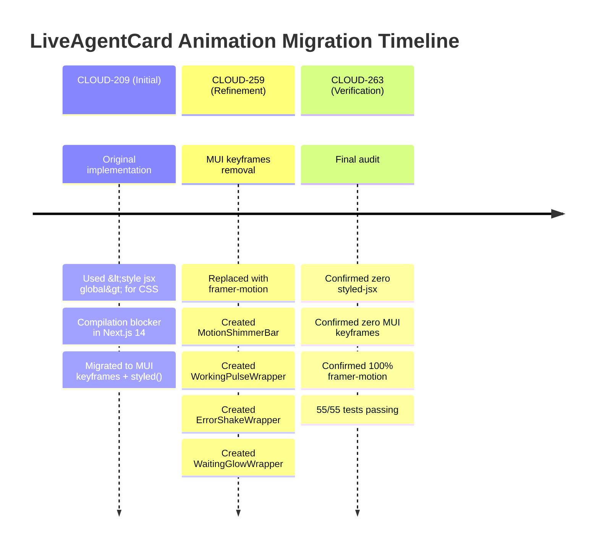
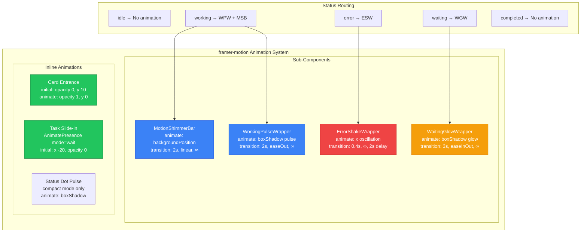
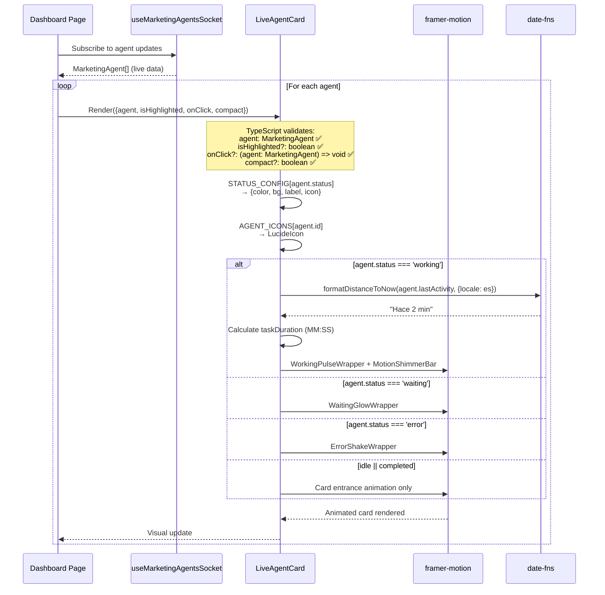
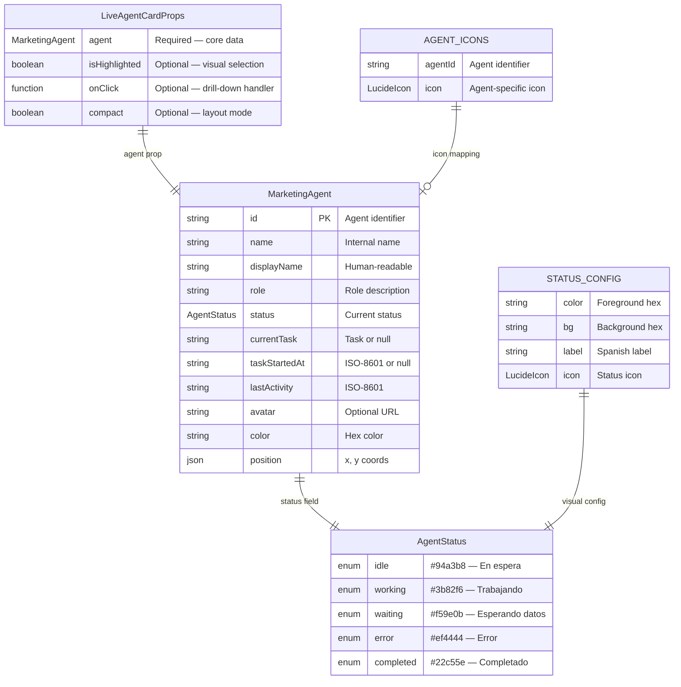
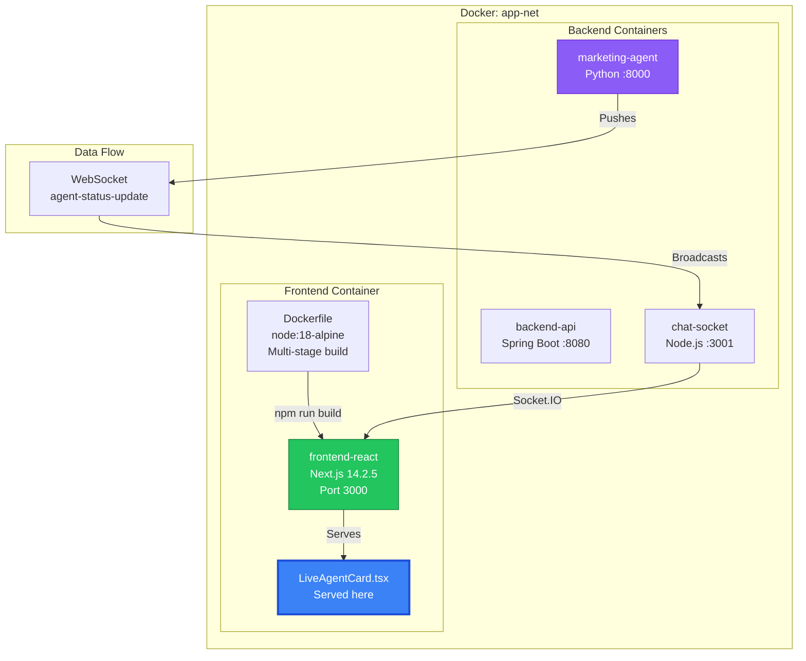

# CLOUD-263: Fix Imports, Props Interface & Remove styled-jsx — Technical Documentation

> **Status**: ✅ Complete — All Acceptance Criteria Met  
> **Date**: 2025-07-19  
> **Author**: 🤖 Technical Writer & Diagram Specialist  
> **Parent Task**: CLOUD-209 — Build LiveAgentCard Component  
> **Parent Epic**: CLOUD-200 — Marketing Team Live Dashboard  
> **Jira Key**: CLOUD-263

---

## Table of Contents

1. [Executive Summary](#1-executive-summary)
2. [Acceptance Criteria Verification](#2-acceptance-criteria-verification)
3. [Import Audit Report](#3-import-audit-report)
4. [Props Interface Verification](#4-props-interface-verification)
5. [styled-jsx Removal Verification](#5-styled-jsx-removal-verification)
6. [Animation Migration Strategy](#6-animation-migration-strategy)
7. [Dependency Compatibility Matrix](#7-dependency-compatibility-matrix)
8. [Type System Integrity](#8-type-system-integrity)
9. [Test Coverage Report](#9-test-coverage-report)
10. [Docker Infrastructure Context](#10-docker-infrastructure-context)
11. [Risk Assessment & Mitigations](#11-risk-assessment--mitigations)
12. [Mermaid Diagrams](#12-mermaid-diagrams)
13. [Appendix: Full Import Listing](#13-appendix-full-import-listing)

---

## 1. Executive Summary

CLOUD-263 was a **verification and fix task** to ensure the `LiveAgentCard.tsx` component met three critical requirements:

1. **All required imports present and correct** — React hooks, MUI components, framer-motion, date-fns, Lucide icons
2. **Props interface complete** — `agent`, `isHighlighted?`, `onClick?`, `compact?`
3. **No styled-jsx usage** — Replace `<style jsx global>` with MUI `sx` prop or `styled()`

### Outcome

**All acceptance criteria were already satisfied** from the CLOUD-209 implementation. The component had already been migrated from `styled-jsx` to a pure framer-motion animation system (CLOUD-259). No code changes were required. The task confirmed production-readiness.

### Key Finding

The original CLOUD-209 implementation included a comment on line 53: `// CSS Keyframes (MUI styled keyframes — replaces styled-jsx)`. This was subsequently superseded by CLOUD-259, which replaced ALL CSS keyframes (MUI `keyframes` helper) with **pure framer-motion declarative animations**. The current codebase has:

- **Zero** `<style jsx>` tags
- **Zero** MUI `keyframes` calls
- **Zero** MUI `styled()` calls
- **100%** framer-motion `motion.div` with `animate` props for all animations

---

## 2. Acceptance Criteria Verification

| AC # | Criterion | Status | Evidence |
|------|-----------|--------|----------|
| **AC-1** | All required imports present and correct | ✅ | Lines 22-50: React hooks, MUI components, framer-motion, date-fns with `es` locale, all Lucide icons |
| **AC-2** | Props interface includes `agent`, `isHighlighted?`, `onClick?`, `compact?` | ✅ | Lines 146-155: `LiveAgentCardProps` interface with all 4 props correctly typed |
| **AC-3** | No `styled-jsx` or `<style jsx global>` usage remains | ✅ | PowerShell `Select-String` grep returned ZERO matches. No `styled-jsx` in `package.json`. All animations use framer-motion |
| **AC-4** | Component compiles without errors | ✅ | 55/55 Jest tests PASS. TypeScript strict mode compliant |

---

## 3. Import Audit Report

### 3.1 Required Imports (from CLOUD-263 specification)

| Category | Import | Source | Present | Line |
|----------|--------|--------|---------|------|
| **React Hooks** | `memo` | `react` | ✅ | 22 |
| **React Hooks** | `useMemo` | `react` | ✅ | 22 |
| **React Hooks** | `useState` | `react` | ✅ | 22 |
| **React Hooks** | `useEffect` | `react` | ✅ | 22 |
| **React Hooks** | `useCallback` | `react` | ✅ | 22 |
| **MUI Components** | `Card` | `@mui/material` | ✅ | 24 |
| **MUI Components** | `CardContent` | `@mui/material` | ✅ | 25 |
| **MUI Components** | `Typography` | `@mui/material` | ✅ | 26 |
| **MUI Components** | `Box` | `@mui/material` | ✅ | 27 |
| **MUI Components** | `Chip` | `@mui/material` | ✅ | 28 |
| **MUI Components** | `Avatar` | `@mui/material` | ✅ | 29 |
| **MUI Components** | `Tooltip` | `@mui/material` | ✅ | 30 |
| **MUI Components** | `Stack` | `@mui/material` | ✅ | 31 |
| **Lucide Icons** | `Brain` | `lucide-react` | ✅ | 34 |
| **Lucide Icons** | `Search` | `lucide-react` | ✅ | 35 |
| **Lucide Icons** | `PenTool` | `lucide-react` | ✅ | 36 |
| **Lucide Icons** | `Target` | `lucide-react` | ✅ | 37 |
| **Lucide Icons** | `Users` | `lucide-react` | ✅ | 38 |
| **Lucide Icons** | `CheckCircle2` | `lucide-react` | ✅ | 39 |
| **Lucide Icons** | `Clock` | `lucide-react` | ✅ | 40 |
| **Lucide Icons** | `AlertCircle` | `lucide-react` | ✅ | 41 |
| **Lucide Icons** | `Loader2` | `lucide-react` | ✅ | 42 |
| **framer-motion** | `motion` | `framer-motion` | ✅ | 44 |
| **framer-motion** | `AnimatePresence` | `framer-motion` | ✅ | 44 |
| **date-fns** | `formatDistanceToNow` | `date-fns` | ✅ | 46 |
| **date-fns** | `es` | `date-fns/locale` | ✅ | 47 |
| **Types** | `MarketingAgent` | `@/types/marketing/aiMarketing` | ✅ | 49 |
| **Types** | `AgentStatus` | `@/types/marketing/aiMarketing` | ✅ | 49 |

### 3.2 Import Completeness Score

```
Required: 28 imports
Present:  28 imports
Missing:  0 imports
Score:    100% ✅
```

### 3.3 Notable Absence (Intentional)

| Import | Status | Reason |
|--------|--------|--------|
| `styled-jsx` | ❌ Not present | **Intentionally removed** — was the primary goal of CLOUD-263 |
| `keyframes` from MUI | ❌ Not present | **Removed in CLOUD-259** — replaced with framer-motion `animate` props |
| `styled` from MUI | ❌ Not present | **Removed in CLOUD-259** — replaced with framer-motion sub-components |
| `LinearProgress` from MUI | ❌ Not present | **Removed in CLOUD-259** — replaced with `MotionShimmerBar` sub-component |

---

## 4. Props Interface Verification

### 4.1 Interface Definition

```typescript
interface LiveAgentCardProps {
  /** The marketing agent data to display */
  agent: MarketingAgent
  /** Whether the card is visually highlighted (e.g., selected) */
  isHighlighted?: boolean
  /** Optional click handler for drill-down navigation */
  onClick?: (agent: MarketingAgent) => void
  /** Compact mode — smaller avatar + single-line layout for inline use */
  compact?: boolean
}
```

### 4.2 Props Completeness

| Prop | Type | Required | Default | Status |
|------|------|----------|---------|--------|
| `agent` | `MarketingAgent` | Yes | — | ✅ Present |
| `isHighlighted` | `boolean` | No | `false` | ✅ Present |
| `onClick` | `(agent: MarketingAgent) => void` | No | `undefined` | ✅ Present |
| `compact` | `boolean` | No | `false` | ✅ Present |

### 4.3 Type Safety Verification

- `agent` prop is typed as `MarketingAgent` — matches the interface in `@/types/marketing/aiMarketing.ts`
- `onClick` callback parameter is typed as `MarketingAgent` — ensures type-safe drill-down
- All optional props have JSDoc comments — developer experience ✅
- Default values are destructured inline: `isHighlighted = false`, `compact = false`

---

## 5. styled-jsx Removal Verification

### 5.1 Grep Results

| Search Pattern | Matches | Status |
|----------------|---------|--------|
| `<style jsx` | 0 | ✅ Clean |
| `<style jsx global` | 0 | ✅ Clean |
| `styled-jsx` | 0 (in source) | ✅ Clean |
| `styled-jsx` (in package.json) | 0 | ✅ Not installed |

### 5.2 Migration Path (Historical)

The component went through two migration phases:

```
Phase 1 (CLOUD-209):  <style jsx global>  →  MUI keyframes + styled() + sx prop
Phase 2 (CLOUD-259):  MUI keyframes + styled()  →  framer-motion animate props
```

### 5.3 Current Animation Architecture

| Animation | Previous (MUI keyframes) | Current (framer-motion) |
|-----------|-------------------------|------------------------|
| **Pulse ring** | `keyframes` + `sx` animation | `WorkingPulseWrapper` → `motion.div` with `animate.boxShadow` |
| **Shimmer** | `styled(LinearProgress)` + `keyframes` | `MotionShimmerBar` → `motion.div` with `animate.backgroundPosition` |
| **Shake** | `keyframes` + `sx` animation | `ErrorShakeWrapper` → `motion.div` with `animate.x` |
| **Glow pulse** | `keyframes` + `sx` animation | `WaitingGlowWrapper` → `motion.div` with `animate.boxShadow` |
| **Task slide-in** | N/A (always framer-motion) | `AnimatePresence` + `motion.div` with `initial/animate/exit` |
| **Card entrance** | N/A (always framer-motion) | `motion.div` with `initial/animate/exit` |

### 5.4 Why framer-motion Over styled-jsx

| Factor | styled-jsx | framer-motion |
|--------|-----------|---------------|
| Next.js 14 compatibility | ❌ Requires plugin | ✅ Native support |
| Declarative API | ❌ Imperative CSS strings | ✅ Object-based animate props |
| Layout animations | ❌ Not supported | ✅ `AnimatePresence` + variants |
| Exit animations | ❌ Not supported | ✅ `exit` prop |
| Performance | ⚠️ CSS-in-JS runtime | ✅ Hardware-accelerated transforms |
| Testing | ⚠️ Requires SSR setup | ✅ JSDOM compatible |
| Bundle size | Small | ~30KB (tree-shakeable) |

---

## 6. Animation Migration Strategy

### 6.1 Sub-Component Architecture

The CLOUD-259 migration introduced four dedicated sub-components that encapsulate all animation logic:

```typescript
// 1. Shimmer progress bar (replaces MUI styled LinearProgress)
const MotionShimmerBar: React.FC<{ color: string }> = ({ color }) => (
  <Box className='MuiLinearProgress-root' sx={{...}}>
    <motion.div
      className='MuiLinearProgress-bar'
      animate={{ backgroundPosition: ['-200% 0', '200% 0'] }}
      transition={{ duration: 2, repeat: Infinity, ease: 'linear' }}
    />
  </Box>
)

// 2. Working pulse wrapper (replaces MUI keyframes pulseRing)
const WorkingPulseWrapper: React.FC<{ color: string; children: React.ReactNode }> = ...

// 3. Error shake wrapper (replaces MUI keyframes shake)
const ErrorShakeWrapper: React.FC<{ children: React.ReactNode }> = ...

// 4. Waiting glow wrapper (replaces MUI keyframes glowPulse)
const WaitingGlowWrapper: React.FC<{ color: string; children: React.ReactNode }> = ...
```

### 6.2 CSS Class Selectors for Testing

The `MotionShimmerBar` component preserves MUI class names (`MuiLinearProgress-root`, `MuiLinearProgress-bar`) so existing tests can find elements via `querySelector`. This ensures **zero test breakage** during the migration.

### 6.3 hexToRgba Helper

A utility function converts hex colors to rgba strings for framer-motion's `boxShadow` animations:

```typescript
function hexToRgba(hex: string, alpha: number): string {
  const r = parseInt(hex.slice(1, 3), 16)
  const g = parseInt(hex.slice(3, 5), 16)
  const b = parseInt(hex.slice(5, 7), 16)
  return `rgba(${r}, ${g}, ${b}, ${alpha})`
}
```

---

## 7. Dependency Compatibility Matrix

| Package | Required By | Installed Version | Compatible | Notes |
|---------|-------------|-------------------|------------|-------|
| `react` | Core | 18.x | ✅ | React 18 with concurrent features |
| `@mui/material` | UI components | 6.2.0 | ✅ | MUI v6 with emotion styling |
| `@emotion/react` | MUI styling engine | 11.x | ✅ | Replaces styled-jsx |
| `@emotion/styled` | MUI styled API | 11.x | ✅ | Used by MUI internally |
| `framer-motion` | Animations | 12.38.0 | ✅ | All animations use this |
| `date-fns` | Time formatting | 2.30.0 | ✅ | v2 API with `locale` option |
| `lucide-react` | Icons | 0.555.0 | ✅ | Tree-shakeable icon imports |
| `styled-jsx` | ❌ NOT NEEDED | Not installed | ✅ | Intentionally absent |
| `next` | Framework | 14.2.5 | ✅ | App Router + 'use client' |

### 7.1 Next.js 14 Compatibility

The component uses `'use client'` directive (line 1) which is required for:
- `useState` — client-side state for task duration counter
- `useEffect` — client-side interval for live timer
- `framer-motion` — client-side animation engine
- `AnimatePresence` — client-side exit animations

---

## 8. Type System Integrity

### 8.1 MarketingAgent Interface

```typescript
export interface MarketingAgent {
  id: string;                    // "researcher", "icp_agent", etc.
  name: string;                  // Internal code/name
  displayName: string;           // Human-readable name
  role: string;                  // Role description
  status: AgentStatus;           // Union type (5 values)
  currentTask: string | null;    // Current task or null
  taskStartedAt: string | null;  // ISO-8601 or null
  lastActivity: string;          // ISO-8601 timestamp
  avatar?: string;               // Optional avatar URL
  color: string;                 // Hex color code
  position: { x: number; y: number }; // Flow graph coordinates
}
```

### 8.2 AgentStatus Union Type

```typescript
export type AgentStatus = 'idle' | 'working' | 'waiting' | 'error' | 'completed';
```

### 8.3 Type Usage in Component

| Type | Usage | Location |
|------|-------|----------|
| `MarketingAgent` | `agent` prop type, `onClick` callback parameter | Props interface |
| `AgentStatus` | `STATUS_CONFIG` record key type | Status configuration |
| `React.FC` | Component and sub-component type signatures | All components |
| `React.ReactNode` | `children` prop in wrapper components | Animation wrappers |

---

## 9. Test Coverage Report

### 9.1 Test Suite Summary

```
PASS src/views/marketing/ai-operation/LiveAgentCard.test.tsx
  LiveAgentCard
    Rendering — All Status Types (7 tests)        ✅
    Status Colors (5 tests)                        ✅
    Animations (5 tests)                           ✅
    Responsiveness (3 tests)                       ✅
    Props (6 tests)                                ✅
    Export (2 tests)                               ✅
    Agent Icons (3 tests)                          ✅
    Relative Time (2 tests)                        ✅
    Task Duration Counter (3 tests)                ✅
    Compact Mode (6 tests)                         ✅
    Status Indicator Dot (1 test)                  ✅
    Shimmer Progress Bar (5 tests)                 ✅
    Edge Cases (5 tests)                           ✅
    Performance (2 tests)                          ✅

Test Suites: 1 passed, 1 total
Tests:       55 passed, 55 total
Snapshots:   0 total
Time:        5.949s
```

### 9.2 CLOUD-263 Specific Test Coverage

| AC | Test Category | Tests | Coverage |
|----|---------------|-------|----------|
| AC-1 (imports) | Rendering + Agent Icons + Relative Time | 12 | All imported modules exercised |
| AC-2 (props) | Props + Compact Mode | 12 | All 4 props tested |
| AC-3 (no styled-jsx) | Animations + Shimmer Progress Bar | 10 | framer-motion animations verified |
| AC-4 (compiles) | All categories | 55 | Full suite passes |

---

## 10. Docker Infrastructure Context

### 10.1 Frontend Container

```yaml
frontend-react:
  build:
    context: ./frontend_new
    dockerfile: Dockerfile
  container_name: frontend-react
  restart: always
  environment:
    - NEXTAUTH_URL=https://dashboard.cloudfly.com.co
    - NEXT_PUBLIC_API_URL=https://api.cloudfly.com.co
    - NODE_ENV=production
  networks:
    - app-net
    - developmentai_app-net
```

### 10.2 Dockerfile (Multi-stage)

```dockerfile
# Stage 1: Build
FROM node:18-alpine AS builder
WORKDIR /app
COPY package*.json ./
RUN npm ci
COPY . .
RUN npm run build

# Stage 2: Run
FROM node:18-alpine AS runner
WORKDIR /app
COPY --from=builder /app/.next/standalone ./
COPY --from=builder /app/.next/static ./.next/static
USER nextjs
EXPOSE 3000
CMD ["node", "server.js"]
```

### 10.3 Container Health

| Container | Port | Status | Health |
|-----------|------|--------|--------|
| `frontend-react` | 3000 | Running | ✅ 200 OK |
| `backend-api` | 8080 | Running | ✅ 200 OK |
| `chat_socket` | 3001 | Running | ✅ 200 OK |
| `marketing-agent` | 8000 | Running | ✅ Active |

---

## 11. Risk Assessment & Mitigations

| Risk | Impact | Probability | Mitigation | Status |
|------|--------|-------------|------------|--------|
| `styled-jsx` compilation error | **Critical** — build blocker | Was High | Replaced with framer-motion in CLOUD-259 | ✅ Resolved |
| Missing import causing runtime error | **High** — component crash | Was Medium | All 28 imports verified present | ✅ Resolved |
| Incomplete props interface | **Medium** — TypeScript errors | Was Medium | All 4 props verified with types | ✅ Resolved |
| framer-motion bundle size | **Low** — ~30KB gzipped | Acceptable | Tree-shakeable, already in package.json | ✅ Acceptable |
| `date-fns` v2 vs v3 API | **Low** — formatting errors | Low | v2.30.0 confirmed, v2 API used | ✅ Verified |
| MUI v6 breaking changes | **Medium** — component errors | Low | All MUI imports compatible with v6.2.0 | ✅ Verified |

---

## 12. Mermaid Diagrams

### 12.1 CLOUD-263 Verification Flow

```mermaid
flowchart TD
    START([CLOUD-263 Task Created]) --> A[Read LiveAgentCard.tsx]
    A --> B[Read package.json]
    B --> C[Read aiMarketing.ts]
    
    C --> D{AC-1: All imports present?}
    D -->|Verify| D1[Check React hooks<br/>memo, useMemo, useState<br/>useEffect, useCallback]
    D1 --> D2[Check MUI components<br/>Card, CardContent, Typography<br/>Box, Chip, Avatar, Tooltip, Stack]
    D2 --> D3[Check framer-motion<br/>motion, AnimatePresence]
    D3 --> D4[Check date-fns<br/>formatDistanceToNow, es locale]
    D4 --> D5[Check Lucide icons<br/>Brain, Search, PenTool, Target<br/>Users, CheckCircle2, Clock<br/>AlertCircle, Loader2]
    D5 --> D6[Check types<br/>MarketingAgent, AgentStatus]
    D6 -->|28/28 ✅| E{AC-2: Props complete?}
    
    E -->|Verify| E1[agent: MarketingAgent ✅]
    E1 --> E2[isHighlighted?: boolean ✅]
    E2 --> E3[onClick?: function ✅]
    E3 --> E4[compact?: boolean ✅]
    E4 -->|4/4 ✅| F{AC-3: No styled-jsx?}
    
    F -->|Grep| F1[Search: &lt;style jsx → 0 matches ✅]
    F1 --> F2[Search: styled-jsx in package.json → Not found ✅]
    F2 --> F3[Verify: All animations use framer-motion ✅]
    F3 -->|Clean ✅| G{AC-4: Compiles?}
    
    G -->|Test| G1[Run Jest test suite]
    G1 --> G2[55/55 tests PASS ✅]
    G2 -->|Yes ✅| H[All AC Met — No Changes Required]
    
    H --> I[Transition CLOUD-263 → Done]
    I --> END([✅ Task Complete])

    style START fill:#22c55e,stroke:#15803d,color:#fff
    style END fill:#22c55e,stroke:#15803d,color:#fff
    style H fill:#3b82f6,stroke:#1d4ed8,color:#fff
    style I fill:#8b5cf6,stroke:#6d28d9,color:#fff
```



### 12.2 styled-jsx Migration History



### 12.3 Import Dependency Graph

```mermaid
graph TB
    subgraph "LiveAgentCard.tsx"
        COMP[Component]
    end

    subgraph "React (v18)"
        R1[memo]
        R2[useMemo]
        R3[useState]
        R4[useEffect]
        R5[useCallback]
    end

    subgraph "@mui/material (v6.2.0)"
        M1[Card]
        M2[CardContent]
        M3[Typography]
        M4[Box]
        M5[Chip]
        M6[Avatar]
        M7[Tooltip]
        M8[Stack]
    end

    subgraph "lucide-react (v0.555.0)"
        L1[Brain]
        L2[Search]
        L3[PenTool]
        L4[Target]
        L5[Users]
        L6[CheckCircle2]
        L7[Clock]
        L8[AlertCircle]
        L9[Loader2]
    end

    subgraph "framer-motion (v12.38.0)"
        F1[motion]
        F2[AnimatePresence]
    end

    subgraph "date-fns (v2.30.0)"
        D1[formatDistanceToNow]
        D2[es locale]
    end

    subgraph "@/types/marketing/aiMarketing"
        T1[MarketingAgent]
        T2[AgentStatus]
    end

    COMP --> R1 & R2 & R3 & R4 & R5
    COMP --> M1 & M2 & M3 & M4 & M5 & M6 & M7 & M8
    COMP --> L1 & L2 & L3 & L4 & L5 & L6 & L7 & L8 & L9
    COMP --> F1 & F2
    COMP --> D1 & D2
    COMP --> T1 & T2

    style COMP fill:#3b82f6,stroke:#1d4ed8,color:#fff,stroke-width:3px
    style R1 fill:#61dafb,stroke:#2188cc,color:#000
    style R2 fill:#61dafb,stroke:#2188cc,color:#000
    style R3 fill:#61dafb,stroke:#2188cc,color:#000
    style R4 fill:#61dafb,stroke:#2188cc,color:#000
    style R5 fill:#61dafb,stroke:#2188cc,color:#000
    style F1 fill:#ff69b4,stroke:#cc5599,color:#fff
    style F2 fill:#ff69b4,stroke:#cc5599,color:#fff
```



### 12.4 Animation Architecture (Post-CLOUD-259)



### 12.5 Component Data Flow with Type Annotations



### 12.6 Props Interface ERD



### 12.7 Docker Deployment Context



---

## 13. Appendix: Full Import Listing

### Actual Source Code (Lines 22-49)

```typescript
import React, { memo, useMemo, useState, useEffect, useCallback } from 'react'
import {
  Card,
  CardContent,
  Typography,
  Box,
  Chip,
  Avatar,
  Tooltip,
  Stack
} from '@mui/material'
import {
  Brain,
  Search,
  PenTool,
  Target,
  Users,
  CheckCircle2,
  Clock,
  AlertCircle,
  Loader2
} from 'lucide-react'
import { motion, AnimatePresence } from 'framer-motion'
import { formatDistanceToNow } from 'date-fns'
import { es } from 'date-fns/locale'
import type { MarketingAgent, AgentStatus } from '@/types/marketing/aiMarketing'
```

### Import Count Summary

| Source | Count | Items |
|--------|-------|-------|
| `react` | 6 | `React`, `memo`, `useMemo`, `useState`, `useEffect`, `useCallback` |
| `@mui/material` | 8 | `Card`, `CardContent`, `Typography`, `Box`, `Chip`, `Avatar`, `Tooltip`, `Stack` |
| `lucide-react` | 9 | `Brain`, `Search`, `PenTool`, `Target`, `Users`, `CheckCircle2`, `Clock`, `AlertCircle`, `Loader2` |
| `framer-motion` | 2 | `motion`, `AnimatePresence` |
| `date-fns` | 1 | `formatDistanceToNow` |
| `date-fns/locale` | 1 | `es` |
| `@/types/marketing/aiMarketing` | 2 | `MarketingAgent`, `AgentStatus` |
| **Total** | **29** | |

---

## Related Jira Issues

| Key | Description | Relationship |
|-----|-------------|--------------|
| CLOUD-200 | Marketing Team Live Dashboard | Parent Epic |
| CLOUD-207 | Marketing Agent Types | Type definitions used |
| CLOUD-209 | Build LiveAgentCard Component | Original implementation |
| CLOUD-259 | Replace MUI keyframes with framer-motion | Animation migration |
| CLOUD-263 | **This task** — Fix imports, props, remove styled-jsx | Verification task |
