# CLOUD-271: CRM Contacts — Architecture Diagrams

## 1. System Context Diagram

```mermaid
graph TB
    subgraph External["External Systems"]
        WA["WhatsApp<br/>(Evolution API)"]
        FB["Facebook Messenger"]
    end

    subgraph Users["Users"]
        ADMIN["Admin / Manager"]
        USER["Sales Agent"]
        VIEWER["Viewer"]
    end

    subgraph CloudFly["CloudFly Platform"]
        FE["Next.js Frontend<br/>dashboard.cloudfly.com.co"]
        BN["backend-new<br/>api.cloudfly.com.co/api/v2"]
        BL["backend-api (legacy)<br/>api.cloudfly.com.co"]
    end

    subgraph Data["Data Layer"]
        MySQL["MySQL 8.0<br/>cloud_master"]
        Kafka["Apache Kafka"]
        Redis["Redis"]
    end

    Users -->|"HTTPS"| FE
    FE -->|"REST API"| BN
    FE -->|"REST API"| BL
    BN -->|"R2DBC"| MySQL
    BL -->|"JDBC"| MySQL
    BN -->|"Producer"| Kafka
    Kafka -->|"Consumer"| BN
    BN -->|"Cache"| Redis
    WA -->|"Webhook"| BL
    FB -->|"Webhook"| BL

    style FE fill:#61dafb,color:#000
    style BN fill:#6db33f,color:#fff
    style BL fill:#6db33f,color:#fff
    style MySQL fill:#4479a1,color:#fff
    style Kafka fill:#d32f2f,color:#fff
    style Redis fill:#dc382d,color:#fff
```

## 2. Container Diagram

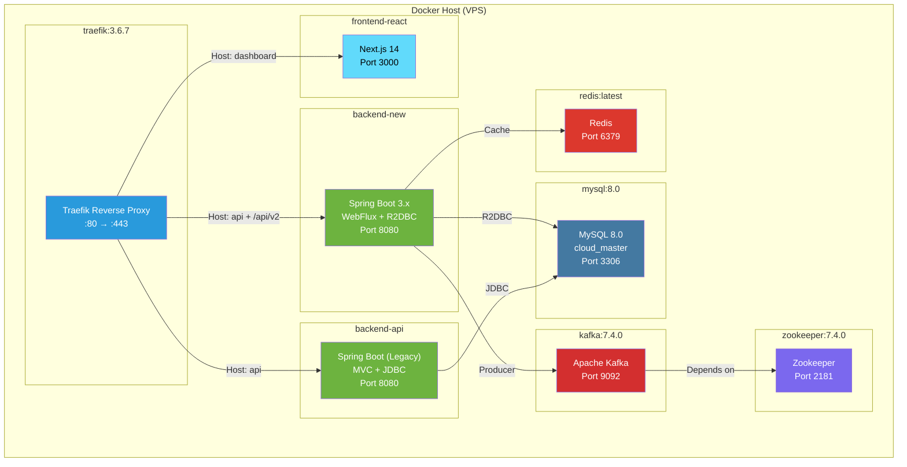

## 3. Component Diagram — Frontend

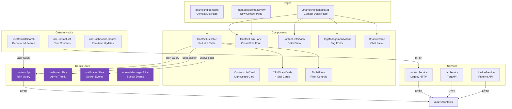

## 4. Component Diagram — Backend

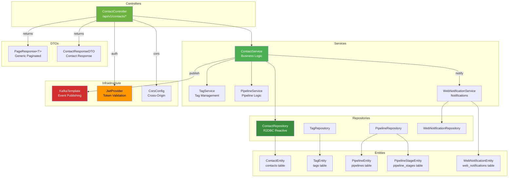

## 5. Sequence Diagram — Paginated List Load

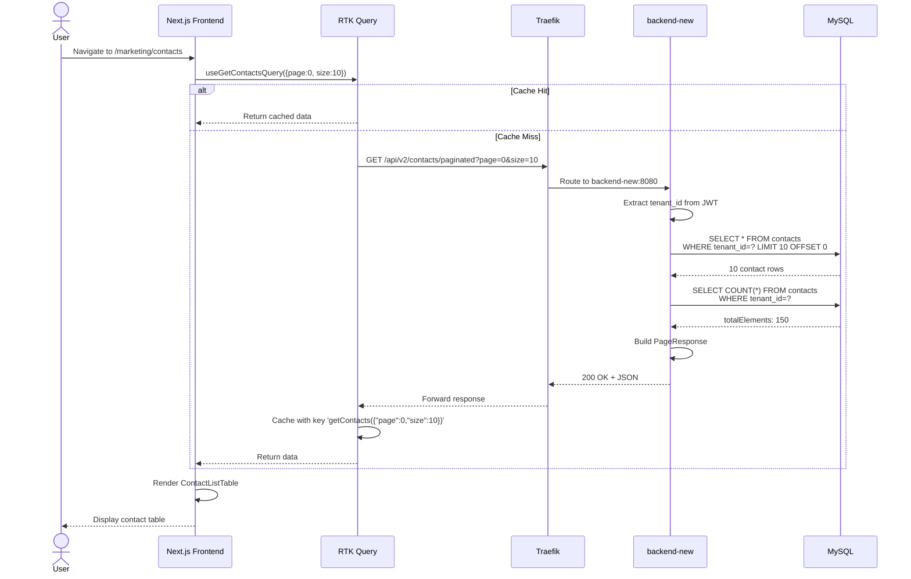

## 6. Sequence Diagram — Create Contact with Cache Invalidation

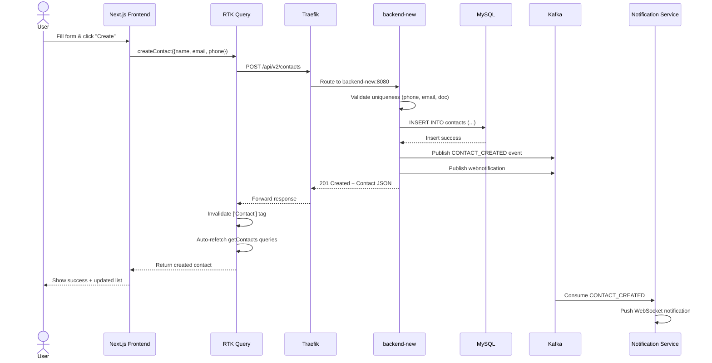

## 7. Sequence Diagram — Delete Contact with Cache Invalidation

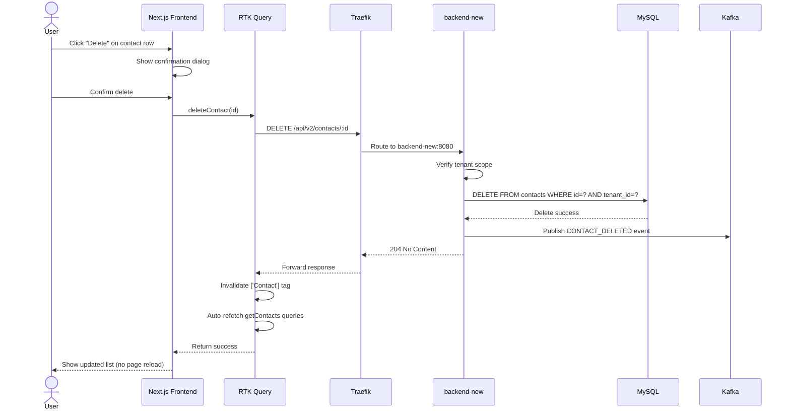

## 8. Sequence Diagram — Server-Side Filtering

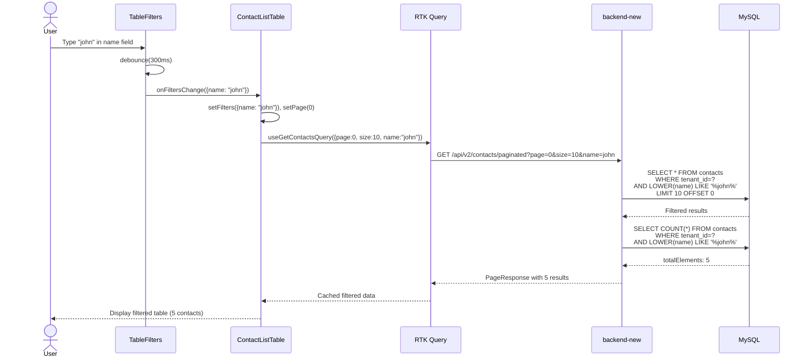

## 9. State Diagram — RTK Query Cache

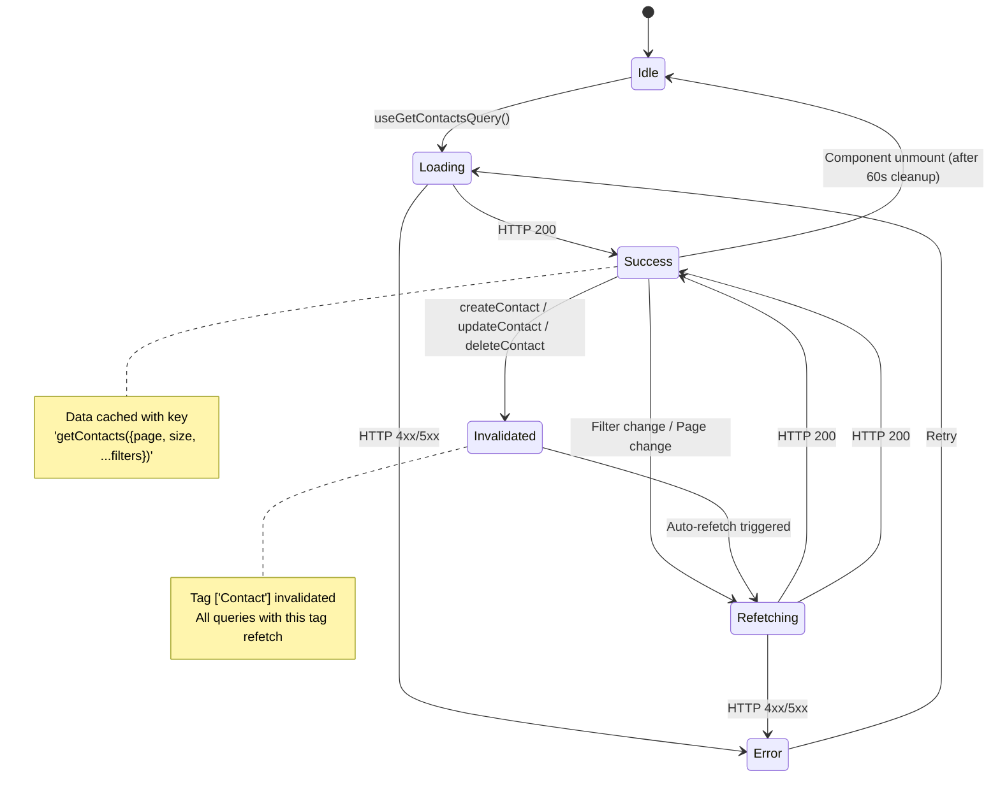

## 10. State Diagram — Contact Entity

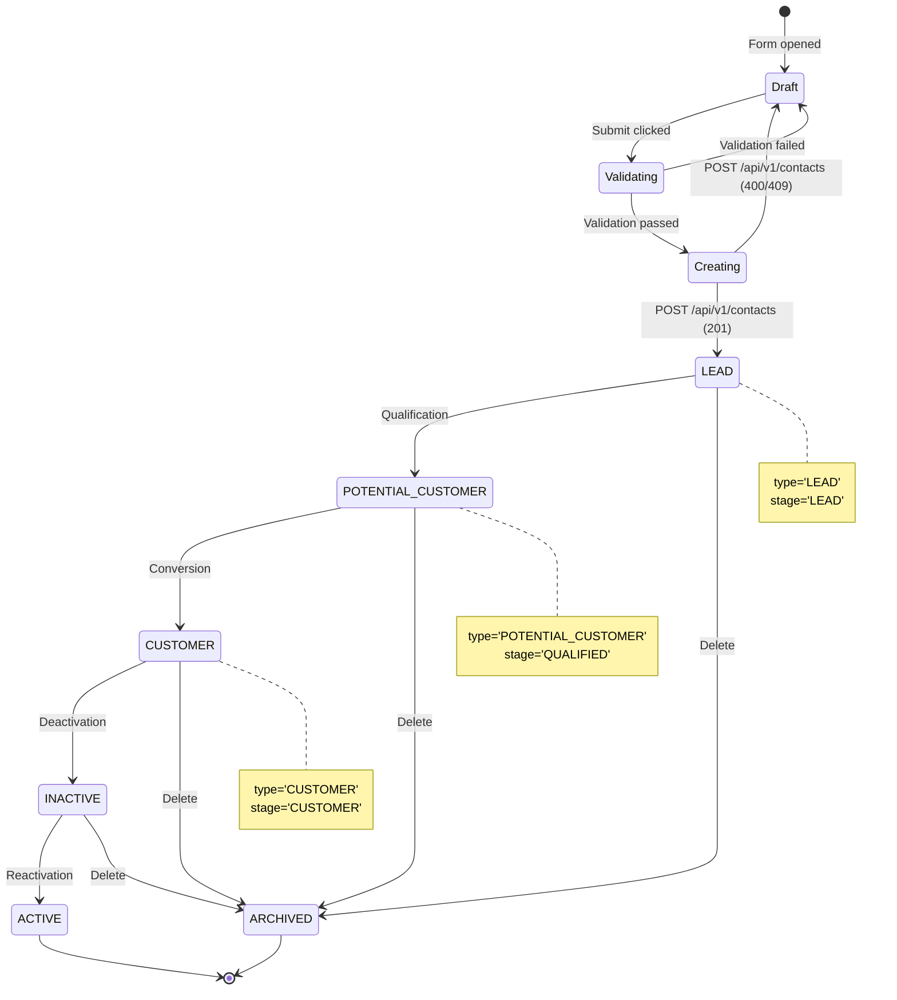

## 11. ER Diagram — Contact Relations

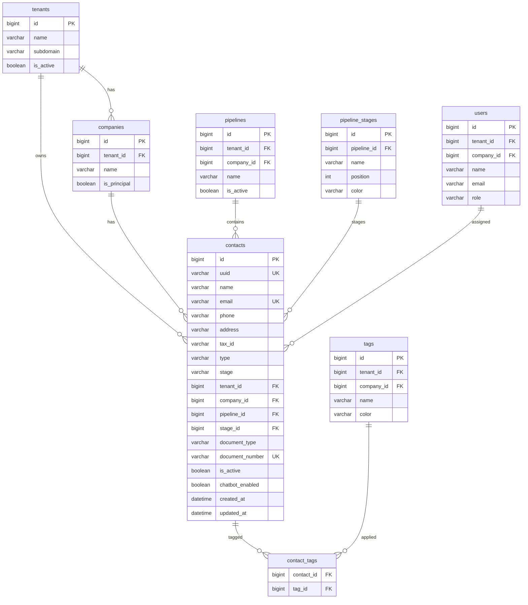

## 12. Deployment Diagram

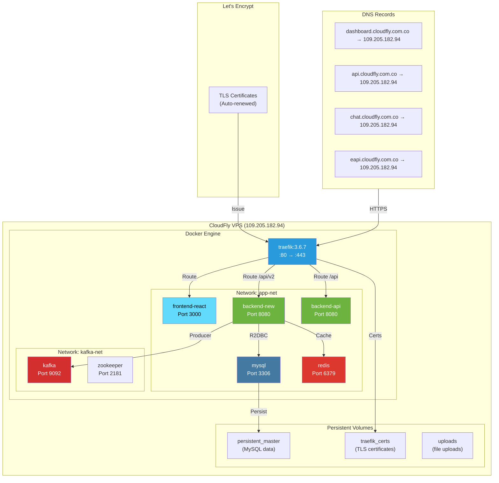

## 13. Cache Invalidation Flow

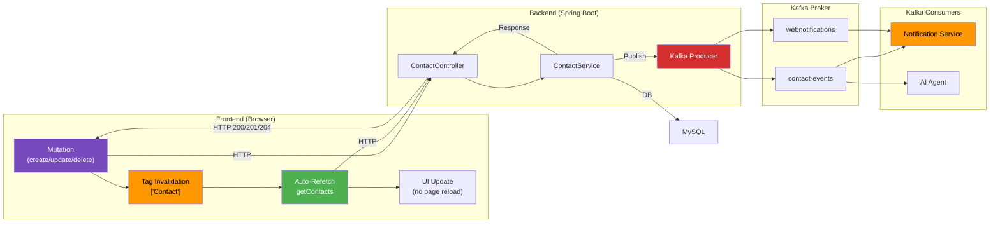

## 14. Authentication Flow

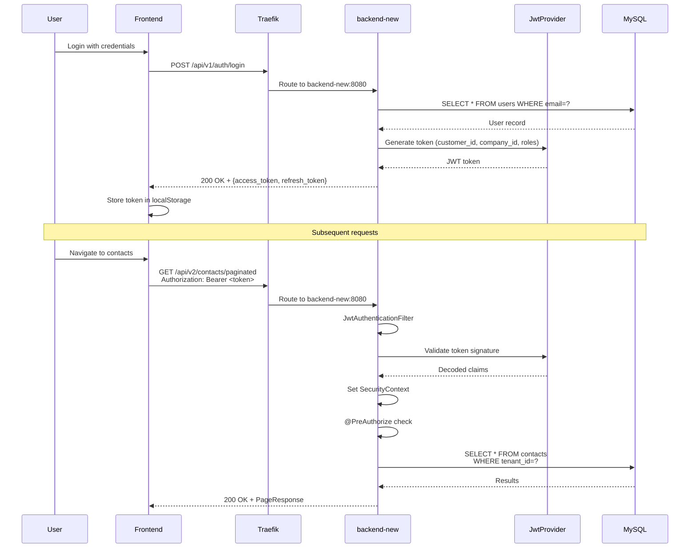

---

*Document generated by OWL — Technical Writer & Diagram Specialist*
*Date: 2025-01-20 | Ticket: CLOUD-271*
