# CLOUD-271: Refactorización de Contactos CRM — Technical Architecture

## Executive Summary

This document describes the complete technical architecture for the CRM contacts refactor (CLOUD-271). The implementation integrates the `backend_new` Spring Boot reactive application as a dedicated service, introduces server-side pagination and filtering, and establishes a Redux Toolkit Query (RTK Query) global state management pattern on the Next.js frontend.

**Key outcomes:**
- New `backend-new` Docker container serving `/api/v2/*` endpoints via Traefik
- Server-side paginated contact listing with multi-field filtering
- RTK Query API slice with automatic cache invalidation on mutations
- Two table components: full-featured MUI `ContactListTable` and lightweight `ContactsListTable`
- Real-time Kafka event publishing for cache invalidation and WebSocket notifications
- Predictive debounced search hook

---

## 1. System Architecture Overview

### 1.1 High-Level Component Diagram

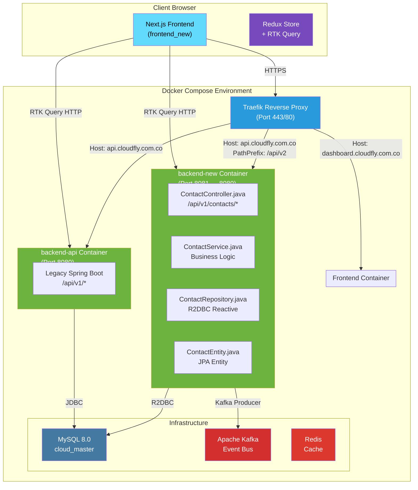

### 1.2 Request Flow Diagram

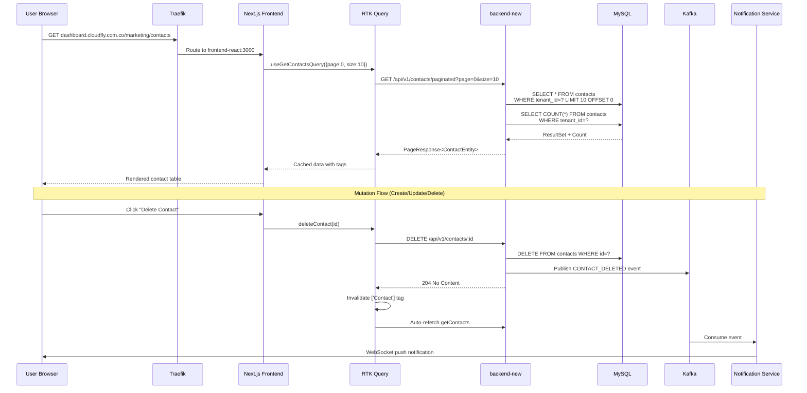

---

## 2. Infrastructure Configuration

### 2.1 Docker Compose — `backend-new` Service

The `backend-new` service is added to `docker-compose-full-vps.yml` with Traefik routing rules that prefix-match `/api/v2` on the `api.cloudfly.com.co` host, while the legacy `backend-api` continues serving all other paths.

```yaml
backend-new:
  build:
    context: ./backend_new
    dockerfile: Dockerfile
  container_name: backend-new
  ports:
    - "8081:8080"
  volumes:
    - ./uploads:/uploads
  env_file:
    - .env
  environment:
    - TZ=America/Bogota
    - DB_HOST=mysql
    - DB_PORT=3306
    - DB_DATABASE=cloud_master
    - DB_USERNAME=root
    - DB_PASSWORD=widowmaker
    - KAFKA_HOST=kafka
    - SPRING_PROFILES_ACTIVE=production
    - JWT_SECRET=${JWT_SECRET:-cloudfly-backend-new-secret-change-in-production}
    - EVOLUTION_API_URL=http://evolution-api:8080
    - EVOLUTION_API_KEY=${EVOLUTION_API_KEY:-CAMBIA_ESTA_LLAVE_LARGA_Y_UNICA}
  networks:
    - app-net
    - kafka-net
  depends_on:
    - db
    - kafka
  labels:
    - "traefik.enable=true"
    - "traefik.http.routers.backend-new.rule=Host(`api.cloudfly.com.co`) && PathPrefix(`/api/v2`)"
    - "traefik.http.routers.backend-new.entrypoints=websecure"
    - "traefik.http.routers.backend-new.tls=true"
    - "traefik.http.routers.backend-new.tls.certresolver=le"
    - "traefik.http.services.backend-new.loadbalancer.server.port=8080"
    - "traefik.docker.network=cloudfly_app-net"
```

### 2.2 Traefik Routing Matrix

| Host | Path Prefix | Target Container | Port |
|------|-------------|------------------|------|
| `dashboard.cloudfly.com.co` | `/` | `frontend-react` | 3000 |
| `api.cloudfly.com.co` | `/api/v2` | `backend-new` | 8080 |
| `api.cloudfly.com.co` | `/` | `backend-api` | 8080 |
| `chat.cloudfly.com.co` | `/` | `chat_socket` | 3001 |
| `eapi.cloudfly.com.co` | `/` | `evolution_api` | 8080 |
| `autobot.cloudfly.com.co` | `/` | `n8nserver.com` | 5678 |
| `calendar.cloudfly.com.co` | `/` | `scheduler-service` | 8080 |

---

## 3. Backend Architecture (backend_new)

### 3.1 Layer Diagram

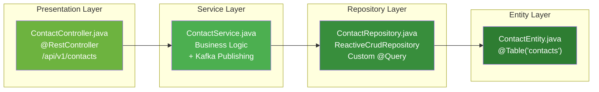

### 3.2 API Endpoints

| Method | Path | Description | Auth |
|--------|------|-------------|------|
| `GET` | `/api/v1/contacts` | Legacy: all contacts (non-paginated) | ADMIN, MANAGER, SUPERADMIN, USER |
| `GET` | `/api/v1/contacts/paginated` | **Primary**: paginated + filtered contacts | ADMIN, MANAGER, SUPERADMIN, USER |
| `GET` | `/api/v1/contacts/{id}` | Single contact by ID | ADMIN, MANAGER, SUPERADMIN, USER |
| `POST` | `/api/v1/contacts` | Create contact | ADMIN, MANAGER, SUPERADMIN |
| `PUT` | `/api/v1/contacts/{id}` | Update contact | ADMIN, MANAGER, SUPERADMIN |
| `DELETE` | `/api/v1/contacts/{id}` | Delete contact | ADMIN, MANAGER, SUPERADMIN |
| `GET` | `/api/v1/contacts/search?q={query}` | Search contacts | ADMIN, MANAGER, SUPERADMIN, USER |
| `GET` | `/api/v1/contacts/check-phone?phone={phone}` | Phone availability check | ADMIN, MANAGER, SUPERADMIN, USER |
| `GET` | `/api/v1/contacts/check-email?email={email}` | Email availability check | ADMIN, MANAGER, SUPERADMIN, USER |
| `GET` | `/api/v1/contacts/check-document?documentNumber={doc}` | Document availability check | ADMIN, MANAGER, SUPERADMIN, USER |
| `PATCH` | `/api/v1/contacts/{id}/chatbot` | Toggle chatbot enabled | ADMIN, MANAGER, SUPERADMIN, USER |

### 3.3 Paginated Endpoint — Request/Response

**Request:**
```
GET /api/v1/contacts/paginated?page=0&size=20&name=john&email=gmail&phone=300&identification=123456
Headers:
  Authorization: Bearer <jwt_token>
  x-tenant-id: <optional_admin_override>
  x-company-id: <optional_admin_override>
```

**Response (200 OK):**
```json
{
  "data": [
    {
      "id": 1,
      "uuid": "550e8400-e29b-41d4-a716-446655440000",
      "name": "John Doe",
      "email": "john@gmail.com",
      "phone": "3001234567",
      "address": "Calle 123",
      "taxId": "900123456",
      "type": "LEAD",
      "stage": "LEAD",
      "pipelineId": 1,
      "stageId": 1,
      "documentType": "CC",
      "documentNumber": "123456789",
      "isActive": true,
      "chatbotEnabled": false,
      "assignedUserIds": "1,2,3",
      "createdAt": "2025-01-15T10:30:00",
      "updatedAt": "2025-01-20T14:45:00"
    }
  ],
  "totalElements": 150,
  "totalPages": 8,
  "currentPage": 0,
  "pageSize": 20
}
```

### 3.4 Database Schema — `contacts` Table

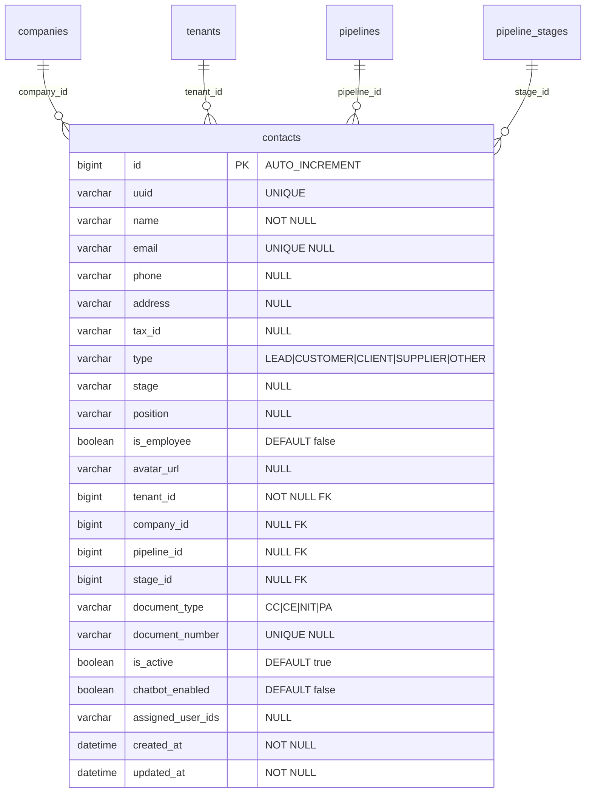

### 3.5 R2DBC Filtered Paginated Query

```sql
-- findFilteredPaginated
SELECT * FROM contacts
WHERE tenant_id = :tenantId
  AND (:companyId IS NULL OR company_id = :companyId)
  AND (:name IS NULL OR LOWER(name) LIKE LOWER(CONCAT('%', :name, '%')))
  AND (:email IS NULL OR LOWER(email) LIKE LOWER(CONCAT('%', :email, '%')))
  AND (:phone IS NULL OR phone LIKE CONCAT('%', :phone, '%'))
  AND (:identification IS NULL OR document_number LIKE CONCAT('%', :identification, '%'))
ORDER BY created_at DESC
LIMIT :limit OFFSET :offset;

-- countFiltered
SELECT COUNT(*) FROM contacts
WHERE tenant_id = :tenantId
  AND (:companyId IS NULL OR company_id = :companyId)
  AND (:name IS NULL OR LOWER(name) LIKE LOWER(CONCAT('%', :name, '%')))
  AND (:email IS NULL OR LOWER(email) LIKE LOWER(CONCAT('%', :email, '%')))
  AND (:phone IS NULL OR phone LIKE CONCAT('%', :phone, '%'))
  AND (:identification IS NULL OR document_number LIKE CONCAT('%', :identification, '%'));
```

### 3.6 Kafka Event Publishing

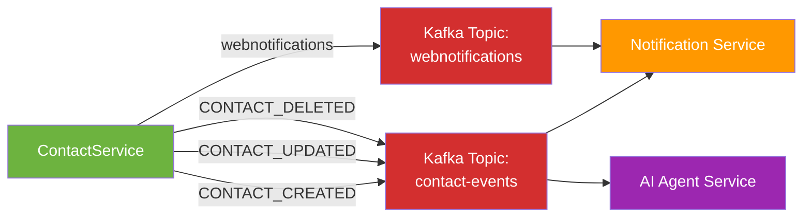

**Event payload (contact-events topic):**
```json
{
  "action": "CONTACT_CREATED",
  "contactId": 1,
  "tenantId": 1,
  "companyId": 1,
  "timestamp": 1705312200000
}
```

---

## 4. Frontend Architecture (frontend_new)

### 4.1 Redux Store Architecture

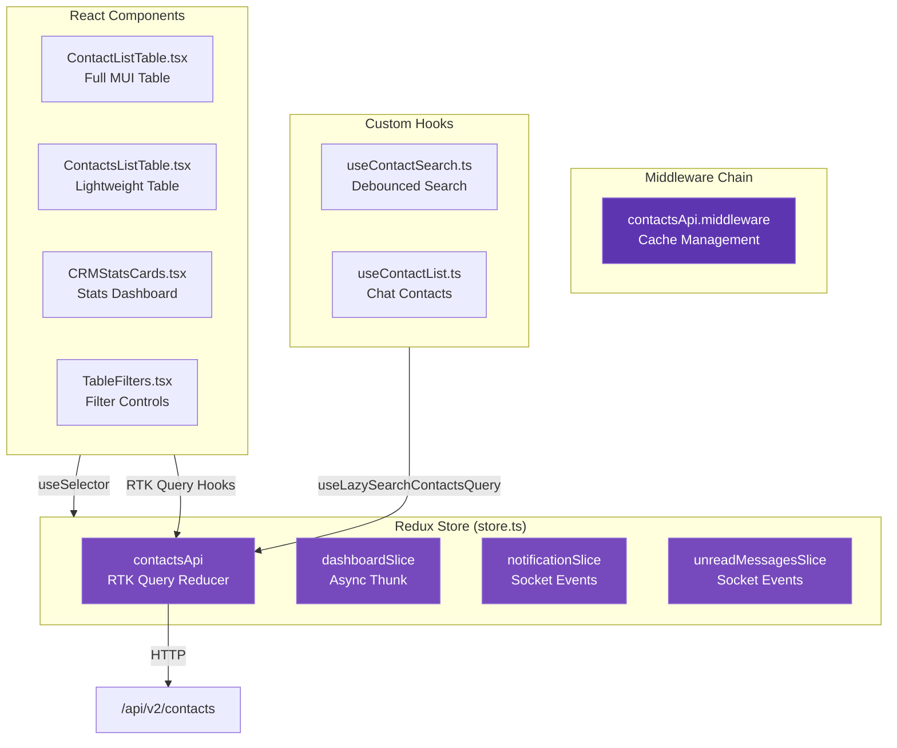

### 4.2 RTK Query API Slice — Cache Invalidation Strategy

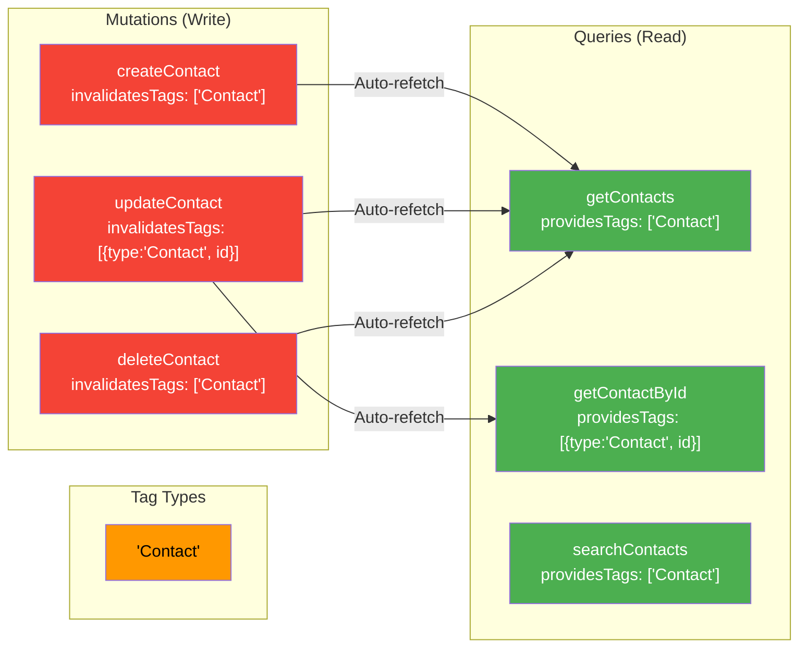

### 4.3 Type System

```typescript
// Contact entity from API
interface Contact {
  id: number;
  uuid?: string;
  name: string;
  email?: string;
  phone?: string;
  address?: string;
  taxId?: string;
  type: string;           // LEAD | POTENTIAL_CUSTOMER | CUSTOMER | CLIENT | SUPPLIER | OTHER
  stage: string;
  avatarUrl?: string;
  tenantId: number;
  companyId: number;
  pipelineId?: number;
  stageId?: number;
  documentType?: string;  // CC | CE | NIT | PA
  documentNumber?: string;
  isActive: boolean;
  chatbotEnabled: boolean;
  assignedUserIds?: string;
  tags?: Tag[];
  createdAt: string;
  updatedAt: string;
  createdBy?: string;
}

// Request body for create/update
interface ContactCreateRequest {
  name: string;
  email?: string;
  phone?: string;
  address?: string;
  taxId?: string;
  type: string;
  stage?: string;
  pipelineId?: number;
  stageId?: number;
  documentType?: string;
  documentNumber?: string;
  isActive?: boolean;
  assignedUserIds?: string;
  tenantId?: number;
  companyId?: number;
  tagIds?: number[];
}

// Server-side filter parameters
interface ContactFilters {
  name?: string;
  email?: string;
  phone?: string;
  identification?: string;
}

// Generic paginated response wrapper
interface PaginatedResponse<T> {
  data: T[];
  totalElements: number;
  totalPages: number;
  currentPage: number;
  pageSize: number;
}
```

### 4.4 Component Hierarchy

```
ContactListTable (Full MUI)
├── CRMStatsCards (4 stat cards)
│   ├── Total & Active Status (circular progress)
│   ├── Data Quality Index (circular progress)
│   ├── Segment Distribution (stacked bar)
│   └── Channel Coverage (linear progress)
├── TableFilters (debounced inputs)
│   ├── Name search
│   ├── Email search
│   ├── Phone search
│   ├── Identification search
│   ├── Status dropdown
│   ├── Pipeline dropdown
│   ├── Stage dropdown (cascaded from pipeline)
│   └── Clear filters button
├── MUI Table
│   ├── Contact column (avatar + name + email)
│   ├── Identification column
│   ├── Pipeline/Stage column
│   ├── Tags column (chips)
│   ├── Type column (chip)
│   ├── Status column (active/inactive chip)
│   ├── Last Activity column
│   └── Actions column (edit + delete)
└── TablePagination (server-side)

ContactsListTable (Lightweight Tailwind)
├── Filter inputs (4 fields)
├── HTML Table
└── Pagination controls
```

### 4.5 Data Flow — Server-Side Pagination

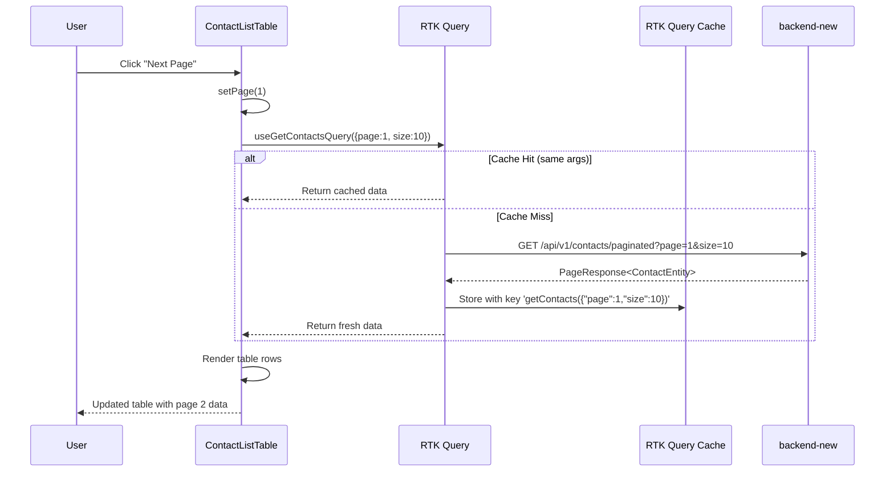

### 4.6 Data Flow — Server-Side Filtering

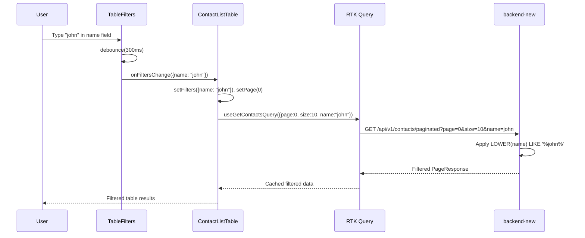

---

## 5. Cache Invalidation Architecture

### 5.1 Multi-Layer Cache Strategy

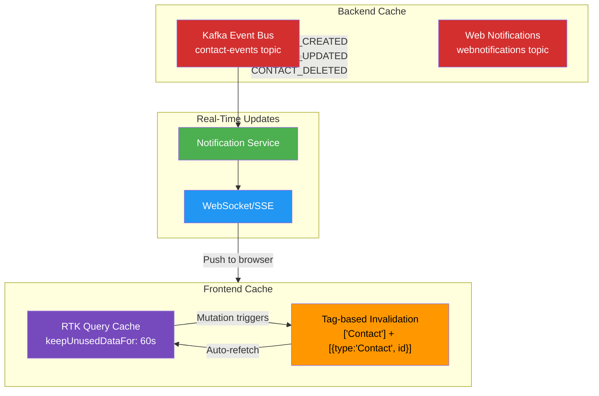

### 5.2 Cache Invalidation Rules

| Mutation | Tags Invalidated | Refetch Triggered |
|----------|------------------|-------------------|
| `createContact` | `['Contact']` | `getContacts` (all pages) |
| `updateContact` | `[{type:'Contact', id}, 'Contact']` | `getContactById(id)` + `getContacts` |
| `deleteContact` | `['Contact']` | `getContacts` (all pages) |

---

## 6. Security Architecture

### 6.1 Authentication Flow

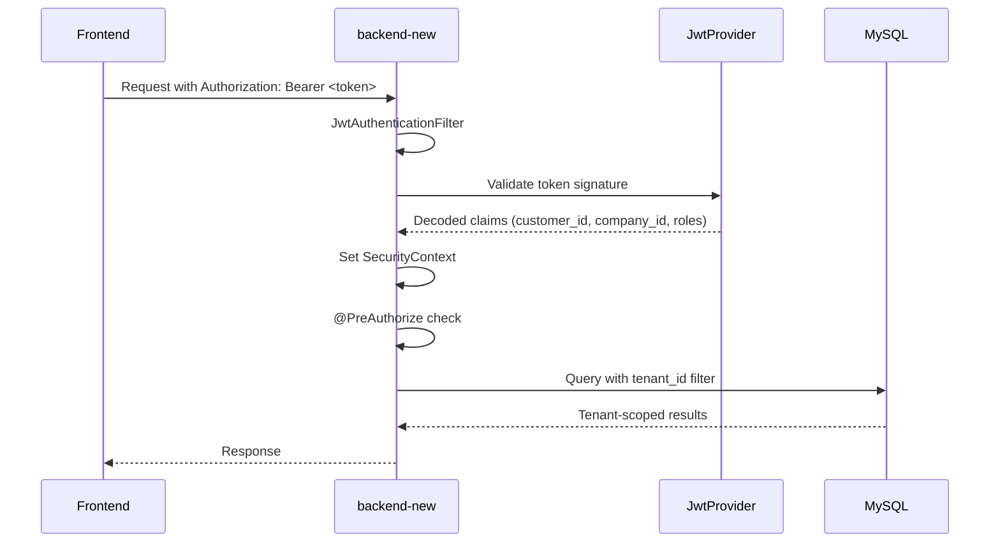

### 6.2 Multi-Tenant Isolation

All contact queries enforce tenant isolation at the database level:

```sql
WHERE tenant_id = :tenantId
  AND (:companyId IS NULL OR companyId = :companyId)
```

Admin/Manager users can override tenant/company via `x-tenant-id` and `x-company-id` headers.

---

## 7. File Inventory

### 7.1 Backend Files (backend_new)

| File | Path | Status |
|------|------|--------|
| `ContactController.java` | `controllers/` | Modified — added `/paginated` endpoint |
| `ContactService.java` | `persistence/services/` | Modified — added `findFilteredPaginated()` + Kafka events |
| `ContactRepository.java` | `persistence/repository/` | Modified — added `findFilteredPaginated()` + `countFiltered()` |
| `ContactEntity.java` | `persistence/entity/` | Existing — no changes needed |
| `PageResponse.java` | `dto/` | Created — generic paginated response DTO |
| `ContactResponseDTO.java` | `dto/` | Created — contact response DTO |

### 7.2 Frontend Files (frontend_new)

| File | Path | Status |
|------|------|--------|
| `contactsApi.ts` | `redux/api/` | Created — RTK Query API slice |
| `store.ts` | `redux/` | Modified — added contactsApi reducer/middleware |
| `contactTypes.ts` | `types/marketing/` | Modified — added `PaginatedResponse<T>`, `ContactFilters` |
| `ContactListTable.tsx` | `views/marketing/contacts/List/` | Created — full MUI table component |
| `ContactsListTable.tsx` | `views/marketing/contacts/List/` | Created — lightweight Tailwind table |
| `CRMStatsCards.tsx` | `views/marketing/contacts/List/` | Created — 4 stat cards |
| `TableFilters.tsx` | `views/marketing/contacts/List/` | Created — debounced filter controls |
| `useContactSearch.ts` | `hooks/` | Created — debounced search hook |
| `dashboardSlice.ts` | `redux/slices/` | Existing — typed selectors added |

### 7.3 Infrastructure Files

| File | Path | Status |
|------|------|--------|
| `docker-compose-full-vps.yml` | Root | Modified — added `backend-new` service |

---

## 8. Deployment Checklist

- [ ] `docker-compose up backend-new` starts without errors
- [ ] `GET /api/v1/contacts/paginated?page=0&size=20` returns paginated results
- [ ] `GET /api/v1/contacts/paginated?name=john` filters server-side
- [ ] `POST /api/v1/contacts` publishes Kafka event + invalidates RTK cache
- [ ] `DELETE /api/v1/contacts/:id` publishes Kafka event + invalidates RTK cache
- [ ] Frontend table shows loading spinner during fetch
- [ ] Pagination controls work (next/prev/page numbers)
- [ ] Debounced search triggers after 300ms of inactivity
- [ ] Dashboard contact counter updates after create/delete without page reload
- [ ] Traefik routes `api.cloudfly.com.co/api/v2/*` to `backend-new:8080`
- [ ] JWT authentication works for all endpoints
- [ ] Multi-tenant isolation enforced (tenant_id filter)

---

## 9. Risk Mitigation

| Risk | Mitigation |
|------|------------|
| Dual backend coexistence | Traefik path prefix routing: `/api/v1/*` → legacy, `/api/v2/*` → new |
| Database sharing | Both backends connect to same MySQL `cloud_master` — no migration needed |
| Cache staleness | RTK Query `keepUnusedDataFor: 60` + tag-based invalidation |
| Gradual rollout | Frontend can switch endpoints incrementally via feature flags |
| Kafka unavailability | Backend gracefully handles Kafka publish failures (logged, not blocking) |
| JWT secret mismatch | Both backends share the same `JWT_SECRET` environment variable |

---

*Document generated by OWL — Technical Writer & Diagram Specialist*
*Date: 2025-01-20 | Ticket: CLOUD-271*
