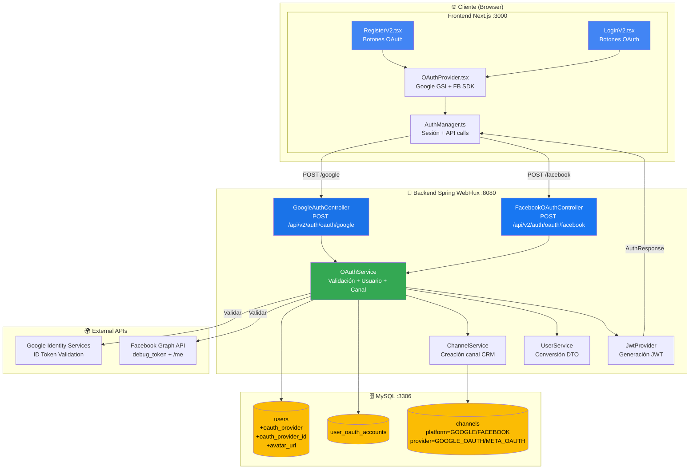
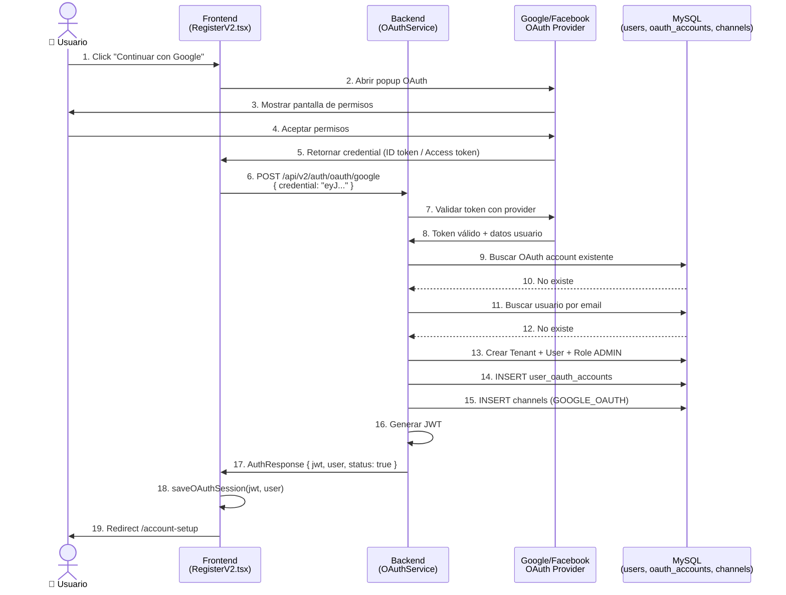
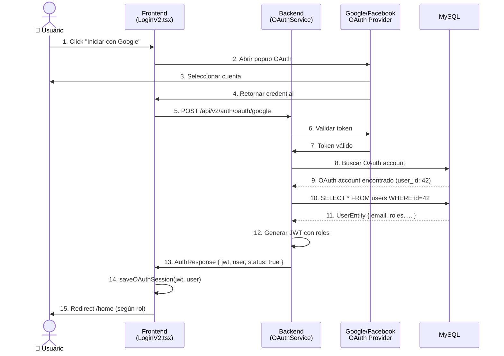
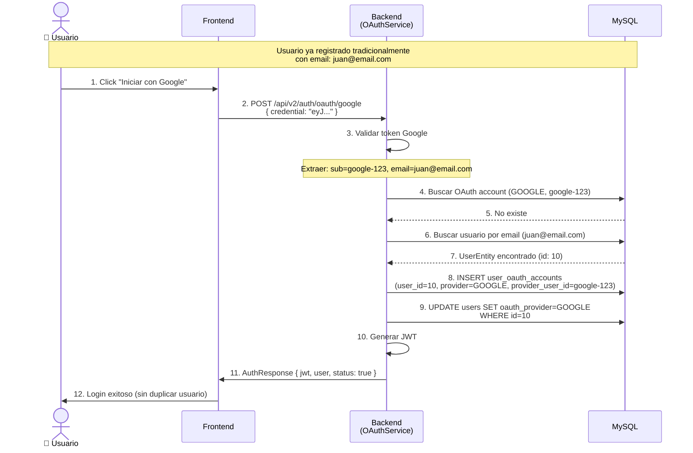
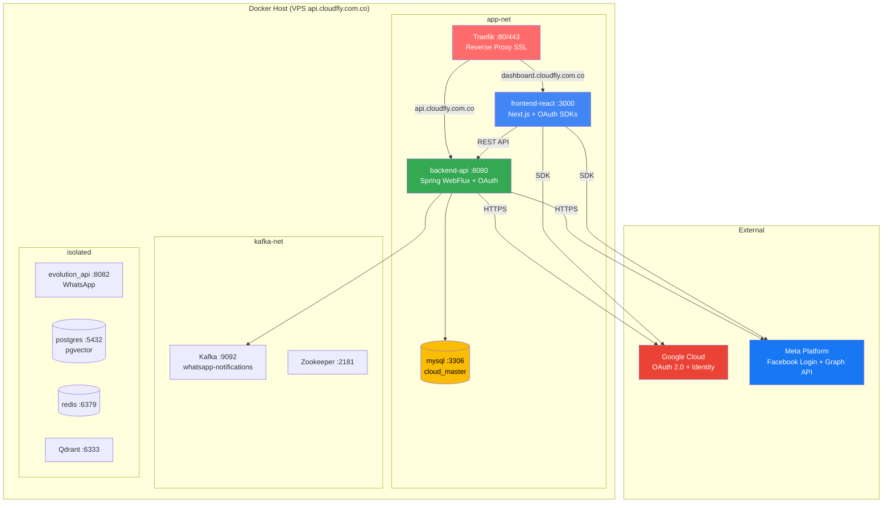
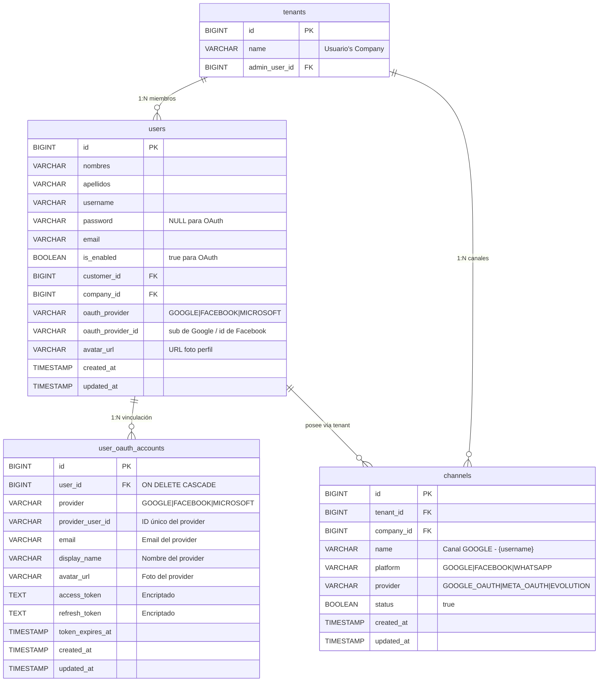
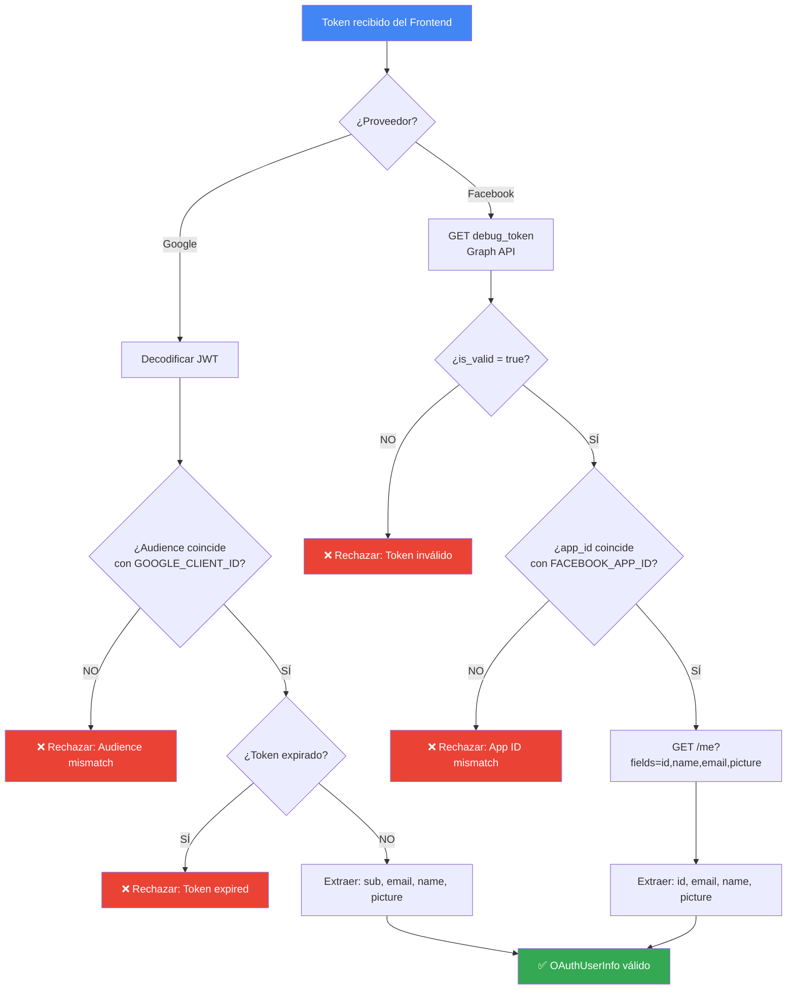
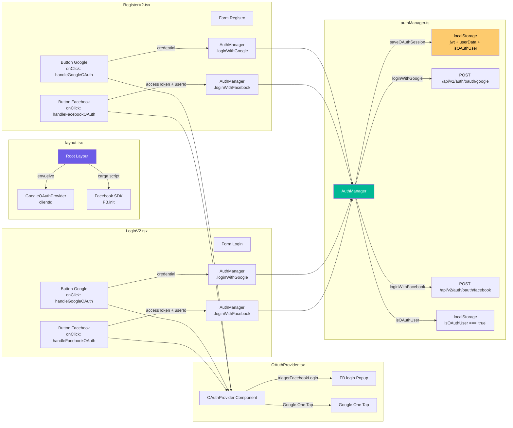

# CLOUD-277: Architecture Diagrams — Social Login OAuth + CRM Channel

## 📐 Diagrama de Componentes

## 🔄 Flujo de Registro OAuth (Nuevo Usuario)

## 🔄 Flujo de Login OAuth (Usuario Existente)

## 🔄 Flujo de Vinculación (Email Existente)

## 🏗️ Arquitectura de Despliegue (Docker)

## 📊 Modelo de Datos — Tablas Afectadas

## 🔐 Flujo de Seguridad — Validación de Tokens

## 📱 Integración Frontend — Componentes

---

*Diagramas generados por 🤖 **Technical Writer** — CloudFly AI Scrum Team*  
*Última actualización: 2026-06-03*
