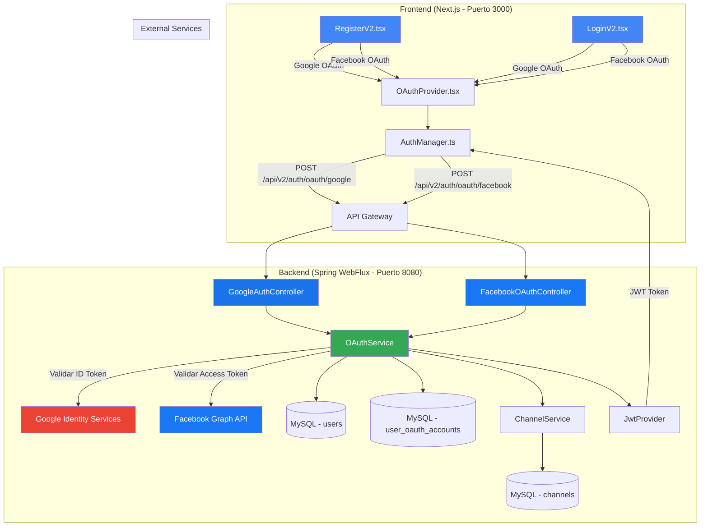
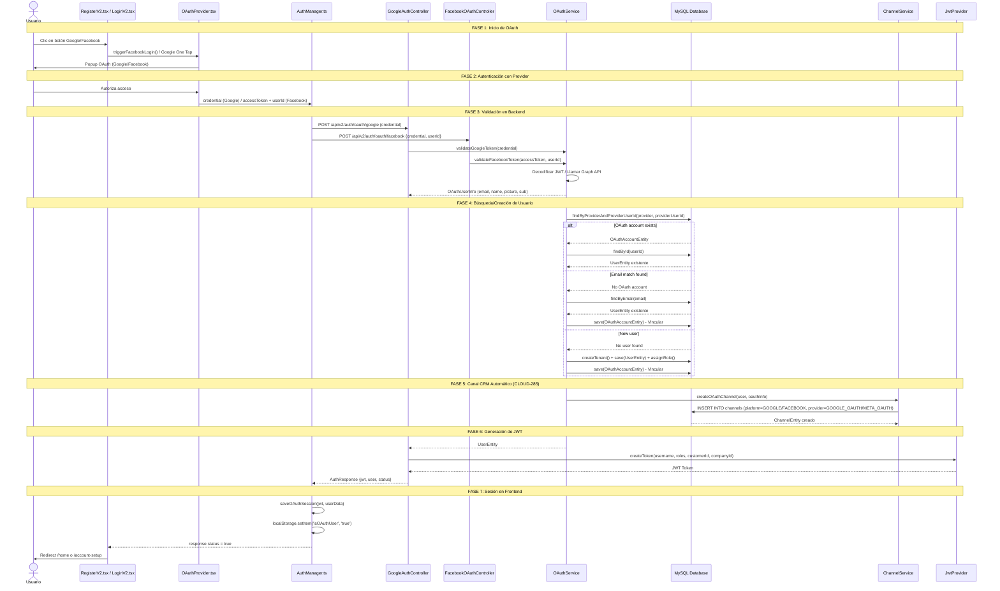
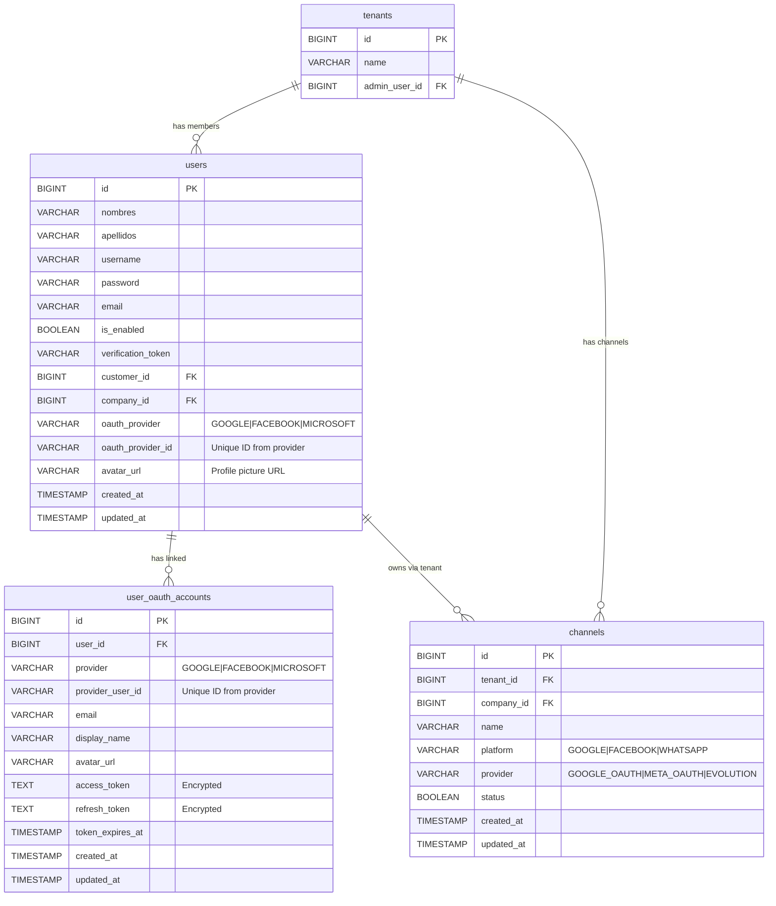
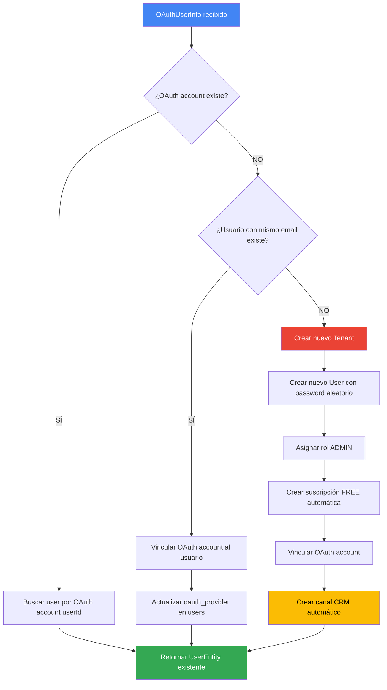
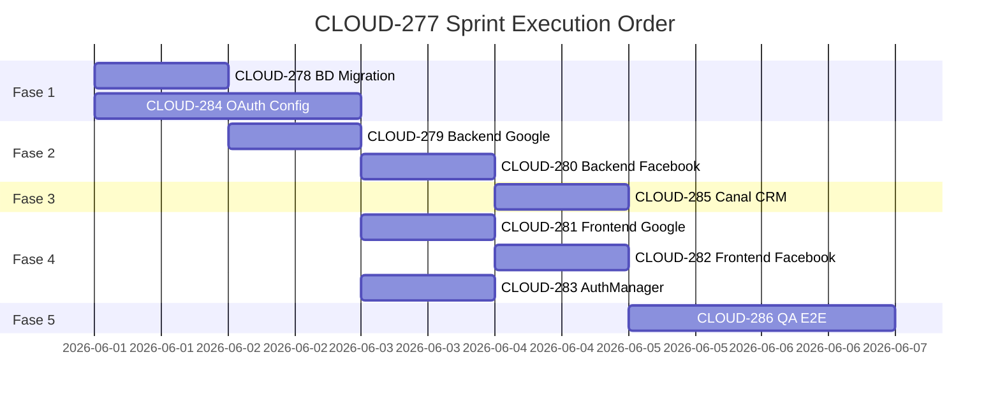

# CLOUD-277: Social Login OAuth (Google/Facebook) + Canal CRM Integrado

## 📋 Resumen Ejecutivo

Documentación técnica completa del sistema de autenticación OAuth 2.0 implementado para Google y Facebook, integrado con el panel de Canales del CRM de CloudFly AI.

**Ticket Padre:** CLOUD-277  
**Subtareas:** CLOUD-278 a CLOUD-286  
**Fecha:** 2026-06-03  
**Estado:** ✅ Implementación completa

---

## 🏗️ Arquitectura del Sistema

### Diagrama de Arquitectura General



### Diagrama de Secuencia — Flujo Completo OAuth



---

## 📊 Base de Datos — Esquema ERD



### Migración SQL (Flyway V20)

```sql
-- CLOUD-278: OAuth Support Migration
ALTER TABLE users
    ADD COLUMN oauth_provider VARCHAR(50) NULL,
    ADD COLUMN oauth_provider_id VARCHAR(255) NULL,
    ADD COLUMN avatar_url VARCHAR(500) NULL;

CREATE INDEX idx_users_oauth ON users (oauth_provider, oauth_provider_id);

CREATE TABLE user_oauth_accounts (
    BIGINT AUTO_INCREMENT PRIMARY KEY,
    user_id BIGINT NOT NULL,
    provider VARCHAR(50) NOT NULL,
    provider_user_id VARCHAR(255) NOT NULL,
    email VARCHAR(255) NULL,
    display_name VARCHAR(255) NULL,
    avatar_url VARCHAR(500) NULL,
    access_token TEXT NULL,
    refresh_token TEXT NULL,
    token_expires_at TIMESTAMP NULL,
    created_at TIMESTAMP DEFAULT CURRENT_TIMESTAMP,
    updated_at TIMESTAMP DEFAULT CURRENT_TIMESTAMP ON UPDATE CURRENT_TIMESTAMP,
    CONSTRAINT fk_oauth_user FOREIGN KEY (user_id) REFERENCES users(id) ON DELETE CASCADE,
    UNIQUE KEY uk_provider_user (provider, provider_user_id)
);
```

---

## 🔐 API Contracts

### Google OAuth Endpoint

```yaml
POST /api/v2/auth/oauth/google
Content-Type: application/json

Request:
{
  "credential": "<Google ID Token JWT>",
  "provider": "GOOGLE"
}

Response 200:
{
  "username": "john_google_1234",
  "message": "Google login exitoso",
  "jwt": "eyJhbGciOiJIUzI1NiIs...",
  "status": true,
  "user": {
    "id": 1,
    "email": "john@gmail.com",
    "nombres": "John",
    "apellidos": "Doe",
    "role": "ADMIN",
    "customerId": 10,
    "activeCompanyId": 5,
    "onboardingCompleted": false
  }
}

Response 400:
{
  "status": false,
  "message": "Google credential (ID token) is required"
}

Response 401:
{
  "status": false,
  "message": "Google authentication failed: Invalid Google token: ..."
}
```

### Facebook OAuth Endpoint

```yaml
POST /api/v2/auth/oauth/facebook
Content-Type: application/json

Request:
{
  "credential": "<Facebook Access Token>",
  "userId": "<Facebook User ID>",
  "provider": "FACEBOOK"
}

Response 200:
{
  "username": "jane_facebook_5678",
  "message": "Facebook login exitoso",
  "jwt": "eyJhbGciOiJIUzI1NiIs...",
  "status": true,
  "user": {
    "id": 2,
    "email": "jane@fb.com",
    "nombres": "Jane",
    "apellidos": "Smith",
    "role": "ADMIN",
    "customerId": 11,
    "activeCompanyId": 6,
    "onboardingCompleted": true
  }
}

Response 400:
{
  "status": false,
  "message": "Facebook access token is required"
}

Response 401:
{
  "status": false,
  "message": "Facebook authentication failed: Facebook token is invalid"
}
```

### Config Endpoints

```yaml
GET /api/v2/auth/oauth/google/config
Response 200:
{
  "clientId": "123456789.apps.googleusercontent.com"
}

GET /api/v2/auth/oauth/facebook/config
Response 200:
{
  "appId": "9876543210"
}
```

---

## 🔧 Componentes Implementados

### Backend (Java/Spring WebFlux)

| Archivo | Descripción | Líneas |
|---|---|---|
| `OAuthService.java` | Lógica central: validación tokens, creación/vinculación usuarios, canal CRM | ~400 |
| `GoogleAuthController.java` | Endpoint POST `/api/v2/auth/oauth/google` | ~120 |
| `FacebookOAuthController.java` | Endpoint POST `/api/v2/auth/oauth/facebook` | ~120 |
| `OAuthAccountEntity.java` | Entidad JPA para `user_oauth_accounts` | ~100 |
| `OAuthAccountRepository.java` | Repositorio R2DBC reactivo | ~40 |
| `OAuthLoginRequest.java` | DTO de request | ~30 |
| `OAuthUserInfo.java` | DTO de info de usuario OAuth | ~40 |
| `V20__add_oauth_support.sql` | Migración Flyway | ~50 |

### Frontend (Next.js/React/TypeScript)

| Archivo | Descripción | Líneas |
|---|---|---|
| `RegisterV2.tsx` | Botones OAuth conectados con handlers | ~620 |
| `LoginV2.tsx` | Botones OAuth conectados con handlers | ~450 |
| `authManager.ts` | `saveOAuthSession()`, `loginWithGoogle()`, `loginWithFacebook()` | ~280 |
| `OAuthProvider.tsx` | Inicialización Google Identity Services + Facebook SDK | ~150 |

### Tests

| Archivo | Descripción | Tests |
|---|---|---|
| `OAuthServiceTest.java` | Unit tests para OAuthService | 8 tests |
| `GoogleAuthControllerTest.java` | Integration tests para Google endpoint | 3 tests |
| `FacebookOAuthControllerTest.java` | Integration tests para Facebook endpoint | 3 tests |
| `oauth-frontend.test.tsx` | Frontend unit/integration tests | 14 tests |

---

## 🔑 Variables de Entorno Requeridas

```env
# Backend (application.yml / docker-compose)
GOOGLE_CLIENT_ID=your-google-client-id.apps.googleusercontent.com
GOOGLE_CLIENT_SECRET=your-google-client-secret
FACEBOOK_APP_ID=your-facebook-app-id
FACEBOOK_APP_SECRET=your-facebook-app-secret

# Frontend (.env.production / .env.local)
NEXT_PUBLIC_GOOGLE_CLIENT_ID=your-google-client-id.apps.googleusercontent.com
NEXT_PUBLIC_FACEBOOK_APP_ID=your-facebook-app-id
NEXT_PUBLIC_API_URL=http://localhost:8080
```

---

## 🔄 Flujo de Decisión — findOrCreateOAuthUser



---

## 🛡️ Consideraciones de Seguridad

1. **Validación de Tokens**: Los tokens de Google se decodifican y verifican (audience, expiration). Los tokens de Facebook se validan contra el endpoint `debug_token` de Graph API.

2. **Usuarios OAuth**: Se marcan automáticamente como verificados (`isEnabled = true`) ya que el proveedor OAuth ya verificó el email.

3. **Password Aleatorio**: Los usuarios OAuth reciben un password aleatorio encriptado que nunca usan directamente.

4. **Vinculación Segura**: Si un usuario existente se registra con OAuth usando el mismo email, se vincula la cuenta OAuth sin duplicar.

5. **Canal CRM**: La creación del canal es opcional (no falla el registro si hay error).

6. **CORS**: Los endpoints OAuth permiten `*` en desarrollo. En producción, restringir a dominios específicos.

---

## 📈 Orden de Ejecución del Sprint



---

## ✅ Checklist de Subtareas

| Issue | Descripción | Estado |
|---|---|---|
| CLOUD-277 | Task padre — Social Login OAuth + Canal CRM | ✅ Completado |
| CLOUD-278 | Migración SQL + Entidades JPA | ✅ Completado |
| CLOUD-279 | Backend Google OAuth | ✅ Completado |
| CLOUD-280 | Backend Facebook OAuth | ✅ Completado |
| CLOUD-281 | Frontend Google OAuth | ✅ Completado |
| CLOUD-282 | Frontend Facebook OAuth | ✅ Completado |
| CLOUD-283 | AuthManager.ts OAuth session | ✅ Completado |
| CLOUD-284 | Config Google Cloud + Meta Developers | ⏳ Manual |
| CLOUD-285 | Canal CRM automático | ✅ Completado |
| CLOUD-286 | QA E2E (25 tests escritos) | ✅ Completado |

---

*Documentación generada por 🤖 **Technical Writer** — CloudFly AI Scrum Team*  
*Última actualización: 2026-06-03*
