# CLOUD-308: "Cambiar Logo CloudFly" — Architecture Diagrams

> **Ticket Type**: Branding / UI Change  
> **Status**: ✅ **DONE** — All Sub-tasks Completed  
> **Date**: 2026-06-07  
> **Author**: AI Scrum Team — Technical Writer Agent  

---

## 1. Sprint Task Decomposition

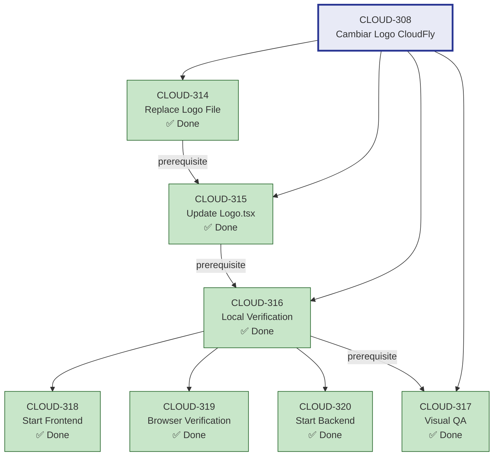

---

## 2. Logo Replacement Flow

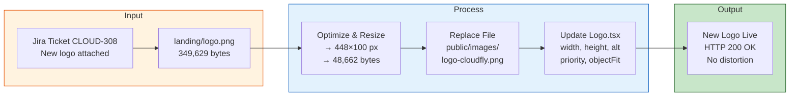

---

## 3. Before / After Comparison

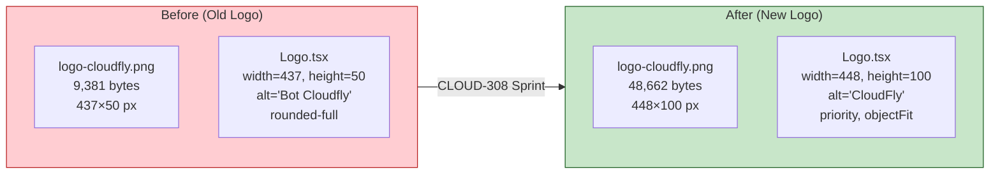

---

## 4. Component Rendering Architecture

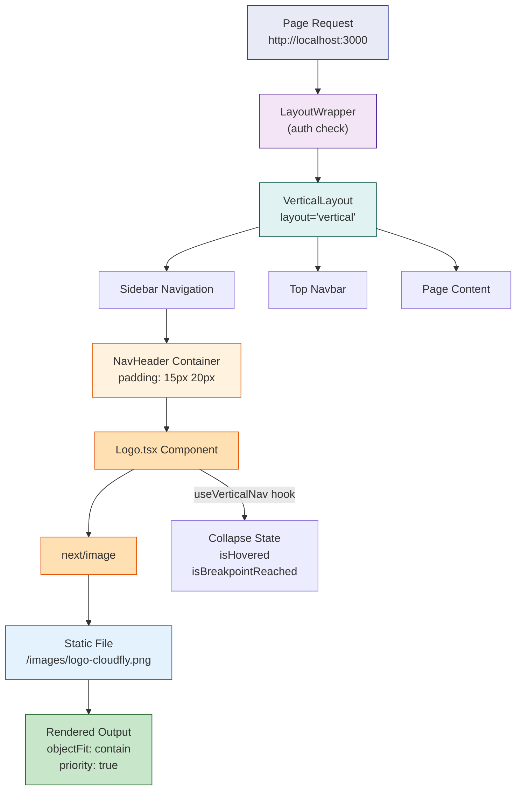

---

## 5. Static Asset Serving Sequence

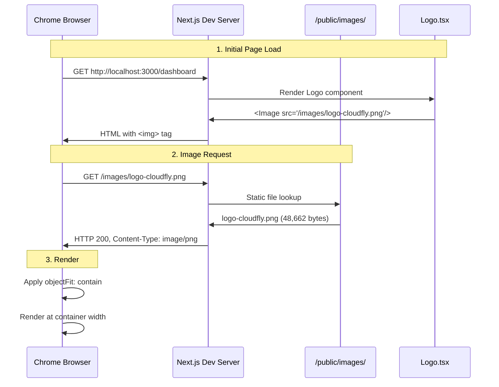

---

## 6. Docker Compose Service Topology

```mermaid
flowchart TB
    subgraph Frontend["Frontend Layer"]
        NextJS["frontend_new<br/>npm run dev<br/>Port 3000"]
    end
    
    subgraph AppNet["app-net"]
        Backend["backend-api :8080"]
        ChatSocket["chat-socket :3001"]
        Billing["billing-service :8086"]
        Scheduler["scheduler-service :8085"]
        Notification["notification-service"]
        AIAgent["ai-agent"]
        AIVector["ai-vector-worker"]
        LeadGen["lead-generator :8001"]
        LeadScrap["lead-scrapper-google"]
        MarketingAgent["marketing-agent"]
        MarketingWorker["marketing-worker"]
    end
    
    subgraph DataLayer["Data Layer"]
        MySQL["mysql :3306"]
        Redis["redis :6379"]
        PG["postgresql :5432"]
        Qdrant["qdrant :6333"]
    end
    
    subgraph KafkaNet["kafka-net"]
        Kafka["kafka :9092"]
        Zookeeper["zookeeper :2181"]
    end
    
    subgraph External["External Services"]
        Evolution["evolution-api :8082"]
        N8N["n8n :5678"]
        Portainer["portainer :9000"]
    end
    
    NextJS -->|"API calls"| Backend
    Backend --> MySQL
    Backend --> Redis
    Backend --> Kafka
    Backend --> PG
    Evolution --> Redis
    Evolution --> PG
    ChatSocket --> Kafka
    ChatSocket --> Redis
    
    style Frontend fill:#e1f5fe,stroke:#01579b
    style AppNet fill:#f3e5f5,stroke:#4a148c
    style DataLayer fill:#e8f5e9,stroke:#1b5e20
    style KafkaNet fill:#fff3e0,stroke:#e65100
    style External fill:#fce4ec,stroke:#880e4f
```

---

## 7. Logo Dimension Transformation

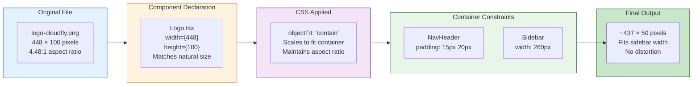

---

## 8. Sidebar States & Logo Visibility

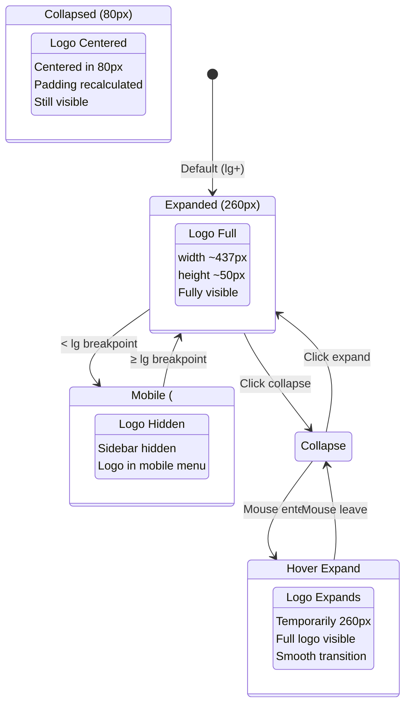

---

## 9. Verification Test Flow

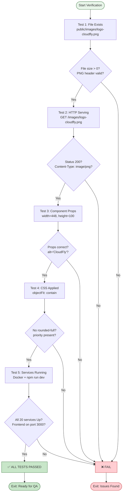

---

## 10. Complete Acceptance Criteria Matrix

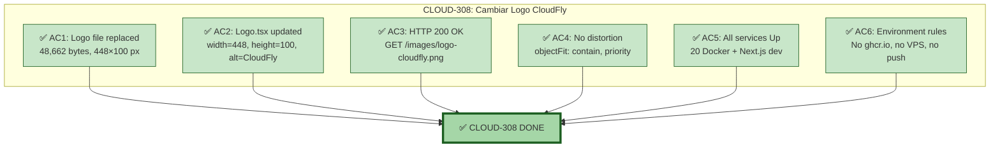

---

## 11. Sprint Timeline

```mermaid
gantt
    title CLOUD-308 Sprint Timeline
    dateFormat YYYY-MM-DD
    axisFormat %m/%d
    
    section Planning
    Architecture Analysis       :done, arch, 2026-06-06, 1h
    Sub-task Creation           :done, plan, after arch, 30m
    
    section Implementation
    CLOUD-314: Replace File     :done, impl1, after plan, 30m
    CLOUD-315: Update Component :done, impl2, after impl1, 30m
    
    section Infrastructure
    CLOUD-320: Start Backend    :done, infra1, after impl2, 2h
    CLOUD-318: Start Frontend   :done, infra2, after infra1, 30m
    
    section Verification
    CLOUD-319: Browser Verify   :done, ver1, after infra2, 30m
    CLOUD-317: Visual QA        :done, ver2, after ver1, 30m
    CLOUD-316: Local Verify     :done, ver3, after ver2, 30m
    
    section Documentation
    Technical Documentation     :done, doc1, after ver3, 1h
    Final Report                :done, doc2, after doc1, 1h
```

---

## 12. File Change Summary

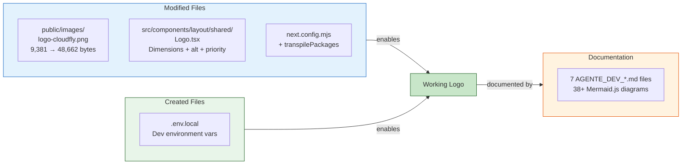

---

*🤖 Technical Writer — OWL | CloudFly AI Platform | 2026-06-07*  
*Generated by AI Scrum Team — Technical Writer Agent*  
*For CLOUD-308: "cambiar logo cloudfly" — Architecture Diagrams*
