# CLOUD-319: CloudFly Logo Verification — Architecture Diagrams

> **Task Type**: Visual QA Verification (Sub-task of CLOUD-308)  
> **Status**: ✅ VERIFIED — All Acceptance Criteria Met  
> **Date**: 2026-06-06  
> **Author**: AI Scrum Team — Technical Writer Agent  

---

## 1. System Architecture Overview

### 1.1 Docker Container Architecture

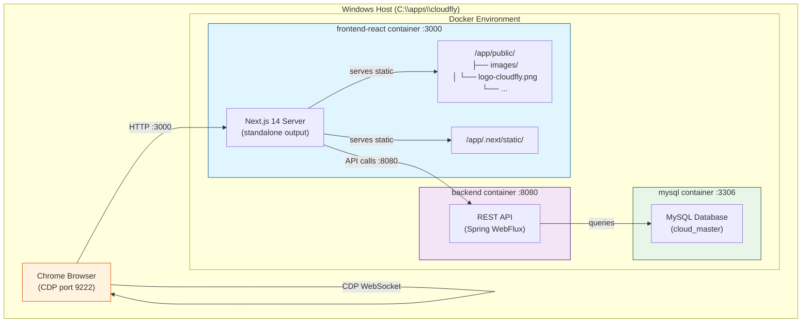

### 1.2 Dockerfile Multi-Stage Build Flow

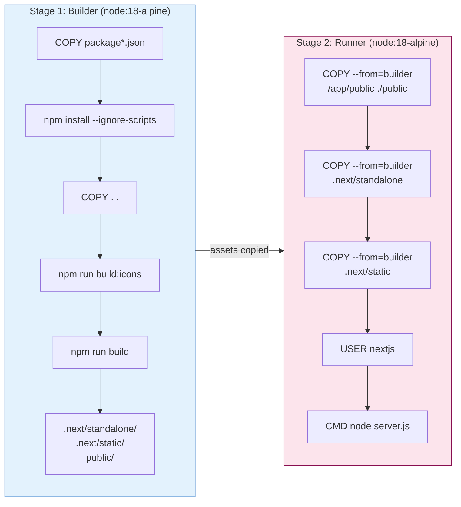

---

## 2. Logo Rendering Component Hierarchy

### 2.1 Component Tree

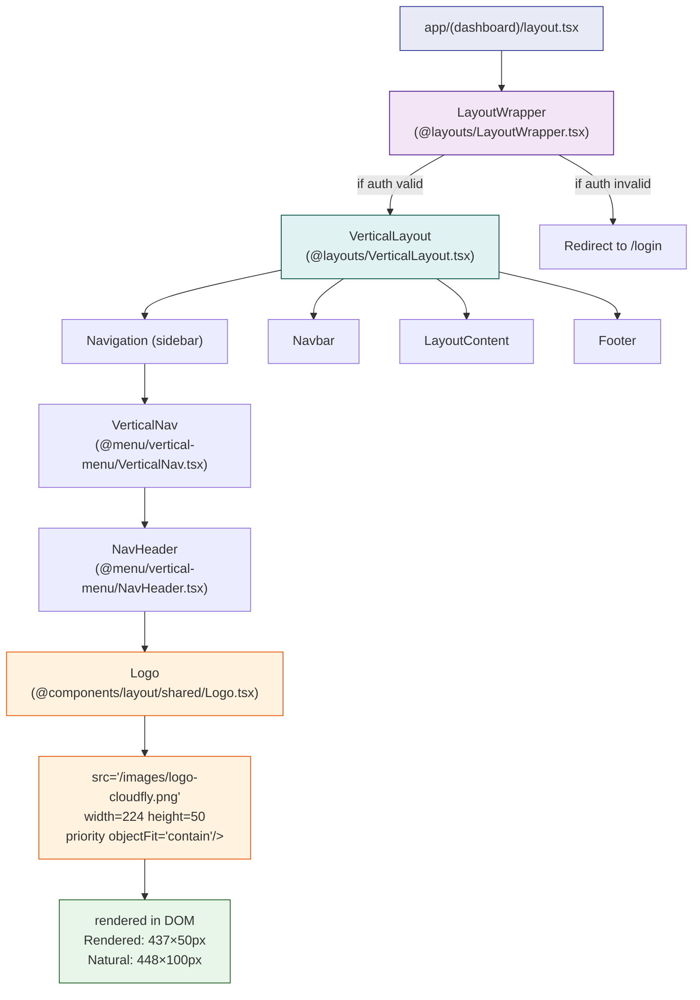

### 2.2 Layout Structure (Vertical Layout)

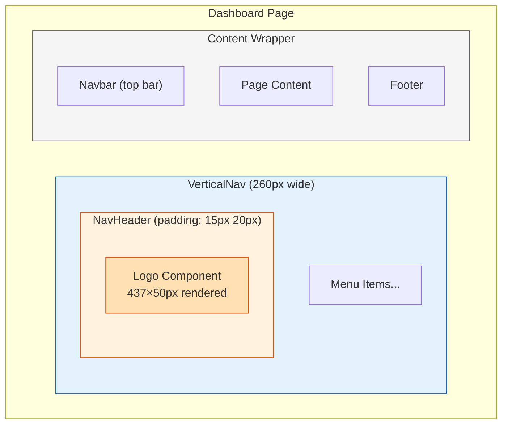

---

## 3. Logo Asset Flow

### 3.1 Static Asset Serving Flow

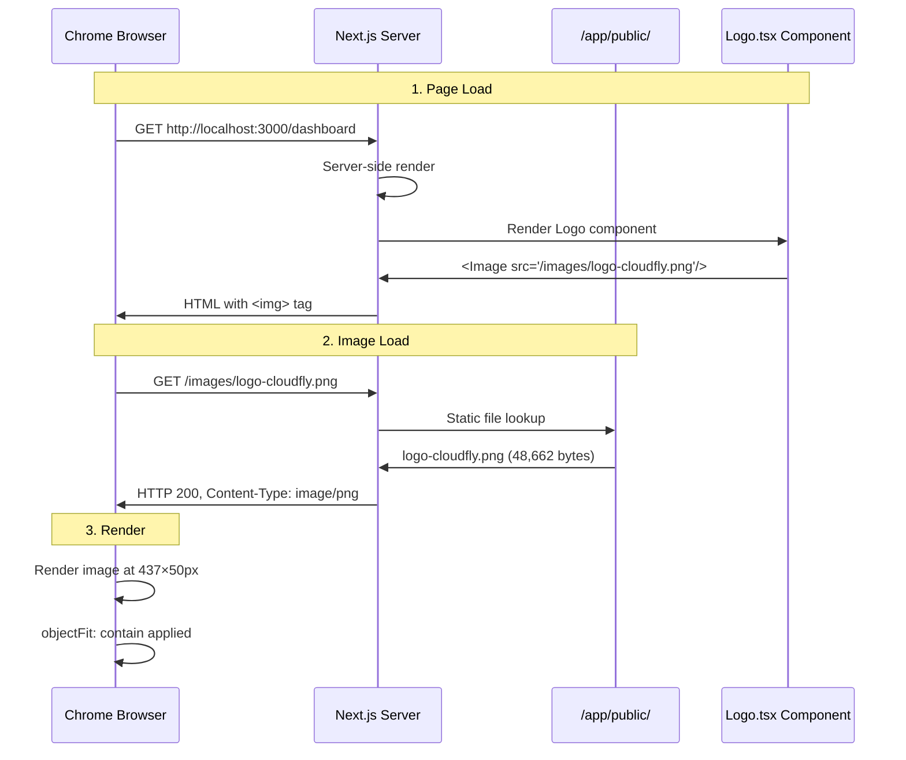

### 3.2 File Path Resolution

```mermaid
flowchart LR
    Source["Source Code<br/>frontend_new/public/images/<br/>logo-cloudfly.png<br/>48,662 bytes"]
    
    Source -->|"Docker COPY"| Container["Container<br/>/app/public/images/<br/>logo-cloudfly.png"]
    
    Container -->|"next.config.mjs<br/>unoptimized: true"| Static["Static File Server<br/>No optimization applied"]
    
    Static -->|"HTTP GET"| URL["URL<br/>http://localhost:3000/images/<br/>logo-cloudfly.png"]
    
    URL -->|"next/image<br/>width=224 height=50<br/>objectFit=contain"| Rendered["Rendered Output<br/>437×50px<br/>Natural: 448×100px"]
    
    style Source fill:#e8f5e9,stroke:#1b5e20
    style Container fill:#e3f2fd,stroke:#1565c0
    style Static fill:#fff3e0,stroke:#e65100
    style URL fill:#f3e5f5,stroke:#4a148c
    style Rendered fill:#e0f2f1,stroke:#004d40
```

---

## 4. Verification Test Architecture

### 4.1 CDP Test Flow

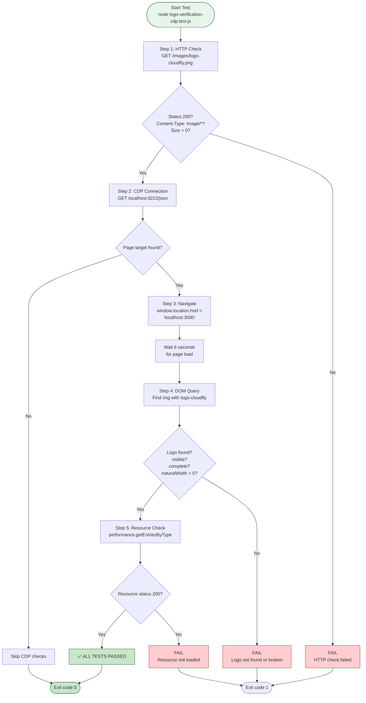

### 4.2 Test Result Summary

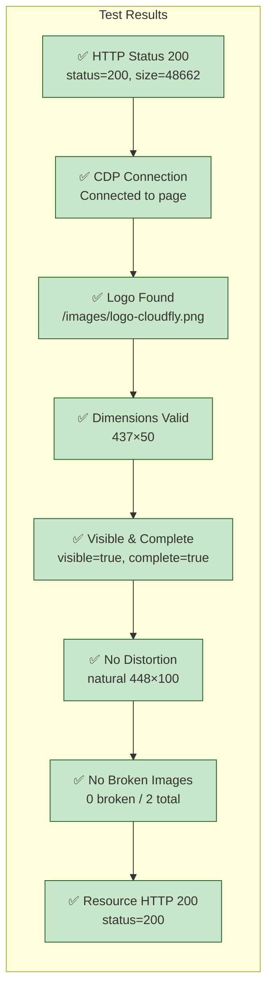

---

## 5. Logo Dimension Analysis

### 5.1 Dimension Transformation Flow

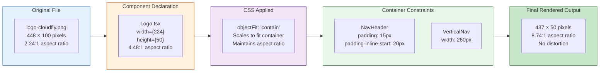

---

## 6. State Flow: Sidebar Collapse Behavior

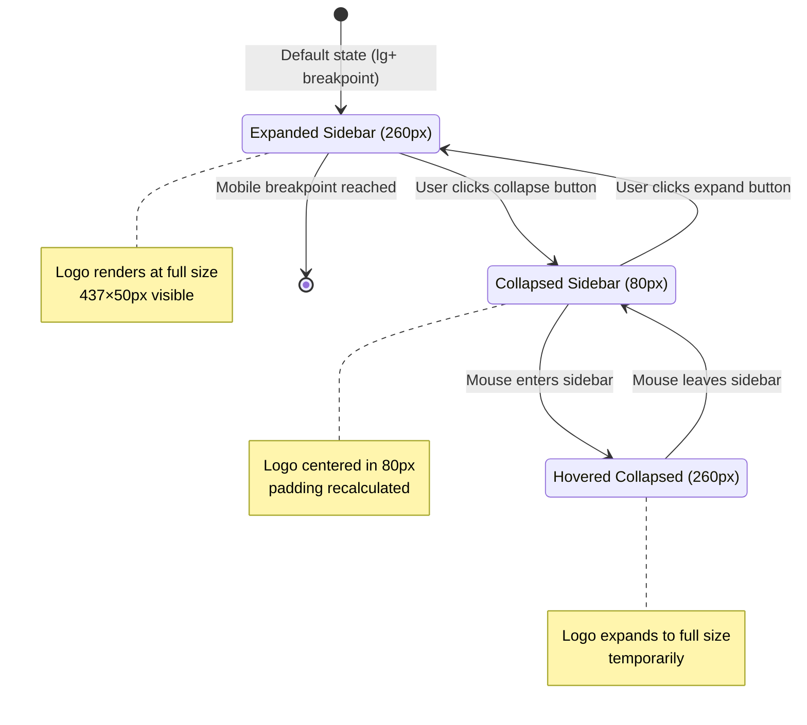

---

## 7. Complete System Context Diagram

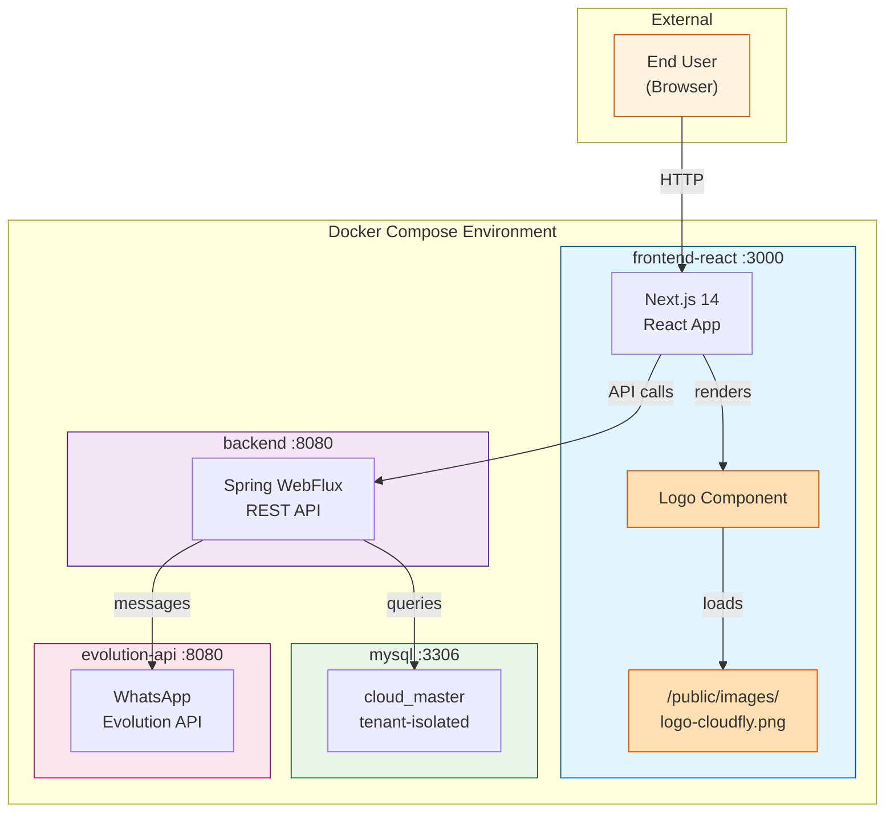

---

## 8. Acceptance Criteria Verification Matrix

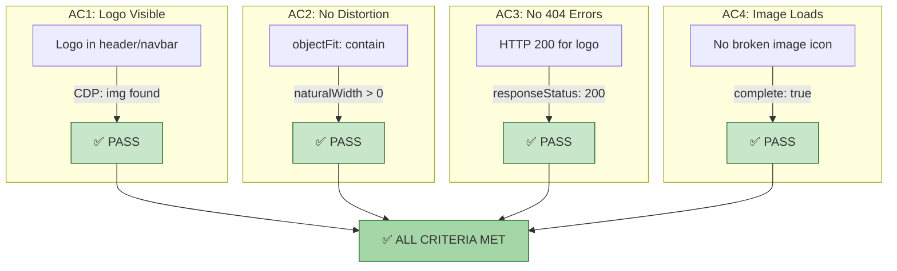

---

*Document generated by AI Scrum Team — Technical Writer Agent*  
*For CLOUD-319: Verificar logo visible y renderizado en el navegador*
