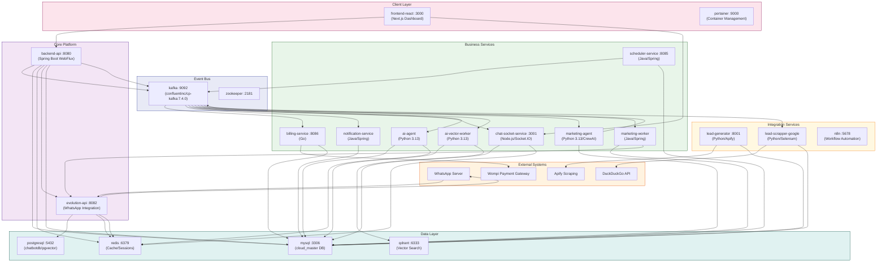
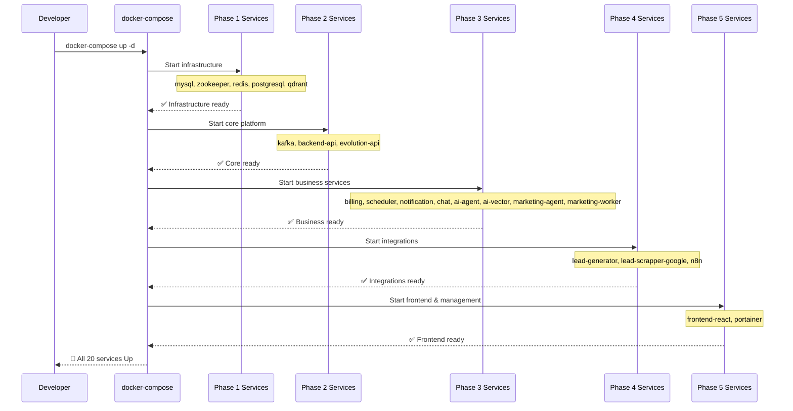
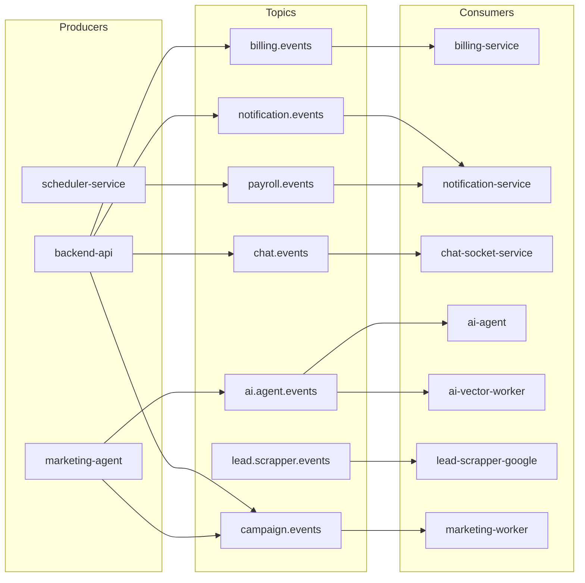
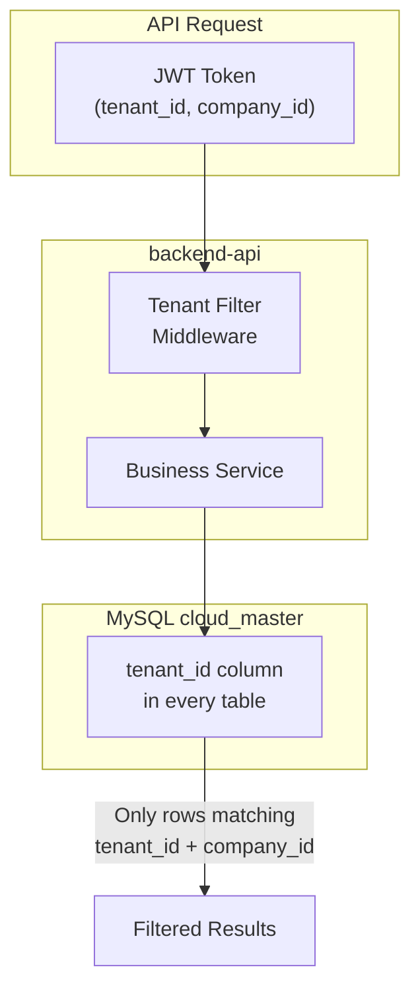
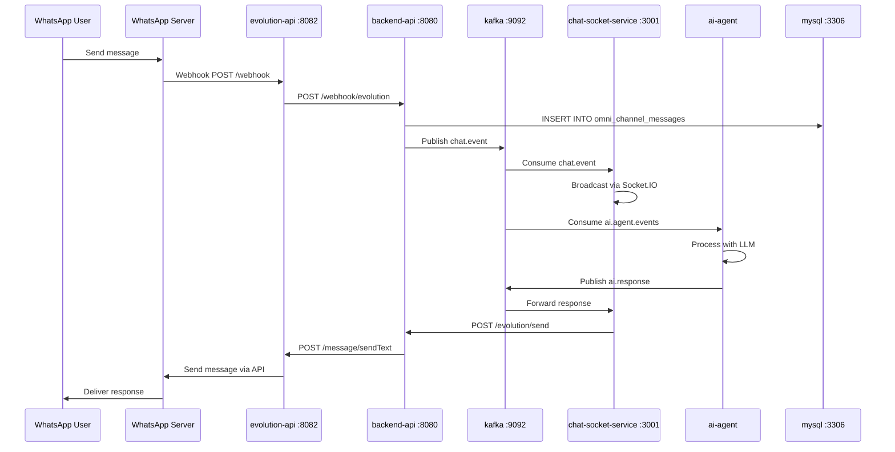
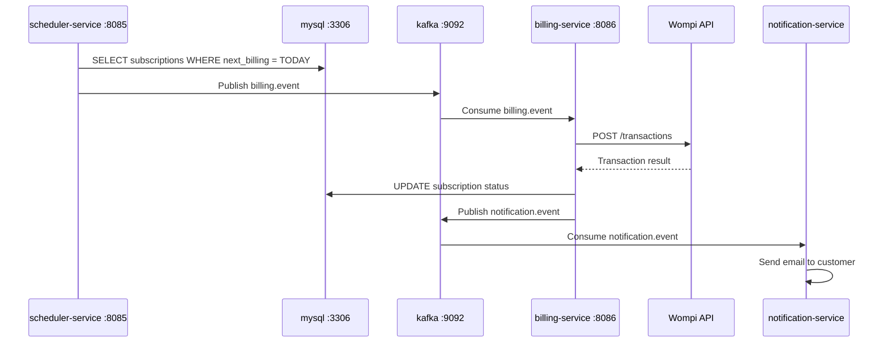
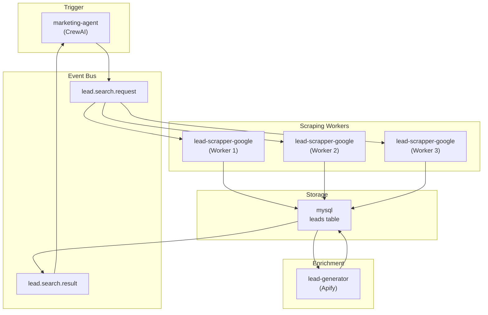
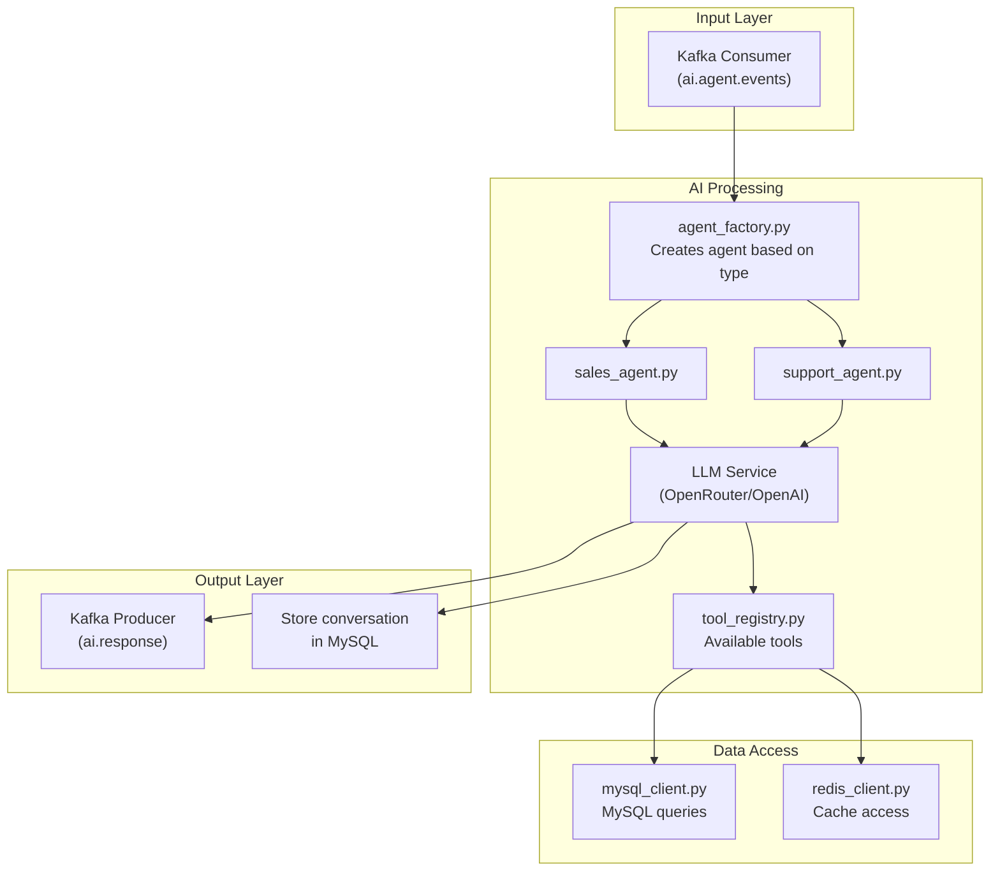

# CLOUD-320: Architecture Diagrams

> **Generated by**: OWL Technical Writer  
> **Date**: 2026-06-07

---

## 1. System Architecture Overview



---

## 2. Docker Network Topology

```mermaid
flowchart TB
    subgraph default_net["default (bridge)"]
        MYSQL["mysql :3306"]
    end

    subgraph kafka_net["kafka-net (bridge)"]
        MYSQL2["mysql"]
        ZK["zookeeper :2181"]
        KAFKA["kafka :9092/9093"]
        BE2["backend-api :8080"]
        BILLING2["billing-service :8086"]
        SCHEDULER2["scheduler-service :8085"]
        NOTIFY2["notification-service"]
        CHAT2["chat-socket-service :3001"]
        AI2["ai-agent"]
        VECTOR2["ai-vector-worker"]
        MA2["marketing-agent"]
        MW2["marketing-worker"]
        SCRAP2["lead-scrapper-google"]
    end

    subgraph app_net["app-net (bridge)"]
        MYSQL3["mysql"]
        BE3["backend-api :8080"]
        BILLING3["billing-service :8086"]
        SCHEDULER3["scheduler-service :8085"]
        NOTIFY3["notification-service"]
        CHAT3["chat-socket-service :3001"]
        AI3["ai-agent"]
        VECTOR3["ai-vector-worker"]
        MA3["marketing-agent"]
        MW3["marketing-worker"]
        EV3["evolution-api :8082"]
        REDIS3["redis :6379"]
        PG3["postgresql :5432"]
        LG3["lead-generator :8001"]
        SCRAP3["lead-scrapper-google"]
        N8N3["n8n :5678"]
        FE3["frontend-react :3000"]
        PORTAINER3["portainer :9000"]
        QDRANT3["qdrant :6333"]
    end

    %% Cross-network connections
    MYSQL --- MYSQL2
    MYSQL2 --- MYSQL3
    BE2 --- BE3
    BILLING2 --- BILLING3
    SCHEDULER2 --- SCHEDULER3
    NOTIFY2 --- NOTIFY3
    CHAT2 --- CHAT3
    AI2 --- AI3
    VECTOR2 --- VECTOR3
    MA2 --- MA3
    MW2 --- MW3
    SCRAP2 --- SCRAP3

    style default_net fill:#f5f5f5,stroke:#9e9e9e
    style kafka_net fill:#e8eaf6,stroke:#3f51b5
    style app_net fill:#e0f2f1,stroke:#009688
```



---

## 3. Service Boot Sequence



---

## 4. Database ERD (Simplified)

```mermaid
erdiagram
    Tenant {
        int tenant_id PK
        string name
        string plan
        datetime created_at
    }
    Company {
        int company_id PK
        int tenant_id FK
        string name
        string nit
    }
    User {
        int user_id PK
        int tenant_id FK
        int company_id FK
        string email
        string password_hash
        string role
    }
    Contact {
        int contact_id PK
        int company_id FK
        string name
        string phone
        string email
    }
    Product {
        int product_id PK
        int company_id FK
        string name
        decimal price
        int stock
    }
    Order {
        int order_id PK
        int contact_id FK
        int company_id FK
        decimal total
        string status
    }
    Invoice {
        int invoice_id PK
        int order_id FK
        string dian_status
        string cufe
    }
    Pipeline {
        int pipeline_id PK
        int company_id FK
        string name
    }
    PipelineStage {
        int stage_id PK
        int pipeline_id FK
        string name
        int order
    }
    Conversation {
        int conversation_id PK
        int contact_id FK
        int pipeline_stage_id FK
        string status
    }
    Message {
        int message_id PK
        int conversation_id FK
        string direction
        string content
        string platform
    }
    Campaign {
        int campaign_id PK
        int company_id FK
        string name
        string channel
        string status
    }
    Subscription {
        int subscription_id PK
        int tenant_id FK
        int plan_id FK
        string status
        date next_billing
    }
    Workflow {
        int workflow_id PK
        int company_id FK
        string name
        string trigger_type
        json definition
    }
    Appointment {
        int appointment_id PK
        int contact_id FK
        int user_id FK
        datetime start_time
        string status
    }
    Employee {
        int employee_id PK
        int company_id FK
        string name
        string contract_type
        decimal salary
    }
    PayrollReceipt {
        int receipt_id PK
        int employee_id FK
        int period_id FK
        decimal total_devengado
        decimal total_deducciones
    }
    Lead {
        int lead_id PK
        int company_id FK
        string source
        string name
        string phone
        string status
    }

    Tenant ||--o{ Company : has
    Tenant ||--o{ User : has
    Company ||--o{ Contact : has
    Company ||--o{ Product : has
    Company ||--o{ Order : has
    Company ||--o{ Pipeline : has
    Company ||--o{ Campaign : has
    Company ||--o{ Employee : has
    Company ||--o{ Lead : has
    Contact ||--o{ Order : places
    Contact ||--o{ Conversation : participates
    Order ||--o| Invoice : generates
    Pipeline ||--o{ PipelineStage : has
    Conversation ||--o{ Message : contains
    Campaign ||--o{ Message : sends
    Subscription ||--|| Tenant : belongs_to
    Appointment ||--|| Contact : with
    Appointment ||--|| User : assigned_to
    PayrollReceipt ||--|| Employee : for
    PayrollReceipt ||--|| PayrollPeriod : in
```

---

## 5. Kafka Event Flow



---

## 6. Multi-Tenant Data Isolation



---

## 7. WhatsApp Integration Flow



---

## 8. Billing Cycle Flow



---

## 9. Lead Scraping Pipeline



---

## 10. AI Agent Architecture



---

*🤖 Technical Writer — OWL | CloudFly AI Platform | 2026-06-07*
