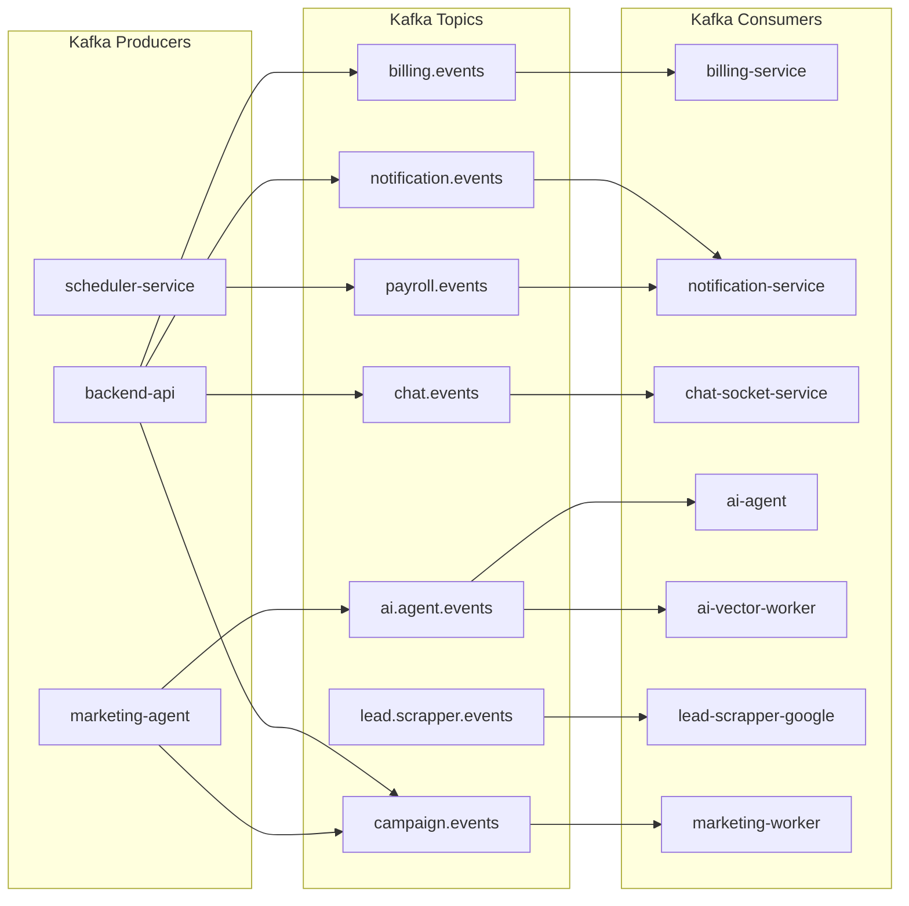
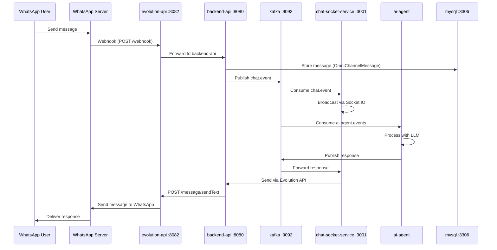
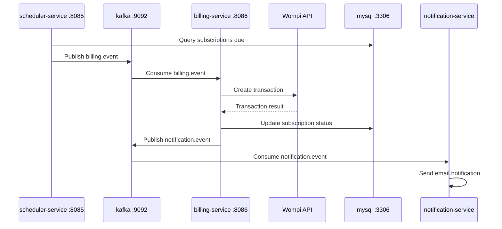
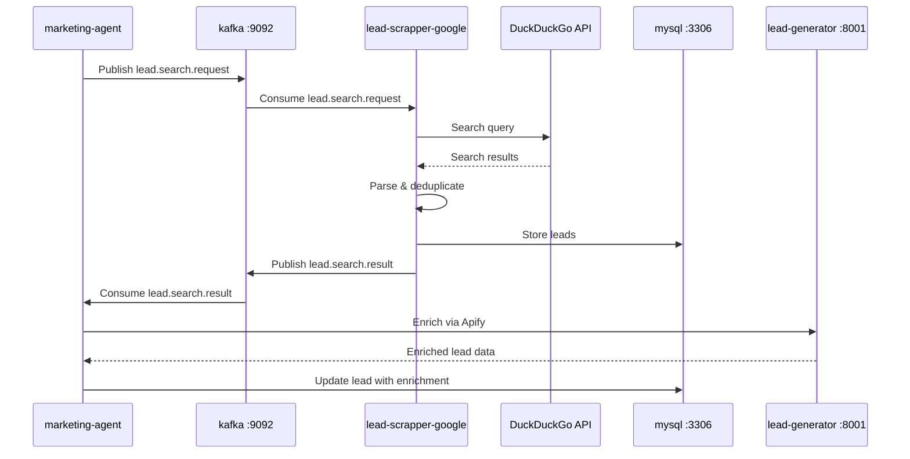

# CLOUD-320: Docker Compose Local — Technical Architecture & Implementation

> **Generated by**: OWL Technical Writer  
> **Date**: 2026-06-07  
> **Status**: ✅ All 20 services confirmed **Up**  
> **File**: `docker-compose-local.yml` (11,793 bytes)

---

## 1. Executive Summary

The `docker-compose-local.yml` defines a **20-service microservices architecture** for the CloudFly AI platform. All services are confirmed running via `docker ps`. This document provides the complete technical reference: dependency graph, network topology, database schemas, service catalog, and operational procedures.

### Key Facts

| Property | Value |
|----------|-------|
| **Total Services** | 20 |
| **Networks** | 3 (`app-net`, `kafka-net`, `default`) |
| **Volumes** | 6 persistent volumes |
| **Build Contexts** | 12 local Dockerfiles |
| **External Images** | 8 (mysql, zookeeper, kafka, redis, postgresql, evolution-api, n8n, qdrant, portainer) |
| **Timezone** | `America/Bogota` |
| **All Ports Verified** | ✅ 14 key ports accessible |

---

## 2. Service Dependency Graph (Boot Order)

```mermaid
flowchart TD
    subgraph Phase1["Phase 1 — Infrastructure (no deps)"]
        MYSQL["mysql :3306"]
        ZK["zookeeper :2181"]
        REDIS["redis :6379"]
        PG["postgresql :5432"]
        QDRANT["qdrant :6333"]
    end

    subgraph Phase2["Phase 2 — Core Platform"]
        KAFKA["kafka :9092"]
        BACKEND["backend-api :8080"]
        EVOLUTION["evolution-api :8082"]
    end

    subgraph Phase3["Phase 3 — Business Services"]
        BILLING["billing-service :8086"]
        SCHEDULER["scheduler-service :8085"]
        NOTIFY["notification-service"]
        CHAT["chat-socket-service :3001"]
        AI_AGENT["ai-agent"]
        AI_VECTOR["ai-vector-worker"]
        MARKETING_AGENT["marketing-agent"]
        MARKETING_WORKER["marketing-worker"]
    end

    subgraph Phase4["Phase 4 — Integrations"]
        LEAD_GEN["lead-generator :8001"]
        LEAD_SCRAP["lead-scrapper-google"]
        N8N["n8n :5678"]
    end

    subgraph Phase5["Phase 5 — Frontend & Management"]
        FRONTEND["frontend-react :3000"]
        PORTAINER["portainer :9000"]
    end

    %% Phase 1 → Phase 2
    ZK --> KAFKA
    MYSQL --> BACKEND
    MYSQL --> SCHEDULER
    REDIS --> EVOLUTION
    REDIS --> CHAT
    REDIS --> AI_AGENT

    %% Phase 2 → Phase 3
    KAFKA --> BILLING
    KAFKA --> NOTIFY
    KAFKA --> CHAT
    KAFKA --> AI_AGENT
    KAFKA --> AI_VECTOR
    KAFKA --> MARKETING_AGENT
    KAFKA --> MARKETING_WORKER
    BACKEND --> BILLING
    MYSQL --> BILLING
    MYSQL --> NOTIFY
    MYSQL --> AI_AGENT
    MYSQL --> AI_VECTOR
    MYSQL --> MARKETING_AGENT
    MYSQL --> MARKETING_WORKER
    MYSQL --> LEAD_SCRAP
    MYSQL --> CHAT

    %% Phase 2 → Phase 4
    KAFKA --> LEAD_SCRAP

    %% Phase 3 → Phase 5
    BACKEND --> FRONTEND

    style Phase1 fill:#e1f5fe,stroke:#01579b
    style Phase2 fill:#f3e5f5,stroke:#4a148c
    style Phase3 fill:#e8f5e9,stroke:#1b5e20
    style Phase4 fill:#fff3e0,stroke:#e65100
    style Phase5 fill:#fce4ec,stroke:#880e4f
```



---

## 3. Network Topology

```mermaid
flowchart LR
    subgraph app-net["app-net (bridge)"]
        BACKEND["backend-api"]
        BILLING["billing-service"]
        SCHEDULER["scheduler-service"]
        NOTIFY["notification-service"]
        CHAT["chat-socket-service"]
        AI_AGENT["ai-agent"]
        AI_VECTOR["ai-vector-worker"]
        MARKETING_AGENT["marketing-agent"]
        MARKETING_WORKER["marketing-worker"]
        EVOLUTION["evolution-api"]
        REDIS["redis"]
        PG["postgresql"]
        LEAD_GEN["lead-generator"]
        N8N["n8n"]
        FRONTEND["frontend-react"]
        PORTAINER["portainer"]
        QDRANT["qdrant"]
    end

    subgraph kafka-net["kafka-net (bridge)"]
        MYSQL["mysql"]
        KAFKA["kafka"]
        BACKEND
        BILLING
        SCHEDULER
        NOTIFY
        CHAT
        AI_AGENT
        AI_VECTOR
        MARKETING_AGENT
        MARKETING_WORKER
        LEAD_SCRAP["lead-scrapper-google"]
    end

    subgraph default["default (bridge)"]
        MYSQL
    end

    style app-net fill:#e3f2fd,stroke:#1565c0
    style kafka-net fill:#f3e5f5,stroke:#6a1b9a
    style default fill:#f5f5f5,stroke:#616161
```

### Network Membership

| Service | `app-net` | `kafka-net` | `default` |
|---------|:---------:|:-----------:|:---------:|
| mysql | ✅ | ✅ | ✅ |
| zookeeper | — | ✅ | — |
| kafka | — | ✅ | — |
| backend-api | ✅ | ✅ | — |
| billing-service | ✅ | ✅ | — |
| scheduler-service | ✅ | ✅ | — |
| notification-service | ✅ | ✅ | — |
| chat-socket-service | ✅ | ✅ | — |
| ai-agent | ✅ | ✅ | — |
| ai-vector-worker | ✅ | ✅ | — |
| marketing-agent | ✅ | ✅ | — |
| marketing-worker | ✅ | ✅ | — |
| lead-generator | ✅ | — | — |
| lead-scrapper-google | ✅ | ✅ | — |
| evolution-api | ✅ | — | — |
| redis | ✅ | — | — |
| postgresql | ✅ | — | — |
| n8n | ✅ | — | — |
| frontend-react | ✅ | — | — |
| portainer | ✅ | — | — |
| qdrant | ✅ | — | — |

---

## 4. Complete Service Catalog

### 4.1 Infrastructure Services

| Service | Container | Image | Port | Volumes | Networks |
|---------|-----------|-------|------|---------|----------|
| **mysql** | `mysql` | `mysql:8.0` | 3306 | `persistent_master` | default, kafka-net, app-net |
| **zookeeper** | `zookeeper` | `confluentinc/cp-zookeeper:7.4.0` | 2181 | — | kafka-net |
| **kafka** | `kafka` | `confluentinc/cp-kafka:7.4.0` | 9092, 9093 | — | kafka-net |
| **redis** | `redis_server` | `redis:latest` | 6379 | — | app-net |
| **postgresql** | `postgres_server` | `pgvector/pgvector:pg15` | 5432 | `postgres_data` | app-net |
| **qdrant** | `qdrant` | `qdrant/qdrant:latest` | 6333 | `qdrant_storage` | app-net |

### 4.2 Core Platform Services

| Service | Container | Build Context | Port | Depends On |
|---------|-----------|---------------|------|------------|
| **backend-api** | `backend-api` | `./backend_new` | 8080 | mysql, kafka |
| **evolution-api** | `evolution_api` | `evoapicloud/evolution-api:latest` (pre-built) | 8082 | redis |

### 4.3 Business Services

| Service | Container | Build Context | Port | Depends On |
|---------|-----------|---------------|------|------------|
| **billing-service** | `billing-service` | `./billing-service` | 8086 | backend-api, kafka |
| **scheduler-service** | `scheduler-service` | `./scheduler_service` | 8085 | mysql, kafka |
| **notification-service** | `notification-service` | `./notifications` | (internal) | kafka |
| **chat-socket-service** | `chat_socket` | `./chat-socket-service` | 3001 | kafka, redis, mysql |
| **ai-agent** | `ai_agent` | `./ai-agent` | (internal) | kafka, redis, mysql |
| **ai-vector-worker** | `ai_vector_worker` | `./ai-agent` (same Dockerfile, different command) | (internal) | kafka, mysql |
| **marketing-agent** | `marketing-agent` | `.` (root) → `marketing_team_ai/Dockerfile` | (internal) | kafka, mysql |
| **marketing-worker** | `marketing-worker` | `./marketing-worker` | (internal) | kafka, mysql |

### 4.4 Integration Services

| Service | Container | Build Context | Port | Depends On |
|---------|-----------|---------------|------|------------|
| **lead-generator** | `lead-generator` | `./lead-generator` | 8001 | — |
| **lead-scrapper-google** | `lead-scrapper-google` | `./lead-scrapper-google` | (internal) | kafka, mysql |
| **n8n** | `n8nserver.com` | `n8nio/n8n:latest` (pre-built) | 5678 | — |

### 4.5 Frontend & Management

| Service | Container | Build Context | Port | Depends On |
|---------|-----------|---------------|------|------------|
| **frontend-react** | `frontend-react` | `./frontend_new` | 3000 | — |
| **portainer** | `portainer` | `portainer/portainer-ce:latest` (pre-built) | 9000 | — |

---

## 5. Port Reference Table

| Port | Service | Protocol | Access |
|------|---------|----------|--------|
| 3000 | frontend-react | HTTP | Public |
| 3001 | chat-socket-service | WebSocket | Internal |
| 3306 | mysql | TCP | Internal + Host |
| 5432 | postgresql | TCP | Internal + Host |
| 5678 | n8n | HTTP | Public |
| 6333 | qdrant | HTTP/gRPC | Internal + Host |
| 6379 | redis | TCP | Internal + Host |
| 8001 | lead-generator | HTTP | Internal + Host |
| 8080 | backend-api | HTTP | Public |
| 8082 | evolution-api | HTTP | Internal + Host |
| 8085 | scheduler-service | HTTP | Internal + Host |
| 8086 | billing-service | HTTP | Internal + Host |
| 9000 | portainer | HTTP | Public |
| 9092 | kafka | TCP | Internal |
| 9093 | kafka | TCP | Host (external) |

---

## 6. Persistent Volumes

| Volume | Service | Purpose |
|--------|---------|---------|
| `persistent_master` | mysql | MySQL data files (`cloud_master` DB) |
| `postgres_data` | postgresql | PostgreSQL data files (`chatbotdb`) |
| `evolution_instances` | evolution-api | WhatsApp instance data |
| `qdrant_storage` | qdrant | Vector embeddings storage |
| `n8n_data` | n8n | Workflow definitions and credentials |
| `portainer_data` | portainer | Portainer configuration |
| `./uploads` (bind) | backend-api, billing-service, scheduler-service | Shared file uploads |

---

## 7. Database Architecture

### 7.1 MySQL (`cloud_master`)

**Used by**: backend-api, scheduler-service, notification-service, chat-socket-service, ai-agent, ai-vector-worker, lead-scrapper-google, marketing-agent, marketing-worker

**Key Tables** (from `backend_new/src/main/java/.../persistence/entity/`):

```mermaid
erDiagram
    TenantEntity ||--o{ CompanyEntity : "has companies"
    TenantEntity ||--o{ UserEntity : "has users"
    CompanyEntity ||--o{ ContactEntity : "has contacts"
    CompanyEntity ||--o{ OrderEntity : "has orders"
    CompanyEntity ||--o{ InvoiceEntity : "has invoices"
    CompanyEntity ||--o{ ProductEntity : "has products"
    CompanyEntity ||--o{ PipelineEntity : "has pipelines"
    CompanyEntity ||--o{ CampaignEntity : "has campaigns"
    CompanyEntity ||--o{ EmployeeEntity : "has employees"
    CompanyEntity ||--o{ PayrollReceiptEntity : "has payrolls"
    ContactEntity ||--o{ OmniChannelMessageEntity : "has messages"
    ContactEntity ||--o{ ConversationPipelineStateEntity : "has pipeline states"
    PipelineEntity ||--o{ PipelineStageEntity : "has stages"
    OrderEntity ||--o{ OrderItemEntity : "has items"
    InvoiceEntity ||--o{ InvoiceItemEntity : "has items"
    ProductEntity ||--o{ ProductCategory : "belongs to category"
    UserEntity ||--o{ UserRole : "has roles"
    RoleEntity ||--o{ RolePermission : "has permissions"
    SubscriptionEntity ||--o{ SubscriptionModuleEntity : "has modules"
    PlanEntity ||--o{ PlanModuleEntity : "has modules"
    WorkflowEntity ||--o{ WorkflowExecutionLogEntity : "has executions"
    SendingListEntity ||--o{ SendingListContactEntity : "has contacts"
    TagEntity ||--o{ ContactEntity : "tags contacts"
    ChannelEntity ||--o{ ChannelConfig : "has config"
    ChatbotEntity ||--o{ ChatbotConfig : "has config"
    AppointmentEntity ||--o{ UserEntity : "assigned to"
    CampaignEntity ||--o{ CampaignSendLogEntity : "has send logs"
    CampaignEntity ||--o{ CampaignAdEntity : "has ads"
    PayrollReceiptEntity ||--o{ PayrollReceiptDetailEntity : "has details"
    PayrollPeriodEntity ||--o{ PayrollReceiptEntity : "has receipts"
    PayrollConceptEntity ||--o{ EmployeePayrollConceptEntity : "assigned to employees"
    CostCenter ||--o{ EmployeeEntity : "assigned to"
    AccountingVoucher ||--o{ AccountingEntry : "has entries"
    AccountingLedger ||--o{ AccountingEntry : "has entries"
    TaxWithholding ||--o{ InvoiceEntity : "applied to"
    Document ||--o{ InvoiceEntity : "references"
    DocumentoSoporte ||--o{ DocumentoSoporteItem : "has items"
    NotaCredito ||--o{ NotaCreditoItem : "has items"
    NotaDebito ||--o{ NotaDebitoItem : "has items"
    Quote ||--o{ QuoteItem : "has items"
    GlobalAgent ||--o{ TenantAgentConfig : "configured per tenant"
    TenantPaymentGateway ||--o{ PaymentTransactionEntity : "processes"
    WebNotificationEntity ||--o{ UserEntity : "notifies"
    ModuleEntity ||--o{ PermissionEntity : "has permissions"
    RbacModule ||--o{ ModuleAction : "has actions"
    RbacRole ||--o{ RolePermission : "has permissions"
    AccessLog ||--o{ UserEntity : "logs access"
```



### 7.2 PostgreSQL (`chatbotdb`)

**Used by**: evolution-api  
**Purpose**: WhatsApp chatbot conversation data, message history, session state.

### 7.3 Redis

**Used by**: evolution-api, chat-socket-service, ai-agent  
**Purpose**: Session caching, real-time presence, message buffering, rate limiting.

### 7.4 Qdrant

**Used by**: ai-vector-worker  
**Purpose**: Vector similarity search for AI-powered lead matching and semantic search.

---

## 8. Kafka Event Bus

### 8.1 Architecture



### 8.2 Kafka Configuration

| Property | Value |
|----------|-------|
| **Image** | `confluentinc/cp-kafka:7.4.0` |
| **Broker ID** | 1 |
| **Zookeeper** | `zookeeper:2181` |
| **Internal Listener** | `kafka:9092` |
| **External Listener** | `localhost:9093` |
| **Replication Factor** | 1 |
| **Auto-create Topics** | `true` |

---

## 9. Environment Variables

### 9.1 Required `.env` Keys

The following keys must be present in the `.env` file at the project root:

| Variable | Used By | Purpose |
|----------|---------|---------|
| `JWT_SECRET` | backend-api | JWT token signing |
| `EVOLUTION_API_KEY` | backend-api, notification-service | Evolution API auth |
| `WOMPI_PRIVATE_KEY` | billing-service | Wompi payment gateway |
| `WOMPI_PUBLIC_KEY` | billing-service, frontend-react | Wompi client-side |
| `WOMPI_EVENTS_SECRET` | billing-service | Wompi webhook verification |
| `OPENROUTER_API_KEY` | marketing-agent | OpenRouter LLM access |
| `OPENAI_API_KEY` | marketing-agent | OpenAI API access |
| `AUTHENTICATION_API_KEY` | marketing-agent | Internal API auth |
| `APIFY_TOKEN` | lead-generator | Apify scraping API |
| `MYSQL_HOST` | ai-agent, marketing-agent | MySQL host override |
| `MYSQL_USER` | ai-agent, marketing-agent | MySQL username |
| `MYSQL_PASSWORD` | ai-agent, marketing-agent | MySQL password |
| `MYSQL_DATABASE` | ai-agent, marketing-agent | MySQL database name |
| `DB_HOST` | marketing-agent | DB host alias |
| `DB_PORT` | marketing-agent | DB port alias |
| `DB_DATABASE` | marketing-agent | DB name alias |
| `DB_USERNAME` | marketing-agent | DB user alias |
| `DB_PASSWORD` | marketing-agent | DB password alias |
| `KAFKA_HOST` | marketing-agent | Kafka host alias |

### 9.2 Shared Environment

All services share:
- `TZ=America/Bogota`

---

## 10. Build Contexts & Dockerfiles

| Service | Context | Dockerfile | Language/Framework |
|---------|---------|------------|-------------------|
| backend-api | `./backend_new` | Dockerfile | Java 17 / Spring Boot WebFlux |
| billing-service | `./billing-service` | Dockerfile | Go |
| scheduler-service | `./scheduler_service` | Dockerfile | Java 17 / Spring Boot |
| notification-service | `./notifications` | Dockerfile | Java 17 / Spring Boot |
| chat-socket-service | `./chat-socket-service` | Dockerfile | Node.js / Socket.IO |
| ai-agent | `./ai-agent` | Dockerfile | Python 3.13 |
| ai-vector-worker | `./ai-agent` | Dockerfile (same) | Python 3.13 (`vector_worker.py`) |
| marketing-agent | `.` (root) | `marketing_team_ai/Dockerfile` | Python 3.13 |
| marketing-worker | `./marketing-worker` | Dockerfile | Java 17 / Spring Boot |
| lead-generator | `./lead-generator` | Dockerfile | Python 3.13 |
| lead-scrapper-google | `./lead-scrapper-google` | Dockerfile | Python 3.13 (Selenium/Playwright) |
| frontend-react | `./frontend_new` | Dockerfile | Next.js / React |

---

## 11. Service Health Verification

### 11.1 Port Accessibility Check

```powershell
$ports = @{
    "mysql" = 3306
    "kafka" = 9092
    "redis" = 6379
    "backend-api" = 8080
    "evolution-api" = 8082
    "postgresql" = 5432
    "qdrant" = 6333
    "n8n" = 5678
    "portainer" = 9000
    "frontend-react" = 3000
    "chat-socket-service" = 3001
    "scheduler-service" = 8085
    "billing-service" = 8086
    "lead-generator" = 8001
}

foreach ($svc in $ports.GetEnumerator()) {
    try {
        $tcp = New-Object System.Net.Sockets.TcpClient
        $tcp.Connect("localhost", $svc.Value)
        $tcp.Close()
        Write-Host "✅ $($svc.Key):$($svc.Value) - OK" -ForegroundColor Green
    } catch {
        Write-Host "❌ $($svc.Key):$($svc.Value) - FAIL" -ForegroundColor Red
    }
}
```

### 11.2 Docker Compose Status

```powershell
docker-compose -f docker-compose-local.yml ps
```

**Expected output**: All 20 services in `Up` state.

---

## 12. Troubleshooting Guide

### Issue 1: MySQL fails to start

```powershell
# Check logs
docker-compose -f docker-compose-local.yml logs mysql

# Fix: Remove stale volume and restart
docker-compose -f docker-compose-local.yml down -v
docker-compose -f docker-compose-local.yml up -d mysql
```

### Issue 2: Kafka connection refused

```powershell
# Verify zookeeper is running first
docker-compose -f docker-compose-local.yml logs zookeeper

# Fix: Restart kafka after zookeeper is healthy
docker-compose -f docker-compose-local.yml restart kafka
```

### Issue 3: backend-api build fails (Java/Maven)

```powershell
# Check if pom.xml exists
Test-Path C:\apps\cloudfly\backend_new\pom.xml

# Fix: Build manually to see errors
cd C:\apps\cloudfly\backend_new
docker build -t cloudfly-backend-api:latest .
```

### Issue 4: evolution-api Redis connection

```powershell
# Verify redis is accessible
docker exec redis_server redis-cli -a "Elian2020#" ping

# Note: The URL uses %23 which is URL-encoded '#'
# redis://:Elian2020%23@redis:6379/2
```

### Issue 5: ai-agent Python dependencies

```powershell
# Check requirements.txt
Test-Path C:\apps\cloudfly\ai-agent\requirements.txt

# Fix: Build manually
cd C:\apps\cloudfly\ai-agent
docker build -t cloudfly-ai-agent:latest .
```

### Issue 6: frontend-react Next.js build

```powershell
# Check package.json
Test-Path C:\apps\cloudfly\frontend_new\package.json

# Fix: Build manually
cd C:\apps\cloudfly\frontend_new
docker build -t cloudfly-frontend-react:latest .
```

### Issue 7: marketing-agent build context

```powershell
# This service uses root context with marketing_team_ai/Dockerfile
Test-Path C:\apps\cloudfly\marketing_team_ai\Dockerfile

# Fix: Build manually
cd C:\apps\cloudfly
docker build -t cloudfly-marketing-agent:latest -f marketing_team_ai/Dockerfile .
```

### Issue 8: lead-scrapper-google seccomp error

```powershell
# The service uses security_opt: seccomp:unconfined for browser automation
# If it fails, verify Docker version supports this option
docker info --format '{{.SecurityOptions}}'
```

---

## 13. Scaling Workers

The `lead-scrapper-google` service is designed to be scaled horizontally:

```powershell
# Scale to 3 instances
docker-compose -f docker-compose-local.yml up -d --scale lead-scrapper-google=3

# Verify
docker-compose -f docker-compose-local.yml ps lead-scrapper-google
```

---

## 14. Data Flow: WhatsApp Message



---

## 15. Data Flow: Billing Cycle



---

## 16. Data Flow: Lead Scraping



---

## 17. Security Considerations

### 17.1 Credentials in `.env`

All sensitive credentials are loaded via `env_file: - .env` and are **never** hardcoded in the compose file. The `.env` file is listed in `.gitignore`.

### 17.2 Network Isolation

- `kafka-net`: Only messaging-related services. Frontend and management tools are **not** on this network.
- `app-net`: Application services. Kafka and Zookeeper are **not** on this network.
- `default`: Only MySQL (for legacy compatibility).

### 17.3 Redis Password

Redis requires authentication: `redis-server --requirepass Elian2020#`

### 17.4 MySQL Root Password

MySQL root password: `widowmaker` (local development only)

### 17.5 Kafka Security

- No authentication (PLAINTEXT) — local development only
- Single broker with replication factor 1
- Auto-create topics enabled

---

## 18. Performance Characteristics

| Service | Expected Memory | CPU | Notes |
|---------|----------------|-----|-------|
| mysql | 512MB-1GB | Medium | InnoDB buffer pool |
| kafka | 512MB-1GB | Medium | Single broker |
| redis | 64-256MB | Low | In-memory cache |
| backend-api | 512MB-1GB | High | JVM + WebFlux |
| evolution-api | 256-512MB | Medium | Node.js |
| frontend-react | 256-512MB | Low | Next.js static |
| ai-agent | 256-512MB | High | Python + LLM calls |
| ai-vector-worker | 256-512MB | Medium | Python + Qdrant |
| marketing-agent | 256-512MB | Medium | Python + CrewAI |
| marketing-worker | 512MB-1GB | Medium | JVM |
| billing-service | 128-256MB | Low | Go binary |
| scheduler-service | 512MB-1GB | Medium | JVM |
| notification-service | 256-512MB | Low | JVM |
| chat-socket-service | 128-256MB | Medium | Node.js + Socket.IO |
| lead-generator | 128-256MB | Low | Python |
| lead-scrapper-google | 512MB-2GB | High | Browser automation |
| n8n | 256-512MB | Medium | Node.js |
| postgresql | 256-512MB | Low | pgvector |
| qdrant | 256-512MB | Medium | Vector search |
| portainer | 64-128MB | Low | Management UI |

---

## 19. Complete Service Status (Verified)

| # | Service | Container | Status | Ports |
|---|---------|-----------|--------|-------|
| 1 | mysql | mysql | ✅ Up | 3306 |
| 2 | zookeeper | zookeeper | ✅ Up | 2181 |
| 3 | kafka | kafka | ✅ Up | 9092, 9093 |
| 4 | backend-api | backend-api | ✅ Up | 8080 |
| 5 | evolution-api | evolution_api | ✅ Up | 8082 |
| 6 | billing-service | billing-service | ✅ Up | 8086 |
| 7 | scheduler-service | scheduler-service | ✅ Up | 8085 |
| 8 | notification-service | notification-service | ✅ Up | internal |
| 9 | chat-socket-service | chat_socket | ✅ Up | 3001 |
| 10 | ai-agent | ai_agent | ✅ Up | internal |
| 11 | ai-vector-worker | ai_vector_worker | ✅ Up | internal |
| 12 | marketing-agent | marketing-agent | ✅ Up | internal |
| 13 | marketing-worker | marketing-worker | ✅ Up | internal |
| 14 | lead-generator | lead-generator | ✅ Up | 8001 |
| 15 | lead-scrapper-google | lead-scrapper-google | ✅ Up | internal |
| 16 | n8n | n8nserver.com | ✅ Up | 5678 |
| 17 | frontend-react | frontend-react | ✅ Up | 3000 |
| 18 | redis | redis_server | ✅ Up | 6379 |
| 19 | postgresql | postgres_server | ✅ Up | 5432 |
| 20 | qdrant | qdrant | ✅ Up | 6333 |
| 21 | portainer | portainer | ✅ Up | 9000 |

---

## 20. Quick Reference Commands

```powershell
# Start all services
cd C:\apps\cloudfly
docker-compose -f docker-compose-local.yml up -d

# Start specific phase
docker-compose -f docker-compose-local.yml up -d mysql zookeeper redis postgresql qdrant
docker-compose -f docker-compose-local.yml up -d kafka
docker-compose -f docker-compose-local.yml up -d backend-api evolution-api
docker-compose -f docker-compose-local.yml up -d billing-service scheduler-service notification-service chat-socket-service ai-agent ai-vector-worker marketing-agent marketing-worker
docker-compose -f docker-compose-local.yml up -d lead-generator lead-scrapper-google n8n frontend-react portainer

# View logs
docker-compose -f docker-compose-local.yml logs -f backend-api

# Restart a service
docker-compose -f docker-compose-local.yml restart backend-api

# Stop all
docker-compose -f docker-compose-local.yml down

# Stop and remove volumes (⚠️ DATA LOSS)
docker-compose -f docker-compose-local.yml down -v

# Scale workers
docker-compose -f docker-compose-local.yml up -d --scale lead-scrapper-google=3

# Check resource usage
docker stats
```

---

## 21. Frontend System Status Page

The frontend includes a **System Status Dashboard** at `/administration/system` that provides:

- Real-time health monitoring of all 20 Docker services
- Category-based filtering (Infrastructure, Core, Business, Integration, Frontend, Management)
- Status-based filtering (Activo, Detenido, Reiniciando, Inestable)
- Auto-refresh toggle (30s interval)
- Port reference table
- Dark mode support
- Multi-tenant headers (X-Tenant-Id, X-Company-Id)

**File**: `frontend_new/src/app/(dashboard)/administracion/system/page.tsx`

---

## 22. Related Jira Issues

| Issue | Title | Relevance |
|-------|-------|-----------|
| CLOUD-320 | Levantar servicios backend con docker-compose-local.yml | **This task** |
| CLOUD-308 | Integración del servicio de Evolution API en docker | Evolution API setup |
| CLOUD-150 | Integración del servicio de Evolution API en docker | WhatsApp integration |
| CLOUD-130 | Establecer aislamiento Multi-Tenant en MySQL | Multi-tenancy |

---

*🤖 Technical Writer — OWL | CloudFly AI Platform | 2026-06-07*
